## 序言

https://www.bilibili.com/video/BV1ib411t7YR?p=1&vd_source=c680aab5d5ef234c75928d8686b004a5

为什么开设这门课程？

数值上的理解（课本上教的）能让你顺利应用这些工具。

几何直观上的理解（本课程）能让你有一个坚实的基础。

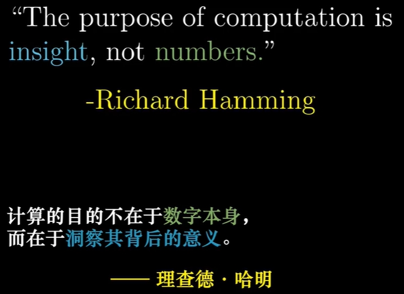

## 向量究竟是什么？

物理学：空间中的箭头（箭头长度、箭头方向）

计算机：数字列表（列表长度、列表维度）

数学家：将上述两个想法抽象，并可以计算，保证**向量相加**以及**数字与向量相乘**（向量的数乘）是有意义的。

向量相加：

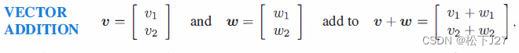

向量的数乘：

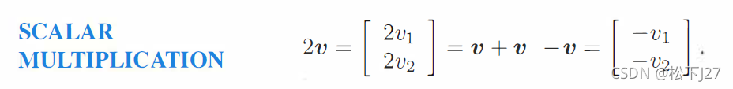

## 线性组合、张成的空间、线性相关

基、基向量：单位向量

线性组合：

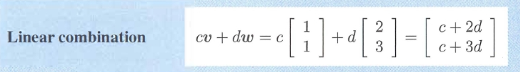

张成的空间：线性组合构成的空间。

线性相关：

* 表述1：至少有一个向量，可以被其他向量表示。因为它已经落在其他向量表示的张成的空间中。
* 表述2：至少有一个向量可以移除，而不减少张成的空间。

线性无关：所有向量都给张成的空间增加了维度。

## 线性变换与矩阵的关系

向量的变换就叫**线性变换**。变换指：缩放和旋转

什么是变化？变换本质上就相当于函数。

为什么用变换不用函数？变换在暗示你用**运动**去思考。

为什么叫线性变换？因为变换后“网格线保持平行且等距分布”

向量如何变换？基向量变换即可。

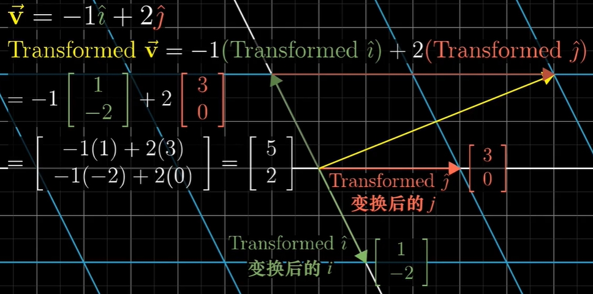

把这一变换过程抽离出来，就是矩阵。矩阵的作用就是变换。

1、矩阵可以看作一个函数。

2、矩阵的列可以看作是变换后的基向量。

3、矩阵向量的乘法可以看作一个线性组合。

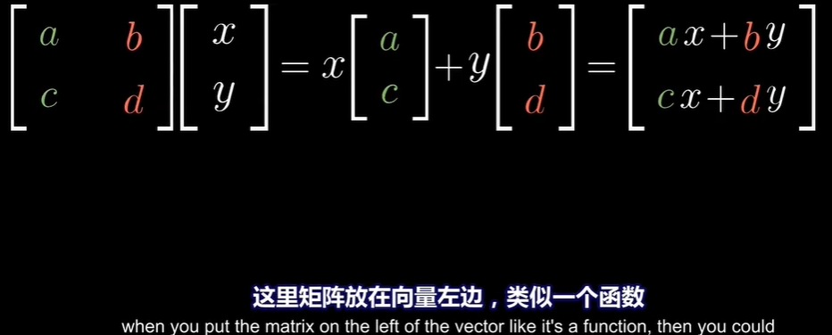

## 矩阵乘法与线性变换的关系

我们想做两个线性变换：旋转、剪切。既可以用一个矩阵表示、也可以用两个矩阵表示。

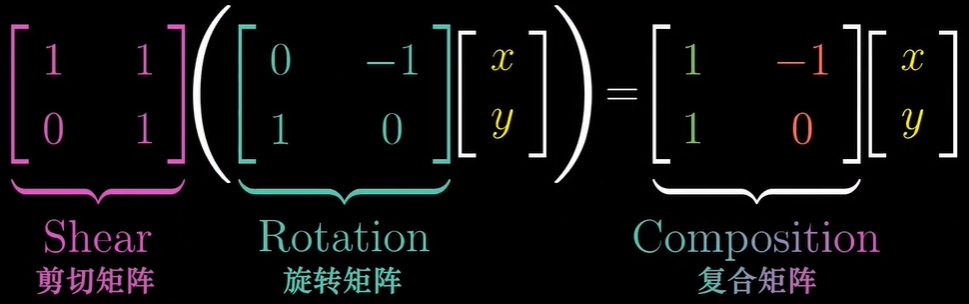

所以矩阵乘法：

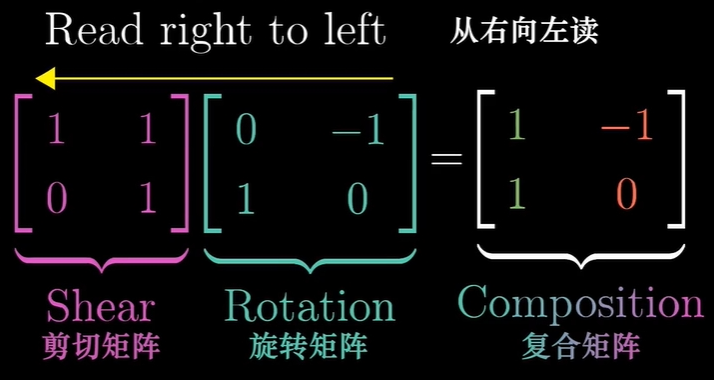

逐步分解矩阵乘法：

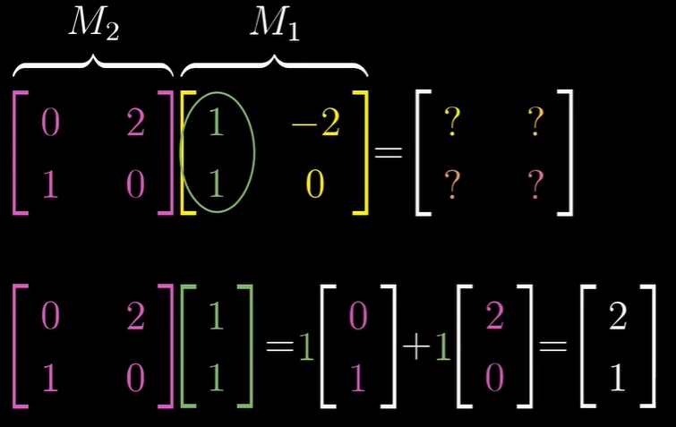

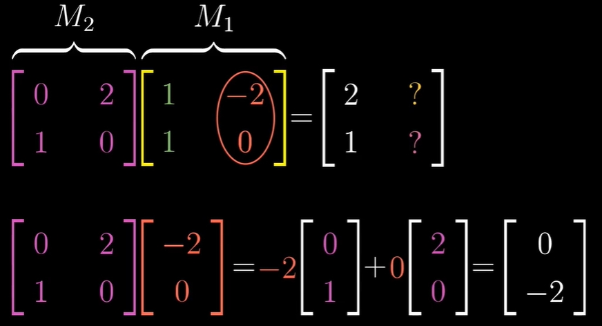

公式化表示：

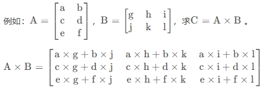

注意：

1、不满足交换律（因为先旋转再缩放，和先缩放再旋转的变换过程是不一样的）

2、满足结合律和分配律

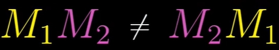

## 矩阵的行列式

矩阵就是线性变换。

线性变换的行列式就是测量变换对空间有多少拉伸或挤压。即，测量一个给定区域面积缩放的比例。

如何解释行列式有负数？变换会改变空间的定向（方向）。

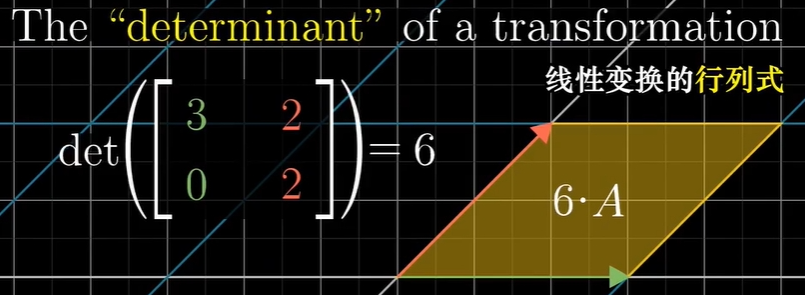

三维行列式计算公式：

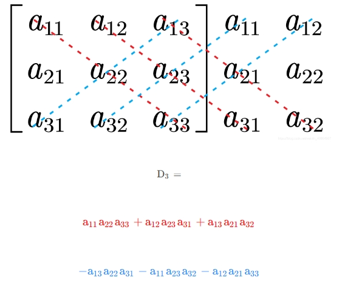

定理：矩阵乘积的行列式等于行列式的乘积

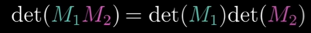

## 逆矩阵、列空间、秩

线性方程组：

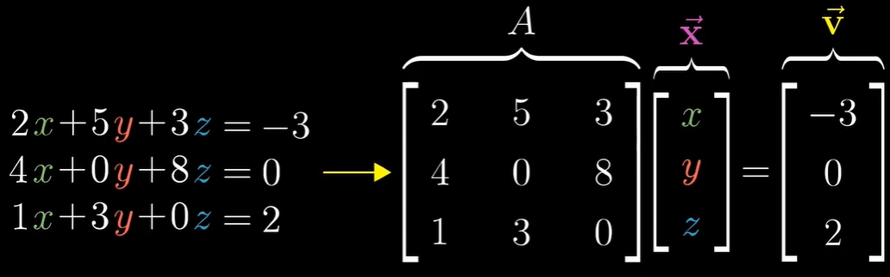

如何求解x：用A的逆矩阵

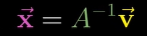

什么时候存在解？

* 当行列式不等于0时，矩阵线性无关，存在唯一解。

* 当行列式等于0时，矩阵线性相关，A的逆矩阵不存在，此时可能存在解。如，A是二维的，v也是二维的。

行列式为0时，需要用**秩**来描述变换。所有可能的变换的集合，被称为矩阵的**列空间**。矩阵的列就是基向量的变换后的位置，矩阵的列向量张成的空间就是列空间。所以，秩就是列空间的维数。变换后，落在原点的向量的集合，被称为矩阵的**零空间**或**核**。

## 向量点积

点积也叫内积：

点积在几何意义上可以表示成投影（**这种表述有点本末倒置，首先是为了投影成点，然后才有了点积公式**）：

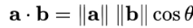

下面分析：投影->点积

问题1：这里有一条数轴，如何将二维（多维）上的点转换到一维？答案是投影。

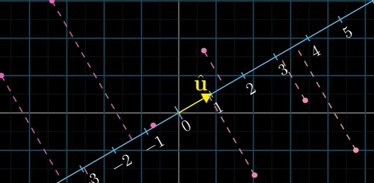

问题2：投影就是变换，就可以用矩阵表示。

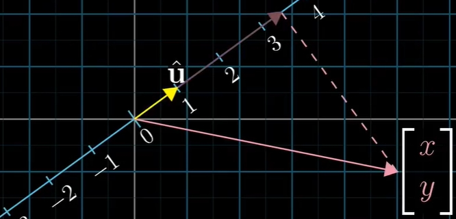

矩阵变换在这里恰好和点积计算公式相似。

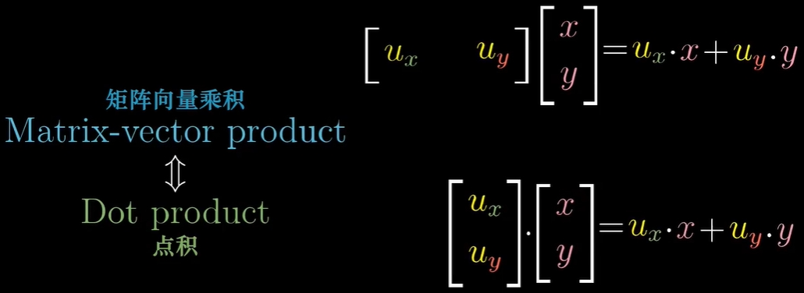

总结：投影是为了做变换，变换就是矩阵，矩阵计算和点积计算一样。所以，点积就是为了一个向量做线性变换。

## 向量叉积

对于二维向量的叉积，就是行列式，就是两个向量的面积（和向量的相对方向）

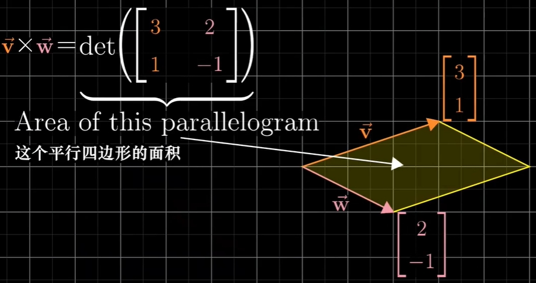

对于三维向量的叉积：

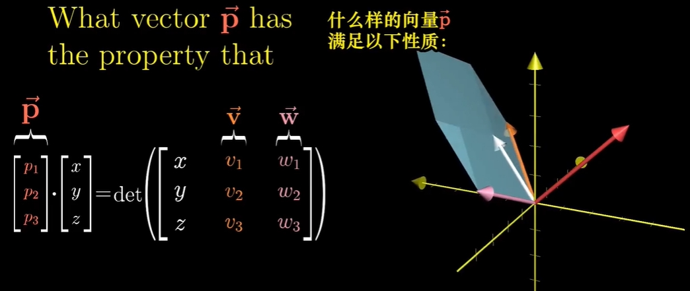

v和w的叉积就是p

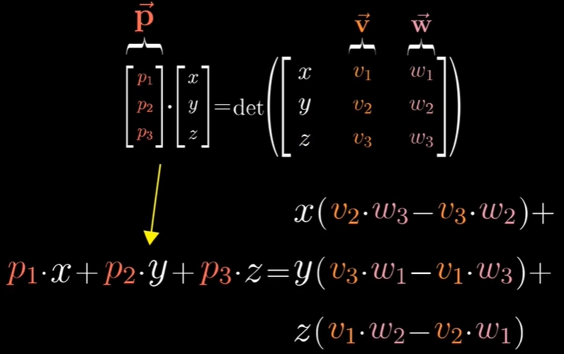

## 基变换

我们（粉色）的基向量变换成另外一组（蓝色）基向量

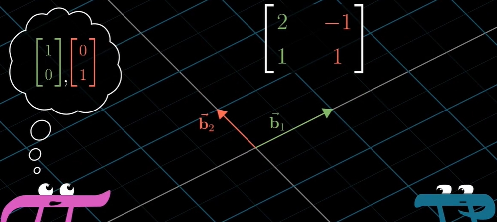

我们空间的[1,2]，在另一基向量空间中就是：

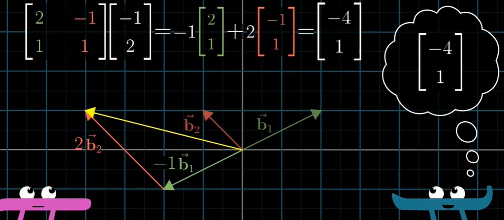

假如另一空间中的[5/3，1/3]，在我们空间怎么表示：我们需要用基向量矩阵的逆。

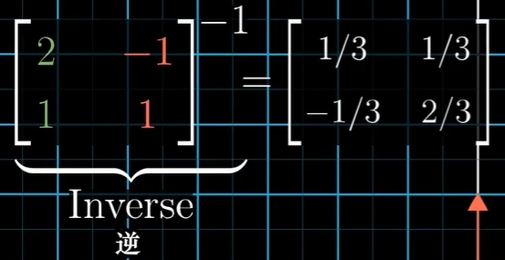

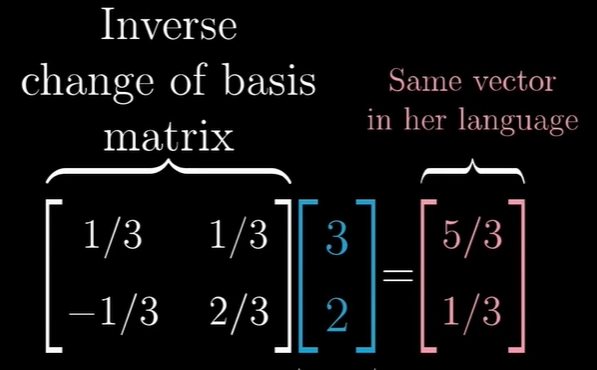

假如我们空间逆时针旋转90度，我们可以用下面矩阵表示，另一空间怎么表示？

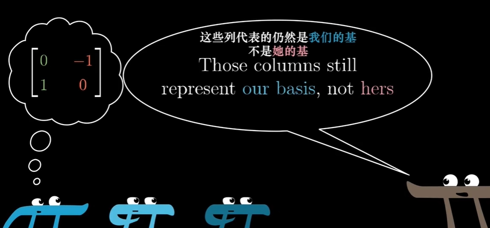

先用逆时针旋转矩阵 乘以 基向量矩阵，表示我们空间中的转移后的基向量矩阵；

再乘以 基向量矩阵的逆，表示她的空间的基向量矩阵。 

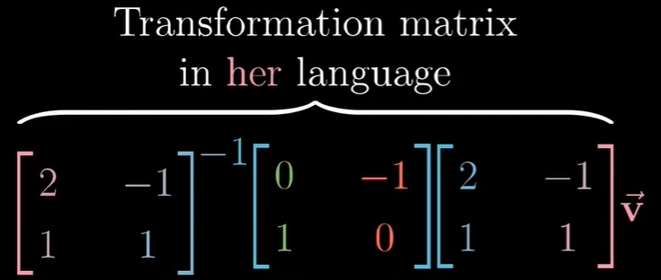

所以，我们看到下面的公式：A和A的逆表示基向量转移矩阵；M表示变换矩阵。

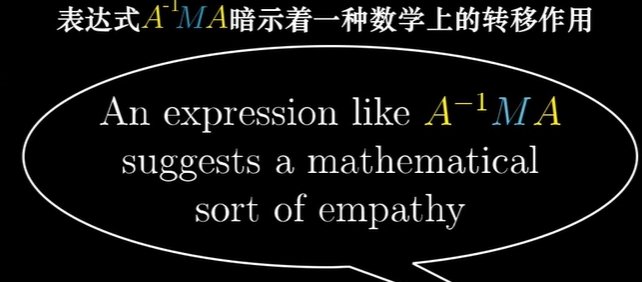

## 特征值和特征向量

一个空间进行旋转，发现有两条线上的向量，没有旋转，只有缩放。这个就是特征向量。特征向量都有自己的特征值，表示缩放的比例因子。

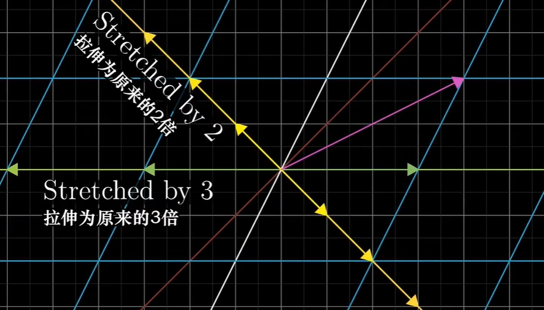

求解特征值和特征向量

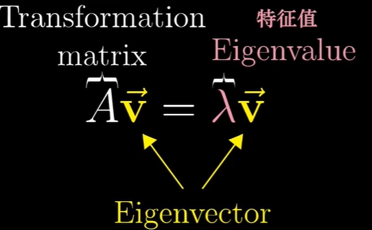

矩阵乘法=0，表示压缩到低维空间，表示行列式为0

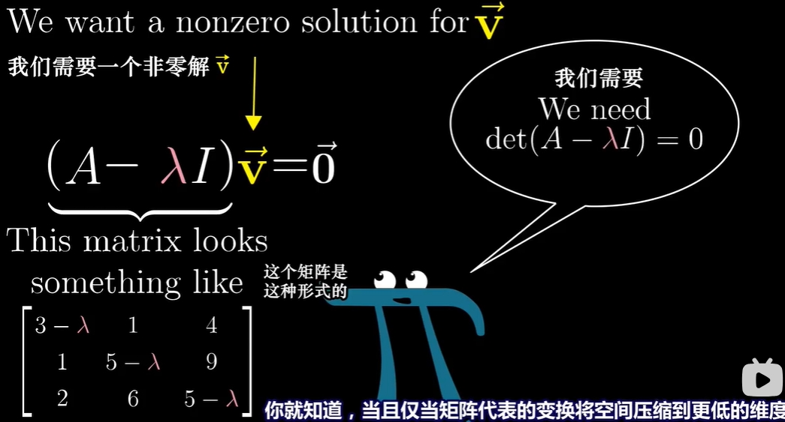

对角矩阵，所有基向量都是特征向量：（对角矩阵只进行了缩放，没有旋转）

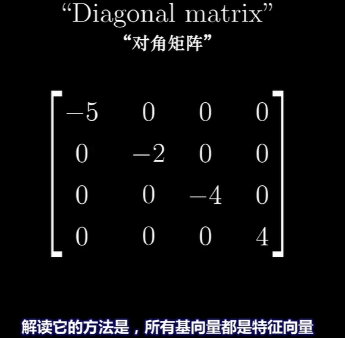

