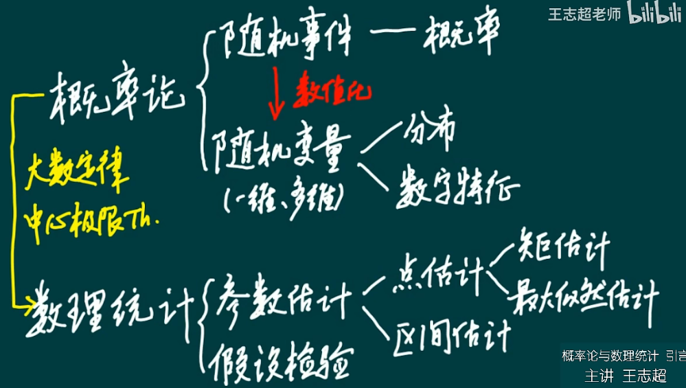

# 第一章 概率论的基本概念

## 一、概率的定义和性质

**1、定义**

满足下列条件的试验称为随机试验：
* 可以在相同的条件下重复地进行；
* 每次试验的可能结果不止一个，并且能事先明确试验的所有可能结果；
* 进行一次试验之前不能确定哪一个结果会出现。

样本点：随机试验的每一个可能结果称为样本点。

样本空间S: 所有样本点全体组成的集合称为样本空间。

随机事件：样本空间S的子集称为随机事件，通常用大写字母A,B,C等表示。

**2、事件的关系及运算**

事件的关系及运算：（如果理解不了，去搜韦恩图表示）

* A包含B： $A \supset B$
* A与B相等： $A=B$
* A与B的和： $A \cup B$
* A与B的积： $AB$ 或 $A \cap B$
* A与B的差： $A-B$
* A与B互斥： $AB = \emptyset$
* A的对立事件： $\bar{A}$

事件运算的性质：

交换律：

结合律：

分配律：

德摩根律：（长杠变短杠，开口变方向）

**3、概率和频率的定义**

频率：在相同条件下，n次试验中，事件A发生的次数，$n_A / n$ 称为事件A发生的频率

概率：E是随机试验，S是样本空间。对于E的每一事件赋予一个实数，记 $P(A)$，称为事件A的概率。

## 二、古典概型和几何概型

**1、古典概型**

引例：张三李四比赛猜拳，谁先赢10局谁就获得1000元。当比分8:7时，中止比赛，按当前结果如果分配这笔奖金？

解答：按8:7或3:2分配都不合理。比赛最多进行4局分成胜负，按照4局计算所有可能结果，最后结果是11:5

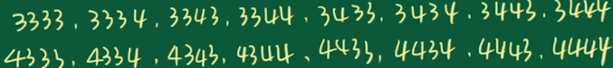

定义：一个试验的样本点有限，并且每个样本点出现的可能性相等，那么这个试验就是古典概型，比如仍骰子。

**2、几何概型**

定义：如果试验是从某一线段（平面、空间）上取一点，并且所取的点在该线段（平面、空间）内的可能性相同，那么这个试验就是几何概型。

## 三、条件概率

条件概率$P(B|A)$表示已知事件A发生的情况下，事件B发生的概率：

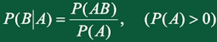

## 四、全概率公式与贝叶斯公式

韦恩图：B是完备事件组，所有B事件组成样本空间。

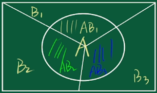

全概率公式用法：有完备事件组（如图中事件B），并且知道事件A与完备事件组B的条件概率，那么就可以求事件A发生的概率。

全概率公式：

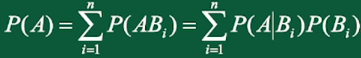

贝叶斯公式用法：有完备事件组（如图中事件B），并且知道事件A与完备事件组B的条件概率，那么就可以求事件B基于事件A的条件概率。

贝叶斯公式：

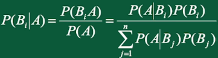

## 五、事件的独立性

设A,B是两个事件，如果满足：

则称事件A,B相互独立。

# 第二章 随机变量及其分布

## 一、定义

### 1、随机变量

定义：随机变量 $X$ 是定义在随机试验样本空间 $S=\{e\}$ 上的单实值函数，记为 $X=X(e)$

笔记：随机变量是为了数值化表示，这样更方便数学研究。$X$ 相当于样本空间，$x$ 相当于样本点。

### 2、分布律和概率分布密度

离散型随机变量X的所有可能取值为 $x_k (k=1,2,3,...)$ ，X取到各个可能值的概率 $P(X=x_k)=p_k$ ，称为随机变量X的概率论分布，也叫分布律。

举例：骰子每面发生的概率

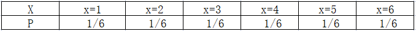

连续型随机变量X在任意位置的概率若为 $f(x)=P(X=x)$，则称 $f(x)$ 为随机变量X的概率分布密度。

举例：你7:00-9:00起床的概率

为什么叫概率密度函数（概率分布密度函数）？因为每个点的值来源于频率/组距：

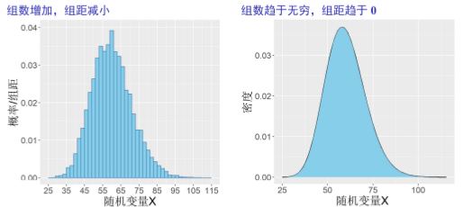

### 3、分布函数

若 $F(X) = P(X<=x)$，称随机变量X的分布函数。分布函数表示将随机变量X<=x的所有取值的概率相加。

分布函数和概率密度的关系：

1. $F(x_2) - F(x_1) = \int_{x_1}^{x_2} f(x) dx = P(x_1 <= X <= x_2)$
2. $F(x) = \int_{-\infty}^{x} f(t) dt$

笔记：分布函数、概率密度 都是为了更方便研究，从不同角度定义的两个函数。

## 二、离散型随机变量及其分布

### 1、0-1分布

随机试验的结果只有两个，随机变量X只有两个可能取值0或1，其分布律可以写成：

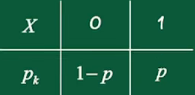

也可以写成：

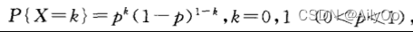

### 2、二项分布

只有两个结果的随机试验成为伯努利试验，独立重复n次，称为n重伯努利试验。（0-1分布是一次伯努利试验）

假设单独一次试验A发生的概率为p，不发生的概率为q（q=1-p），则n次试验中A发生k次的概率为：

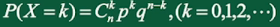

我们把n重伯努利试验中A发生的次数，这个随机变量服从的分布称为二项分布，记 $B(n,p)$

### 3、泊（po）松分布

问题假设：

1、假设每个小时要么有新生儿出生1，要么没有0；

2、假设一天有10个新生儿，那么每个小时有10/24个新生儿；

3、假设每个新生儿互不影响。

问题：

在24小时内，有k个新生儿出生的概率是多少？

问题分析：

这其实是n重伯努利试验。但是

1、假设1存在问题，因为小时不合理，可以按分钟、按秒、按微秒，，，即n趋于无穷。

2、假设2存在问题，这里将每天出生新生儿数量设为$\lambda$ 。

通过求极限消除n，得到泊松分布。

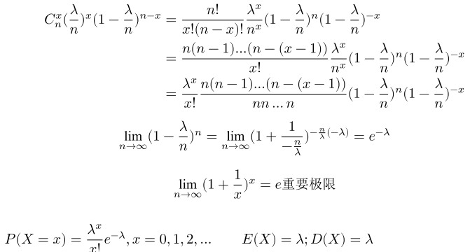

上面推理告诉我们：如果随机变量 $X \sim B(n, p)$，当n很大，p很小时，X近似服从参数 $\lambda = np$ 的泊松分布。

泊松分布（Poisson distribution）适合于描述单位时间（空间）内随机事件发生的次数。如加油站一个小时内到达的车辆数，一个医院一天内出生的新生儿的数量等等。

泊松分布的分布律：

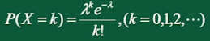

其中 $\lambda > 0$ 是一个常数，表示单位时间（空间）内随机事件发生的平均次数；k是次数。$X \sim P(\lambda)$ 表示随机变量X服从参数为 $\lambda$ 的泊松分布。

泊松定理：

设 $\lambda > 0$ 是一个常数，n是任意正整数，设 $np_n = \lambda$，则对于任一固定的非负整数k，有

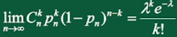

这个定理告诉我们：如果随机变量 $X \sim B(n, p)$，当n很大，p很小时，X近似服从参数 $\lambda = np$ 的泊松分布，即

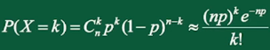

## 三、连续型随机变量及其概率密度

### 1、均匀分布

若连续型随机变量X具有概率密度

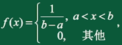

则称随机变量X服从均匀分布，记 $X \sim U(a, b)$ 。X的分布函数为

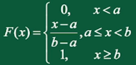

### 2、指数分布

若连续型随机变量X具有概率密度

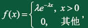

其中 $\theta > 0$ 为常数，则称X服从指数分布，记 $X \sim E(\lambda)$ 。 X的分布函数为：

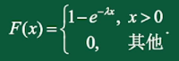

笔记：
* 泊松分布：医院一天内出生新生儿的数量，$\lambda$表示一天内平均出生的数量。
* 指数分布：两个新生儿出生的时间间隔，$\frac{1}{\lambda}$ 表示两个新生儿出生的平均间隔。

### 3、正态分布

正太分布（Normal distribution），也叫常态分布，高斯分布。

若连续型随机变量X具有概率密度：

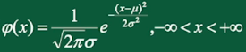

其中 $\mu$均值，$\sigma$标准差为常数，则称X服从参数为$\mu ,\sigma$的正态分布，记$X \sim N(\mu, {\sigma}^2)$ 。

若 $X \sim N(0,1)$ ，称X服从标准正态分布，有概率密度：

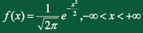

正态分布标准化：

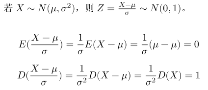

问题1：样本的均值的均值和方差是什么？

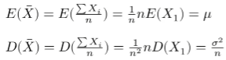

笔记：违反直觉，可以这样理解，采样越多n越大，变量X的方差越小。

# 第三章 多维随机变量及其分布

### 1、二维离散型随机变量

二维离散型随机变量的概率分布（联合分布律）：

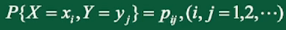

二维离散型随机变量的分布函数：

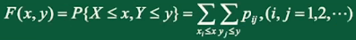

二维离散型随机变量的边缘分布函数：

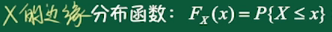

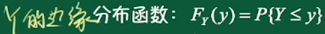

独立性：

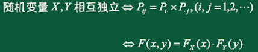

### 2、二维连续型随机变量

二维连续型随机变量的联合分布函数：

其中，$f(x,y)$ 是二维连续型随机变量的概率分布函数。

二维连续型随机变量的边缘分布函数：

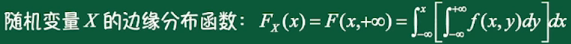

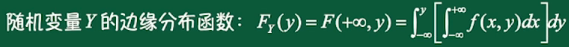

独立性：

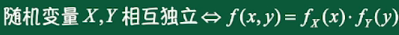

# 第四章 随机变量的数字特征

### 1、数学期望

数学期望：随机变量由概率加权的平均值

离散型随机变量的数学期望：

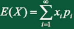

连续型随机变量的数学期望：

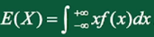

### 2、方差

方差：偏差平方的概率加权平均值，衡量平均偏离程度（稳定性）

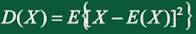

标准差或均方差：

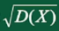

切比雪夫不等式：

设随机变量X，其均值和方差都存在，对任意$\epsilon > 0$ 均有：

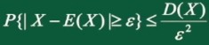

笔记：切比雪夫不等式描述了，在只知道均值和方差的情况下，可以大概知道该点落在某个区间内的概率。

### 3、协方差及相关系数

协方差：描述二维随机变量X，Y的线性相关性。

设 $(X, Y)$ 是二维随机变量，且EX和EY都存在，X和Y的协方差记作： 

相关系数：由于协方差受量纲（单位）的影响特别严重，如果将每个维度标准化，再计算协方差，通过推理，其结果就是相关系数：

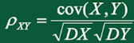

问题1：怎么标准化？

如果这些数据都符合正态分布 $X \sim N(\mu, {\sigma}^2)$ ，其中均值等于$\mu$，方差等于${\sigma}^2$。标准化过程是：

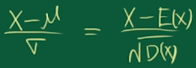

问题2：从协方差到相关系数的推理过程？

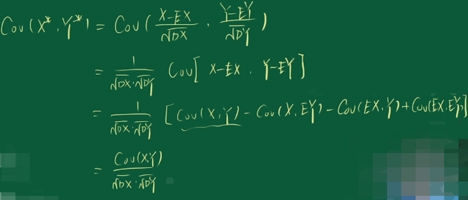

### 4、中心矩、原点矩

中心矩：$E(X-EX)^k$ , 这里以EX为中心

原点矩：$E(X)^k$ ，这里以0为中心

一阶原点矩：EX，就是期望

一阶中心矩：E(X-EX) = EX - EX = 0

二阶中心矩：E(X-EX)2，就是方差

# 第五章 大数定律及中心极限定理

## 一、大数定律

大数定理讲了什么：在样本足够多的情况下，随机变量序列的均值收敛于真实的均值；随机事件发生的概率收敛于真实的概率。

大数定理和中心极限定理为什么有很多条：就像0-1分布和伯努利分布，只有一个统一的定律，其它都是在特殊情况下的变种，这些变种是由不同的人发现的。

辛钦大数定律是切比雪夫大数定律的特殊情况；伯努利大数定律是辛钦大数定律的特殊情况。

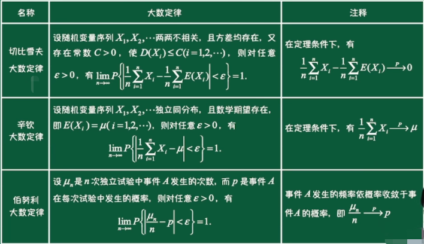

## 二、中心极限定理

中心极限定理讲了什么：无论随机变量服从什么分布，在试验足够多的情况下，它们的算术平均值（如平均身高、平均寿命）都近似服从正态分布。当然，在经过标准化，近似服从标准正态分布。

重点理解：这里不是说X服从正态分布，而是在说 抽样分布 近似服从 正态分布。

什么是抽样分布：如随机抽100人计算平均身高为175，如果再进行类似的9次抽样调查，会得到10组平均身高。根据中心极限定理，这10组抽样的分布服从正态分布，所以我们就不会担心源数据具体是什么分布，都能计算出样本的相关统计量（均值和方差）。

举例：随机掷骰子，分成1000组，每组1000次。每次的平均值接近3.5，每组接近**均匀分布**。1000组的平均值也是接近3.5，但是1000组是**正态分布**。

具体数学公式就不列了，就像大数定律，这些公式平常用不到。但是，这里的思想是数理统计的基础。

# 数理统计

科学研究有两种逻辑思维方法：

* 演绎法（deduction）：从一条公理出发进行推演分析
* 归纳法（induction）：从大量经验事实中总结出最接近本质的原理

概率论是演绎法，已知随机变量的分布，去研究问题。

数理统计是归纳法，通过大量试验总结规律。

数理统计的分类：
* 描述统计学：对随机现象进行观测、试验，以取得有代表性的观测值。如抽样方法、试验设计。
* 推断统计学：对已取得的观测值进行整理、分析，作出推断、决策，从而找出所研究的对象的规律性。参数估计、假设检验、方差分析、回归分析。

# 第六章 样本及抽样分布

## 一、随机样本

样本基本概念：
* 总体：试验的全部可能观测值，即随机变量X
* 个体：每一个可能的观测值
* 总体容量：总体中包含的个体的数量
* 抽样调查：从总体中随机抽取一部分个体观测结果 
* 样本定义：设总体X是具有分布函数F的随机变量，若 $X_1,X_2,...,X_n$是与X具有同一分布函数且相互独立的随机变量，则称$X_1,X_2,...,X_n$为从总体X得到的容量为n的简单随机样本，简称样本。它们的观测值$x_1,x_2,...,x_n$称为样本值。

## 二、抽样分布

通过样本观察值我们可以获得一些数据，通过对这些数据进行加工处理，可以对总体进行有效的统计推断。这个加工的过程通常就是对样本构造适当的函数。比如我们求样本的平均值，来推断总体的平均值。而这个构造出来的样本的函数我们称为统计量。

统计量是样本的函数，而样本是随机变量，故统计量也是随机变量，统计量的概率分布称为抽样分布。

统计量：样本的函数，不含未知参数。

定义：设$X_1,X_2,...,X_n$是来自总体X的一个样本，$g(X_1,X_2,...,X_n)$是$X_1,X_2,...,X_n$的函数，若g中不含未知的参数，则称$g(X_1,X_2,...,X_n)$是一个统计量。

常用的统计量：

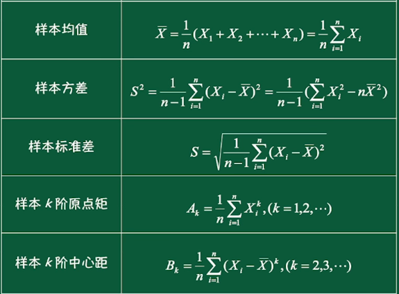

样本方差为什么除以n-1?

1、方差分为总体方差、样本方差；总体方差除以n，因为我们知道总体的数量；但是现实世界我们不知道总体数量，而是抽样，然后计算样本均值、样本方差。

2、如果除以n，对样本方差的估计不是无偏估计，比总体方差要小，要想是无偏估计就要调小分母，所以除以n-1。

为什么小，什么是无偏估计？

1、我们希望样本方差=总体方差，即 $E(S^2) = \delta ^ 2$ 

2、如果分母是n，推理：$E(S^2) = Var(X) - Var(\bar{X}) = \delta^2 - \frac{1}{n}\delta^2 = \frac{n-1}{n} \delta^2$ .

3、分母是n，比总体方差小，所以是有偏估计。如果是n-1，总后推理正好相等，推理过程复杂，略。

 

## 三、三大抽样分布

什么是抽样分布：如随机抽100人计算平均身高为175，如果再进行类似的9次抽样调查，会得到10组平均身高。根据中心极限定理，这10组抽样的分布服从正态分布。即使是x组，每组y次的掷骰子，这x组的抽样分布也服从正态分布。所以我们就不会担心源数据具体是什么分布，都能计算出样本的相关统计量（均值和方差）。（所以搞这么复杂，就是为了准确计算均值和方法？）

首先要明确的是，所有分布的前提是所收集的样本要服从正态分布，这需要首先进行正态分布的拟合检验，即使是大样本的情况下，样本正态的情况下分析的结论也会更严谨。

抽样分布（样本分布的分布）可以分为两类：一类是关于均值的分布：正态分布和t-分布；另一类是关于方差的分布：
$\mathcal{X}$-分布和F-分布。

**1、卡方分布**

定义：设 $X_1,X_2,...,X_n$ 相互独立且均来自总体 $X \sim N(0,1)$ ，则称统计量（它们的平方和）

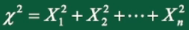

服从自由度为n的 $\mathcal{X}^2$ 分布，记 $\mathcal{X}^2 \sim \mathcal{X}^2(n)$

特点：

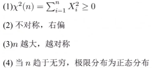

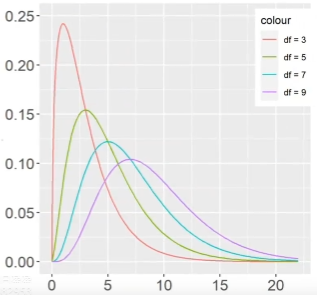

知识点1：若$Y \sim \mathcal{X}^2(n)$, 则Y一定可以分解成n个独立的标准正态随机变量的平方和。

性质1：样本的方差服从自由度为n-1的卡方分布

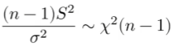

性质2：可加性（但不满足可减）

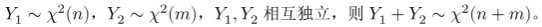

**2、t 分布**

为什么叫t分布？因为作者发表文章的笔名叫"Student"

定义：设 $X \sim N(0,1)$ ，$Y \sim \mathcal{X}^2(n)$ ，且X,Y相互独立，则称统计量

服从自由度为n的 t 分布，记 $t \sim t(n)$

**3、F 分布**

定义：设 $U \sim \mathcal{X}^2(n_1)$ ，$V \sim \mathcal{X}^2(n_2)$ ，且U,V相互独立，则统计量

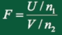

服从自由度为 $(n_1, n_2)$ 的F分布，记 $F \sim F(n_1, n_2)$ 

# 第七章 参数估计

判断了分布类型后，总体分布中会有一些未知参数，需要用到参数估计的方法：点估计和区间估计。

## 一、点估计

设总体X的分布函数$F(x;\theta)$的形式已知，$\theta$是待估计参数。$X_1,X_2,...,X_n$是X的一个样本，$x_1,x_2,...,x_n$是相应的一个样本值。点估计就是要构造一个适当的统计量$\hat{\theta}(X_1,X_2,...,X_n)$，用它的观察值$\hat{\theta}(x_1,x_2,...,x_n)$ 作为未知参数$\theta$的近似值。我们称

$\hat{\theta}(X_1,X_2,...,X_n)$ 为 $\theta$ 的估计量，$\hat{\theta}(x_1,x_2,...,x_n)$ 为 $\theta$ 的估计值。

点估计的两种方法：矩估计和最大似然估计。

### 1、矩估计

用样本矩 估计 总体矩。这里主要是用样本的一阶原点矩（样本均值）来估计总体均值（数学期望）。

### 2、最大似然估计

最大似然估计的思想是：如果一次试验的结果是A发生了，那么有理由相信A发生的概率就是最大的。因此我们求什么参数取什么值时，这个样本出现的概率最大，就用这个取值作为参数的估计值。

## 二、区间估计

点估计是对参数估计一个具体的值，而区间估计是对未知参数估计出一个范围。这里主要是对总体的均值和方差进行估计。

主体思想是通过从总体抽取的样本，根据一定的准确度要求，构造出合适的区间，以此作为参数真实值的估计区间。

# 第八章 假设检验

# 参考资料

《概率论与数理统计》内容讲解视频
https://www.bilibili.com/video/BV15o4y1R74P?p=22&spm_id_from=pageDriver&vd_source=c680aab5d5ef234c75928d8686b004a5

《概率论与数理统计》知识点总结
https://blog.csdn.net/Aliy66/article/details/123661773

抽样分布有什么用
https://zhuanlan.zhihu.com/p/25250959