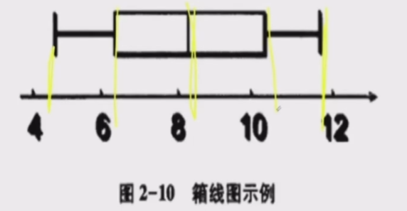
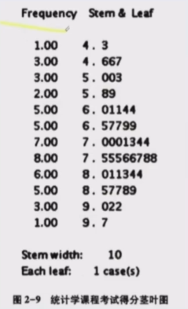
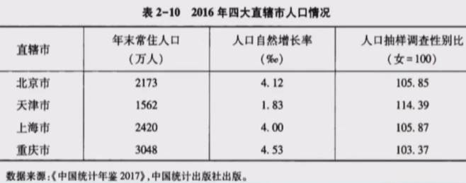
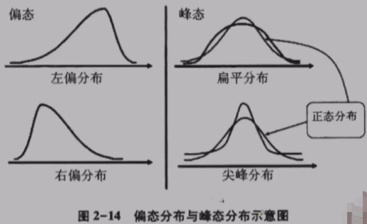

课程大纲：

1、统计和数据

2、数据描述

3、参数估计

4、假设与检验

5、相关分析与回归分析

6、时间序列分析

7、统计指数

# 一、统计与数据

课程大纲：

1、统计的定义

2、数据类型

3、数据搜集

4、数据误差

## 统计的定义

统计学：数学的应用（描述、推测、应用）

* 描述description：统计与数据，数据描述
* 推测inference：参数估计，假设与检验
* 应用application：相关分析与回归分析，时间序列分析，统计指数

辅助计算工具：Excel, SPSS, R, MiniLab

## 数据类型

分类：

1、定性数据：规定事物类别的文字表述型数据，不能将其量化

* 分类数据
* 顺序数据（分类数据的一种）

2、定量数据：它们都是以数值的形式出现的

数据归纳后，成为三种数据

1、横截面数据cross-seetinal：多个变量在同一时间的数据

2、时间序列数据time-scale：某种变量在时间顺序上的数据

3、面板panel（常用）：多个变量在时间序列上的数据

## 数据搜集

两大来源：

1、直接来源（一手数据、一级数据）

* 实验Experiment（人为控制）

* 观测Observation（统计调查）

2、间接来源（次级数据）

常用的统计调查方法：

1、普查census

2、抽样调查sampling

3、报表调查：制定调查表

4、重点调查：找比重最大的这一类数据去调查

5、典型调查：找具有代表性的这一类数据去调查

抽样调查分类：

1、概率抽样：

* 简单随机抽样random：放回、不放回
* 分层抽样layers：分成层次，如体重
* 整群抽样cluster：分成群体，如男、女
* 系统抽样systematic：选起始点、定间隔数，如按时间

2、非概率抽样：

* 方便抽样：看顺眼就抽、碰到即问，所以不准
* 判断抽样：主观判断，主观性比较大
* 配额抽样：类似于分层，先分配，所以取决于分配的准确性
* 雪球抽样：选第一个，找关联第二个，第三个，以此类推。

## 数据误差

两大类：

1、抽样误差：不能代表总体

* 总体问题（不可控）
* 样本少
* 方法错误

2、非抽样误差

* 抽样框误差（清单），如丢失单位、多出单位、非对应关系、
* 应答误差：答非所问
* 无回答
* 计量误差

# 二、数据描述

数有两个特征：

1、数值特征：数字（本质、代数）

2、分布特征：图表（视觉、几何）

## 图形描述

> 在画图表之前，都需要做出频数分布表。

定性数据展示方法：

1、饼图：描述占比

2、环图：描述分组占比（若干个空心圆，如根据男女分成两类，每类的各年龄段占比）

3、条形图：

4、帕累托图

定量数据展示方法：

1、直方图：条形图分开排列重点是频数；直方图横坐标代表各组的界限，纵坐标代表频数/频率。频数密度 = 频数 / 组距

2、折线图：反应变化规律、趋势。

3、散点图：两个变量，观察他们的相关程度。

4、箱线图：用于描述数据分布特征的一种图形，常用于显示未分组原始数据的分布。箱线图由一组数据的5个特征值绘制而成（最大值、最小值、中位数、两个四分位数），一个箱子两条线段，再将两个极值点与箱子相连。

5、茎叶图：反应原始数据分布。直方图大批量数据，茎叶图小批量数据。

6、雷达图：多个变量对比。

7、气泡图：展示三个变量之间的关系，与散点图类似。

## 统计表描述

统计表两个目的：

1、支持自己的观点

2、组织数据

统计表要素：

1、标题：简明扼要（When,Where,What）

2、表格：两边不封口、上下两边粗线、数据右对齐（小数点对齐）。

3、注释：必要时在表的下方加上注释。

## 数字描述

针对一组数据的分布特征，可以从三个方面考察：

1、集中趋势，即向中心值的靠拢程度。

2、离散程度，即远离中心值的趋势和程度。

3、分布形状，即分布规律。

集中趋势描述：

1、众数

2、中位数：按顺序排列，位居中间。

3、分位数：按顺序排列，分割点的数值就是相应的分位数。如果是0.5分位点，就等于中位数。四分位数比较常用。

4、算数平均数

5、几何平均数：所有数相乘再开n次根。

离散趋势描述：

1、异众比率variation ratio：非众数所占比率。

2、极差range：最大值最小值之差。

3、四分位距quatile distance：等于上下四分位数之差（0.75分为数-0.25分为数）。用$Q_d$表示。

4、平均差：$MAD=\frac{\sum{|X-\bar{X}|}}{N}$

5、总体方差：$\sigma^2 = \frac{\sum(x_i - \bar{x})^2}{n}$，样本方差$S^2 = \frac{\sum(x_i - \bar{x})^2}{n-1}$，自由度为n-1。

6、离散系数：数值之间的差异程度；方差 除以 平均数；不受数值计量单位的影响。

7、标准分数：$E_i = \frac{x_i - \bar{x}}{s}$，某点占标准差比例。

偏态和峰度：

偏态和峰态可以用来测度数据分布形状是否对称、偏斜程度、扁平程度。

偏态系数：计算方法有很多，如皮尔逊系数等，不偏时为零，偏斜越大，偏态系数越大。

峰度系数：将随机变量的四阶中心矩 与其标准差的四次方相除，所得比率为峰度系数。

# 三、参数估计

## 抽样分布

**总体：**试验的全部可能观测值是总体，因为观测值各不相同，可视为随机变量，用X表示。总体的参数通常是不知道，我们要利用样本去推断，总体的参数通常有：均值$\mu$ 、方差$\sigma^2$ 、比例$\pi$等。

**样本：**设总体X是具有分布函数F的随机变量，若 $X_1,X_2,...,X_n$是与X具有同一分布函数且相互独立的随机变量，则称$X_1,X_2,...,X_n$为从总体X得到的容量为n的简单随机样本，简称样本。它们的观测值$x_1,x_2,...,x_n$称为样本值。

通过样本观察值我们可以获得一些数据，通过对这些数据进行加工处理，可以对总体进行有效的统计推断。这个加工的过程通常就是对样本构造适当的函数。比如我们求样本的平均值，来推断总体的平均值。而这个构造出来的样本的函数我们称为统计量。

**统计量：**是样本的函数，是对样本某个特征的概括性度量，是不含任何未知参数的样本的函数。定义：设$X_1,X_2,...,X_n$是来自总体X的一个样本，$g(X_1,X_2,...,X_n)$是$X_1,X_2,...,X_n$的函数，若g中不含未知的参数，则称$g(X_1,X_2,...,X_n)$是一个统计量。

注意：样本是随机变量，所以在抽样前统计量也是一个随机变量，统计量所形成的概率分布称为抽样分布，如样本均值的分布，样本比例的分布等。当抽样后，样本值是观测值，这个统计量就是已知的。

什么是抽样分布：如随机抽100人计算平均身高为175，如果再进行类似的9次抽样调查，会得到10组平均身高。根据中心极限定理，这10组抽样的分布服从正态分布。即使是x组，每组y次的掷骰子，这x组的抽样分布也服从正态分布。所以我们就不会担心源数据具体是什么分布，都能计算出样本的相关统计量（均值和方差）。（所以搞这么复杂，就是为了准确计算均值和方法？）

**抽样分布：**统计量所形成的概率分布称为抽样分布。

首先要明确的是，所有分布的前提是所收集的样本要服从正态分布，这需要首先进行正态分布的拟合检验，即使是大样本的情况下，样本正态的情况下分析的结论也会更严谨。

三个分布：

总体分布：总体数据的分布

样本分布：样本数据的分布

抽样分布：样本分布的分布

一、样本均值的抽样分布

1、样本均值的均值=总体均值，即抽样分布的均值=总体均值$E(\bar{x}) = \mu$ 

2、样本均值的方差

放回抽样时，样本均值的方差是总体方差$\sigma^2$的1/n，$S^2 = \frac{\sigma^2}{n}$

不放回抽样时，样本均值的方差略小于重复抽样的方差：$S^2 = \frac{\sigma^2}{n} \frac{N-n}{N-1}$

二、样本比率的抽样分布

1、样本比率的均值=总体比率$E(p)=\pi$

2、样本比率的方差

放回抽样时，$\sigma_p^2 = \frac{\pi(1-\pi)}{n}$

不放回抽样，$p ~ N(\pi, \frac{\pi(1-\pi)}{n} \frac{N-n}{N-1})$ 

## 参数估计

参数估计：根据样本统计量估计总体的参数。比如样本均值$\bar{x}$估计总体均值$\mu$，样本比例p估计总体比例$\pi$，样本方差$S^2$估计总体方差$\sigma^2$。

估计量：用来推断总体参数的统计量称为估计量。

估计值：根据具体的样本计算出来的估计量称为估计值。

注意：同一个参数可以有多个估计量，参数是唯一的，但估计量是随机变量，取值不确定。

两种方法：点估计和区间估计

点估计point estimation：用样本统计量的某个实际取值作为相应的总体参数的估计值。如用样本均值$\bar{x}$估计总体均值$\mu$，用样本比例p估计总体比例$\pi$，用样本方差$S^2$估计总体方差$\sigma^2$。

区间估计interval estimate：在点估计的基础上，给出总体参数估计的一个区间范围，该区间通常由样本统计量加减估计误差得到。

## 样本量的确定

# 四、假设与检验

# 五、相关分析与回归分析

# 六、时间序列分析

# 七、统计指数

