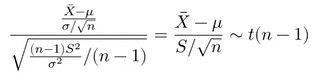
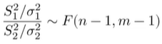
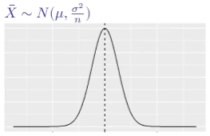
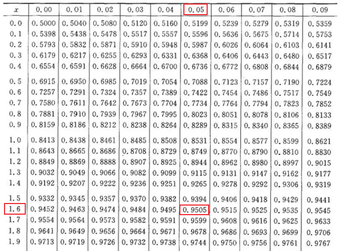
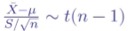
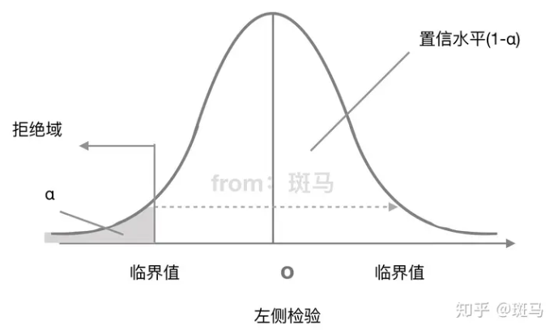
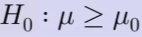

 参考：

收费课程：[432《统计学》（贾俊平第八版）基础精讲_哔哩哔哩_bilibili](https://www.bilibili.com/cheese/play/ss10760)

免费课程：[统计学基础知识_中大网校](https://www.bilibili.com/video/BV1Zv411A7vt/?vd_source=c680aab5d5ef234c75928d8686b004a5)

课本：《统计学》（贾俊平第八版）

# 统计与数据

## 统计的定义

统计学：数学的应用（描述、推测、应用）

* 描述description：统计与数据，数据描述
* 推测inference：参数估计，假设与检验
* 应用application：相关分析与回归分析，时间序列分析，统计指数

辅助计算工具：Excel, SPSS, R, MiniLab

## 数据类型

分类：

1、定性数据（分类数据）：规定事物类别的文字表述型数据，不能将其量化

* 分类数据：如，男、女等
* 顺序数据：如，一等品、二等品、三等品等

2、定量数据（数值型数据）：它们都是以数值的形式出现的

数据来源：

1、实验Experiment（人为控制）

2、观测Observation（调查、观测，无人为控制）

数据归纳后，成为三种数据

1、横截面数据cross-seetinal：多个变量在同一时间的数据（时间相同，空间不同）

2、时间序列数据time-scale：某种变量在时间顺序上的数据（时间不同，空间相同）

3、面板panel（常用）：多个变量在时间序列上的数据（时间不同，空间不同）

## 基本概念

总体：是全部个体（数据）的集合

样本：从总体中抽取的一部分元素的集合，构成样本的数量成为样本量。抽样的目的是根据样本提供的信息推断总体的特征。

参数：用来描述总体的概括性数字度量，它是研究者想要了解的总体的某种特征值。如，总体平均数、总体标准差、总体方差等。

统计量：用来描述样本的概括性数字度量，它是根据样本数量计算出来的一个量，是随机的，是样本的函数。如，样本平均数、样本标准差、样本方差等。

## 数据搜集

两大来源：

1、直接来源（一手数据、一级数据）

* 实验Experiment（人为控制）

* 观测Observation（统计调查）

2、间接来源（次级数据）

常用的统计调查方法：

1、普查census

2、抽样调查sampling

3、报表调查：制定调查表

4、重点调查：找比重最大的这一类数据去调查

5、典型调查：找具有代表性的这一类数据去调查

通过抽样获得样本，抽样调查分类：

1、概率抽样：

* 简单随机抽样random：放回、不放回
* 分层抽样stratified：分成层次，从每一层中随机抽取样本。如体重，男女等
* 整群抽样cluster：分成群体，随机选取若干群体进行调查。如地区。
* 系统抽样systematic：选起始点、定间隔数，如按时间

2、非概率抽样：

* 方便抽样：看顺眼就抽、碰到即问，可对研究内容形成初步认识。
* 判断抽样：研究人员根据经验抽样，主观判断，主观性比较大
  * 重点抽样：找数量少、地位高、体量大的样本。
  * 典型抽样：找具有代表性的一类数据。
  * 代表抽样：和典型抽样相近。
* 配额抽样：类似于分层，先分配，再方便或判断抽样，所以取决于分配的准确性
* 雪球抽样：选第一个，找关联第二个，第三个，以此类推。

## 数据误差

两大类：

1、抽样误差：样本不能代表总体

* 总体问题（波动较大）
* 样本少了
* 使用了错误的抽样方法（有放回、无放回等）

2、非抽样误差

* 抽样框误差（清单），如丢失单位、多出单位、非对应关系等
* 回答误差：答非所问
* 无回答误差：拒绝回答、问卷丢失等。（系统性的、随机性的）
* 调查员误差：调查员不专业、出现失误等。
* 计量误差：方法、设备等出现问题。

笔记：

抽样框：按规律分组的总体，如按国家分组、按性别分组等。

# 描述性统计

数有两个特征：

1、数值特征：数字（本质、代数）

2、分布特征：图表（视觉、几何）

## 图形描述

在画图表之前，都需要做出**频数分布表**。

定性数据展示方法：

1、饼图：描述占比

2、环图：描述分组占比（若干个空心圆，如根据男女分成两类，每类的各年龄段占比）

3、条形图：展示频数。

4、帕累托图：频数+累积百分比。频数类似于条形图，累积百分比类似于折线图。

帕累托图：

定量数据展示方法：

1、直方图：条形图分开排列重点是频数；直方图横坐标代表各组的界限，纵坐标代表频数/频率。频数密度 = 频数 / 组距

2、折线图：反应变化规律、趋势。

3、散点图：两个变量，观察他们的相关程度。

4、箱线图：用于描述数据分布特征的一种图形，常用于显示未分组原始数据的分布。箱线图由一组数据的5个特征值绘制而成（最大值、最小值、中位数、两个四分位数），一个箱子两条线段，再将两个极值点与箱子相连。

5、茎叶图：反应原始数据分布。一般叶子只表示最后一位。茎叶图类似于横置的直方图。直方图适用于大批量数据，茎叶图适用于小批量数据。

6、雷达图：多个变量对比。

7、气泡图：展示三个变量之间的关系。

## 统计表描述

统计表两个目的：

1、支持自己的观点

2、组织数据

统计表要素：

1、标题：简明扼要（When,Where,What）

2、表格：两边不封口、上下两边粗线、数据右对齐（小数点对齐）。

3、注释：必要时在表的下方加上注释。

## 数字描述

针对一组数据的分布特征，可以从三个方面考察：

1、集中趋势，即向中心值的靠拢程度。

2、离散程度，即远离中心值的趋势和程度。

3、分布形状，即分布规律。

集中趋势描述：

1、众数$M_o$：无众数、一个众数、多个众数。

2、中位数$M_e$：按顺序排列，位居中间。

3、分位数：按顺序排列，分割点的数值就是相应的分位数。如果是0.5分位点，就等于中位数。四分位数比较常用。

4、算数平均数、加权平均数。

5、几何平均数：所有数相乘再开n次根。

离散趋势描述：

1、异众比率variation ratio $V_r$：非众数所占比率，等于1-众数比率。

笔记：用于衡量众数的代表性。

2、极差range （全距）：最大值最小值之差。易受极端值影响。

3、四分位距quatile distance（内距、四分位差）：等于上下四分位数之差（0.75分为数-0.25分为数）。用$Q_d$表示。

笔记：反映了中间50%数据的离散程度；不受极端值影响；用于衡量中位数的代表性。

4、平均差$M_d$：$MAD=\frac{\sum{|X-\bar{X}|}}{N}$ 

笔记：对离群值不敏感，实际应用很少

5、总体方差（标准差）：$\sigma^2 = \frac{\sum(x_i - \bar{x})^2}{n}$，样本方差$s^2 = \frac{\sum(x_i - \bar{x})^2}{n-1}$，自由度为n-1（独立偏差信息的个数）。

6、离散系数（变异系数）：标准差 除以 平均数。

笔记：数值之间的差异程度；不受数值计量单位的影响。均值为0时慎用。

7、标准分数：$E_i = \frac{x_i - \bar{x}}{s}$，与平均数相比占标准差的比例。

笔记：对某个值的相对位置的度量；找离群点；用于标准化处理。

偏度和峰度：

偏度和峰态可以用来测度数据分布形状是否对称、偏斜程度、扁平程度。

偏度系数（skewness）：不偏时为零，左偏<0，右偏>0。

计算方式：样本的三阶标准化矩

峰度系数（peakedness；kurtosis）：表征概率密度分布曲线在平均值处峰值高低的特征数

计算方式：随机变量的四阶中心矩 与其标准差的四次方相除。k>0尖峰分布，k<0扁平分布， k=0正态分布。

# 统计量及其抽样分布

## 统计量与抽样分布概念

**总体：**试验的全部可能观测值是总体，因为观测值各不相同，可视为随机变量，用X表示。总体的参数通常是不知道，我们要利用样本去推断，总体的参数通常有：均值$\mu$ 、方差$\sigma^2$ 、比例$\pi$等，通常用希腊字母表示。

**样本：**设总体X是具有分布函数F的随机变量，若 $X_1,X_2,...,X_n$是与X具有同一分布函数且相互独立的随机变量，则称$X_1,X_2,...,X_n$为从总体X得到的容量为n的简单随机样本，简称样本。它们的观测值$x_1,x_2,...,x_n$称为样本值。

通过样本观察值我们可以获得一些数据，通过对这些数据进行加工处理，可以对总体进行有效的统计推断。这个加工的过程通常就是对样本构造适当的函数。比如我们求样本的平均值，来推断总体的平均值。而这个构造出来的样本的函数我们称为统计量。

**统计量：**是样本的函数，是对样本某个特征的概括性度量，是不含任何未知参数的样本的函数。定义：设$X_1,X_2,...,X_n$是来自总体X的一个样本，$g(X_1,X_2,...,X_n)$是$X_1,X_2,...,X_n$的函数，若g中不含未知的参数，则称$g(X_1,X_2,...,X_n)$是一个统计量。如，均值$\bar{x}$ 、标准差$s$、比例$p$等，通常用英文小写表示。**用样本的统计量推断总体的参数。**

**抽样分布：**统计量所形成的概率分布称为抽样分布。

什么是抽样分布：如随机抽100人计算平均身高为175，如果再进行类似的9次抽样调查，会得到10组平均身高。根据中心极限定理，这10组抽样的分布服从正态分布。即使是x组，每组y次的掷骰子，这x组的抽样分布也服从正态分布。所以我们就不会担心源数据具体是什么分布，都能计算出样本的相关统计量（均值和方差）。（所以搞这么复杂，就是为了准确计算均值和方法？）

首先要明确的是，所有分布的前提是所收集的样本要服从正态分布，这需要首先进行正态分布的拟合检验，即使是大样本的情况下，样本正态的情况下分析的结论也会更严谨。

三个分布：

总体分布：总体数据的分布

样本分布：样本数据的分布（没有意义）

抽样分布：样本分布的分布 （统计量的分布，如样本均值的分布）

抽样分布（样本分布的分布）可以分为两类：

* 一类是关于均值的分布：正态分布和t-分布；
* 另一类是关于方差的分布：$\mathcal{X}$-分布和F-分布。

## 正态分布的几个性质

设随机变量 $X \sim N(\mu_1,\sigma_1^2)$ , $Y \sim N(\mu_2,\sigma_2^2)$ , 且X,Y相互独立，

则对于任意常数k1, k2, 有 $Z = k_1X + k_2 Y$ 服从正态分布。如，

设 $X_1,X_2,...,X_n$ 是来自总体 $N(\mu,\sigma^2)$ 的样本，样本均值是 $\bar{X} = \frac{\sum X_i}{n}$ ，样本方差是 $S^2 = \frac{\sum(X_i - \bar{x})^2}{n-1}$  

则有：

1、采样越多n越大，样本均值的方差越小（结合中心极限定理，很好理解）

2、通过1推理可得

## 卡方分布

设 $X_1,X_2,...,X_n$ 相互独立且服从标准正态分布，则他们的平方和 $\sum_{i=1}^{n} X_i^2$ 服从自由度为n的 $\mathcal{X}^2$ 分布。

特点：自由度n越小，分布越右偏；n越大，越接近正态分布，极限就是正态分布。

卡方分布的概率密度曲线：

卡方分布的期望：$E(\mathcal{X}^2(n)) = n$

卡方分布的方差：$D(\mathcal{X}^2(n)) = 2n$

性质1：

性质2：可加性（但是不满足可减性）

## t分布

定义：

设 $X \sim N(0,1)$ ， $Y \sim \mathcal{X}^2(n)$ ，且XY相互独立，则称随机变量 $T= \frac{X}{\sqrt{Y/n}}$ 服从自由度为n的t分布。

场景：

设 $X_1,X_2,...,X_n$ 来自总体 $N(\mu, \sigma^2)$ 的样本，

根据正态分布标准化、卡方分布性质：

可得：

t分布的概率密度曲线：

笔记：t分布的波动比标准正态分布更大，因为标准正态分布只有一个变量$\bar{X}$，而t分布还包括变量$S$ ，所以t分布波动更大。

性质1：

## F分布

定义：

设 $X \sim \mathcal{X}^2(m)$ ， $Y \sim \mathcal{X}^2(n)$ ，且X与Y相互独立，则称随机变量 $F = \frac{X/m}{Y/n} = \frac{nX}{mY}$ 服从自由度为 $(m,n)$ 的F分布，记 $F \sim F(m,n)$ 。

场景:

设 $X_1,X_2,...,X_n$ 来自总体 $N(\mu_1, \sigma_1^2)$ 的样本，设 $Y_1,Y_2,...,Y_m$ 来自总体 $N(\mu_2, \sigma_2^2)$ 的样本，且相互独立，则有：

F分布的概率密度曲线：

## 分位数

标准正态分布的分位点

t分布的分位点

卡方分布的分位点（这里不对称）

F分布的分位点

## 中心极限定理

中心极限定理指的是给定一个任意分布的总体。我每次从这些总体中随机抽取 n 个抽样（每组大于等于30即可），一共抽 m 次。 然后把这 m 组抽样分别求出平均值。 这些平均值的分布接近正态分布。

样本的均值 $\bar{X}$ ，其期望为 $E(\bar{X}) = \mu $ , 方差为 $D(\bar{X}) = \frac{\sigma^2}{n}$ 。

# 参数估计

## 点估计

点估计：根据样本统计量（估计量） $\hat{\theta}$ 的某个取值作为总体参数 $\theta$ 的估计值。

举例：1000个学生的平均身高为175，可以说全国学生的平均身高是175。

如何评估估计量？

1、无偏性：如果 $E(\hat{\theta}) = \theta$ ，就说 $\hat{\theta}$ 是 $\theta$ 的无偏估计，否则就是有偏估计（高估、低估）

所以，样本的方差要这样写：（这）

2、有效性：如果 $D(\hat{\theta_1}) < D(\hat{\theta_1})$ , 就说 $\hat{\theta_1}$ 更有效。（前提是这两个都是无偏的。）

解释：统计量的波动越小，越有效。

3、一致性：随着样本量的增加，估计量的值越来越接近待估参数的真值。

解释：样本越多，样本的波动越小，越接近真值。

## 区间估计的引入

点估计存在的问题：

如果用 $\bar{X}$ 直接作为 $\mu$ 的估计值，它的概率是 $p(\bar{x} = \mu) = 0$ ，因为点上没有概率，区间上才有概率。

已知 总体 $X \sim N(\mu, \sigma^2)$ ，如何求出 $\bar{X}$ 作为 $\mu$ 的概率？我们只能这样描述： $\bar{X}$ 落在区间 $(\mu-1, \mu+1)$ 上的概率为p（p是置信度，是根据样本计算出来的。）

反转问题：

已知 总体 $X \sim N(\mu, \sigma^2)$ ，且 $\sigma$ 已知，问包含 $\mu$ 的概率为p（p就是置信水平，是预设出来的。）的区间是什么？

通过查表，得知标准正态分布的概率为90%的区间（90%置信水平对应的90%置信区间）为：

在正态总体方差 $\sigma$ 已知的条件下，得到了置信水平为90%的，总体均值 $\mu$ 的置信区间。

为什么90%不叫概率？或者90%是什么的概率？

因为 $\mu$ 是一个真值存在现实世界，它在区间的概率要么为0，要么为1。

如果采样一样，区间估计方法一样，所有产生的区间中，90%的概率会包含 $\mu$  。。。

将上述方法归纳：

step1、找到一个枢轴量（同时包含 估计值$\bar{X}$ 和待估参数$\mu$ ），如  

step2、枢轴量服从明确的分布，且分布不受待估参数的影响，如 

step3、找到分位数，通过等价变换，找到置信区间。

## 拓展：分位数

**上**α **分位点**：随机变量Z的上α分位点 $z_{\alpha}$ 满足：$P\{ Z>z_{\alpha} \} = \alpha$

**下**α **分位点**：随机变量Z的下α分位点 $z_{\alpha}$ 满足：$P\{ Z>z_{1-\alpha} \} = \alpha$

**双侧**α **分位点**：随机变量Z的双侧α分位点 $z_{\alpha / 2}$ 满足：$P\{ |Z| > z_{\alpha / 2} \} = \alpha$

标准正态分布表：

如，当α=0.95时，通过查找分布表，找最接近0.95的值，确定$z_{\alpha}$ 为1.64或1.65。

## 一个总体参数的区间估计（均值）

上节讲了正态总体、方差已知条件下的区间估计。

这节讲正态总体、方差未知条件下的区间估计。

step1、方差未知，可以用样本方差，此时枢轴量为：

step2、枢轴量服从t分布

step3、找到分位数，等价变换。（当样本超30个时，t分布近似服从标准正态分布）

如果是样本来自非正态总体，怎么办？采用大样本 + 正态分布。

因为根据中心极限定理，

## 一个总体参数的区间估计（方差）

只涉及正态总体，不讲非正态总体。

step1、方差未知，可以用样本方差，此时枢轴量为：

step2、枢轴量服从卡方分布

step3、找到分位数，等价变换。

## 两个总体参数的区间估计（均值之差）

两个正态总体，方差已知（独立样本）

两个正态总体，方差未知，大样本（独立样本）

两个正态总体，方差未知，小样本，方差相等（独立样本）

两个正态总体，方差未知，小样本，方差不相等（独立样本）

非正态总体，大样本（独立样本）

匹配样本：差的均值=均值的差 （独立样本不可以）

所以，匹配样本的均值之差的区间估计，可以参考一个总体均值的区间估计：

## 两个总体参数的区间估计（方差之比）

# 假设检验

## 基本步骤

假设检验（Hypothesis Testing）是统计学中一种用于决定样本数据是否支持特定假设的方法。它不仅帮助我们在数据分析中做出决策，还在验证科学研究假说中发挥重要作用。

**基本步骤：**

1. **设定假设**：首先设定两个相互对立的假设——零假设（Null Hypothesis, H0）和备择假设（Alternative Hypothesis, H1）。零假设一般表示没有效应或差异，而备择假设表示存在显著效应或差异。
2. **选择检验方法**：根据数据类型、样本大小和检验目标选择合适的统计检验方法。例如，对两个独立样本均值的比较可能采用t检验。我们将在后续部分详细探讨t检验的应用和原理。
3. **确定显著性水平**：显著性水平（α）定义了我们接受的第一类错误（即错误地拒绝真实的零假设）的概率上限。常见的显著性水平有5%（0.05）、1%（0.01）。
4. **计算检验统计量**：根据选定的检验方法从样本数据计算相应的检验统计量，以反映样本数据与零假设之间的一致性程度。
5. **做出决策**：比较检验统计量与显著性水平，判断是否有足够的证据拒绝零假设。如果检验结果显示的差异或效应显著超过我们设定的显著性水平，则拒绝零假设，接受备择假设；否则，不能拒绝零假设。

假设检验为我们提供了一种结构化的方法来评估数据与特定假设之间的关系。

## 零假设与备择假设

在进行假设检验时，正确设定零假设（Null Hypothesis, H0）和备择假设（Alternative Hypothesis, H1）是至关重要的。这两种假设是假设检验的基石，它们代表了两种相互对立的情况。

**零假设（H0）**：

- 零假设通常表示“无效果”或“无差异”的状态。它是一种默认假设，表明样本观测结果仅由随机变异所引起，而非由我们正在测试的效应引起。
- 例如，在药物效果测试中，零假设可能是“新药物与旧药物无差异”。

**备择假设（H1）**：

- 备择假设与零假设对立，通常表示我们希望证明或支持的情况。它可能表明有显著效果、有差异或有特定方向的变化。
- 继续刚才的例子，备择假设可能是“新药物比旧药物有更好的效果”。

设定这两种假设时的关键在于它们应该是清晰、具体且相互排斥的。在实际操作中，统计检验的目的是检验零假设，即我们试图找到足够的证据来拒绝零假设，从而支持备择假设。值得注意的是，拒绝零假设并不意味着备择假设一定正确，它只意味着有足够的证据表明备择假设比零假设更可能。

## 显著性水平与决策规则

显著性水平（Significance Level）和决策规则是假设检验中不可或缺的部分，它们共同决定了我们如何基于统计证据来接受或拒绝零假设。

**显著性水平（α）**：

- 显著性水平定义了我们在假设检验中愿意承担的错误拒绝零假设（即犯第一类错误）的最大概率。常用的显著性水平包括5%（α=0.05）和1%（α=0.01）。
- 选择较低的显著性水平意味着对拒绝零假设的证据要求更严格，但同时也增加了犯第二类错误（即错误地接受零假设）的风险。

**决策规则**：

- 决策规则是基于显著性水平和计算得到的检验统计量来确定是否拒绝零假设的具体方法。
- 例如，在t检验中，我们会计算一个t值并将其与特定显著性水平下的临界t值比较。如果计算得到的t值大于临界t值，我们则拒绝零假设。

决策规则的设定需考虑检验的类型（单侧检验或双侧检验）和数据的分布。单侧检验用于检验数据是否显著大于或小于某个特定值，而双侧检验用于检验数据是否显著不同于某个特定值。选择检验类型取决于研究问题和假设的性质。

决策规则可以用临界值法，也可以用P值法。

## 常见的假设检验方法

在统计学中，有多种假设检验方法可用于不同类型的数据和研究问题。其中一些最常用的方法包括t检验、F检验等。每种方法都有其特定的应用场景和假设条件。

**t检验（t-test）**：

- t检验是一种用于比较两组数据均值差异的统计方法。它分为独立样本t检验和配对样本t检验。
- 独立样本t检验用于比较两个独立样本的均值，例如比较两种不同教学方法对学生成绩的影响。
- 配对样本t检验用于比较同一组受试者在两种不同条件下的表现，例如患者在治疗前后的健康状况。
- t检验的关键在于其假定数据遵循正态分布，并且样本量较小时仍适用。

**F检验（F-test）**：

- F检验主要用于比较两个样本方差的差异，常用于方差分析（ANOVA）中。
- 它可以帮助我们判断多个群体间是否存在显著的差异。
- F检验的前提是样本来自正态分布，并且各组具有相同的方差。

除了这两种方法，还有其他多种检验方法，如卡方检验（Chi-square Test）用于频数数据的比较，非参数检验如曼-惠特尼U检验（Mann-Whitney U Test）用于不满足正态分布假设的数据。

## 错误类型和功效分析

在假设检验中，理解可能犯下的错误类型以及如何进行功效分析是至关重要的。这些概念帮助我们评估检验的可靠性和有效性。

**错误类型**：

1. **第一类错误（Type I Error）**：这是在实际上零假设为真时错误地拒绝它的情况。它的概率等于显著性水平α，例如，如果α=0.05，那么我们有5%的概率犯第一类错误。
2. **第二类错误（Type II Error）**：当零假设实际上是假的，但检验未能拒绝它时发生的错误。这种错误的概率用β表示。功效（1-β）则是正确检测到效应（即正确拒绝零假设）的概率。

**功效分析（Power Analysis）**：

- 功效分析是用来确定检验能够正确识别效应的能力。一个高功效的检验能够减少犯第二类错误的风险。
- 功效受多个因素影响，包括样本大小、效应大小和显著性水平。增加样本大小或效应大小通常会提高检验的功效。
- 进行功效分析可以帮助研究者在实验设计前确定所需的样本量，以确保检验具有足够的灵敏度。

在实际研究中，权衡第一类和第二类错误是非常重要的。选择较低的显著性水平可以减少犯第一类错误的风险，但可能会增加犯第二类错误的风险，反之亦然。了解这些错误类型和如何通过功效分析来优化研究设计，对于进行有效和可靠的假设检验至关重要。

H0成立，拒绝H0，是弃真错误；H0不成立，不拒绝H0，是取伪错误。

我们一般想要拒绝原假设。因为原假设备被拒绝，如果出错的话，只能犯弃真错误，而犯弃真错误的概率已经被规定的显著性水平所控制了。这样对统计者来说更容易控制，将错误影响降到最小。

战略上，希望拒绝原假设，但是战术上，要表现为不拒绝原假设。这样拒绝原假设才更有说服力。

# 假设检验

## 假设检验的引入

假设检验，虽然说是“检验”，但主要是针对两个相斥的**假设**做一个“**选择**”。

假设是对**总体**或**总体参数**的一个陈述。

假设分为两种：

- 原假设 
- 备择假设 

两者的区别并没有很明显，如果一定要区分的话，可以认为原假设是假设总体”**没有变化**“或者总体“**没有问题**”，备择假设则是认为“**总体有变**”。或者说，原假设偏向于**保守**，备择假设偏向**激进**。

**举个例子：** 

水果店老板买橘子。

那么，先假设

这里的Z是**检验统计量**，用于检验与原假设的冲突，即，Z的变换反映了$\bar{X}$ 与原假设的冲突的变化。

Z的中心在0，如果Z远离0，表明$\bar{X}$ 在远离7。

定义$c$ 为临界值（z在横坐标上）。

* 如果$|Z| < c$ ，不拒绝原假设。

* 如果$|Z| >= c$ ，拒绝原假设。（双侧检验）

记$p(|Z| >= c) = \alpha$ ，其中$\alpha$被称为显著性水平（图中阴影部分）。这里的c可以用$Z_{\alpha / 2}$代替。

通常会给出显著性水平 $\alpha$ ，然后计算出临界值 $Z_{\frac{\alpha}{2}}$ 和检验统计量 $Z$ 比较，如果Z在拒绝域，拒绝原假设，否则，不拒绝原假设。

**如果我们希望要大橘子的直接大于等于7（单侧检验之左侧检验）：**

定义$c$ 为临界值（z在横坐标上）。

* 如果$|Z| \geq c$ ，不拒绝原假设。

* 如果$|Z| < c$ ，拒绝原假设。

记$p(Z >= c) = \alpha$ ，其中$\alpha$被称为显著性水平。这里的c可以用$Z_{\alpha}$代替。

通常会给出显著性水平 $\alpha$ ，然后计算出临界值 $Z_{\alpha}$ 和检验统计量 $Z$ 比较 ，如果Z在拒绝域，拒绝原假设，否则，不拒绝原假设。

## p值

p值：在零假设为真的情况下，观测到这种差值或更极端的差值的概率。

如果p值足够小（显著性水平α一般取0.05），则我们拒绝零假设。

**右侧检验：**

原假设：

p值为：（样本观测结果）

如果：

**左侧检验：**

原假设：

p值为：（样本观测结果）

如果：

**双侧检验：**

原假设：

p值：

如果：

## 流程

## 一个总体参数的检验

略

## 两个总体参数的检验

略

# 分类数据分析

# 方差分析

# 一元线性回归

# 多元线性回归

# 时间序列分析和预测

# 指数

