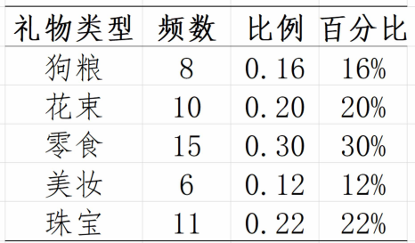

# 一、统计与数据

## 统计的定义

统计学：数学的应用（描述、推测、应用）

* 描述description：统计与数据，数据描述
* 推测inference：参数估计，假设与检验
* 应用application：相关分析与回归分析，时间序列分析，统计指数

辅助计算工具：Excel, SPSS, R, MiniLab

## 数据类型

分类：

1、定性数据（分类数据）：规定事物类别的文字表述型数据，不能将其量化

* 分类数据：如，男、女等
* 顺序数据：如，一等品、二等品、三等品等

2、定量数据（数值型数据）：它们都是以数值的形式出现的

数据来源：

1、实验Experiment（人为控制）

2、观测Observation（调查、观测，无人为控制）

数据归纳后，成为三种数据

1、横截面数据cross-seetinal：多个变量在同一时间的数据（时间相同，空间不同）

2、时间序列数据time-scale：某种变量在时间顺序上的数据（时间不同，空间相同）

3、面板panel（常用）：多个变量在时间序列上的数据（时间不同，空间不同）

## 基本概念

总体：是全部个体（数据）的集合

样本：从总体中抽取的一部分元素的集合，构成样本的数量成为样本量。抽样的目的是根据样本提供的信息推断总体的特征。

参数：用来描述总体的概括性数字度量，它是研究者想要了解的总体的某种特征值。如，总体平均数、总体标准差、总体方差等。

统计量：用来描述样本的概括性数字度量，它是根据样本数量计算出来的一个量，是随机的，是样本的函数。如，样本平均数、样本标准差、样本方差等。

## 数据搜集

两大来源：

1、直接来源（一手数据、一级数据）

* 实验Experiment（人为控制）

* 观测Observation（统计调查）

2、间接来源（次级数据）

常用的统计调查方法：

1、普查census

2、抽样调查sampling

3、报表调查：制定调查表

4、重点调查：找比重最大的这一类数据去调查

5、典型调查：找具有代表性的这一类数据去调查

通过抽样获得样本，抽样调查分类：

1、概率抽样：

* 简单随机抽样random：放回、不放回
* 分层抽样stratified：分成层次，从每一层中随机抽取样本。如体重，男女等
* 整群抽样cluster：分成群体，随机选取若干群体进行调查。如地区。
* 系统抽样systematic：选起始点、定间隔数，如按时间

2、非概率抽样：

* 方便抽样：看顺眼就抽、碰到即问，可对研究内容形成初步认识。
* 判断抽样：研究人员根据经验抽样，主观判断，主观性比较大
  * 重点抽样：找数量少、地位高、体量大的样本。
  * 典型抽样：找具有代表性的一类数据。
  * 代表抽样：和典型抽样相近。
* 配额抽样：类似于分层，先分配，再方便或判断抽样，所以取决于分配的准确性
* 雪球抽样：选第一个，找关联第二个，第三个，以此类推。

## 数据误差

两大类：

1、抽样误差：不能代表总体

* 总体问题（波动较大）
* 样本少
* 方法错误（有放回、无放回等）

2、非抽样误差

* 抽样框误差（清单），如丢失单位、多出单位、非对应关系等
* 回答误差：答非所问
* 无回答误差：拒绝回答、问卷丢失等。（系统性的、随机性的）
* 调查员误差：调查员不专业、出现失误等。
* 计量误差：方法、设备等出现问题。

笔记：抽样框：按规律分组的总体，如国家、性别等。

# 二、描述性统计

数有两个特征：

1、数值特征：数字（本质、代数）

2、分布特征：图表（视觉、几何）

## 图形描述

在画图表之前，都需要做出**频数分布表**。

定性数据展示方法：

1、饼图：描述占比

2、环图：描述分组占比（若干个空心圆，如根据男女分成两类，每类的各年龄段占比）

3、条形图：展示频数。

4、帕累托图：频数+累积百分比。频数类似于条形图，累积百分比类似于折线图。

帕累托图：

定量数据展示方法：

1、直方图：条形图分开排列重点是频数；直方图横坐标代表各组的界限，纵坐标代表频数/频率。频数密度 = 频数 / 组距

2、折线图：反应变化规律、趋势。

3、散点图：两个变量，观察他们的相关程度。

4、箱线图：用于描述数据分布特征的一种图形，常用于显示未分组原始数据的分布。箱线图由一组数据的5个特征值绘制而成（最大值、最小值、中位数、两个四分位数），一个箱子两条线段，再将两个极值点与箱子相连。

5、茎叶图：反应原始数据分布。一般叶子只表示最后一位。茎叶图类似于横置的直方图。直方图适用于大批量数据，茎叶图适用于小批量数据。

6、雷达图：多个变量对比。

7、气泡图：展示三个变量之间的关系，与散点图类似，气泡大小可以表示第三个变量。

## 统计表描述

统计表两个目的：

1、支持自己的观点

2、组织数据

统计表要素：

1、标题：简明扼要（When,Where,What）

2、表格：两边不封口、上下两边粗线、数据右对齐（小数点对齐）。

3、注释：必要时在表的下方加上注释。

## 数字描述

针对一组数据的分布特征，可以从三个方面考察：

1、集中趋势，即向中心值的靠拢程度。

2、离散程度，即远离中心值的趋势和程度。

3、分布形状，即分布规律。

集中趋势描述：

1、众数$M_o$：无众数、一个众数、多个众数。

2、中位数$M_e$：按顺序排列，位居中间。

3、分位数：按顺序排列，分割点的数值就是相应的分位数。如果是0.5分位点，就等于中位数。四分位数比较常用。

4、算数平均数、加权平均数。

5、几何平均数：所有数相乘再开n次根。

离散趋势描述：

1、异众比率variation ratio $V_r$：非众数所占比率，等于1-众数比率。

笔记：用于衡量众数的代表性。

2、极差range （全距）：最大值最小值之差。易受极端值影响。

3、四分位距quatile distance（内距、四分位差）：等于上下四分位数之差（0.75分为数-0.25分为数）。用$Q_d$表示。

笔记：反映了中间50%数据的离散程度；不受极端值影响；用于衡量中位数的代表性。

4、平均差$M_d$：$MAD=\frac{\sum{|X-\bar{X}|}}{N}$ 

笔记：对离群值不敏感，实际应用很少

5、总体方差（标准差）：$\sigma^2 = \frac{\sum(x_i - \bar{x})^2}{n}$，样本方差$s^2 = \frac{\sum(x_i - \bar{x})^2}{n-1}$，自由度为n-1（独立偏差信息的个数）。

6、离散系数（变异系数）：标准差 除以 平均数。

笔记：数值之间的差异程度；不受数值计量单位的影响。均值为0时慎用。

7、标准分数：$E_i = \frac{x_i - \bar{x}}{s}$，与平均数相比占标准差的比例。

笔记：对某个值的相对位置的度量；找离群点；用于标准化处理。

偏度和峰度：

偏度和峰态可以用来测度数据分布形状是否对称、偏斜程度、扁平程度。

偏度系数（skewness）：不偏时为零，左偏<0，右偏>0。

计算方式：样本的三阶标准化矩

峰度系数（peakedness；kurtosis）：表征概率密度分布曲线在平均值处峰值高低的特征数

计算方式：随机变量的四阶中心矩 与其标准差的四次方相除。k>0尖峰分布，k<0扁平分布， k=0正态分布。

# 统计量及其抽样分布

## 统计量与抽样分布概念

**总体：**试验的全部可能观测值是总体，因为观测值各不相同，可视为随机变量，用X表示。总体的参数通常是不知道，我们要利用样本去推断，总体的参数通常有：均值$\mu$ 、方差$\sigma^2$ 、比例$\pi$等，通常用希腊字母表示。

**样本：**设总体X是具有分布函数F的随机变量，若 $X_1,X_2,...,X_n$是与X具有同一分布函数且相互独立的随机变量，则称$X_1,X_2,...,X_n$为从总体X得到的容量为n的简单随机样本，简称样本。它们的观测值$x_1,x_2,...,x_n$称为样本值。

通过样本观察值我们可以获得一些数据，通过对这些数据进行加工处理，可以对总体进行有效的统计推断。这个加工的过程通常就是对样本构造适当的函数。比如我们求样本的平均值，来推断总体的平均值。而这个构造出来的样本的函数我们称为统计量。

**统计量：**是样本的函数，是对样本某个特征的概括性度量，是不含任何未知参数的样本的函数。定义：设$X_1,X_2,...,X_n$是来自总体X的一个样本，$g(X_1,X_2,...,X_n)$是$X_1,X_2,...,X_n$的函数，若g中不含未知的参数，则称$g(X_1,X_2,...,X_n)$是一个统计量。如，均值$\bar{x}$ 、标准差$s$、比例$p$等，通常用英文小写表示。**用样本的统计量推断总体的参数。**

注意：样本是随机变量，所以在抽样前统计量也是一个随机变量，统计量所形成的概率分布称为抽样分布，如样本均值的分布，样本比例的分布等。当抽样后，样本值是观测值，这个统计量就是已知的。

什么是抽样分布：如随机抽100人计算平均身高为175，如果再进行类似的9次抽样调查，会得到10组平均身高。根据中心极限定理，这10组抽样的分布服从正态分布。即使是x组，每组y次的掷骰子，这x组的抽样分布也服从正态分布。所以我们就不会担心源数据具体是什么分布，都能计算出样本的相关统计量（均值和方差）。（所以搞这么复杂，就是为了准确计算均值和方法？）

**抽样分布：**统计量所形成的概率分布称为抽样分布。

首先要明确的是，所有分布的前提是所收集的样本要服从正态分布，这需要首先进行正态分布的拟合检验，即使是大样本的情况下，样本正态的情况下分析的结论也会更严谨。

三个分布：

总体分布：总体数据的分布

样本分布：样本数据的分布

抽样分布：样本分布的分布

抽样分布（样本分布的分布）可以分为两类：

一类是关于均值的分布：正态分布和t-分布；

另一类是关于方差的分布：$\mathcal{X}$-分布和F-分布。

## 正态分布的几个性质

设随机变量 $X \sim N(\mu_1,\sigma_1^2)$ , $Y \sim N(\mu_2,\sigma_2^2)$ , 且X,Y相互独立，

则对于任意常数k1, k2, 有 $Z = k_1X + k_2 Y$ 服从正态分布。如，

设 $X_1,X_2,...,X_n$ 是来自总体 $N(\mu,\sigma^2)$ 的样本，样本均值是 $\bar{X} = \frac{\sum X_i}{n}$ ，样本均值的方差是 $S^2 = \frac{\sum(X_i - \bar{x})^2}{n-1}$  

则有：

1、采样越多n越大，样本均值的方差越小

2、通过1推理可得

## 卡方分布

设 $X_1,X_2,...,X_n$ 相互独立且服从标准正态分布，则他们的平方和 $\sum_{i=1}^{n} X_i^2$ 服从自由度为n的 $\mathcal{X}^2$ 分布。

特点：自由度n越小，分布越右偏；n越大，越接近正态分布，极限就是正态分布。

卡方分布的概率密度曲线：

卡方分布的期望：$E(\mathcal{X}^2(n)) = n$

卡方分布的方差：$D(\mathcal{X}^2(n)) = 2n$

性质1：

笔记1：从这里就可以理解”卡方分布是关于均值的分布“，虽然$\bar{X}$ 是样本均值，但是其中 $\sigma^2$ 仍然是总体方差。

性质2：可加性（但是不满足可减性）

## t分布

定义：

设 $X \sim N(0,1)$ ， $Y \sim \mathcal{X}^2(n)$ ，且XY相互独立，则称随机变量 $T= \frac{X}{\sqrt{Y/n}}$ 服从自由度为n的t分布。

场景：

设 $X_1,X_2,...,X_n$ 来自总体 $N(\mu, \sigma^2)$ 的样本，

根据正态分布标准化、卡方分布性质：

可得：

笔记：从这里就可以理解”t分布是关于方差的分布“

t分布的概率密度曲线：

笔记：t分布的波动比标准正态分布更大，因为标准正态分布只有一个变量$\bar{X}$，而t分布还包括变量$S$ ，所以t分布波动更大。

性质1：

## F分布

定义：

设 $X \sim \mathcal{X}^2(m)$ ， $Y \sim \mathcal{X}^2(n)$ ，且X与Y相互独立，则称随机变量 $F = \frac{X/m}{Y/n} = \frac{nX}{mY}$ 服从自由度为 $(m,n)$ 的F分布，记 $F \sim F(m,n)$ 。

场景:

设 $X_1,X_2,...,X_n$ 来自总体 $N(\mu_1, \sigma_1^2)$ 的样本，设 $Y_1,Y_2,...,Y_m$ 来自总体 $N(\mu_2, \sigma_2^2)$ 的样本，且相互独立，则有：

F分布的概率密度曲线：

## 参数估计

参数估计：根据样本统计量估计总体的参数。比如样本均值$\bar{x}$估计总体均值$\mu$，样本比例p估计总体比例$\pi$，样本方差$S^2$估计总体方差$\sigma^2$。

估计量：用来推断总体参数的统计量称为估计量。

估计值：根据具体的样本计算出来的估计量称为估计值。

注意：同一个参数可以有多个估计量，参数是唯一的，但估计量是随机变量，取值不确定。

两种方法：点估计和区间估计

点估计point estimation：用样本统计量的某个实际取值作为相应的总体参数的估计值。如用样本均值$\bar{x}$估计总体均值$\mu$，用样本比例p估计总体比例$\pi$，用样本方差$S^2$估计总体方差$\sigma^2$。

区间估计interval estimate：在点估计的基础上，给出总体参数估计的一个区间范围，该区间通常由样本统计量加减估计误差得到。

