# 强化学习入门

## 方法分类

## Policy-based(Acotr)

**深度强化学习怎么做的（和普通监督学习类似）：**

1、Neural network as actor （定义模型）

2、goodness of function （定义目标函数）

3、pick the best function （选出最优模型 / 训练模型）

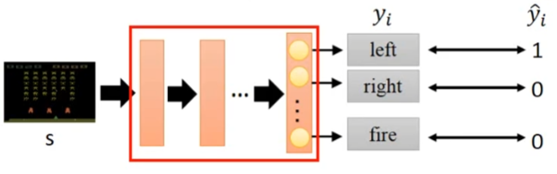

**定义模型**

$\theta $ 是神经网络参数

$\pi_{\theta} (s) $ 是智能体 Actor （注意，Actor具有随机性，即action根据概率得出的，所以每次游戏过程不一样）

$R_{\theta} = \sum_{t=1}^{T} r_t$ 是所有奖励之和

$\bar{R_{\theta}}$ 是所有 $R_{\theta}$ 的期望 （因为每次游戏不一样，奖励也不一样）

$\tau = \{ s_1, a_1, r_1, s_2, a_2, r_2, ... \} $ 是游戏轨迹 trajectory

$P(\tau | \theta)$ 是trajectory发生的概率

 $\bar{R_{\theta}} = \mathop{\sum}\limits_{\tau} R(\tau) P(\tau | \theta)$   其中，$\tau$ 是多次游戏的采样

**如何Gradient Ascent**

1、有目标函数 $\bar{R_{\theta}} = \mathop{\sum }\limits_{\tau} R(\tau) P(\tau | \theta)$ 

2、求参数 $\theta^{\star} = \mathop{\arg\max}\limits_{\theta} \bar{R_{\theta}}$ 

3、梯度下降 $\theta^{n+1} = \theta^{n} + \eta \nabla \bar{R_{\theta}}^{n}$ 

4、

其中 $\nabla \bar{R_{\theta}} = \mathop{\sum}\limits_{\tau} R(\tau) \nabla P(\tau | \theta) = \mathop{\sum}\limits_{\tau} R(\tau) P(\tau | \theta) \frac{\nabla P(\tau | \theta)}{P(\tau | \theta)} \approx \frac{1}{n} \sum_{n=1}^{N} R(\tau) \nabla log P(\tau^n | \theta) $  

其中 $P(\tau | \theta) = p(s_1) \prod_{t=1}^{n} p(a_t | s_t, \theta)$ 

把常数项去掉，得 $\nabla \bar{R_{\theta}} = \frac{1}{n} \sum_{n=1}^{N} \sum_{t=1}^{T_n} R(\tau^{n}) \nabla log p(a_t^n | s_t^n, \theta) $ 

其中，N是N次采样，T是一次完整的游戏序列

**两个Tip**

1、实际上，游戏的奖励函数大多是正数，而我们想要既有正数又有负数（梯度上升或梯度下降），所以需要在公式中加一个偏置项

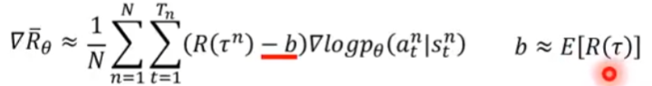

2、$R(\tau^n)$ 不应该是整个序列的累加奖励，有以下优化：

* 应该是从当前时刻的状态$s_t$算起，$s_t$之前的奖励不算
* 每个时刻的奖励权重不应该一样
* 这些奖励可以提前算出来，用$A^{\theta}$表示

## Value-based(Critic)

**什么是Critic？**

1、Critic不用做出action

2、假如有一个Actor $\pi$ , 如何评估Acotr的好坏？

3、用state value function状态价值函数 $V^{\pi}(s)$ 评价当前状态的好坏。 $V^{\pi}(s)$ 是当前状态开始的累加奖励的期望。深度学习中，$V^{\pi}(s)$ 就是一个神经网络。

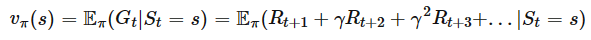

**如何计算V函数，有两种方法**

方法一，Monte-Carlo：给定任意当前状态$s_a$，一直到游戏结束，得到真实值 $G_a$ ，用$G_a$ 优化网络。

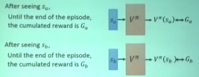

方法二，Temporal-difference：用两个相邻状态的价值函数之差 $V^{\pi}(s_t) - V^{\pi}(s_{t+1}) \rightarrow r_t$  逼近奖励，奖励$r_t$是真实值。

* 优点：不用完成整个游戏序列
* 缺点：损失小，收敛满

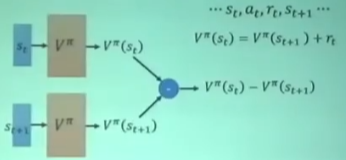

**另一个Critic：计算动作**

1、state-action value function $Q^{\pi}(s,a)$ ：通过状态s和动作a评估Actor好坏。

2、如果动作有限，可以通过Q函数计算出每个动作的分数。

**Q-Learning**

通过TD算法计算损失，把Q函数当成回归任务，不断更新参数。

算法：

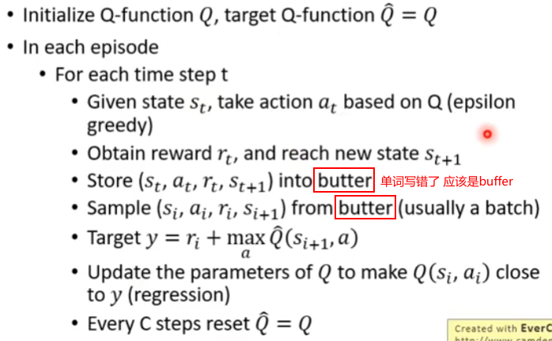

## Actor + Critic

Advantage Actor-Critic (A2C)方法：讲的不详细，后面有详细的，这里 略。

Asynchronous Advantage Actor-Critic-Agents (A3C)方法：用多个分身学习，然后汇总，更新...

## Inverse Reinforcement Learning

现实中Reward函数不知道，怎么解决？

1、专家Expert演示怎么玩

2、IRL反推出Reward函数

3、根据Reward函数就可以找到最优的actor

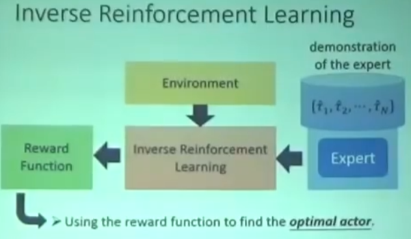

实现原理：

1、专家演示一系列游戏记录；

2、Actor随机初始化，也玩一系列游戏记录；

3、定义专家的Reward 一定要高于 Actor的Reward，得到一个Reward函数；

4、基于新的Reward，Actor再玩一系列游戏记录，不断优化Reward函数

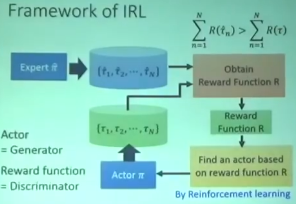

# PPO

Proximal Policy Optimization 是 OpenAI默认的强化学习算法

PPO算法的学习过程：

On-policy：智能体学习、交互的环境都是同一个。通过“自己玩”完成学习，如象棋对弈。

Off-policy：智能体学习、交互的环境不是同一个。通过“看别人玩”完成学习。

## Policy Gradient

入门章节讲了，这里略。

## On-policy to Off-policy

**问题引入**

Policy-based方法的梯度这样计算：

问题：从$\pi_{\theta}$ 中采样数据，当$\theta$ 更新时，需要重新采样

解决：从另一个Acotr $\pi_{\theta'}$ 中采样数据，$\theta$ 更新时，对 $\theta'$ 无影响，无需重新采样。

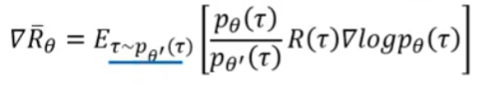

**Importance Sampling （上面式子的推导过程）**

重要性采样：

**从梯度更新，推出损失函数**

## Add constraint

上面损失函数已经有了，但是还需要加入约束，保证$\theta$ 和$\theta'$ 不要差太多。

Proximal Policy Optimization (PPO):

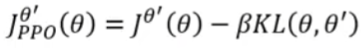

笔记：这里的KL散度不是计算参数的距离，而是在计算action的距离。

PPO算法：

笔记：发现这里每轮也需要采样，但是特别指出，在每一步可以update多次。

KL算法计算很复杂，因此提出了PPO2算法：

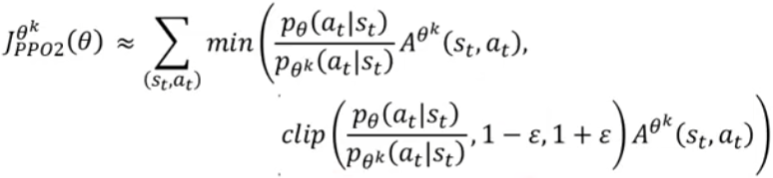

笔记：

1、clip函数约束第一个参数，介于第二个和第三个参数之间。蓝色线表示目标函数中第二项的取值。

2、这个算是函数两种情况讨论，当A>0 或A<0时。如下图，绿色线表示第一项取值，蓝色线表示第二项取值，红色线表示最终损失函数的取值。

# Q-Learning

## Introduction of Q-Learning

入门章节讲了，这里略。

## Tips of Q-Learning

问题：Q-Learning训练时损失越来越小，但是Q函数越来越大，导致经常被高估。

**Double DQN** 解决方案：用两个Q函数

1、Q-Learning本身就需要两个网络，所以现在的计算量没有增加。

2、Q变大，并不影响$Q'$ 值；$Q'$ 变大，不影响Q选择的动作。

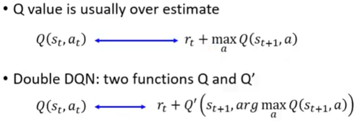

**Dueling DQN** 解决方案：修改网络架构。

将Q改成V+A，并对A做Normalization，控制Q不要变大。

**Prioritized Reply** 解决方案：优先采样TD error大的样本。

Q-Learning是从Buffer中采样，导致出现action多的采样概率高。这里优先采样TD error大的样本。

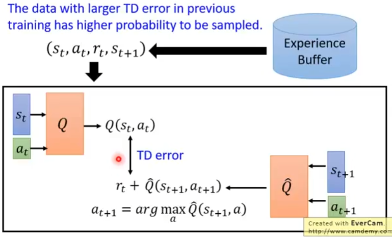

**Multi-Step** 解决方案：平衡TD和MC算法。

TD算法只需要一步，MC算法需要完整序列，这里用N步。

**Noisy Net** 解决方案：添加噪声。

第一种：在选择action时，用概率去选，而不是永远取最大action；

第二种：在每轮开始前，参数中注入噪声。

区别：第一种方式每次动作比较随机，第二种方式每次动作比较固定，实际效果是第二种方法好。

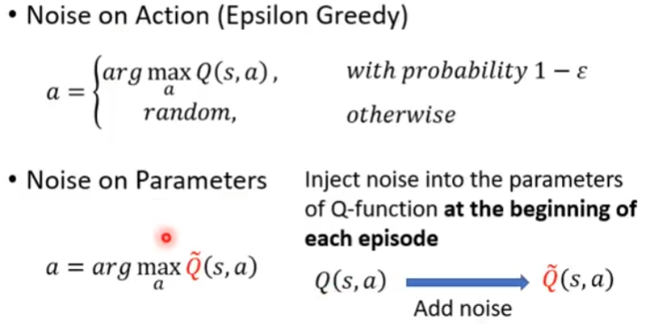

**Distributional Q-funtion** 解决方案：用多个Q函数。

Q是一个分布函数，一个可能不靠谱，用多个取平均或取最大。

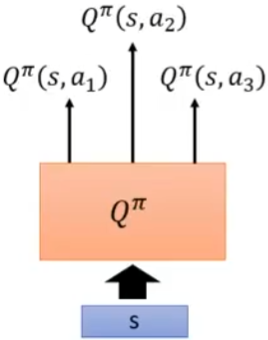

**Rainbow** ：将上面7个方法全部组合起来用，达到了最强！

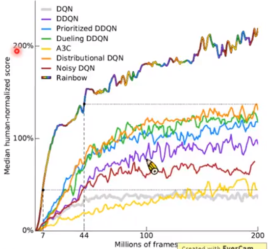

## Q-Learning for Continuous Actions

如何解决连续动作？

第一种：采样多个；

第二种：使用梯度；

第三种：用神经网络，比较简单，如下。

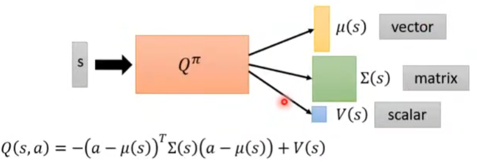

# Actor-Critic 

**Advantage Actor-Critic-Agents**

1、G用Q代替，b用V代替，将Policy-based和Value-based结合起来。

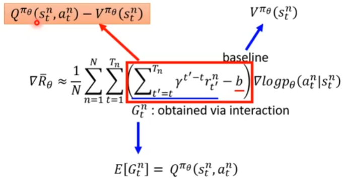

2、Q的值可以用V的值计算

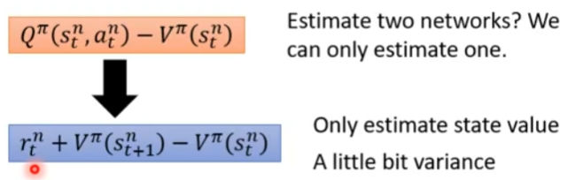

3、算法流程图

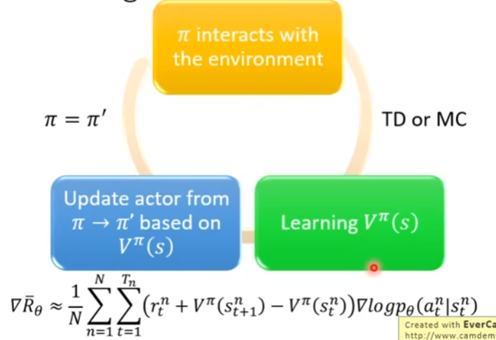

4、Tips：actor和critic可以共用一部分参数

**Asynchronous Advantage Actor-Critic-Agents**

原理：用多个“分身”去计算梯度，但是在梯度更新时在同一个网络上，这样加速了计算和最终效果。

**Pathwise Derivative Policy Gradient**

一种基于Q-Learning改进的方法，其网络结构如下

算法步骤如下（相比Q-Learning算法，只多了几步）：

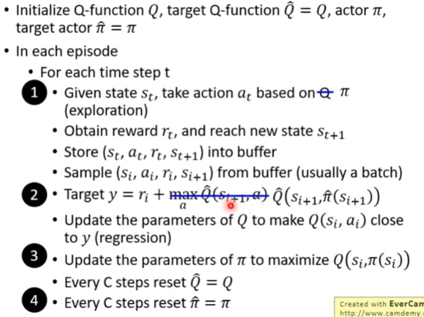

# Sparse Reward

如果Reward非常稀疏，智能体可能什么也学不到，怎么解决这个问题呢？

## Reward Shaping

重新设计Reward，可以和真实Reward不完全相同。

如，ICM模型的Reward的设计：

1、鼓励Agent好奇心： $\hat{s}_{t+1}$ 和 $s_{t+1}$ 差距越大Reward 越高。

2、不能一味鼓励好奇心，还要过滤不重要状态（略，这里不讲了）

## Curriculum Learning

规划学习课程，从简单到困难学习。

如，Reverse Curriculum Learning 逆向课程学习步骤如下：

1、给一个目标状态 $s_g$

2、根据$s_g$采样，并学习得到多条学习路径及Reward，删除极端路径；

3、从第二步的采样中采样，学习路径及Reward，不断重复。

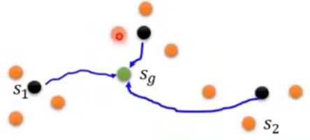

# Imitation Learning

多数情况下，没有Reward。如果没有Reward，智能体怎么学习？

答案：需要有专家expert来演示demonstration

这里介绍两种：

1、Behavior Cloning

2、Inverse Reinforcement Learning (inverse optimal control)

**Behavior Cloning**

方法：用专家数据（s, a），训练网络。

问题：智能体对特殊情况无法处理。

解决：数据要多样性，智能体自己选择动作，但是Expert要指示出当前S正确的动作。

**Inverse Reinforcement Learnin (IRL)**

用expert数据反推reward；有了reward就可以训练智能体。

