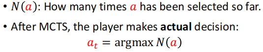
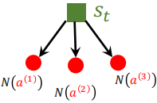

# 基本概念

## 基本概念

state：s

action: a

policy: $\pi$

reward: R

policy funciton: 

state transition: 

trajectory轨迹: 

return：(aka, cumulative future retward)

Discounted return: (aka cumulative discounted future reward)

> 因为s和a有随机性，所以 $R_{t+n}$ 和 $U_t$ 也有随机性，所以一般用期望 $E[U_t]$ 消除随机性。

## 重要概念

**重要概念：Action-value function:**

动作价值函数：

动作价值函数的意义：

* 如果已知 $\pi$ ，那么 $Q_{\pi}$ 可以评估当前动作 a 

提出问题：

* 如何求 $\pi$ ？

需要解决：

*  $\pi$ 需要每次都选择最好的动作，因此可以最大化 $Q_{\pi}$ ，即 Optimal action-value function.

Optimal action-value function:

**重要概念：State-value function：**

状态价值函数：

状态价值函数的意义：

* 如果已知 $\pi$ ，那么 $V_{\pi}$ 可以评估当前状态 s；
* 用 $E_s[V_{\pi}(s)]$ 评估 $\pi$ 的好坏

## 如何实现Agent

policy-based learning:

* 用Polity network 近似  $\pi$ 

value-based learning:

* 用DQN(Deep Q network) 近似 $Q^{\star}$ （因为有了Q网络，也可以指导当前动作）

## Value-Based

基于Q函数的DQN算法，也就是Q-Learning、Deep Q-Learning.

已知 $Q^{\star}$ 的定义：

首先用神经网络  表示 $Q^{\star}$ 函数：（这里有两种网络形状，都可以表示）

使用TD算法迭代：

TD算法示意图：

算法描述：

这里提出疑问：

* 奖励r如何定义？

个人理解：

* 奖励r类似于标签(ground truth)，可能是训练数据吧。

## Policy-Based

已知，状态价值函数：

用神经网络表示 $\pi$ 策略函数，定义策略神经网络：

为了得到最优的$\pi$，可以最大化状态价值函数V：

经过推导Policy gradient，得到：

现实中A可能是连续的，或者很多值。此时需要采样计算（下面算法是采样一次）。

其中Q函数是不知道的，先看算法流程：

如何计算Q？

1、蒙特卡罗采样：

2、用神经网络近似Q：这就是Actor-Critic方法。

## Actor-Critic

已知，状态价值函数：

* 用神经网络 表示 $\pi$ 函数
* 用神经网络  表示 $Q$ 函数

得到：

算法流程：

其中第4和第5步是关键，展开如下：

总结算法流程如下：

注意：第9步的$q_t$在论文里用$\delta_t$ ，可以得到更好的结果。（有详细推导）

# AlphaGo

2016年，AlphaGo打败李世石。

强化学习和模仿学习（Imitation learning, behavior cloning）的区别：

* 强化学习有奖励函数，模仿学习没有奖励函数；
* 模仿学习是有监督学习。

**环境：**

在围棋世界，状态就是0和1组成19x19x2张量，分别表示黑棋和白起落子位置。动作就是361个可能落子的位置。AlphaGo 中用了19x19x48张量，为什么是48未知。AlphaGo Zero用了19x19x17张量，其中19x19x8是黑子最近8步的状态，19x19x8个是白子最近8步的状态，19x19x1个用全0或全1表示该黑子或白子行棋。

**AlphaGo的训练过程有3步：**

1、用behavior cloning训练一个policy network（监督学习）；

2、用policy gradient接着训练policy network；

3、用policy network训练一个value network.（因为这两个是分开训练的，所以AlphaGo不是Actor-Critic策略）

**AlphaGo的使用有两种：**

1、只用policy network每次生成一个最优步，但是效果不稳定。

2、利用value network，使用蒙特卡洛树搜索，比较稳定。

问：为什么要用policy gradient接着训练策略网络？

答：监督学习泛化效果不好，对未见过的状态处理不好。

数据显示：Behavior cloning + RL beats behavior cloning  with 80% chance.

## behavior cloning

只能打败高等业务爱好者，不能打败高手。

## policy network

定义奖励函数：

同样，Q函数我们不知道，可以用U代替，那么近似policy gradient如下：

训练方法如下：

## value network

在前面Value-Based章节我们定义的是Q网络，但是这里我们定义的是V网络

训练步骤如下：

## Monte Carlo Tree Search

蒙特卡洛树搜索先进行搜索+打分，即选出一个动作并进行打分，步骤如下：

**1、Selection 选择动作**

选出一个分数最高的动作，分数计算方式如下：（Q分数在第4步定义）

**2、Expansion 扩展棋局**

模拟对手下棋：利用 $\pi$ 网络，随机采样一个动作。

是的，这里是根据概率采样，因为对手可能下任意点。

**3、Evaluation 评估** $s_{t+1}$ 

* 利用 $\pi$ 网络，一直对弈到最后，得到奖励+1或-1.

* 利用V网络直接评估

将上面两种评估分数取平均值，记为：

因为对弈到最后，所以会得到一系列V值：

**4、Backup 回溯** $a_t$ 

利用上一步的到一系列V值，计算 $a_t$ 动作的分数：

在最后，MCTS做决策并不是用Q，而是用N：

## AlphaGo Zero

2017年，AlphaZero全胜AlphaGo

AlphaZero做了如下改进：

* AlphaGo Zero没有使用Behavior cloning. （说明人的经验不是全对的）
* 训练policy network时使用了MCTS.

# Value-Based中TD算法

时序差分算法

## Sarsa & Q-Learning

Sarsa和Q-Learning的区别仅在于一个用Q函数，一个用$Q^{\star}$ 函数：

Sarsa: （下一个动作是采样得到的）

Q-Learning:（下一个动作是取最大值得到的）

## Multi-Step TD Target

前面讲的TD都是一步，已知：

所以，

m步的Sarsa算法是：

m步的Q-Learning算法是：

# Value-Based高阶技巧

## Experience Replay

在Value-Based中，我们已知TD算法：

在这里，我们假设：

在算法中，我们使用一个transition： 算出来的 $\delta_t$ 更新网络，有两个地方可以优化：

1、一个transition 应该训练几次？应该如何采样？

2、面对不均匀的s状态（打小怪场景多，打boss场景少），不能采用均匀采样，应该采用importance samping.

第一个问题解决：

 应该存到 replay buffer里面，容量是一个超参数。每次 randomly sample，因为打乱训练效果更好。

第二问题解决：

使用**Prioritized Experience Replay**，如果 $\delta_t$ （TD误差）比较大，说明数据重要，采样概率更高，学习率更大。

## 高估问题

TD训练DQN时，TD target是被高估的，因为：

TD target是被高估 -> 导致SGD被高估 -> 导致最终模型被高估。

又因为transition中的action通常是不均匀 -> 导致模型训练不均匀 -> 导致动作被高估的也不均匀 -> 导致模型不精准。

总结，两个原因：

1、TD Target被高估；

2、bootstraping方式训练的模型。（即，左脚踩右脚训练）

解决办法：Double DQN

1、训练一个target network，网络结构和参数可以定期从DQN网络复制。

2、选择动作还是从DQN，但是计算y值用target network.

## Dueling Network

2016年 Dueling Network得到更好的结果，我们来看下怎么实现的。

定义A函数（Optimal advantage function）：

已知：

那么：

那么，就有公式2：

用DQN的方法，训练一个A网络和一个V网络，结合起来就是Q网络。

效果很好。

为什么公式最后要减去max A?

# Policy-Based中Baseline

## 定义Baseline

推导过程：

得出定理：

根据定理，得到新的Policy gradient:

通常MC采样得到a，可以近似估计$E_A$ 。然后进行梯度上升：

在这里的b有以下问题：

1、b影响g，影响梯度；

2、好的b会减小方差加速收敛。

什么是好的b？ V函数可以当b，并且V非常接近Q函数。（后面两节都在用baseline）

## REINFORCE with Baseline

上节我们知道：

先在我们要构建两个网络：

* $\pi(A_t | s_t; \theta)$ ：表示策略网络
* $V_{\pi}(s_t)$ : 表示价值网络。

注意，第一章中A2C是Q网络，这里是V网络，V网络不包含动作，V网络更有价值，因为：

两个网络可以共享参数：

reinforce算法：

根据算法总结：

* V网络和之前Q网络更新策略类似，V网络的误差类似于TD error.
* $\pi$网络之前仅用u更新，即，MC采样。
* $\pi$网络现在还有baseline，即，V网络的输出.

## Advantage A2C

Advantage A2C和A2C不一样，这里就不推导了（和baseline推导不一样，但殊途同归）。

Advantage A2C和REINFORCE网络结构一样，但是算法如下：

Advantage A2C如果再结合Multi-Step TD Target，算法如下：

此时，可以说REINFORCE算法是Advantage A2C的一种特殊情况。即，REINFORCE特指MC采样了全轨迹，而Advantage A2C可以自定义Multi-Step TD Target.

