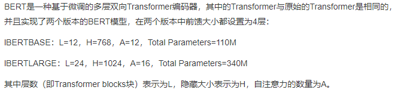
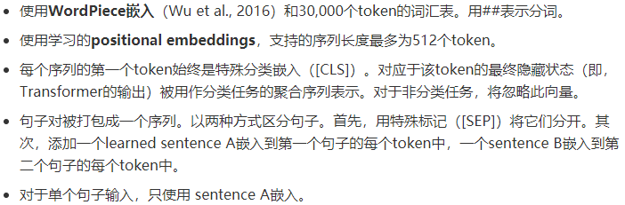
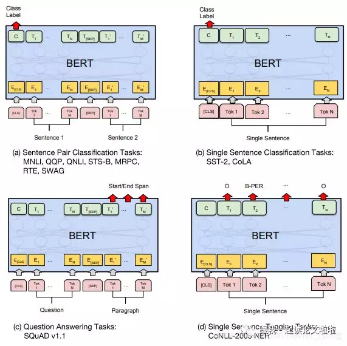

论文 《Pre-training of Deep Bidirectional Transformers for Language Understanding》

### 前言

BERT的本质上是通过在海量的语料的基础上运行自监督学习方法为单词学习一个好的特征表示，所谓自监督学习是指在没有人工标注的数据上运行的监督学习。在以后特定的NLP任务中，我们可以直接使用BERT的特征表示作为该任务的词嵌入特征。 

论文主要特点：

* 使用了Transformer。
* 为了解决单向的缺陷，论文中提出了两种预训练方法，分别是 “Masked Language model” 和 "next sentence prediction" 
*  使用更强大的机器训练更大规模的数据， 用户可以直接使用BERT作为Word2Vec的转换矩阵并高效的将其应用到自己的任务中。 

### 模型架构

这个图害我不浅，我不理解为什么每个单词要对应一个Transformer。其实BERT一行是一个Encoder；GPT只是一个Decoder.

基本架构是Transformer编码器的架构。

### 输入表征 input representation

更多说明：

### token embeddings

tokens化是使用一种叫做WordPiece token化的方法来完成的。这是一种数据驱动的token化方法，旨在实现词汇量和非词汇量之间的平衡。这就是“strawberries”被分成“straw”和“berries”的方式。对这种方法的详细描述超出了本文的范围。感兴趣的读者可以参考Wu et al. (2016)和Schuster & Nakajima (2012)中的第4.1节。单词token化的使用使得BERT只能在其词汇表中存储30522个“词”，而且在对英语文本进行token化时，很少会遇到词汇表以外的单词。

另外，在tokens的开始([CLS])和结束([SEP])处添加额外的tokens。这些tokens的目的是作为分类任务的输入表示，并分别分隔一对输入文本。

token嵌入层将每个wordpiece token转换为768维向量表示形式。这将使得我们的6个输入token被转换成一个形状为(6,768)的矩阵，或者一个形状为(1,6,768)的张量，如果我们包括批处理维度的话。

### segment embedding

Segment嵌入层只有两个向量表示。第一个向量(索引0)分配给属于输入1的所有tokens，而最后一个向量(索引1)分配给属于输入2的所有tokens。如果一个输入只有一个输入语句，那么它的Segment嵌入就是对应于Segment嵌入表的索引为0的向量。

### position embedding

BERT被设计用来处理长度为512的输入序列。作者通过让BERT学习每个位置的向量表示来包含输入序列的顺序特征。这意味着Position嵌入层是一个大小为(512,768)的查找表。

postiton是学习得到的。推理时，只需要查表就可以。

### 预训练任务

 论文不使用传统的从左到右或从右到左的语言模型来预训练BERT。相反，使用两个新的无监督预测任务对BERT进行预训练。 

### fine-tune

对于不同的任务，模型修改非常简单，最多加一层神经网络即可。

### 模型的影响

1. 深度学习就是表征学习。  在11项BERT刷出新境界的任务中，大多只在预训练表征（pre-trained representation）微调（fine-tuning）的基础上加一个线性层作为输出（linear output layer）。  
2. 规模很重要。这种遮挡（mask）在语言模型上的应用对很多人来说已经不新鲜了，但确是BERT的作者在如此超大规模的数据+模型+算力的基础上验证了其强大的表征学习能力。这样的模型，甚至可以延伸到很多其他的模型，可能之前都被不同的实验室提出和试验过，只是由于规模的局限没能充分挖掘这些模型的潜力，而遗憾地让它们被淹没在了滚滚的paper洪流之中。
3. 预训练价值很大。预训练已经被广泛应用在各个领域了（e.g. ImageNet for CV, Word2Vec in NLP），多是通过大模型大数据，这样的大模型给小规模任务能带来的提升有几何，作者也给出了自己的答案。BERT模型的预训练是用Transformer做的，但我想换做LSTM或者GRU的话应该不会有太大性能上的差别，当然训练计算时的并行能力就另当别论了。
4. 只有encoder没有decoder的双向语言表示预训练模型，可以接各种下游任务，它的输出只是文本表示，所以不能使用固定的decoder。
5. 动态词向量。在Word2Vec，GloVe的年代，词向量都是静态的，一旦训练之后词向量就固定不变了，但是这就限制了模型对多义词的识别能力，比如apple可以指水果也可以指苹果公司，因此词向量需要动态变化。