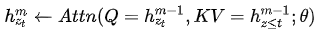
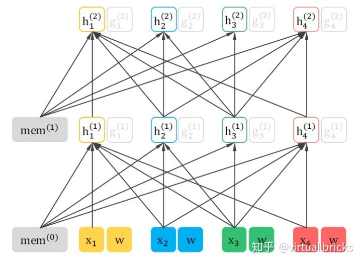

参考： https://zhuanlan.zhihu.com/p/70395238 

2019.6.19，论文：

Yang Z, Dai Z, Yang Y, et al. XLNet: Generalized Autoregressive Pretraining for Language Understanding[J]. arXiv preprint arXiv:1906.08237, 2019. 

Bert的缺点：

1. 独立性假设：bert忽略了mask之间的相关性
2.  数据分布不一致：预训练使用了mask，微调阶段没有mask

XLNet也是一个语言模型，继承ELMo, GPT, BERT，同时借鉴TransformerXL，改善了bert存在的问题。

**自回归语言模型**是根据上文或者下文来预测后一个单词，如ELMo，GPT

**自编码语言模型**是根据上下文来预测mask的词，如bert

AR模型没能同时获取上下文信息，AE模型 也有其缺点，就是在Fine-tune阶段，模型是看不到[mask]标记的，所以这就会带来一定的误差。  XLNet将二者的上述优缺点做了一个完美的结合，在AR中自然地引入上下文信息，并且解决了AE两阶段保持一致的问题。

### XLNet是怎么做的

XLNet的思路采用的是自回归语言模型，根据上文来预测下一个单词，但是在上文中添加了下文信息，这样就既解决了[mask]带来的两阶段不一致问题和无法同时引入上下文信息的问题。改进之后，取了个新名字：**Permutation Language Model 排列组合语言模型**。举个例子：输入句子为x1->x2->x3->x4，假设我们要预测的单词是x3，那我们需要在x3的上文x1和x2的位置看到x4的信息，这样才能解决同时引入上下文的问题。那就可以这么做了：随机排列组合x1、x2、x3、x4的顺序，并从中随机选择一部分作为新的句子输入。比如选择了x2->x4->x3->x1，那这个时候预测x3的时候是不是就能看到上文x2和下文x4的信息了呢，这就是XLNet的基本思路。就是通过排列组合的方式将一部分下文单词放到上文单词的位置，但实际形式还是一个从左到右预测的**自回归语言模型。** 

设所有排列组合为Z，z是其中一种，zt表示z的第t个元素，则优化目标为：

![[公式]](https://www.zhihu.com/equation?tex=%5Cmax_%7B%5Ctheta%7D%7B%5C+%5C+E_%7B%5Cbm%7Bz%7D%5Csim+Z_%7BT%7D%7D%5Cleft%5B+%5Csum_%7Bt%3D1%7D%5E%7BT%7D%7B%5Clog%7Bp_%7B%5Ctheta%7D%7B%5Cleft%28+x_%7Bz_%7Bt%7D%7D%7C%5Cbm%7Bx%7D_%7B%5Cbm%7Bz%7D_%7B%3Ct%7D%7D+%5Cright%29%7D%7D%7D+%5Cright%5D%7D)

XLNet在输入阶段并没有改变输入顺序，并不是真正打乱数据，而是在计算attention时mask掉对应位置。后文将详细描述。

### 双流注意力

举个例子，有序列 [暴雨，造成，大面积，晚点] ，产生排列组合序列 [暴雨，造成，大面积] 和 [暴雨，造成，晚点]。它们有共同的前置序列[暴雨，造成]，这样就造成“大面积”和“晚点”出现的概率一样，不合逻辑。因此，需要加入位置向量。

若像BERT在输入中加入，则位置信息仍是缺失，如图：

要解决这个问题，需要另外开辟一条attention流，因此称为双流attention。

Query steam：只能看到当前的位置信息，不能看到当前token的编码：

Content steam：传统self-attention，像GPT一样对当前token编码：

如图（多看几遍，直到理解）：

预训练阶段的最终预测只使用query stream，因为content stream已经见过当前token了。在精调阶段使用content stream，又回到了传统的self-attention结构。 

用了“排列组合”技术后，理论上每个原始序列的每种排列组合序列里的每一个位置都可以作为target来训练。但是这样搞训练开销太大，毕竟Bert只在更少的语料上挑了原始序列中15%的位置，普通玩家就已经玩不转了。XLNet的解决办法是只把一部分位置作为target进行训练 。如[1,2,3,4]，只训练3和4。作者设置为>6的位置才能训练。

### 借鉴了Transformer-XL

### 计算过程

序列[3, 2, 4, 1]

h的计算示意图：

g的计算示意图：

