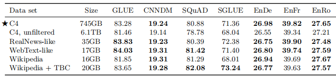

论文：Exploring the Limits of Transfer Learning with a Unified Text-to-Text Transformer

时间：2019.10.23

机构：Google

arxiv：[[1910.10683\] Exploring the Limits of Transfer Learning with a Unified Text-to-Text Transformer (arxiv.org)](https://arxiv.org/abs/1910.10683)

github: [GitHub - google-research/text-to-text-transfer-transformer: Code for the paper "Exploring the Limits of Transfer Learning with a Unified Text-to-Text Transformer"](https://github.com/google-research/text-to-text-transfer-transformer)

# Abstract

迁移学习，即模型首先在数据丰富的任务上进行预先训练，然后对下游任务进行微调，已经成为自然语言处理（NLP）中的一种强大的技术。迁移学习的有效性已经产生了多种方法、方法和实践。在本文中，我们通过引入一个统一的框架，将所有基于文本的语言问题转换为文本到文本的格式，来探索自然语言处理的迁移学习技术的前景。我们的系统研究比较了训练前的目标、架构、无标签数据集、迁移方法和数十个语言理解任务中的其他因素。通过将我们的探索与规模和我们新的“巨大的干净爬行语料库”相结合，我们在许多基准上实现了最先进的结果，包括摘要总结、问题回答、文本分类等。为了促进NLP迁移学习工作，我们发布了我们的数据集、预先训练的模型和代码。

# 1 Introduction

训练一个机器学习模型来执行自然语言处理（NLP）任务通常需要该模型能够以一种适合下游学习的方式来处理文本。这可以被不严格地看作是开发通用知识，允许模型“理解”文本。这些知识可以从低级的(例如单词的拼写或含义)到高水平。在现代机器学习实践中，提供这些知识很少明确完成；相反，它通常作为辅助任务的一部分学习。例如，历史上常见的方法是使用词向量（Mikolov等人，2013b，a；Penninton等人，2014）将词恒等式映射到一个连续的表示，理想情况下，相似的词映射到相似的向量。这些向量通常是通过一个目标来学习的，例如，鼓励共现词被定位在连续空间的附近（Mikolov et al.，2013b）。

最近，在一个数据丰富的任务上对整个模型进行预训练变得越来越普遍。理想情况下，这种预训练会使模型开发通用能力和知识，然后将其转移到下游任务中。在迁移学习在计算机视觉中的应用中（Oquab等，2014；贾等，2014；胡等，2016；约辛斯基等，2014），预训练通常是通过对大型标记数据集进行监督学习（拉斯萨科夫斯基等，2015；邓等，2009年）。相比之下，现代自然语言处理中的迁移学习技术通常是对无标记数据使用无监督学习进行预训练。该方法最近被用于在许多最常见的NLP基准中获得最先进的结果（Devlin等，2018年；杨等，2019年；东等，2019年；刘等，2019年c；Lan等，2019年）。除了它的经验优点之外，NLP的无监督预训练特别有吸引力，因为由于互联网，未标记的文本数据可以大量提供——例如， Common Crawl项目每月从网页中提取大约20TB的文本数据。神经网络很轻松可以容纳，它表现出显著的可扩展性，即，仅通过在更大的数据集上训练更大的模型通常可以获得更好的性能（赫斯内斯等，2017；沙泽等，2017；2016；马哈扬等，2018；雷德福等人，2019；沙泽等人，2018；黄等人，2018b；Keskar等人，2019a)。

这种成效导致了大量最近的为NLP开发迁移学习方法的工作，产生了广泛的预训练目标、无标签数据集，基准，微调方法等等。在这一新兴领域中，技术的快速发展速度和多样性使得比较不同的算法、梳理新贡献的影响以及理解现有的迁移学习方法的空间变得困难。出于对更严格的理解的需求，我们利用了一种统一的迁移学习方法，使我们能够系统地研究不同的方法，并推动该领域当前的极限。

我们工作的基本思想是将每一个文本处理问题都视为“text-to-text”的问题，即将文本作为输入，生成新的文本作为输出。这种方法的灵感来自于之前针对NLP任务的统一框架，包括将所有文本问题转换为问答（McCann等人，2018年）、语言建模（Radford等人，2019年）或跨度提取Keskar等人（2019年b）任务。至关重要的是，文本到文本的框架允许我们直接将相同的模型、目标、训练过程和解码过程应用到我们所考虑的每一个任务中。我们利用这种灵活性，通过评估各种基于英语的NLP问题的表现，包括问题回答，文档摘要，情感分类，等。通过这种统一的方法，我们可以比较不同的迁移学习目标、无标签数据集和其他因素的有效性，同时通过扩展模型和数据集超出以前考虑的范围来探索迁移学习的局限性。

我们强调，我们的目标不是提出新的方法，而是对该领域的立场提供一个全面的观点。因此，我们的工作主要包括对现有技术的调查、探索和经验比较。我们还通过扩大我们的系统研究（训练模型多达110亿个参数）的见解来探索当前方法的局限性，从而在我们所考虑的许多任务中获得最先进的结果。为了在这个规模上进行实验，我们引入了“Colossal Clean Crawled Corpus”（C4），这是一个由从网络上刮取的数百gb的干净英语文本组成的数据集。认识到迁移学习的主要用途是在数据稀缺的环境中利用预训练过的模型的可能性，我们发布了我们的代码、数据集和预训练过的模型。

本文的其余部分的结构如下：在下一节中，我们将讨论我们的基本模型及其实现，我们将每个文本处理问题表述为文本到文本任务的过程，以及我们所考虑的一组任务。在第3节中，我们提出了大量的实验来探索NLP的迁移学习领域。在本节（第3.7节）的最后，我们结合系统研究的见解，在各种基准上获得最先进的结果。最后，我们将对我们的结果进行总结，并在第4节中总结一下对未来的展望。

# 2 Setup

在展示我们的大规模实证研究的结果之前，我们回顾了理解我们的结果所需的必要的背景主题，包括Transformer模型架构和我们评估的下游任务。我们还介绍了将每个问题作为文本到文本的任务来处理的方法，并描述了我们的C4，这是我们创建的作为未标记文本数据源的基于爬行的通用数据集。我们将我们的模型和框架称为“**T**ext-**t**o-**T**ext **T**ransfer **T**ransformer”（T5）。

## Model

总的来说，我们的Transformer的实现非常遵循其最初提出的形式（Vaswani et al.，2017）。首先，将一个序列的tokens映射到一个嵌入序列，然后将其传递到编码器中。编码器由一堆“blocks”组成，每个块由两个子组件组成：一个自注意层和一个小的前馈网络。层归一化应用于每个子组件的输入。我们使用一个简化版本的层标准化，其中激活只是重新调整，没有附加偏差被应用。在层归一化之后，一个剩余的residual skip connection将每个子组件的输入添加到其输出中。Dropoaut应用于feed-forward network、residual skip connection、attention weights、整个堆栈的输入和输出。解码器在结构上类似于编码器，不同之处在于它在关注编码器输出的每个自注意层之后包括标准注意机制。解码器中的自我注意机制也使用了一种自回归或因果性自我注意的形式，这只允许模型关注过去的输出。最终解码器块的输出被输入到一个具有softmax输出的密集层中，其权值与输入的嵌入矩阵共享。Transformer中的所有注意机制都被分成独立的“heads”，其输出在被进一步处理之前被连接起来。

由于自注意是与顺序无关的，因此通常会向Transformer提供一个显式的位置信号。虽然原始变压器使用正弦位置信号或学习位置嵌入，但最近使用相对位置嵌入变得更加普遍（Shaw等人，2018；Huang等人，2018a）。相对位置嵌入不是对每个位置使用固定的嵌入，而是根据自我注意机制中比较的“键”和“查询”之间的偏移量产生不同的学习嵌入。我们使用一种简化的位置嵌入形式，其中每个“嵌入”都只是一个标量，它被添加到用于计算注意力权重的相应的logit中。为了提高效率，我们还在模型中的所有层中共享位置嵌入参数，尽管在给定的层中，每个注意头使用不同的学习位置嵌入。通常，学习固定数量的嵌入，每个嵌入对应于一系列可能的键查询偏移量。在这项工作中，我们为所有的模型使用了32个嵌入，其范围的大小对数增加到128的偏移，超过此，我们将所有相对位置分配给相同的嵌入。请注意，一个给定的层对超过128个标记的相对位置不敏感，但是后续的层可以通过结合来自以前的层的局部信息来建立对更大的偏移量的敏感性。综上所述，我们的模型与Vaswani等人（2017）提出的原始变压器大致相同，除了 Layer Norm bias，将层归一化放置在残差路径之外，并使用不同的位置嵌入方案。由于这些结构上的变化与我们在迁移学习的实证调查中考虑的实验因素正交，我们将其影响的消融留给了未来的工作。

作为我们研究的一部分，我们实验了这些模型的可伸缩性，即它们的性能如何随着它们具有更多的参数或层而发生变化。训练大型模型可能不是很简单的，因为它们可能不适合一台机器，而且需要大量的计算。因此，我们使用模型和数据并行性的组合，并在云TPU上训练模型。TPU pods是一种多机架ML超级计算机，其中包含1,024个TPU v3芯片，通过高速2D网格互连与支持的CPU主机连接。我们利用 Mesh TensorFlow（Shazeer et al.，2018）来方便地实现模型并行和数据并行（Krizhevesky，2014）。

笔记：T5模型和原始的Transformer结构基本一致，除了做了如下几点改动：

1、remove the Layer Norm bias

2、place the Layer Normalization outside the residual path

* 常规Layer_normalization计算公式 
* 此处的Layer_normalization计算公式 ，weight初始化为1

3、use a different position embedding

此处使用了简化的相对位置embedding，即每个位置对应一个数值而不是向量，原来的Transformer采用`sin/cos`习得position embeddings，而T5将(key和query)相对位置的数值加在attention softmax之前的logits上，每个head的有自己的position embeddings，所有的层共享一套position embeddings，每一层都计算一次，让模型对位置更加敏感

## C4

以前关于NLP迁移学习的大部分工作都利用了大型的无标记数据集来进行无监督学习。在本文中，我们感兴趣的是测量这些未标记数据的质量、特征和大小的影响。为了生成满足我们需求的数据集，我们利用 Common Crawl作为从web中刮取的文本的来源。

Common Crawl是一个公开的web存档，它通过从爬取的HTML文件中删除markup和其他非文本内容来提供“web extracted text”。这个过程每月产生大约20TB的文本数据。不幸的是，产生的文本不是自然语言。相反，它主要由胡言乱语或样板文本组成，如菜单、错误信息或重复文本。此外，大量被收集的文本所包含的内容不太可能对我们所考虑的任何任务（冒犯性语言、占位符文本、源代码等）有帮助。为了解决这些问题，我们使用以下启发式方法来清理 Common Crawl’s web extracted text：

* 7条过滤条件，略。

此外，由于我们的大多数下游任务都集中在英语文本上，所以我们使用 langdetect 来过滤掉任何没有被分类为英语的页面，其概率至少为0.99。我们的启发式方法的灵感来自于过去使用通用爬行作为NLP数据来源的工作：例如，Grave等人也使用自动语言检测器过滤文本并丢弃短线；Grave等人都执行行级重复数据删除。然而，我们选择创建一个新的数据集，因为之前的数据集使用了更有限的过滤启发式集，不公开，或范围不同（例如仅限于新闻数据（Zellers等人，2019），只包含知识共享内容（哈伯纳等人，2016），或专注于机器翻译的并行训练数据（Smith等人，2013））。

为了组装我们的基础数据集，我们下载了2019年4月的web extracted text，并应用了上述过滤。这所产生的文本集合不仅比大多数用于预训练的数据集（约750 GB）大一个数量级，而且还包含相当干净和自然的英语文本。我们将此数据集称为C4，并将其作为 TensorFlow 数据集的一部分发布。

笔记：一个月数据，也就是20T，过滤后750G.

## Downstream Tasks

本文的目标是衡量一般的语言学习能力。因此，我们在一系列不同的基准测试上研究下游性能，包括机器翻译、问题回答、摘要抽取和文本分类。具体来说，我们测量了GLUE和SuperGLUE文本分类；CNN/Daily Mail 摘要抽取；SQuAD 问答；以及WMT English to German, French, and Romanian的翻译。所有数据均来自TensorFlow数据集。

GLUE和SuperGLUE每一个任务都包含一组文本分类任务，旨在测试一般的语言理解能力：

* Sentence acceptability judgment (CoLA (Warstadt et al., 2018))

* Sentiment analysis (SST-2 (Socher et al., 2013))

* Paraphrasing/sentence similarity (MRPC (Dolan and Brockett, 2005), STS-B (Ceret al., 2017), QQP (Iyer et al., 2017))

* Natural language inference (MNLI (Williams et al., 2017), QNLI (Rajpurkar et al.,

  2016), RTE (Dagan et al., 2005), CB (De Marneffff et al., 2019))

* Coreference resolution (WNLI and WSC (Levesque et al., 2012))

* Sentence completion (COPA (Roemmele et al., 2011))

* Word sense disambiguation (WIC (Pilehvar and Camacho-Collados, 2018))

*  Question answering (MultiRC (Khashabi et al., 2018), ReCoRD (Zhang et al., 2018), BoolQ (Clark et al., 2019))

我们使用由GLUE和SuperGLUE基准测试所分布的数据集。为了简单起见，在进行微调时，我们通过连接所有组成数据集，将GLUE基准测试中的所有任务（SUpERGLUE类似）视为单个任务。正如Kocijan等人（2019）所建议的，我们还包括了SuperGLUE中的DPR数据集。

CNN/Daily Mail（Hermann等人，2015）数据集作为问答任务引入，但被Nallapati等人（2016）改编为文本摘要；我们使用See等人（2017）的非匿名版本作为抽取摘要任务。SQuAD（Rajpurkar et al.，2016）是一个常见的问答基准。该模型被输入问题及其上下文，并被要求逐个标记地生成答案。对于WMT English to German，我们使用与（Vaswani等人，2017）和 newstest2013 相同的训练集作为验证集（Bojar等人，2014）。对于English to French，我们使用2015年和newstest2014年的标准训练数据作为验证集（Bojar et al.，2015）。对于English to Romanian，这是一个标准的低资源机器翻译基准，我们使用了来自WMT 2016年的训练和验证集（Bojar等人，2016年）。请注意，我们只对英语数据进行了预训练，因此，为了学习翻译，一个给定的模型将需要学习用一种新的语言生成文本。

## Input and Output Format

为了训练一个模型在上面描述的各种任务，我们把所有的任务我们考虑“文本到文本”格式。该框架为培训前和微调提供了一个一致的训练目标。具体来说，不管任务是什么，该模型采用最大似然目标（使用“teacher forcing”(Williams and Zipser, 1989)）。为了指定模型应该执行哪个任务，我们在将原始输入序列输入给模型之前，先向原始输入序列添加一个特定于任务的（文本）前缀。

举个例子，让模型翻译“That is good”这句话。从英语到德语，这个模型将被输入“translate English to German: That is good.”。并将被训练来输出“Das ist gut.”。对于文本分类任务，该模型只是预测与目标标签对应的一个单词。例如，在MNLI基准上（威廉姆斯等人，2017），目标是预测一个前提是否暗示隐含（“entailment”）、矛盾（“contradiction”）或既不隐含（“neutral”）假设。通过我们的预处理，输入序列变了“mnli premise: I hate pigeons. hypothesis: My feelings towards pigeons are fifilled with animosity”，与相应的目标词“entailment”。请注意，如果我们的模型在文本分类任务上输出的文本与任何可能的标签都不对应（例如，当任务的唯一可能标签是“隐含”、“中性”或“矛盾”时，就会出现一个问题）。在这种情况下，我们总是将模型的输出视为错误的，尽管我们从未在任何我们训练过的模型中观察到这种行为。请注意，用于给定任务的文本前缀的选择本质上是一个超参数；我们发现，改变前缀的确切措辞的影响有限，因此没有对不同的前缀选择进行广泛的实验。图1显示了我们的文本到文本框架的图表，以及一些输入/输出示例。我们为附录D中我们研究的每个任务提供了预处理输入的完整示例。

图1：T5完成的四个任务：翻译、情感分类、文本语义相似度任务（1-5分）、摘要

除了STS-B，我们能够直接将我们考虑的所有任务的文本转换为文本格式，这是一个回归任务，目标是预测1到5之间的相似性得分。我们发现这些分数大多以0.2的增量进行标注，所以我们简单地将任何分数四舍五入到最接近的0.2增量，并将结果转换为字符串表示（例如，浮点值2.57将映射到字符串“2.6”）。在测试时，如果模型输出一个对应于1到5之间的数字的字符串，我们将其转换为浮点值；否则，我们认为模型的预测是不正确的。这有效地将STS-B回归问题重新定义为一个21类分类问题。

另外，我们还将Winograd任务（WNLI from GLUE, WSC from SuperGLUE，以及我们添加到SuperGLUE的DPR数据集）转换为一种更简单的格式，更适合文本到文本的框架。Winograd任务的例子包括一个文本段落，其中包含一个有歧义的代词，可以指该代词中的多个名词短语。例如，“The city councilmen refused the demonstrators a permit because they feared violence”，其中包含了模棱两可的代词“他们”，可以指“市议员”或“示威者”。我们将WNLI、WSC和DPR任务转换为文本到文本的问题，通过突出显示文本段落中的歧义代词，并要求模型预测它所指的名词。上面提到的例子将被转化为“The city councilmen refused the demonstrators a permit because *they* feared violence”该模型将被训练来预测目标文本“The city councilmen”。

对于WSC，样本包括段落、歧义代词、一个候选名词和一个反映候选代词是否匹配的True/False标签（忽略任何文章）。我们只对带有“真”标签的例子进行训练，因为我们不知道带有“假”标签的例子的正确的名词目标。对于评估，如果模型输出中的单词是候选名词短语中单词的子集，我们分配一个“True”标签，否则分配一个“False”标签。这删除了大约一半的WSC训练集，但DPR数据集增加了大约1000个代词解析示例。DPR的样本用正确的参考名词标注，便于以上面列出的格式使用这个数据集。

WNLI训练集和验证集与WSC训练集有显著的重叠。为了避免将验证示例泄漏到我们的训练数据中（在第3.5.2节的多任务实验中的一个特殊问题），因此我们从不在WNLI上进行训练，也从不在WNLI验证集上报告结果。省略WNLI验证集的结果是标准做法（Devlin等人，2018），因为它相对于训练集是“对抗性的”，即验证示例都是带有相反标签的训练示例的轻微扰动版本。因此，每当我们报告验证集时，我们不将WNLI包括在平均GLUE分数中（除第3.7节外的所有部分）。将WNLI转换为上面描述的“referent noun prediction”变体需要更复杂一些；我们在附录B中描述这个过程。

# 3 Experiments

NLP迁移学习的最新进展来自于各种各样的发展，如新的训练前目标、模型架构、未标记的数据集等等。在本节中，我们对这些技术进行了实证调查，希望能梳理出它们的贡献和意义。然后，我们将结合所获得的见解，以便在我们所考虑的许多任务中获得最先进的水平。由于NLP的迁移学习是一个快速发展的研究领域，因此我们在实证研究中不可能涵盖所有可能的技术或想法。为了获得更广泛的文献综述，我们推荐Ruder等人（2019年）最近进行的一项调查。

我们通过采用一个合理的基线（在第3.1节中描述），并一次改变一个设置，来系统地研究这些贡献。例如，在第3.3节中，我们测量了不同的无监督目标的性能，同时保持我们其余的实验pipline的固定。这种“坐标上升”方法可能会错过二阶效应（例如，一些特定的无监督目标可能在比我们的基线设置更大的模型上效果最好），但对我们研究中的所有因素进行组合探索将是令人望而却步的代价。在未来的工作中，我们希望更彻底地考虑我们所研究的方法的组合将是富有成效的。

我们的目标是在不同的任务集上比较各种不同的方法，同时保持尽可能多的因素固定。为了满足这一目标，在某些情况下，我们并不完全复制现有的方法。例如，像BERT（Devlin et al.，2018）这样的“仅编码器”模型被设计为对每个输入令牌产生单个预测或对整个输入序列的单个预测。这使得它们适用于分类或跨度预测任务，但不适用于翻译或抽象摘要等生成性任务。因此，我们所考虑的所有模型架构都没有一个与BERT相同，或由一个仅包含编码器的结构组成。相反，我们测试了在精神上相似的方法——例如，我们考虑了一个类似于3.3节中的BERT的“蒙面语言建模”目标的目标，并考虑了一个在3.2节中的文本分类任务中行为类似于BERT的模型体系结构。

在下面的小节中概述了我们的基线实验设置之后，我们对模型架构（第3.2节）、无监督目标（第3.3节）、训练前数据集（第3.4节）、转移方法（第3.5节）和缩放（第3.6节）进行了经验比较。在本节的高潮，我们将我们的研究见解与规模结合起来，以在我们考虑的许多任务中获得最先进的结果（第3.7节）。

## 3.1 Baseline

我们的基线目标是反映典型的现代实践。我们使用一个简单的去噪目标对一个标准的Transformer进行预训练（详见第2.1节），然后对我们的每个下游任务分别进行微调。我们将在下面的小节中描述这个实验设置的细节。

**MODEL**

对于我们的模型，我们使用了Vaswani等人（2017）提出的标准编码器-解码器变压器。虽然许多现代的NLP迁移学习方法使用只包含一个“堆栈”的变压器架构（例如，语言建模（雷德福德等人，2018；Dong等人，2019）或分类和跨度预测（Devlin等人，2018；Yang等人，2019）），我们发现使用标准的编码-解码器结构在生成和分类任务上都取得了良好的效果。我们将在第3.2节中探讨不同模型体系结构的性能。

我们的基线模型设计使编码器和解码器在大小和配置上都与“BERT_base”（Devlin et al.，2018）堆栈相似。具体地说，编码器和解码器都由12个块组成（每个块包括自注意、可选的编码器-解码器注意和一个前馈网络）。每个块中的前馈网络由一个输出维数为d_ff = 3072，然后是一个ReLU非线性和另一个致密层组成。所有注意机制的“关键”和“值”矩阵为d_kv = 64，所有注意机制都有12个头。所有其他子层和嵌入的维数都是 768的维数。总的来说，这导致了一个约2.2亿参数的模型。这大约是BERT_base参数数量的两倍，因为我们的基线模型包含两层堆栈，而不是一个。对于正则化，我们在模型中到处使用0.1的dropout概率。

**Training**

如第2.4节所述，所有任务都被表述为从文本到文本的任务。这使得我们总是使用标准的最大似然进行训练，即，使用teacher forcing（威廉姆斯和Zipser，1989）和cross-entropy loss。对于优化，我们使用AdaFactor（Shazeer和Stern，2018）。在测试时，我们使用贪婪解码（即在每个时间步长上选择最高概率的logit）。

在进行微调之前，我们在C4上对每个模型进行了2的19次方= 524,288步的预训练。我们使用的最大序列长度为512，批处理大小为128个序列。只要有可能，我们将多个序列“打包”到batch，这样我们的批次就包含大约2的16次方= 65,536个令牌。总的来说，这个批处理的大小和步数对应于对2的35个≈34B令牌的预训练。这远远低于BERT（Devlin等人，2018），后者使用了大约137B tokens，或RoBERTa（Liu等人，2019c），后者使用了大约2.2T tokens。仅使用2的35个令牌就可以获得合理的计算预算，同时仍然提供足够的预训练以获得可接受的性能。我们考虑第3.6和3.7节中更多步骤的预训练效果。请注意，2的35个令牌只覆盖了整个C4数据集的一小部分，所以我们在训练前不会重复任何数据。

在训练前，我们使用一个“inverse square root”学习率计划。这为前104步设置了0.01学习率（预热），然后指数衰减学习率，直到训练前结束。我们还尝试使用三角函数学习率（Howard和Ruder，2018），这产生了略好的结果，但需要提前知道训练步骤的总数。由于我们将在一些实验中改变训练步骤的数量，所以我们选择了更通用的反平方根的计划。

我们的模型对所有任务上的2 18个= 262,144个步骤进行了微调。选择这个值是作为高资源任务（即具有大数据集的任务）和快速过拟合的低资源任务（较小的数据集）之间的权衡。在微调过程中，我们继续使用长度为128个-512个序列的批处理（即每批处理2 16个令牌）。当进行微调时，我们使用了一个恒定的0.001的学习率。我们每5000步保存一个检查点，并在与最高验证性能对应的模型检查点上报告结果。对于对多个任务进行微调的模型，我们为每个任务独立选择最佳检查点。对于除第3.7节外的所有实验，我们都在验证集中报告结果，以避免在测试集上进行模型选择。

**Vocabulary**

我们使用SentencePiece（工藤和理查森，2018）将文本编码为WordPiece tokens（Sennrich等人，2015；工藤，2018）。在所有的实验中，我们使用了32,000个单词的词汇表。由于我们最终将英语模式调整为德语、法语和罗马尼亚语的翻译，因此我们还要求我们的词汇必须涵盖这些非英语语言。为了解决这个问题，我们将C4中使用的 Common Crawl 爬取页面分为德语、法语和罗马尼亚语。然后，我们在10部分英语C4数据的混合物上训练我们的SentencePiece模型，其中1部分数据分为德语、法语和罗马尼亚语。这个词汇表在我们的模型的输入和输出中都被共享了。请注意，我们的词汇表使我们的模型只能处理一组预先确定的、固定的语言集。

**Unsupervised Objective**

最近有研究表明，“denoising”目标产生了更好的性能，因此它们很快成为标准。降噪目标：训练模型以预测输入中丢失或损坏的令牌。受BERT的“masked language modeling”的目标和“word dropout”正则化技术，我们设计了一个目标，随机抽样，然后在输入序列中删除15%的标记。所有连续的 dropped-out tokens都被一个哨兵标记取代。每个哨兵令牌被分配一个序列唯一的令牌ID。哨兵id是一种特殊的标记，它们被添加到我们的词汇表中，并不对应于任何wordpiece。然后，目标对应于所有dropped-out spans of tokens，由输入序列中使用的相同哨点标记加上标记目标序列结束的最终哨点标记分隔。我们选择掩盖连续跨度的标记，并只预测退出的标记，以减少训练前的计算成本。我们对第3.3节中的培训前的目标进行了彻底的调查。图2显示了由应用此目标所产生的转换的一个示例。我们将这一目标与第3.3节中的许多其他变体进行了实证比较。

图2：base-line模型训练方式：

**Baseline Performance**

在本节中，我们将使用上面描述的基线实验程序来展示结果，以了解我们的下游任务套件将期望什么样的性能。理想情况下，我们应该重复研究中的每个实验，以获得我们结果的置信区间。不幸的是，由于我们运行了大量的实验，这将是非常昂贵。作为一种更便宜的替代方案，我们从头开始训练我们的基线模型10次（即使用不同的随机初始化和数据集洗牌），并假设基础模型的这些运行上的方差也适用于每个实验变体。我们不期望我们所做的大多数变化会对运行间的方差产生显著的影响，所以这应该提供一个关于不同变化的重要性的合理指示。另外，我们还测量了在没有预先训练的情况下，对所有下游任务进行2 18步（我们用于微调的相同数字）训练模型的性能。这让我们了解了预训练在基线设置中对我们的模型有多少好处。

表1：baseline训练10次的平均结果和方差，其中SGLUE就是SuperGLUE。EnDe就是English to German。

## 3.2 Architectures

虽然Transformer最初是通过编码器-解码器架构引入的，但许多关于NLP迁移学习的现代工作都使用了替代架构。在本节中，我们将回顾和比较这些架构变体。

**Model Structures**

不同架构的一个主要区别因素是模型中不同的注意机制所使用的“掩模”。作者对多种模型架构进行了对比，主要是如下三种（图3）：

图3：掩码方式

第一种，**Encoder-Decoder 型**，即 Seq2Seq 常用模型，分成 Encoder 和 Decoder 两部分，对于 Encoder 部分，输入可以看到全体，之后结果输给 Decoder，而 Decoder 因为输出方式只能看到之前的。此架构代表是 MASS（今年WMT的胜者），而 BERT 可以看作是其中 Encoder 部分。

第二种， 相当于上面的 **Decoder 部分**，当前时间步只能看到之前时间步信息。典型代表是 GPT2 还有最近 CTRL 这样的。

第三种，**Prefix LM（Language Model） 型**，可看作是上面 Encoder 和 Decoder 的融合体，一部分如 Encoder 一样能看到全体信息，一部分如 Decoder 一样只能看到过去信息。最近开源的 UniLM 便是此结构。

图4：Transformer三种架构

**Comparing Different Model Structures**

为了实验比较这些体系结构变体，我们希望我们认为的每个模型以某种有意义的方式是等价的。如果两个模型有相同数量的参数，或者它们需要大致相同的计算量来处理一个给定的（输入序列、目标序列）对，我们可能会说它们是等价的。不幸的是，不可能同时根据这两个标准将编码器-解码器模型与语言模型架构（包括单个变压器堆栈）进行比较。为了了解为什么，首先注意一个在编码器中有L层和在解码器中有L层的编码器-解码器模型与具有2L层的语言模型的参数数量大致相同。然而，相同的L + L编码-解码器模型的计算成本与只有L层的语言模型大致相同。这是由于语言模型中的L层必须同时应用于输入和输出序列，而编码器只应用于输入序列，而解码器只应用于输出序列。请注意，这些等价是近似的——由于编码器-解码器的attention，在解码器中有一些额外的参数，并且在注意层中也有一些序列长度为二次的计算代价。然而，在实践中，我们观察到L层语言模型与L+L层编码-解码器模型的步长几乎相同，这表明计算成本大致相等。此外，对于我们考虑的模型大小，编码解码器注意层中的参数数约为总参数数的10%，因此我们简化假设L+L层编码解码器模型与2L层语言模型具有相同的参数数量。

为了提供一种合理的比较方法，我们考虑了编码器-解码器模型的多种配置。我们将把BERT_base大小的层堆栈中的层数和参数分别称为L和P。我们将使用M来表示L+L层编码器-解码器模型或仅L层解码器模型所需的FLOP数量以处理给定的输入目标对。总的来说，我们将比较：

* 编码器中有L层，解码器中有L层的 encoder-decoder模型。该模型具有2个P参数和M个FLOPs的计算代价。
* 一个等效的模型，但参数在编码器和解码器之间共享，因此是P参数和M-FLOP计算代价。
* 一个在编码器和解码器中各有L/2层的 encoder-decoder模型，给出了P参数和一个M/2-FLOP成本。
* 一个具有L个层和P个参数的decoder-only语言模型，以及M个FLOPs的计算代价。
* 一个decoder-only prefix LM具有相同的架构（因此具有相同数量的参数和计算成本），但在输入上具有完全可见的自注意。

**Objectives**

训练目标有两个：basic language modeling objective 以及在3.1.4节中描述的 denoising objective。对于在进行预测之前先提取前缀的模型（编码器-解码器模型和前缀LM），我们从未标记的数据集中采样了一段文本，并选择一个随机点将其分为前缀和目标部分。对于标准语言模型，我们训练模型以预测从开始到结束的整个跨度。我们的无监督降噪目标是为 text-to-text 模型设计的；为了使其适应语言模型，我们将输入和目标连接起来，如3.2.1节所述。

**Results**

表2：结果表明：Denoising目标函数好；Encoder-decoder架构好；

## 3.3 Unsupervised objectives

都有那些训练目标：

之后是对预训练目标的大范围探索，具体做了哪些实验，下面这张图就能一目了然。

总共从四方面来进行比较。

第一个方面，**高层次方法（自监督的预训练方法）对比**，总共三种方式。

1. **语言模型式**，就是 GPT-2 那种方式，从左到右预测；
2. **BERT-style 式**，就是像 BERT 一样将一部分给破坏掉，然后还原出来；
3. **Deshuffling （顺序还原）式**，就是将文本打乱，然后还原出来。

其中发现 Bert-style 最好，进入下一轮。

第二方面，对文本一部分进行**破坏时的策略**，也分三种方法。

1. **Mask 法**，如现在大多模型的做法，将被破坏 token 换成特殊符如 [M]；
2. **replace span（小段替换）法**，可以把它当作是把上面 Mask 法中相邻 [M] 都合成了一个特殊符，每一小段替换一个特殊符，提高计算效率；
3. **Drop 法**，没有替换操作，直接随机丢弃一些字符。

此轮获胜的是 **Replace Span 法**，类似做法如 SpanBERT 也证明了有效性。

第三方面，到底该**对文本百分之多少进行破坏**呢，挑了 4 个值，10%，15%，25%，50%，最后发现 BERT 的 **15%** 就很 ok了。这时不得不感叹 BERT 作者 Devlin 这个技术老司机直觉的厉害。

接着进入更细节，第四方面，因为 Replace Span 需要决定**对大概多长的小段进行破坏**，于是对不同长度进行探索，2，3，5，10 这四个值，最后发现 **3** 结果最好。

终于获得了完整的 T5 模型，还有它的训练方法。

- Transformer Encoder-Decoder 模型；
- BERT-style 式的破坏方法；
- Replace Span 的破坏策略；
- 15 %的破坏比；
- 3 的破坏时小段长度。

到此基本上 T5 预训练就大致说完了，之后是些细碎探索。

##  3.4 Pre-training dataset

本节将比较 C4 数据集的变体和其他潜在的预训练数据源。

 **Unlabeled Data Sets**

第2.2节讲述了很多建立 C4 数据集时使用的启发式方法。除了将其与其他过滤方法和常见的预训练数据集进行比较之外，我们有兴趣测量这种过滤是否会改善下游任务的性能。为此，我们在以下数据集上进行预训练后比较基线模型的性能：

只在单个领域上进行预训练的一个缺点是，所得到的数据集通常要小得多。类似地，虽然类似webtexe的变体表现得与C4数据集一样好或更好，但基于reddit的过滤产生的数据集比C4小40×，尽管基于Common Crawl的数据多12×。然而，请注意，在我们的基线设置中，我们只在2 35个≈34B令牌上进行了预训练，这只比我们考虑的最小的训练前数据集大了大约8倍。我们将在下一节中使用较小的训练前数据集提出问题。

**Pre-training Data set Size**

最终的下游性能如表9所示，随着数据集大小缩小而下降。我们怀疑这可能是由于该模型开始记住预训练数据集。为了测量这是否成立，我们在图6中绘制了每种数据集大小的训练损失。的确，随着预训练数据集的大小缩小，该模型获得的训练损失明显较小，这表明可能存在记忆。

我们注意到，当预训练数据集仅重复 64 次时，这些影响是有限的。这表明一定程度的重复预训练数据可能不会有害。但是，考虑到额外的预训练可能是有益的(我们将在第3.6节中显示)，并且获取额外的未标记数据既便宜又容易，我们建议尽可能使用大型的预训练数据集。

## 3.5 Training strategy

到目前为止，我们已经考虑了以下设置：在无监督的任务上对模型的所有参数进行预训练，然后对个别有监督的任务进行微调。 尽管这种方法很简单，但现在已经有了各种用于在下游/监督任务上训练模型的替代方法。在本节中，除了在多个任务上同时训练模型的方法之外，我们还比较了用于微调模型的不同方案。

**Fine-tuning methods**

第一种：“adapter layers”[15]的动机是在微调时保持大多数原始模型固定不变。适配器层是附加的dense-ReLU-dense块，这些块在变压器的每个块中的每个预先存在的前馈网络之后添加。这些新的前馈网络的设计使其输出维数与其输入相匹配。这样就可以将它们插入网络，而无需更改结构或参数。进行微调时，仅更新适配器层和层归一化参数。这种方法的主要超参数是前馈网络的内部维数 d ，它改变了添加到模型中的新参数的数量。我们用 d 的各种值进行实验。

第二种替代性微调方法是“gradual unfreezing”[6]。在逐步解冻过程中，随着时间的流逝，越来越多的模型参数会进行微调。逐步解冻最初应用于包含单个块层(a single stack of layers)的语言模型体系结构。在此设置中，微调开始时仅更新最后一层的参数，然后在训练了一定数量的更新之后，就会更新包括倒数第二层的参数，依此类推，直到整个网络的参数都在微调。为了使这种方法适应我们的编码器-解码器模型，我们从顶部开始逐渐并行地解冻编码器和解码器中的层。由于我们的输入嵌入矩阵和输出分类矩阵的参数是共享的，因此我们会在整个微调过程中对其进行更新。我们模型12+12层，微调是2 18个步，分成12节，每节2 18 / 12 步。

**Multi-task learning**

到目前为止，我们已经在单个无监督学习任务上对我们的模型进行了预训练，然后在每个下游任务上分别对其进行了微调。另一种方法称为“多任务学习”，在多个任务上同时训练模型。这种方法通常的目标是训练可以同时执行许多任务的单个模型，即该模型及其大多数参数在所有任务之间共享。我们在某种程度上放松了这一目标，而是一次研究了针对多个任务进行训练的方法，以便最终产生对每个任务都执行良好的独立参数设置。

在我们统一的 Text-to-text 框架中，“多任务学习”仅对应于将数据集混合在一起。相比之下，大多数将多任务学习应用于NLP的应用都会添加特定于任务的分类网络，或者为每个任务使用不同的损失函数。多任务学习，需要重点关注数据混合比例。

具体过程略。

结论： pre-train-then-fine-tune 方法好于 multi-task

## 3.6 Scaling

缩放研究：模型放大，训练步数放大，batch放大，模型集成（4个单独训练的模型 / 4个单独微调，预测时logits取平均）

结果表明：

1、 4 倍步数或 4 倍batch，尽管两者都是有益的，但没有明显的赢家。

2、增大模型，效果会变好。

## 3.7 Putting it all together

训练了不同规模的模型：

- Small，Encoder 和 Decoder 都只有 6 层，隐维度 512，8 头；

- Base，相当于 Encoder 和 Decoder 都用 BERT-base；各12层；
- Large，Encoder 和 Decoder 都用 BERT-large 设置，除了层数只用 12 层；
- 3B（Billion）和11B，层数都用 24 层，不同的是其中头数量和前向层的维度。

11B 的模型最后在 GLUE，SuperGLUE，SQuAD，还有 CNN/DM 上取得了 SOTA，而 WMT(翻译) 则没有。

