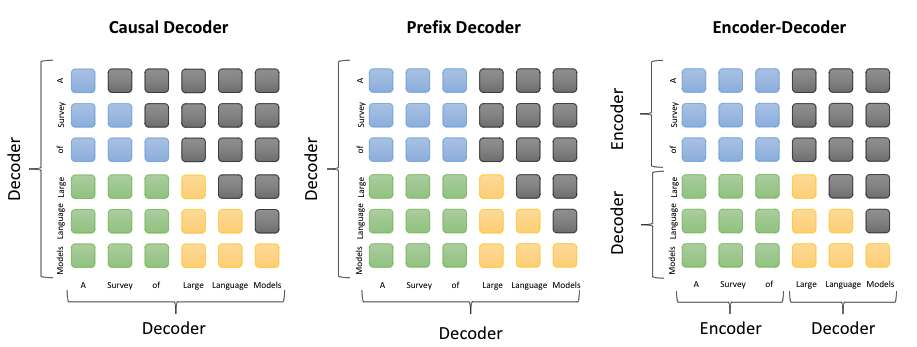

### transformer中的mask机制

在Transformer模型中，mask机制是一种用于在self-attention中的技术，用以控制不同token之间的注意力交互。具体来说，Transformer中使用两种类型的mask：padding mask和sequence mask。

- Padding mask（填充掩码）：在自注意力机制中，句子中的所有单词都会参与计算。但是，在实际的句子中，往往会存在填充符（比如-1），用来填充句子长度不够的情况。Padding mask就是将这些填充符对应的位置标记为0，以便在计算中将这些位置的单词忽略掉。
- Sequence mask（序列掩码）：sequence mask用于在Decoder端的self-attention中，以保证在生成序列时不会将未来的信息泄露给当前位置的单词。

序列掩码有三种形式。

### 三种attention mask

不同的语言模型通过attention mask设计，mask取全1就对应双向注意力，mask取下三角矩阵就对应单向注意力，我们可以只使用transformer encoder的情况下，自定义attention mask来兼容不同模型架构（如auto agressive单向注意力、auto encoding 双向注意力、encoder-decoder 解码器用单向注意力 且用交叉注意力连接两者）:

蓝色：the attention between prefix tokens
绿色：the attention between prefix and target tokens
黄色：the attention betweetn target tokens and masked attention

因果解码器（causal decoder，当前主流）：因果解码器架构采用单向注意力掩码，以确保每个输入标记只能关注过去的标记和它本身。输入和输出标记通过解码器以相同的方式进行处理。因果编码器：GPT,BLOOM，Gopher等。
前缀解码器(prefix decoder)：前缀解码器结构修正了因果编码器的掩码机制，以使其能可对前缀标记执行双向注意力，并仅对生成的标记执行单向注意力。这样，与encoder-decoder类似，可以双向编码前缀序列并自回归低逐个预测输出标记，其中在编码和解码阶段共享相同的参数。现在前缀编码器的大模型包括U-PaLM、GLM-130B等。
编码器-解码器（encoder-decoder）：传统 Transformer 模型是建立在编码器-解码器架构上的 ，由两个 Transformer 块分别作为编码器和解码器。编码器采用堆叠的多头自注意层对输入序列进行编码以生成其潜在表示，而解码器对这些表示进行交叉注意并自回归地生成目标序列。目前，只有少数大语言模型是基于编码器-解码器架构构建的例如 Flan-T5。