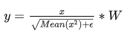
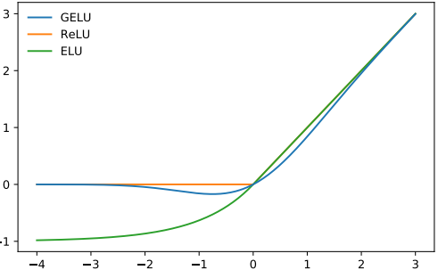
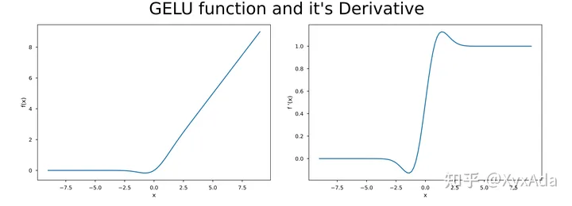
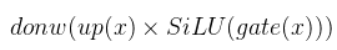

# 模型相关数据

## 分词

我们使用与Llama 1相同的分词器；它采用了一个字节对编码（bytepair encoding，BPE）算法（Sennrich等，2016），使用来自SentencePiece（Kudo和Richardson，2018）的实现。与Llama 1一样，我们将所有数字（number）拆分为单个数字（digit），并使用字节来分解未知的UTF-8字符。总词汇量为32k个Token。

## 超参数

我们使用AdamW优化器（Loshchilov和Hutter，2017）进行训练，其中β1 = 0.9，β2 = 0.95，eps = 10e−5。我们使用余弦学习率计划（cosine learning rate schedule），2000步warmup，并将最终学习率衰减到峰值学习率的10％。我们使用0.1的权重衰减（weight decay）和1.0的梯度裁剪（gradient clipping）。图3显示了使用这些超参数的Llama 2的训练损失。

学习率：70B和34B是 1.5e-5,  7B和13B是3e-5

## 硬件和时间

论文中没准确说明，只是说70B模型训练GPU Hours是1720320 ，显卡是A100s

推测：1720320  / 24小时 / 2000张GPU = 35天

## 训练数据

比LLama1多40%。7B,13B,70B都是用了2T的Token。上下文4K。

## 模型架构

使用RMSNorm进行预归一化（Zhang和Sennrich，2019）

使用SwiGLU激活函数（Shazeer，2020）

旋转位置嵌入（rotary positional embeddings，RoPE，Su等，2022）

增加的上下文长度扩展到4K

grouped-query attention（GQA）

## SFT

* 人工标注的27540个问答对。

- 余弦学习率，初始学习率为 2×10-5，权重衰减为 0.1，批量大小为 64，序列长度为 4096 个标记。
- 对于微调过程，每个样本由一个提示（prompt）和一个答案（answer）组成。为了确保模型的序列长度得到正确填充，将训练集中的所有提示和答案连接在一起。使用一个特殊的 token 将提示和答案分隔开。
- 采用自回归目标（autoregressive objective）并将用户提示中的标记损失设为零，因此我们只在答案标记上进行反向传播。最后，我们对模型进行2个 epoch 的微调。

## RLHF

### RLHF模型训练

收集了140万二元比较数据。

* 偏好程度：明显更好、更好、稍好、不确定。二元排序标签只有（选择，拒绝），我们的偏好被分成四个等级，因此可以更好训练奖励模型。
* 安全性标签：1)首选回复安全，而另一个回复不安全；2)两个回复都安全；3)两个回复都不安全

单独训练了两个模型（后面说为什么）：

* Helpfulness RM最终在所有Meta Helpfulness数据上进行训练，与从Meta Safety和开源数据集中均匀采样的剩余数据相结合。
* Safety RM在所有Meta Safety和Anthropic Harmless数据上进行训练，与Meta Helpfulness和开源Helpfulness数据以90/10的比例混合。

训练细节：

* 训练一个 epoch
* 使用和基础模型相同的训练超参数
* 70b模型使用5e-6的学习率，其他的使用1e-5学习率
* 3% 的 warmup
* 每个 batch 有 512 pairs 数据

### RLHF迭代微调

尝试了两种 RLHF 微调算法:

* PPO:

* 拒绝采样：通过从模型中采样K个输出并选择最佳候选者，使用奖励进行重新排序，进一步使用选定的输出进行梯度更新。这种方法将获得最高奖励分数的样本视为新的标准，然后在这个新的排名样本集上进行模型的微调，加强奖励。

对于所有的模型，我们使用AdamW优化器，其中 �1=0.9,�2=0.95,���=10−5 ，我们使用0.1的权重衰减，1.0的梯度剪裁，以及 10−6 的恒定学习率。对于每个PPO迭代，我们使用512的批量大小，0.2的PPO剪裁阈值，64的小批量大小，并在每个小批量中进行一次梯度步骤。对于7B和13B模型，我们设置β = 0.01（KL惩罚），对于34B和70B模型，我们设置β = 0.005。我们对所有模型进行200到400次迭代的训练，并使用保留的提示进行早停。每次70B模型的PPO迭代平均需要约330秒。为了使用大批量快速训练，我们使用FSDP。这在使用 �(1) 的前向或后向传递时非常有效，但在生成过程中会导致大幅度的减速（约20倍），即使使用大批量大小和KV缓存也是如此。我们通过在生成之前将模型权重合并到每个节点上，然后在生成后释放内存，恢复其余的训练循环来缓解这个问题。

## GAtt

解决多轮对话遗忘的问题，我们提出Ghost Attention：

- 假设我们可以访问两个人之间的多轮对话数据集（例如，用户和助手之间的对话），其中包含一系列消息 [u1, a1, ..., un, an]，其中 un 和 an 分别对应第 n 轮对话的用户和助手消息。然后，我们定义一个指令（inst），在整个对话过程中应该被遵守。例如，指令可以是"扮演"某个角色。然后，我们将这个指令合成地连接到对话中所有的用户消息上
- 接下来，我们可以使用最新的RLHF模型从这个合成数据中进行采样。现在我们有了一个上下文对话和用于微调模型的样本，这个过程类似于拒绝抽样。然而，我们并不是在所有上下文对话回合中都加入指令，而是只在**第一个回合中加入**，这样会导致一个训练时的问题，即系统消息（即最后一轮之前的所有中间助手消息）与我们的样本不匹配。为了解决这个问题，以免影响训练，我们简单地将之前回合中的所有标记的损失设置为0，包括助手消息
- 对于训练指令，我们创建了一些合成的限制供采样，例如兴趣爱好（"您喜欢（），例如网球"），语言（"说()，例如法语"），或者公众人物（"扮演()，例如拿破仑"）。为了获得兴趣爱好和公众人物的列表，我们让Llama 2-Chat来生成，避免了指令与模型知识不匹配的问题（例如，让模型扮演它在训练中没有遇到过的角色）。为了使指令更加复杂和多样化，我们通过随机组合上述限制来构造最终的指令。在构造用于训练数据的最终系统消息时，我们还会将一半的原始指令修改为更简洁的形式，例如"Always act as Napoleon from now"会变为"Figure: Napoleon"。这些步骤生成了一个 SFT 数据集，用于微调Llama 2-Chat。

# 模型架构详解

decoder-only结构


模型特点：

* RMSNorm - 传统结构 Norm 放在 Att 后，这里将 Norm 前置
* RoPE 编码 - 更换了 Position Embedding 的编码方式
* MLP 层更新 - 增加了 UP 和 Donw 的线性层并使用 SiLU 激活 
* LLaMA-1 相比，其增加了一倍 Context Length 达到 4096


## RMSNorm

这是在BERT、GPT等模型中广泛使用的LayerNorm：


[RMSNorm](https://link.zhihu.com/?target=https%3A//arxiv.org/pdf/1910.07467.pdf)(root mean square)发现LayerNorm的中心偏移没什么用(减去均值等操作)。将其去掉之后，效果几乎不变，但是速度提升了40%。最终公式为：



注意除了没有减均值，加偏置以外，分母上求的RMS而不是方差。

LLaMA在 Attention Layer和MLP的输入上使用了RMSNorm，相比在输出上使用，训练会更加稳定。

## RoPE

https://blog.csdn.net/weixin_44826203/article/details/129255185

## SwiGLU

### Swish函数


Swish函数可以看做是介于线性函数与ReLU函数之间的平滑函数，其中贝塔是常数或者可训练参数。


### GELU激活函数

GELU（高斯误差线性单元）是一个非初等函数形式的激活函数，是ReLU的变种。由16年论文 [Gaussian Error Linear Units (GELUs)](https://link.zhihu.com/?target=https%3A//arxiv.org/abs/1606.08415) 提出，随后被GPT-2、BERT、RoBERTa、ALBERT 等NLP模型所采用。论文中不仅提出了GELU的精确形式，还给出了两个初等函数的近似形式。函数曲线如下：



ReLU及其变种与Dropout从两个独立的方面来决定网络的输出，有没有什么比较中庸的方法把两者合二为一呢？在网络正则化方面，Dropout将神经单元输出随机置0（乘0），Zoneout将RNN的单元随机跳过（乘1）。两者均是将输出乘上了服从伯努利分布的随机变量m ~ Bernoulli(p)，其中p是指定的确定的参数，表示取1的概率。

然而激活函数由于在训练和测试时使用方式完全相同，所以是需要有确定性的输出，不能直接对输入x乘随机变量m，这点与Dropout不同（Dropout在测试时并不随机置0）。由于概率分布的数学期望是确定值，因此可以改为求输出的期望：E[mx]=xE[m]，即对输入乘上伯努利分布的期望值p=E[m]。

论文中希望p能够随着输入x的不同而不同，在x较小时以较大概率将其置0。 由于神经元的输入通常服从正态分布，尤其是在加入了Batch Normalization的网络中，**因此令p等于正态分布的累积分布函数即可满足**

正态分布的累积分布函数曲线与sigmoid曲线相似。

GELU公式如下：其中erf是高斯误差函数，具体公式就不详细说了。

$$g(x) = xp = x \Phi (x) = x \frac{1}{2} ( 1 + erf(\frac{x}{\sqrt{2}}) )$$

erf(x) 与 tanh(x) 比较接近，在代码实现中可以用近似函数来拟合erf(x)。论文给出的两个近似如下：


$\sigma $代表sigmoid激活函数。不过很多框架已经有精确的erf计算函数了，可以直接使用，参考代码如下：

```python
# BERT、GPT-2 的旧式 GELU 实现
def gelu(x):
    return x * 0.5 * (1 + tf.tanh(np.sqrt(2/np.pi)*(x+0.044715*tf.pow(x,3))))
# 使用erf函数的 GELU 实现
def gelu(x):
    cdf = 0.5 * (1.0 + tf.erf(x / tf.sqrt(2.0)))
    return x * cdf
```




可以看出，当x越大的时候，就越有可能被保留，x越小就越有可能被归置为0.

**GELU vs Swish**

GELU 与 Swish 激活函数（x · σ(βx)）的函数形式和性质非常相像，一个是固定系数 1.702，另一个是可变系数 β（可以是可训练的参数，也可以是通过搜索来确定的常数），两者的实际应用表现也相差不大。

### GLU（Gated Linear Unit)


圆圈代表哈达玛积 / 点乘 / 按位乘

在公式中，首先通过中间向量g(x)=xW进行门控操作，使用Sigmoid函数σ将其映射到0到1之间的范围，表示每个元素被保留的概率。然后，将输入向量x与门控后的向量进行逐元素相乘（即 ⊗ 操作），得到最终的输出向量。

GLU通过门控机制对输出进行把控，像Attention一样可看作是对重要特征的选择。其优势是不仅具有通用激活函数的非线性，而且**反向传播梯度时具有线性通道**，类似ResNet残差网络中的加和操作传递梯度，能够缓解梯度消失问题。

### GEGLU

是GLU的激活函数变体

将GLU中的sigmoid替换为GELU，函数形式如下（忽略bias项的书写）：


GLU包含W和V两个可学习的参数

GEGLU也包含W和V两个可学习的参数，用GELU替换SIGMOD

### SwiGLU


在FFN中，即FC->激活函数->FC中，ReLU一般定义如下：


在T5论文中没有使用偏置项，也就是：


在PaLM论文中使用了SwiGLU激活函数：


### SiLU

当beta=1是，swish函数就是xsigmoid(x)，SiLU函数就是Swish(xW) \dot V

## MLP


这里 MLP 的表达式为：



其中 up、down 与 gate 是三个维度相同的 Linear 层。


## GQA（v2 only）

参考：https://mp.weixin.qq.com/s/wOyDpxcxKATxGrP8W-1w2Q

### KV Cache

Decoder  每次前向，当前 timestep 计算 Attention 要用到的部分，如之前 timestep 的 KV （Key 和 Value）值都计算过的，只是之前每次前向完后给计算结果都丢掉，只保留最后输出。

于是一个很自然的想法就是 **Cache**。这很像斐波那契递归函数，naive 版本，也会出现不断重复计算问题，加个 cache 瞬间提速。

每次前向完，给 **KV 都保留下来，用于之后计算**。

瓶颈：SRAM内存昂贵且有限；而GPU显存DRAM有**内存墙**问题，即内存读取速度限制了整体速度。

### MQA 和 GQA

**MHA(Multi-Head Attention)**，QKV 三部分有相同数量的头，且一一对应。

**MQA(Multi-Query Attention)** 则是让 **Q 仍然保持原来的头数**，但 **K 和 V 只有一个头**，相当于所有的 Q 头共享一组 K 和 V 头，所以叫做 Multi-Query 了。实现改变了会不会影响效果呢？确实会影响但相对它能带来的收益，性能的些微降低是可以接受的。能带来多大的收益呢，实验发现一般能**提高 30%-40% 的吞吐**。收益主要就是由降低了 KV cache 带来的，实际上 MQA 运算量和 MHA 是差不多的。

**GQA(Group-Query Attention)** 是 MHA 和 MQA 的折衷方案，既不想损失性能太多，又想获得 MQA 带来的推理加速好处。具体思想是，不是所有 Q 头共享一组 KV，而是**分组一定头数 Q 共享一组 KV**，比如上面图片就是两组 Q 共享一组 KV。

