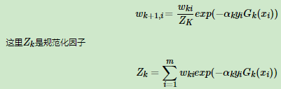
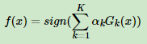
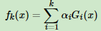
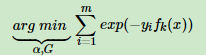
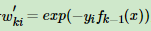
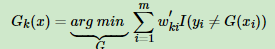
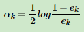
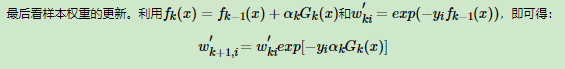
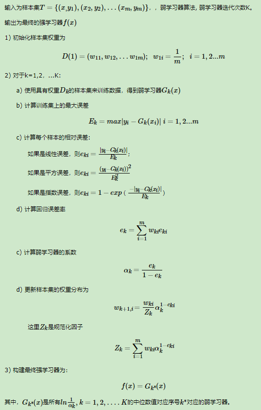

Adaboost

并联学习几个需要解决的问题：

1. 如何计算误差率
2. 如何计算学习器权重
3. 如何计算样本权重


# 1. 基本思路 （分类器，回归先不讨论）

先初始样本权重。

对于二元分类，第k个弱学习器(Gk)的加权误差为：


第k个弱学习器的权重为：


则样本权重更新：



最终强学习器为：



这些都可以通过损失函数推导出


# 2. 分类器损失函数优化

弱学习器为Gk，则第k轮强学习器为：




定义损失损失函数为指数函数：




令，上轮和这轮无关，损失函数转化为：


因为Gk是：



将Gk带入损失函数，并对alpha求导，使其等于0，得到：



其中ek是分类误差率：


样本权重：




# 3. 二分类算法流程


多分类弱学习器的系数：


其中R是类别。


# 4. 回归算法




# 5. 正则化


其中0<v<=1，是正则化项，v越小就需要更多的弱学习器。


# 6. 优缺点

优点：

1. 分类精度高
2. 可以回归，可以分类
3. 不容易过拟合

缺点：

1. 对异常样本敏感，异常样本在迭代中可能会获得较高的权重，影响最终的强学习器的预测准确性。


# 代码

库：ensemble

方法：AdaBoostClassifier和AdaBoostRegressor

框架参数：

1. base_estimator: 默认使用CART，即DecisionTreeClassifier和DecisionTreeRegressor
2. loss：针对回归方法，有线性"linear"，平方"square"，指数"exponential"，默认是线性
3. n_estimators：学习器个数
4. learning_rate：即正则化参数v，默认是1，一般和n_estimators一起调参。

学习器参数：

1. max_features：划分时考虑的最大特征数，默认"None"，考虑所有。
2. max_depth：最大深度，默认不限制
3. min_samples_split：划分节点最小样本数，默认2
4. min_samples_leaf：叶子节点最少样本数，默认1
5. min_weight_fraction_leaf：叶子节点最小的样本权重和，默认不考虑
6. max_leaf_nodes：最大叶子节点数


二分类

代码：

```
import numpy as np
import matplotlib.pyplot as plt
from sklearn.ensemble import AdaBoostClassifier
from sklearn.tree import DecisionTreeClassifier
from sklearn.datasets import make_gaussian_quantiles

# data
X1, y1 = make_gaussian_quantiles(cov=2, n_samples=500, n_features=2, n_classes=2, random_state=1)
X2, y2 = make_gaussian_quantiles(mean=(3, 3), cov=1.5, n_samples=400, n_features=2, n_classes=2, random_state=1)
X = np.concatenate((X1, X2))
y = np.concatenate((y1, -y2 + 1))
plt.scatter(X[:, 0], X[:, 1], marker='o', c=y)
plt.show()

# model
clf = AdaBoostClassifier(DecisionTreeClassifier(max_depth=2, min_samples_split=20, min_samples_leaf=5),
                        n_estimators=200, learning_rate=0.8)
clf.fit(X, y)

# 可视化
x_min, x_max = X[:, 0].min() - 1, X[:, 0].max() + 1
y_min, y_max = X[:, 1].min() - 1, X[:, 1].max() + 1
xx, yy = np.meshgrid(np.arange(x_min, x_max, 0.02), np.arange(y_min, y_max, 0.02))
Z = clf.predict(np.c_[xx.ravel(), yy.ravel()])
Z = Z.reshape(xx.shape)
cs = plt.contourf(xx, yy, Z, cmap=plt.cm.Paired)
plt.scatter(X[:, 0], X[:, 1], marker='o', c=y)
plt.show()
print(clf.score(X, y))
```

