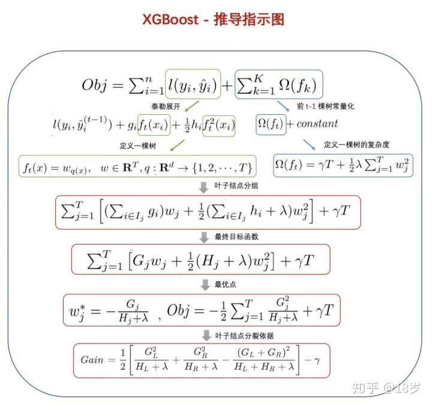
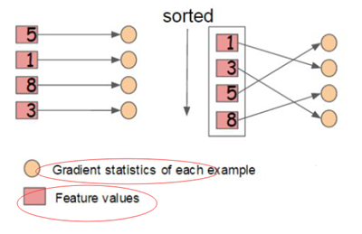
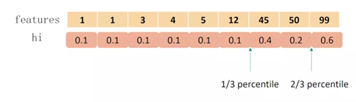

参考：

1. 刘建平
2.  https://zhuanlan.zhihu.com/p/92837676 
3.  https://www.cnblogs.com/gczr/p/10412609.html 
4.  https://blog.csdn.net/dpengwang/article/details/87910480 


---

作者陈天奇


# 1. 从GBDT到XGBoost

xgboost是一个上限特别高的算法，主要改进为：

1. 算法本身的优化。GBDT只支持决策树，XGBoost支持更多。损失函数加入了正则化。损失函数为二阶泰勒展开。CART节点划分标准不一样。
2. 算法运行效率的优化。对每个弱学习器，比如决策树建立的过程做并行选择，找到合适的子树分裂特征和特征值。在并行选择之前，先对所有的特征的值进行排序分组，方便前面说的并行选择。对分组的特征，选择合适的分组大小，使用CPU缓存进行读取加速。将各个分组保存到多个硬盘以提高IO速度。
3. 算法健壮性的优化。对于缺失值的特征，通过枚举所有缺失值在当前节点是进入左子树还是右子树来决定缺失值的处理方式。算法本身加入了L1和L2正则化项，可以防止过拟合，泛化能力更强。


# 2. XGBoost



### 推导过程：

1. 目标函数（广义加法模型）
2. 第t轮损失，二阶泰勒展开
3. 化简：去掉常数项，从样本误差累积->叶子节点误差累积
4. 目标函数最优点（一元二次方程，导数=0），极值
5. 叶子节点分裂

### 防止过拟合

除了使用正则化项，还使用了权重收缩和列采样技术。

权重收缩：每个树乘上$\eta$ , 类似于梯度下降的学习率

列采样：和随机森林相同，每次分裂时只考虑一部分随机选择的特征。

子采样：使用部分样本

### 寻找最佳分裂节点

贪心方法：

- 遍历每个结点的每个特征；
- 对每个特征，按特征值大小将特征值排序；
- 线性扫描，找出每个特征的最佳分裂特征值；
- 在所有特征中找出最好的分裂点（分裂后增益最大的特征及特征值）

XGBoost方案：

* **特征预排序+缓存：**XGBoost在训练之前，预先对每个特征按照特征值大小进行排序，然后保存为block结构，后面的迭代中会重复地使用这个结构，使计算量大大减小。
* **分位点近似法：**对每个特征按照特征值排序后，采用类似分位点选取的方式，仅仅选出常数个特征值作为该特征的候选分割点，在寻找该特征的最佳分割点时，从候选分割点中选出最优的一个。
* **并行查找：**由于各个特性已预先存储为block结构，XGBoost支持利用多个线程并行地计算每个特征的最佳分割点，这不仅大大提升了结点的分裂速度，也极利于大规模训练集的适应性扩展。

**1. 特征预排序，存储样本索引：**

* 每一个块结构包括一个或多个已经排序好的特征；
* 缺失特征值将不进行排序；
* 每个特征会存储指向样本梯度统计值的索引，方便计算一阶导和二阶导数值；



**2. 加权分位数算法：weighted quantile sketch**

损失函数经过变换，每个样本的权重正好是二阶偏导hi。



计算特征k小于特征值的样本的比例：

rk(1)=0

rk(3)=(0.1+0.1)/(1.8)=1/9

rk(4)=(0.1+0.1+0.1)/(1.8)=1/6

rk(5)=0.4/1.8=2/9

rk(12)=0.5/1.8=5/18

rk(45)=0.6/1.8=1/3

rk(50)=1.0/1.8=5/9

rk(99)=1.2/1.8=2/3

如果取三分位点，那么候选分裂点就是1/3, 2/3对应的特征值45, 99。对45,99计算分裂增益，减少了计算量。

对于小数据，可以按照上面计算。对于大数据，一次不能访问所有数据，文中解决方案是weighted quantile sketch，证明比较复杂。请看链接https://blog.csdn.net/ningyanggege/article/details/90437470

**3. 缓存访问优化**

块结构的设计可以减少节点分裂时的计算量，但特征值通过索引访问样本梯度统计值的设计会导致访问操作的内存空间不连续，这样会造成缓存命中率低，从而影响到算法的效率。

为了解决缓存命中率低的问题，XGBoost 提出了缓存访问优化算法：为每个线程分配一个连续的缓存区，将需要的梯度信息存放在缓冲区中，这样就是实现了非连续空间到连续空间的转换，提高了算法效率。 

此外适当调整块大小，也可以有助于缓存优化 。

**4.  核外 块计算**

当数据量过大时无法将数据全部加载到内存中，只能先将无法加载到内存中的数据暂存到硬盘中，直到需要时再进行加载计算，而这种操作必然涉及到因内存与硬盘速度不同而造成的资源浪费和性能瓶颈。为了解决这个问题，XGBoost 独立一个线程专门用于从硬盘读入数据，以实现处理数据和读入数据同时进行。

此外，XGBoost 还用了两种方法来降低硬盘读写的开销：

- **块压缩：**对 Block 进行按列压缩，并在读取时进行解压；
- **块拆分：**将每个块存储到不同的磁盘中，从多个磁盘读取可以增加吞吐量。


**5. 缺点**

1. 虽然利用预排序和近似算法可以降低寻找最佳分裂点的计算量，但在节点分裂过程中仍需要遍历数据集；
2. 预排序过程的空间复杂度过高，不仅需要存储特征值，还需要存储特征对应样本的梯度统计值的索引，相当于消耗了两倍的内存。


### 缺失值&稀疏数据处理

1. 为了保证完备性，将不完整样本分配到左右子树，选择最大增益方向。
2. 也可以手动指定方向，加快算法训练。
3. 若训练数据无缺失，预测数据有缺失，自动划分到右子树。


### 停止生长

1. 当Gain<0时，损失不再减小，停止
2. 达到最大深度
3. 叶子节点的样本权重w_j


# 代码

库："pip install xgboost"

xgboost有两种接口风格，一个是原生，一个是sklearn风格。有两个类，一个是"XGBClassifier"，一个是“XGBRegressor”

sklearn风格的参数又分原生，和sklearn风格参数。这里建议使用sklearn风格参数。

* from xgboost.sklearn import XGBClassifier


参数：

XGBoost框架参数：

1. booster：学习器，默认"gbtree"，也就是CART。还可以线性学习器"gblinear"
2. n_estimators：学习器个数
3. n_jobs：线程数，默认1

学习目标参数

1. objective：需要被最小化的损失函数
   * "reg:linear"：默认，线性回归
   * "reg:logistic"：逻辑回归
   * “reg:squarederror"，回归平方差，建议使用
   * "binary:logistic"，二分类的逻辑回归，返回预测的概率
   * "multi:softmax"，使用softmax的多分类器，返回预测的类别，需要设置参数num_class
   * "multi:softprob"，和上面一样，但是返回概率
2. seed：随机数种子

学习器参数，主要是决策树参数：

1. learning_rate：默认0.1，控制每个弱学习器的权重缩减系数。通常和n_estimator一起调。学习率小就需要更多学习器。典型值[0.01-0.2]
2. max_depth：树的深度，需要网格搜索。默认3，典型[3-10]
4. min_child_weight：最小的子节点权重阈值。这里权重使用的是该节点样本的二阶导数和，类似min_samples_split。
5. gamma：决策树分裂所带来的损失减小阈值，需要大于该阈值才能分裂。
6. subsample：子采样，不放回抽样。取(0,1]
7. reg_alpha/reg_lambda：正则化系数，alpha正则化叶子数，labmbda正则化叶子值
8. colsample_bytree/colsample_bylevel/colsample_bynode：这三个参数都是用于特征采样，默认使用所有特征。colsample_bytree控制整棵树的特征采样比例。colsample_bylevel控制某一层特征采样比例。col_sample_bynode控制某个节点的特征采样比例。例如，一共64个特征，如果三个参数都为0.5，则最终才随机采样8个特征。
9. scale_pos_weight: 默认1，处理样本不平衡问题，在样本高度不平衡时，将参数设置大于0，可以加快算法收敛。
10. max_delta_step：每棵树的最大权重估计，默认0，没有约束。处理不平衡的逻辑回归。典型值[1-10]

其他参数：

1. random_state：默认0

2. missing：默认None，是np.nan。在数据中，标注为缺失值的表示


调参指南：

1. n_estimators and learning_rate，默认100 and 0.1，调参范围[100-500] and [0.1-0.3]
2. max_depth and min_child_weight，默认3、1，调参范围[3-8] and [1-8]
3. gamma，默认0，调参范围[0, 0.01, 0.02, 0.03]
4. subsample and colsample_bytree，默认1，设为0.8, 0.8, 可调[0.6, 0.7, 0.8, 0.9]
5. reg_alpha/reg_lambda，默认0/1，调参范围[0, 0.01, 0.02, 0.03, 0.04, 0.05]
6. 降低learning_rate，增加n_estimators

分类代码

```python
import pandas as pd
import numpy as np
import matplotlib.pyplot as plt
from xgboost.sklearn import XGBClassifier
from sklearn.model_selection import GridSearchCV
from sklearn.model_selection import train_test_split
from sklearn.datasets.samples_generator import make_classification


# data
# X为样本特征，y为样本类别输出， 共10000个样本，每个样本20个特征，输出有2个类别，没有冗余特征，每个类别一个簇
X, y = make_classification(n_samples=10000, n_features=20, n_redundant=0, n_clusters_per_class=1, n_classes=2, flip_y=0.1)
X_train, X_test, y_train, y_test = train_test_split(X, y, random_state=1)

# # model
model = XGBClassifier(max_depth=5, learning_rate=0.5, verbosity=1, objective='binary:logistic', random_state=1)

# # cv
# grid = GridSearchCV(model, {
#     'max_depth': [4, 5, 6],
#     'n_estimators': [5, 10, 20],
#     },
#     cv=5)
# grid.fit(X_train, y_train)
# print(grid.best_score_)
# print(grid.best_params_)

# model
model = XGBClassifier(max_depth=4, learning_rate=0.3, verbosity=1, objective='binary:logistic', n_estimators=10, random_state=1)
model.fit(X_train, y_train, early_stopping_rounds=10, eval_metric="error", eval_set=[(X_test, y_test)])
```


