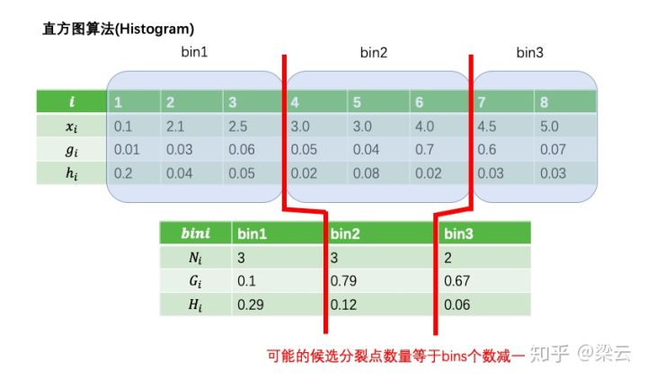
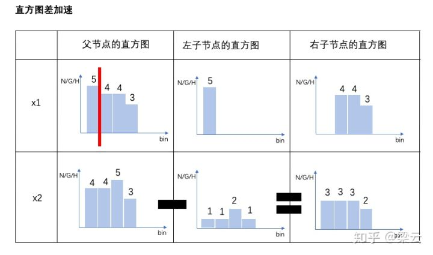
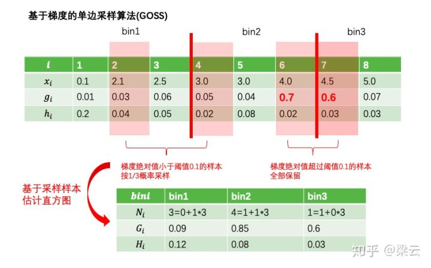
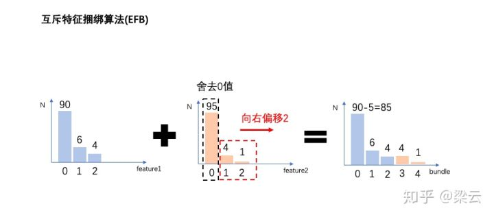

参考：

1.  https://zhuanlan.zhihu.com/p/91167170 
2.  https://zhuanlan.zhihu.com/p/87885678 

---


2017年微软推出

和XGBoost相比：

* 模型精度相当
* 训练速度更快
* 内存更小
* 缺失自动处理
* XGBoost不支持类别特征，需要One-hot编码预处理。LightGBM直接支持类别特征。

XGBoost复杂度：

* 由于XGBoost采用的基模型是二叉树，因此生成每片叶子需要分裂一次。而每次分裂，需要遍历所有特征上所有候选分裂点位，计算按照这些候选分裂点位分裂后的全部样本的目标函数增益，找到最大的那个增益对应的特征和候选分裂点位，从而生成一片新叶子。 

* 生成一片叶子的复杂度：特征数量 x 候选分裂点数量 x 样本的数量

性能优化原理：

1. Histogram算法：直方图算法：减少候选分裂点数量（离散化）
2. GOSS算法：基于梯度的单边采样算法：减少样本数量（采样）
3. EFB算法：互斥特征捆绑算法：减少特征数量
4. 基于最大深度的 Leaf-wise 的垂直生长算法；
5. 类别特征最优分割；
6. 特征并行和数据并行；
7. 缓存优化。

### 1. Histogram直方图算法

**直方图算法**

直方图算法通过将连续特征值离散化到固定数量(如255个)的bins上，使得候选分为点位为常数个(num_bins -1)。 虽然将特征离散化后无法找到精确的分割点，可能会对模型的精度产生一定的影响，但较粗的分割也起到了正则化的效果，一定程度上降低了模型的方差。 



**直方图差加速**：当节点分裂成两个时，右边叶子节点的直方图等于其父节点的直方图减去左边叶子节点的直方图。从而大大减少构建直方图的计算量。 



**稀疏特征优化**

 XGBoost 在进行预排序时只考虑非零值进行加速，而 LightGBM 也采用类似策略：只用非零特征构建直方图。 

### 2. GOSS单边梯度采样

其主要思想是通过对样本采样的方法来减少计算目标函数增益时候的复杂度。

但如果对全部样本进行随机采样，势必会对目标函数增益的计算精度造成较大的影响。

GOSS算法的创新之处在于它只对梯度绝对值较小的样本按照一定比例进行采样，而保留了梯度绝对值较大的样本。

这就是所谓的单边采样。由于目标函数增益主要来自于梯度绝对值较大的样本，因此这种方法在计算性能和计算精度之间取得了很好的平衡。



### 3. EFB互斥特征捆绑算法

EFB算法可以有效减少用于构建直方图的特征数量，从而降低计算复杂度，尤其是特征中包含大量稀疏特征的时候。

在许多应用场景下，数据集中会有大量的稀疏特征，这些稀疏特征大部分样本都取值为0，只有少数样本取值非0。

通常可以认为这些稀疏特征是互斥的，即它们几乎不会同时取非零值。

利用这种特性，可以通过对某些特征的取值重新编码，将多个这样互斥的特征捆绑成为一个新的特征。

有趣的是，对于类别特征，如果转换成onehot编码，则这些onehot编码后的多个特征相互之间是互斥的，从而可以被捆绑成为一个特征。

因此，对于指定为类别特征的特征，LightGBM可以直接将每个类别取值和一个bin关联，从而自动地处理它们，而无需预处理成onehot编码多此一举。



1. 哪些特征可以一起捆绑？
2. 捆绑后，特征值如何确定？

问题1：

EFB 算法利用特征和特征间的关系构造一个加权无向图，并将其转换为图着色算法。我们知道图着色是个 NP-Hard 问题，故采用贪婪算法得到近似解，具体步骤如下：

1. 构造一个加权无向图，顶点是特征，边是两个特征间互斥程度；
2. 根据节点的度进行降序排序，度越大，与其他特征的冲突越大；
3. 遍历每个特征，将它分配给现有特征包，或者新建一个特征包，总体冲突最小。

算法允许两两特征并不完全互斥来增加特征捆绑的数量，通过设置最大互斥率来平衡算法的精度和效率。 

问题2：

假设 Bundle 中有两个特征值，A 取值为 [0, 10]、B 取值为 [0, 20]，为了保证特征 A、B 的互斥性，我们可以给特征 B 添加一个偏移量转换为 [10, 30]，Bundle 后的特征其取值为 [0, 30]，这样便实现了特征合并。 

### 4. 带深度限制的Leaf-wise算法

在建树的过程中有两种策略：

- Level-wise：基于层进行生长，直到达到停止条件；
- Leaf-wise：每次分裂增益最大的叶子节点，直到达到停止条件。

XGBoost 采用 Level-wise 的增长策略，方便并行计算每一层的分裂节点，提高了训练速度，但同时也因为节点增益过小增加了很多不必要的分裂，降低了计算量；LightGBM 采用 Leaf-wise 的增长策略减少了计算量，配合最大深度的限制防止过拟合，由于每次都需要计算增益最大的节点，所以无法并行分裂。


### 5. 类别特征最优分割

大部分的机器学习算法都不能直接支持类别特征，一般都会对类别特征进行编码，然后再输入到模型中。常见的处理类别特征的方法为 one-hot 编码，但我们知道对于决策树来说并不推荐使用 one-hot 编码：

1.  会产生样本切分不平衡问题，切分增益会非常小。 
2.  影响决策树学习 。

LightGBM 原生支持类别特征，采用 many-vs-many 的切分方式将类别特征分为两个子集，实现类别特征的最优切分。 


### 代码

库：pip install lightgbm

from lightgbm import LGBMClassifier

核心参数：

* boosting：默认gbdt
* objective：回归regression，二分类binary，多分类multiclass
* metric:
    * 分类：mae, mse
    * 回归：binary_logloss, multi_logloss

IO参数：

* categorical_features=[0,1,2]：这3列是类别型变量
* min_bin：连续变离散，离散范围

学习参数：

* n_estimators
* learning_rate
* max_depth
* num_leaves
* min_data_in_leaf
* colsample_bytree
* subsample
* lambda_l1：正则化
* lambda_l2
* min_split_gain： 描述分裂的最小gain

代码：

```python
import pandas as pd
import lightgbm as lgb
from sklearn.datasets import load_breast_cancer
from sklearn.model_selection import train_test_split
from sklearn.model_selection import GridSearchCV
from sklearn import metrics


cancer = load_breast_cancer()
x = cancer.data
y = cancer.target
x_train, x_test, y_train, y_test = train_test_split(x, y, test_size=0.2, random_state=10)
data_train = lgb.Dataset(x_train, y_train)


model = lgb.LGBMClassifier(objective='binary', metric='auc',
                           learning_rate=0.01, 
                           n_estimators=1000, 
                           max_depth=4,
                           num_leaves=5,
                           min_data_in_leaf=31,
                           min_bin=30,
                           subsample=0.6,
                           colsample_bytree=0.7,
                           lambda_l1=1e-5,
                           lambda_l2=1e-5,
                           min_split_gain=0
                          )
params = {
#     'n_estimators': range(100, 200, 20),
#     'learning_rate': [0.1]
    
#     'max_depth': range(3, 8, 1),
#     'num_leaves': range(5, 100, 5),
    
#     'min_data_in_leaf': range(1, 50, 10),
#     'min_bin': range(30, 200, 20),
    
#     'subsample': [0.6, 0.7, 0.8, 0.9, 1.0],
#     'colsample_bytree': [0.6, 0.7, 0.8, 0.9, 1.0],
    
#     'lambda_l1': [1e-5,1e-3,1e-1,0.0,0.1,0.3,0.5,0.7,0.9,1.0],
#     'lambda_l2': [1e-5,1e-3,1e-1,0.0,0.1,0.3,0.5,0.7,0.9,1.0],
    
#     'min_split_gain': [0.0,0.1,0.2,0.3,0.4,0.5,0.6,0.7,0.8,0.9,1.0]
}
# grid = GridSearchCV(estimator=model, param_grid=params, scoring='roc_auc', cv=5, n_jobs=-1)
# grid.fit(x_train, y_train)
# print(grid.best_params_, grid.best_score_)

model.fit(x_train, y_train)
y_pre = model.predict(x_test)
print(metrics.roc_auc_score(y_test, y_pre))
```

