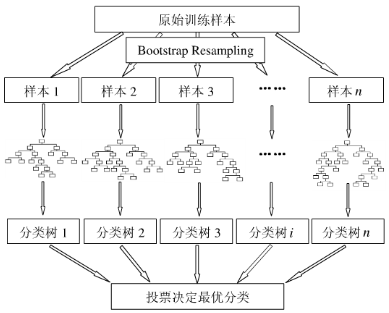
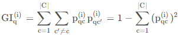
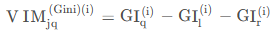
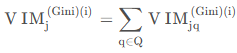
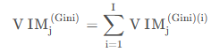
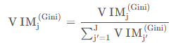
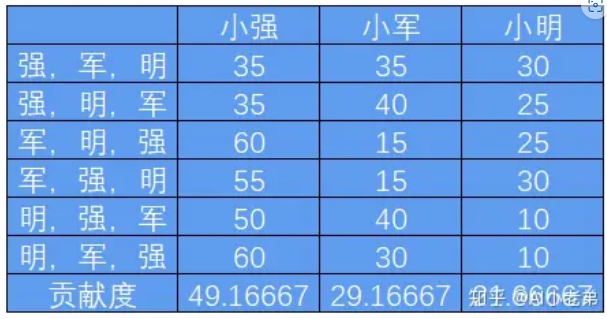

# 随机森林

随机森林的算法可以用如下几个步骤概括：

1、用有抽样放回的方法（bootstrap）从样本集中选取n个样本作为一个训练集
2、用抽样得到的样本集生成一棵决策树。在生成的每一个结点：

* 随机不重复地选择d个特征
* 利用这d个特征分别对样本集进行划分，找到最佳的划分特征（可用基尼系数、增益率或者信息增益判别）

3、重复步骤1到步骤2共k次，k即为随机森林中决策树的个数。

4、用训练得到的随机森林对测试样本进行预测，并用票选法决定预测的结果。

下图比较直观地展示了随机森林算法：



# 特征重要性


## 基尼重要性

scikit-learn内置了feature_importances_参数，可以直接从模型得出。

我们将变量重要性评分（variable importance measures）用VIM来表示，将Gini指数用GI来表示，X是训练数据，J是特征数量，I棵树，C个类别：

第i棵树节点q的Gini系数的计算公式：



q是当前节点，l和r表示划分后的节点，特征j的变化量为：



假如特征j在决策树i中一共出现的节点的结合为Q，那么特征j在树i的重要性为：



所有树上的重要性为:



最后，把所有求得的重要性评分做一个归一化处理即可。



## 置换重要性

基于“置换检验”的思想对特征重要性进行检测，计算步骤：

1、用上全部特征，训练一个模型。
2、验证集预测得到得分。
3、验证集的一个特征列的值进行随机打乱，预测得到得分。
4、将上述得分做差即可得到特征x1对预测的影响。
5、依次将每一列特征按上述方法做，得到每个特征对预测的影响。

代码

```
from sklearn.linear_model import LogisticRegression
from sklearn.inspection import permutation_importance
X = [[1, 9, 9],[1, 9, 9],[1, 9, 9],
     [0, 9, 9],[0, 9, 9],[0, 9, 9]]
y = [1, 1, 1, 0, 0, 0]
clf = LogisticRegression().fit(X, y)
result = permutation_importance(clf, X, y, n_repeats=10,
                                random_state=0)
result.importances_mean
result.importances_std
```

## SHAP值

可以使用[SHAP](https://github.com/slundberg/shap)解释(与模型无关)来计算随机森林中的特征重要性。 它使用博弈论中的Shapley值来估计每个特征如何对预测做出贡献。

从博弈论的角度，把数据集中的每一个特征变量当成一个玩家，用该数据集去训练模型得到预测的结果，可以看成众多玩家合作完成一个项目的收益。Shapley value通过考虑各个玩家做出的贡献，来公平的分配合作的收益。

SHAP构建一个加性的解释模型，所有的特征都视为“贡献者”。对于每个预测样本，模型都产生一个预测值，SHAP value就是该样本中每个特征所分配到的数值。基本思想：计算一个特征加入到模型时的边际贡献，然后考虑到该特征在所有的特征序列的情况下不同的边际贡献，取均值，即某该特征的SHAPbaseline value，包括Kernel Shap，Deep Shap和Tree Shap。这也是目前可解释机器学习在风控、金融中最实用的一个方法。

我们定义边际贡献：假定初始组合为小强一个人，贡献35，加入小军后，他们俩的组合贡献为70，则小军的边际贡献就是70-35=35，再加入小明，三个人的组合贡献为100，则小明的边际贡献为100-70=30；

根据组合次序计算全部的组合及组合中每个人的边际贡献，如表格所示，则可以求得每个人的贡献度。

