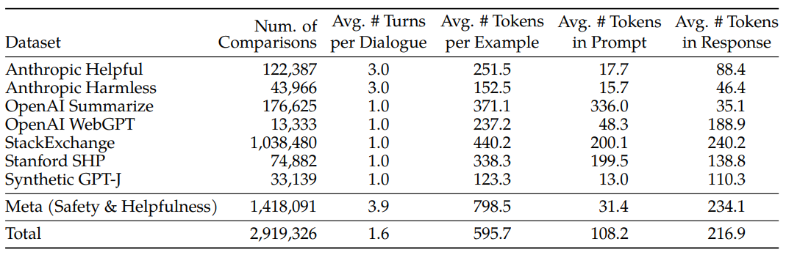

论文：Llama 2: Open Foundation and Fine-Tuned Chat Models

主页: https://ai.meta.com/llama/

时间：20230720

机构：Meta AI

https://www.cnblogs.com/ms27946/p/llama-2-open-foundation-and-fine-tuned-chat-models-zh.html

# 背景

- 尽快 LLM 训练方法很直观：基于自回归的 transformer 模型，在大量预料上做自监督训练，然后通过人类反馈强化学习 (RLHF) 等技术来与人类偏好对齐。但高计算需求限制了 LLM 只能由少数玩家来推动发展
- 现有的开源大模型，例如 BLOOM、Llama1、Falcon，虽然都能基本达到匹配非开源大模型（如 GPT-3、Chinchilla）的能力，但这些模型都不适合成为非开源产品级 LLM （比如 ChatGPT、BARD、Claude）的替代品，因为这些封闭的产品级 LLM 经过大量微调，与人类的偏好保持一致，大大提高了它们的可用性和安全性。这一步在计算和人工标注中需要大量的成本，而且往往不透明或容易重现，限制了社区的进步，以促进AI对齐研究

# 本文方案

- 开发并发布了 Llama 2，包含预训练的大语言模型和微调大语言模型，模型规模有 7b、13b、70b 这三种（还有个没有开源的 34b 版本）

- - 预训练语料增加了 40%
  - context length 从 2048 提升到 4096
  - 70b模型使用了 grouped-query attention （GQA）
  - 提供了微调版本的 LLM，称为 Llama 2-Chat，针对对话用例进行了优化
  - Llama2 在大多数基准测试中都优于开源聊天模型，并且基于有用性和安全性方向进行人工评估
  - 提供了对 Llama 2-Chat 微调和安全改进的方法的详细描述，为开源社区做出贡献

图1：有益性人类评估：Llama 2-Chat与其他开源和闭源模型进行比较的结果。人类评分员对约4k个prompts进行了比较，包括单轮和多轮。此评估的95％置信区间在1％和2％之间。

# 2 Pretraining

模型结构：

* 延续 Llama 中的自回归 transformer 结构
* 增加了 40% 的 token 
* context length 扩展了两倍：4K
* 使用 grouped-query attention (GQA)

表1：LLaMA 2系列模型。Token数仅涉及预训练数据。所有模型都使用全局批量大小为4M的Token进行训练。更大的模型——34B和70B——使用grouped-query attention（GQA）来提高推理可扩展性。

## 2.1 Pretraining Data

我们的训练语料库包括来自公开可用来源的混合新数据，这不包括来自Meta的产品或服务的数据。我们努力移除了一些已知包含大量个人信息的站点的数据。我们训练了2万亿个Token的数据，这实现了一个良好的性能与成本之间的平衡，并通过上采样可信度最高的来源，增加模型的知识并减弱其幻觉（hallucinations）。

我们进行了各种预训练数据检查，以便用户更好地了解我们的模型的潜在能力和限制；相关结果可以在第4.1节中找到。

## 2.2 Training Details

我们采用了大部分来自于Llama 1的预训练设置和模型架构。我们使用标准的Transformer架构（Vaswani等，2017），使用RMSNorm进行预归一化（Zhang和Sennrich，2019），使用SwiGLU激活函数（Shazeer，2020）和旋转位置嵌入（rotary positional embeddings，RoPE，Su等，2022）。与Llama 1相比，主要的架构差异包括增加的上下文长度和grouped-query attention（GQA）。在附录A.2.1中，我们详细介绍了每个差异，并通过消融实验来证明它们的重要性。

**超参数** 我们使用AdamW优化器（Loshchilov和Hutter，2017）进行训练，其中β1 = 0.9，β2 = 0.95，eps = 10e−5。我们使用余弦学习率计划（cosine learning rate schedule），2000步warmup，并将最终学习率衰减到峰值学习率的10％。我们使用0.1的权重衰减（weight decay）和1.0的梯度裁剪（gradient clipping）。图3显示了使用这些超参数的Llama 2的训练损失。

图3：LLaMA 2模型训练损失：我们比较了LLaMA 2系列模型的训练损失。我们观察到，在对2T的Token进行预训练后，模型仍然没有显示出任何饱和的迹象。

**分词器（Tokenizer）** 我们使用与Llama 1相同的分词器；它采用了一个字节对编码（bytepair encoding，BPE）算法（Sennrich等，2016），使用来自SentencePiece（Kudo和Richardson，2018）的实现。与Llama 1一样，我们将所有数字（number）拆分为单个数字（digit），并使用字节来分解未知的UTF-8字符。总词汇量为32k个Token。

### 训练硬件&碳足迹

**训练硬件**

在两个集群上做了实验：Meta's Research Super Cluster (RSC) 和 Meta 内部集群

- - 所有集群都使用 A100
  - RSC 使用 NVIDIA Quantum InfiniBand，内部集群使用 RoCE (RDMA over converged Ethernet)
  - 每GPU功耗上限：RSC 是 400W，内部集群是 350W
  - RoCE(这是一个更实惠的商业互连网络)，几乎可以扩展和昂贵的Infiniband一样高达2000个gpu的规模，这使得预训练更加民主化

ChatGPT 对 RoCE 和 NVIDIA Quantum InfiniBand 进行对比

- - 性能：两种技术都具有低延迟和高带宽的特点，因此它们都适用于要求严苛的HPC和AI工作负载。虽然NVIDIA Quantum InfiniBand专门针对其GPU加速系统进行了优化，但RoCE提供了更通用的以太网上RDMA功能。
  - 网络基础设施：RoCE具有在集成方面的优势，因为它可以在现有的以太网网络中部署，无需专用的InfiniBand硬件。而NVIDIA Quantum InfiniBand则需要专用的InfiniBand交换机和网络基础设施。
  - 厂商特定与标准技术：NVIDIA Quantum InfiniBand是由NVIDIA开发的专有技术，而RoCE是基于标准RDMA和以太网协议的，因此更具厂商无关性，并得到了广泛采用。

**碳足迹**

1720320 / 24小时 / 2000GPU = 35.8，所以大约35天。

表2：预训练期间CO2排放量。时间：训练每个模型所需的总GPU时间。功耗：每个GPU设备的峰值功率容量，经过功耗使用效率的调整。

## 2.3 Pre-Model Evaluation

在本节中，我们报告了Llama 1和Llama 2基础模型、MosaicML预训练Transformer（MPT）模型以及Falcon（Almazrouei等人，2023）模型在标准学术基准测试上的结果。对于所有评估，我们使用我们的内部评估库。我们在内部重新复现了MPT和Falcon模型的结果。对于这些模型，我们始终选择在我们的评估框架下得到的和公开报告的结果之间的最佳分数。

除了开源模型，我们还将Llama 2 70B的结果与闭源模型进行了比较。如表4所示，Llama 2 70B在MMLU和GSM8K上接近于GPT-3.5（OpenAI，2023），但在代码基准测试上存在显着差距。Llama 2 70B与PaLM（540B）持平或更好。**Llama 2 70B和GPT-4以及PaLM-2-L相比仍存在很大差距。**

# 3 Fine-tuning

Llama 2-Chat是几个月研究和迭代应用对齐技术的结果，包括指令调整和RLHF，需要大量的计算和注释资源。

## 3.1 SFT

**Getting Started。**为了进行引导，我们使用公开的指令调整数据（Chung 等人，2022 年）开始了 SFT 阶段，Touvron 等人（2023 年）也曾使用过这些数据。

**质量就是一切**。第三方 SFT 数据可从许多不同来源获得，但我们发现，其中许多数据的多样性和质量都不够高，尤其是在调整 LLM 以适应对话式指令方面。因此，我们首先重点收集了几千个高质量 SFT 数据示例，如表 5 所示。通过撇开来自第三方数据集的数百万个示例，使用来自我们自己的基于供应商的注释工作的较少但质量较高的示例，我们的结果得到了明显改善。这些发现与 Zhou 等人（2023 年）的研究精神相似，后者也发现有限的干净指令调整数据集足以达到较高的质量水平。我们发现，数以万计的 SFT 注释足以获得高质量的结果。在总共收集到 27,540 条注释后，我们停止了对 SFT 的注释。请注意，我们不包括任何元用户数据。

表 5：SFT 标注 -- SFT 的有用性（上）和安全性（下）注释示例，注释者同时编写了提示和答案。

**微调细节。**在有监督的微调中，我们使用余弦学习率计划，初始学习率为 2×10-5，权重衰减为 0.1，批量大小为 64，序列长度为 4096 个标记。

在微调过程中，每个样本由一个提示和一个答案组成。为确保模型序列长度得到适当填充，我们将训练集中的所有提示和答案连接起来。我们使用一个特殊的标记来分隔提示和答案片段。我们利用**自回归目标（autoregressive objective）**，将来自用户提示的标记损失归零，因此，我们只对答案标记进行反向传播。最后，我们对模型进行了 2 个epoch微调。

## 3.2 RLHF

### 人类偏好数据收集

作者详细描述了他们如何收集人类偏好数据以进行奖励建模。他们选择了二元比较协议（binary comparison protocol），因为它可以最大化收集提示的多样性。他们的注释过程如下：首先要求注释员编写一个提示，然后根据提供的标准在两个模型响应中进行选择。为了最大化多样性，给定提示的两个响应是从两个不同的模型变体中采样的，并且变化了温度超参数。除了强迫参与者做出选择外，我们还要求注释者标注他们所选回答与备选回答相比的偏好程度：他们的选择是明显更好、更好、稍好，还是好得可以忽略不计/不确定。

他们在收集偏好注释时，关注的是有用性和安全性。有用性是指Llama 2-Chat响应如何满足用户的请求和提供所请求的信息；安全性是指Llama 2-Chat的响应是否不安全（比如，炸药是如何制作的）。所有，还要收集安全标签：1)首选回复安全，而另一个回复不安全；2)两个回复都安全；3)两个回复都不安全。

他们收集了一个大型数据集，包含超过100万个基于人类应用他们指定的指南的二元比较，他们将其称为Meta奖励建模数据。与现有的开源数据集相比，他们的偏好数据具有更多的对话轮次，并且平均长度更长。

**表6**：**用于奖励建模的人类偏好数据统计**。我们列出了用于奖励建模的开源和内部收集的人类偏好数据。请注意，二元人类偏好比较包含共享相同提示（和先前对话）的 2 个响应（选择和拒绝）。每个示例都由一个提示（如果有的话，包括之前的对话）和一个回复组成，后者是奖励模型的输入。我们报告了比较的次数、每次对话的平均回合数、每个例子、每个提示和每个回复的平均代币数。有关每批元帮助和安全数据的更多详情，请参阅附录 A.3.1。

### 奖励模型

奖励模型接受模型生成的回复和相应的提示（包括之前对话的上下文）作为输入，并输出一个标量分数，以指示模型生成的质量（例如，有用性和安全性）。通过将这些回复分数作为奖励，我们可以在RLHF过程中优化Llama 2-Chat，以实现更好的人类偏好对齐和提高有用性和安全性。

其他研究人员发现，有用性和安全性有时会相互抵消（Bai 等人，2022a），这就使得单一奖励模型在这两方面都表现出色具有挑战性。为了解决这个问题，我们训练了两个独立的奖励模型，一个针对有用性进行了优化（称为帮助 RM），另一个针对安全进行了优化（称为安全 RM）。

我们从预训练的聊天模型检查点初始化奖励模型，因为这样可以确保两个模型都能从预训练中获得的知识中受益。简而言之，奖励模型”知道“聊天模型知道什么。这就避免了两个模型出现信息不匹配等情况，因为信息不匹配可能导致偏向幻觉。模型结构和超参数与预训练语言模型相同，只是将下一个标记预测的 classification head 替换为用于输出标量奖励的 regression head。

**训练目标**。为了训练奖励模型，我们将收集到的成对人类偏好数据转换成二元排序标签格式（即选择和拒绝），并强制要求被选中的响应比其对应的响应得分更高。我们使用了与 Ouyang 等人（2022 年）一致的二元排序损失：

其中，rθ(x,y) 是对模型权重为 θ 的提示 x 和完成 y 输出的标量分数。 yc 是注释者选择的首选回复，而 yr 是被拒绝的对应回复。这个评分用于训练奖励模型，以将人类偏好转化为二元排名标签格式，并确保首选回复的得分高于被拒绝的回复。

在此二元排序损失的基础上，我们对其进行了进一步修改，分别用于更好的有用性和安全奖励模型，具体如下。如第 3.2.1 节所述，我们的偏好评级被分解为四个等级（明显更好、更好、稍好、忽略不计），因此，利用这一信息明确教导奖励模型将更多差异分值分配给差异更多代是非常有用的。为此，我们进一步在损失中添加了边际分量：

其中，边际 m(r) 是偏好等级的离散函数。当然，我们对具有不同回答的配对使用较大的边际值，而对具有相似回答的配对使用较小的边际值（如表 27 所示）。我们发现这个边距部分可以提高帮助奖励模型的准确性，尤其是两个比较容易分辨的样本。更详细的消减和分析见附录 A.3.3 中的表 28。

**数据组成**。我们将新收集的数据与现有的开源偏好数据集相结合，形成一个更大的训练数据集。在收集偏好注释数据的过程中，我们最初使用开源数据集来引导我们的奖励模型。在我们的实验中，我们没有观察到来自开源偏好数据集的负面转移。因此，我们决定将它们保留在我们的数据混合中，因为它们可以提高奖励模型的泛化能力，并防止奖励欺骗，即Llama 2-Chat利用我们的奖励的一些弱点，从而在表现较差的情况下人为地提高得分。根据来自不同来源的训练数据，我们尝试了不同的混合方案，以确定Helpfulness和Safety奖励模型的最佳设置。经过广泛的实验，Helpfulness奖励模型最终在所有Meta Helpfulness数据上进行训练，与从Meta Safety和开源数据集中均匀采样的剩余数据相结合。Meta Safety奖励模型在所有Meta Safety和Anthropic Harmless数据上进行训练，与Meta Helpfulness和开源Helpfulness数据以90/10的比例混合。我们发现，在被认为是安全的情况下，10%的Helpfulness数据对于选择和拒绝响应都准确性特别有益。

**训练细节**。我们对训练数据进行一个epoch训练。在之前的实验中，我们发现训练时间过长会导致过度拟合。我们使用与基础模型相同的优化器参数。70B 参数 Llama 2-Chat 的最大学习率为 5 × 10-6，其他参数为 1 × 10-5。学习率按余弦学习率计划降低，最低为最大学习率的 10%。我们使用总步数 3% 的预热，最小为 5 步。有效批次大小固定为 512 对，或每批 1024 行。

**奖励模型结果**。这一段描述了他们如何评估奖励模型。他们在每个用于奖励建模的人类偏好注释批次中，保留了1000个示例作为测试集。他们将相应测试集的所有提示的并集称为“Meta Helpfulness”和“Meta Safety”。他们还评估了其他公开可用的替代方案作为基准，包括基于FLAN-T5-xl的SteamSHP-XL，基于DeBERTa V3 Large的Open Assistant奖励模型，以及通过OpenAI的API访问的GPT4。

他们的结果显示，他们自己的奖励模型在基于Llama 2-Chat收集的内部测试集上表现最好，其中Helpfulness奖励模型在Meta Helpfulness测试集上表现最佳，而Safety奖励模型在Meta Safety测试集上表现最佳。总体而言，他们的奖励模型优于所有基线模型，包括GPT-4。

他们还发现，当按偏好评分分组时，"显著更好"的测试集的准确性最高，而随着比较对的相似性逐渐增加（例如"稍微更好"），准确性逐渐降低。他们强调，对于更不同的回答的准确性对于提高Llama 2-Chat的性能最为重要。

**缩放趋势。**我们研究了奖励模型在数据和模型大小方面的扩展趋势，在每周收集的奖励模型数据量不断增加的情况下微调了不同的模型大小（请参阅表 26 中每批数据量的详细信息）。图 6 报告了这些趋势，显示了预期的结果，即在类似的数据量下，较大的模型能获得更高的性能。更重要的是，考虑到用于训练的现有数据注释量，扩展性能尚未达到平稳状态，这表明随着注释量的增加，还有更大的改进空间。我们注意到，奖励模型的准确性是衡量 Llama 2-Chat 最终性能的最重要指标之一。虽然全面评估生成模型的最佳实践是一个尚未解决的研究问题，但奖励的排序任务并不模糊。因此，在其他条件相同的情况下，奖励模型的改进可以直接转化为 Llama 2-Chat 的改进。

**图 6：奖励模型的缩放趋势**。更多的数据和更大的模型通常会提高准确率，而且我们的模型似乎还没有从训练数据的学习中达到饱和。

### 迭代微调

随着我们收到更多批次的人类偏好数据注释，我们能够训练出更好的奖励模型并收集更多的提示。因此，我们训练了连续版本的 RLHF 模型，在此称为 RLHF-V1、......、RLHF-V5。, RLHF-V5。

我们使用两种主要算法对 RLHF 进行了微调：

- **近端策略优化（Proximal Policy Optimization, PPO）**（Schulman 等人，2017 年），这是 RLHF 文献中的标准算法。
- **拒绝采样微调（Rejection Sampling fine-tuning）**。我们对模型中的 K 个输出进行采样，然后用我们的奖励选出最佳候选，这与 Bai 等人（2022b）的做法一致。Deng 等人（2019）也提出了同样的 LLM 重新排序策略，将奖励视为能量函数。在这里，我们更进一步，将所选输出用于梯度更新。对于每个提示，获得最高奖励分数的样本被视为新的黄金标准。与 Scialom 等人（2020a）的做法类似，我们会在新的排序样本集上对模型进行微调，强化奖励。

这两种 RL 算法的主要区别在于：

- 广度（Breadth）-- 在拒绝采样（Rejection Sampling）算法中，模型会针对给定的提示探索 K 个样本，而 PPO 算法只进行一次生成。
- 深度（Depth） - 在 PPO 中，在第 t 步的训练过程中，样本是上一步梯度更新后第 t - 1 步更新模型策略的函数。在拒绝采样微调中，我们会对模型初始策略下的所有输出进行采样，以收集新的数据集，然后再应用类似于 SFT 的微调。不过，由于我们采用了迭代模型更新，这两种 RL 算法之间的根本区别就不那么明显了。

在 RLHF（V4）之前，我们只使用了拒绝采样微调，而在此之后，我们将这两种算法依次结合起来，拒绝采样检查点之上应用 PPO，然后再重新采样。

### --Rejection

每个迭代阶段，从最近的模型中为每个 prompt 采样 K 个答案。然后，使用当时实验可访问的最佳奖励模型对每个样本进行评分，并选择给定 prompt 的最佳答案。在我们模型的早期版本，直到 RLHF V3，我们的方法是仅限于从前一次迭代中收集的样本“袋”中进行答案选择。例如，RLHF V3是仅使用来自RLHF V2的样本进行训练的。然而，尽管不断改进，这种方法在某些能力上出现了一些能力退化。例如，通过定性分析发现，与之前的版本相比，RLHF V3 在构成韵律诗句方面更加困难，这表明进一步调查遗忘的原因以及缓解方法，可能是未来额外研究的一个富有成果的领域

作为回应，随后的迭代中，我们修改了我们的策略，将所有之前迭代中表现最好的样本纳入考虑，例如RLHF-V1和RLHF-V2中使用的样本。虽然我们没有呈现具体的数字，但这种调整在性能方面表现出了显著的改进，并有效地解决了之前提到的问题。

### --PPO

优化目标就是提升 reward，同时与原始模型的输出加个 KL 散度约束（为了训练稳定性，并且缓解 reward hacking 情况，也即奖励模型高分而真实人工评测低分）

其中 Rc 是安全性奖励和帮助性奖励的分段组合。在数据集中标记了可能引发潜在不安全响应的提示，并从安全模型中优先考虑分数。选择 0.15 的阈值来过滤不安全的响应，对应于在 Meta Safety 测试集上评估的 0.89 的准确度和 0.55 的召回率。还发现将最终的线性分数进行白化（通过使用logit函数来反转sigmoid函数）非常重要，以增加稳定性并与上面的KL惩罚项（β）正确平衡

对于所有模型，我们使用AdamW优化器（Loshchilov和Hutter，2017），其中β 1 = 0.9，β 2 = 0.95，eps = 10 −5 。我们使用0.1的权重衰减，1.0的梯度裁剪，并使用10 −6 的恒定学习率。对于每个PPO迭代，我们使用512的批量大小，0.2的PPO剪辑阈值，64的小批量大小，并对每个小批量进行一次梯度更新。对于7B和13B模型，我们设置β = 0.01（KL惩罚项），对于34B和70B模型，我们设置β = 0.005。

我们对所有模型进行了200到400次迭代的训练，并使用保留的提示进行早停评估。70B模型的每次PPO迭代平均需要约330秒。为了快速训练大批量数据，我们使用了FSDP。当使用O(1)的前向或后向传递时，这是有效的，但在生成过程中会导致大幅度的减速（约20倍），即使使用大批量大小和KV缓存也是如此。我们通过在生成之前将模型权重合并到每个节点上，然后在生成后释放内存，恢复训练循环的其余部分，从而减轻了这个问题。

## 3.3 系统消息的多轮一致性

在对话设置中，有些指令应该适用于所有的对话轮次，例如简洁回答或者"扮演"某个公众人物。当我们将这些指令提供给Llama 2-Chat时，后续的回答应该始终遵守这些约束。然而，我们最初的RLHF模型在几轮对话后往往会忘记最初的指令。为了解决这些限制，我们提出了Ghost Attention（GAtt）方法，这是一种受Context Distillation（Bai等，2022b）**启发的非常简单的方法**，通过在多阶段过程中帮助注意力集中来修改微调数据。GAtt使得对话控制可以延续多个轮次。

**GAtt**

假设我们可以访问两个人之间的多轮对话数据集（例如用户和助手），其中包含一系列消息[u1, a1, ..., un, an]，其中un和an分别对应于第n轮的用户和助手消息。然后，我们定义一个指令inst，这个指令应该在整个对话过程中得到遵守。例如，inst可以是"扮演"。然后，我们可以将这个指令合成到对话中所有的用户消息中。

接下来，我们可以使用最新的RLHF模型从这个合成数据中进行采样。现在，我们有了一个上下文对话和用于微调模型的样本，这个过程类似于拒绝抽样。我们可以选择只在第一轮中保留指令，而在其他轮次中去掉指令，但这样会导致训练时系统消息（即最后一轮之前的所有中间助手消息）与我们的样本不匹配。为了解决这个问题，我们可以简单地将之前轮次的所有标记的损失设为0，包括助手消息。

对于训练指令，我们创建了一些合成的约束进行采样：兴趣爱好（"你喜欢例如网球"），语言（"用例如法语"）或者公众人物（"扮演例如拿破仑"）。为了获取兴趣爱好和公众人物的列表，我们要求Llama 2-Chat生成它，避免指令与模型知识不匹配（例如要求模型扮演它在训练中没有遇到过的人物）。为了使指令更加复杂和多样化，我们通过随机组合上述约束来构造最终的指令。在构造训练数据的最终系统消息时，我们还有一半的时间将原始指令修改得更简洁，例如"始终扮演拿破仑"->"人物: 拿破仑"。这些步骤产生了一个SFT数据集，我们可以用它来微调Llama 2-Chat。

## 3.4 RLHF 结果

# 4 安全性

首先讨论了我们对预训练数据和预训练模型的安全调查，接下来描述了安全对齐过程，解释如何收集与安全相关的注释并利用SFT和RLHF，并给出了实验结果。然后讨论了我们进行的红色团队，以进一步理解和提高模型的安全性。最后，我们提出了 Llama 2-Chat 的定量安全评估

# 其他

**我们从很多技术细节上能看出，模型的规模越大，上限越高，trick越多。**

**一、基座模型架构上**

1.在attention的实现上，30B以上的模型用GQA代替了MQA和MHA，主要是考虑效果和易扩展性的权衡。

2.上下文长度从2048升级到4096

其他方面大同小异。包括预训练设置和模型架构， RMSNorm归一化、SwiGLU 、RoPE等。其他超参数设置细节：

AdamW 其中 β1 =0.9，β2 = 0.95，eps = 10−5。cosin scheduler，warmup 2000 步，衰减最终学习率降至峰值学习率的 10%，使用 0.1 的权重衰减和1.0的梯度裁剪。

**二、数据方面：**

1.SFT数据有10万+，RLHF的数据有100万+

2.预训练Llama 2训练语料相比LLaMA多出40%，达到了2万亿token。

**三、SFT和RL对齐方面**

**1、增加了很重的sft和rlhf，并且研究了rm和rl的一些trick，进一步强调了SFT数据质量和多样性的重要性，技术报告并对数据方面的研究做的很仔细**。

在SFT的参数设置上，值得注意：

(1)对于监督微调，使用cosin scheduler，初始学习率小到 2 × 10−5，decay为 0.1，bs为 64，maxlen为 4096 个标记。

(2)对于微调过程，每个样本都包含提示和答案, 为了确保正确填充模型序列长度，连接训练集中的所有提示和答案。使用特殊标记来分隔提示和答案部分。

(3) 利用自回归目标，将用户提示中的token损失归零,仅对答案token进行反向传播。最后对模型进行了 2 个 epoch 的微调。

其实这里（2）和（3）就是我们前面提到的一个trick[大模型微调样本构造的trick](http://mp.weixin.qq.com/s?__biz=MzIwNDY1NTU5Mg==&mid=2247486036&idx=1&sn=1885f2b1c35415c981f22c5ab0efeee5&chksm=973d94d3a04a1dc56c4fe7353ae0f426d0c305398780faca1f749ae7e9fba24ee6af3f375877&scene=21#wechat_redirect)，另外不仅仅在数据组织方面，还有流程上的优化

**2、多论对话的SFT用了一种Ghost Attention (GAtt)的tirck。**

**GAtt是全文篇幅很重的一个trick，原文做了大量的相关实验。**

**这部分细节和实验很多，建议仔细阅读技术报告原文。**

**3.rm中引入了metric learning中的margin方法。**

做过人脸的同学都知道，margin的原则就是类内聚集，类间可分，这样会让RM对于好坏有更好的判断力，当然也有副作用，会让相似的数据分不开。

**4.拒绝采样**

RLHF的训练变成迭代式的，从V1到V5，并且过程中伴随着拒绝采样，在给定的K个promt中，只选取一个用于ppo的训练。不过这个过程也只用在了70B的llama上，可以看出来，模型的规模越大，上限越高，trick越多...

