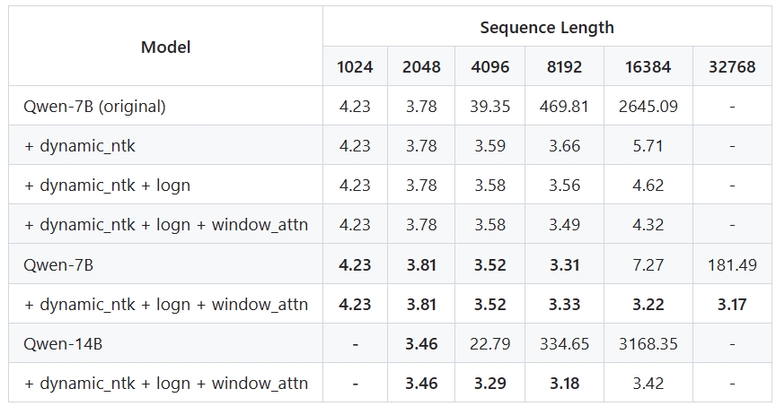
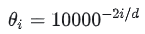
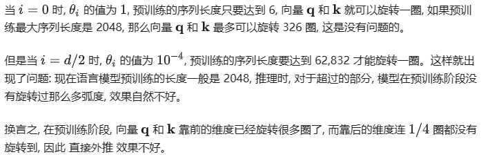
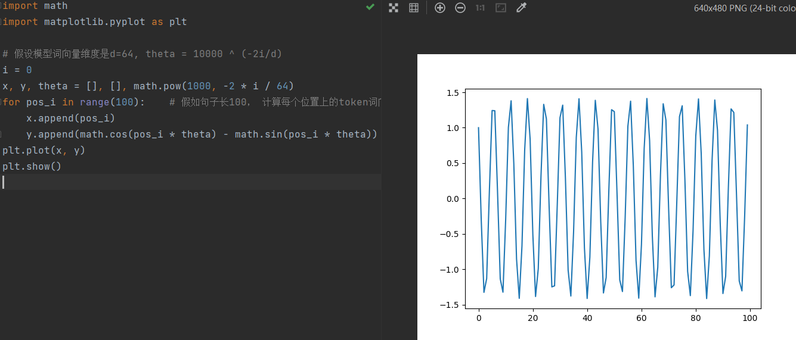
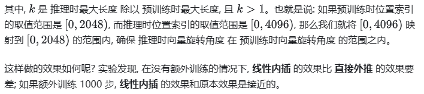
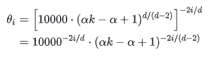

# 摘要

QWEN、QWEN-CHAT

我们还开发了专门的编码模型CODE-QWEN 和 CODE-QWEN-CHAT

基于基础语言模型构建的数学模型 MATH-QWEN-CHAT。

# 预训练

## 数据

预训练数据共3TB，主要涉及公共网络文档、百科全书、书籍、代码等，数据涉及多语言，但以中文和英文为主。为了保证数据质量，制定了一套全面的预处理程序。

- Web数据需要从HTML中提取文本内容，并采用语言识别工具确定语种；
- 通过重复数据删除技术增加数据的多样性，包括规范化后的精确匹配重复数据删除方法和使用MinHash和LSH算法的模糊重复数据删除方法；
- 结合规则和机器学习的方法过滤低质量数据，即通过多个模型对内容进行评分，包括语言模型、文本质量评分模型以及用于识别潜在冒犯性模型；
- 从各种来源数据中手动采样并进行审查，以确保其质量；
- 有选择地对来自某些来源的数据进行采样，以确保模型在各种高质量内容上进行训练

## Tokenizer

词表大小影响者模型的训练效率和下游任务效果，Qwen采用开源快速BPE分词器-tiktoken，以cl100k为基础词库，增加了常用的中文字、词以及其他语言的词汇，并把数字字符串拆成单个数字，最终词表大小为152K。


## 模型

模型基于LLaMA，有以下改进：

* 嵌入和输出投影。 对于embedding层和lm_head层不进行权重共享，是两个单独的权重。 做出这个决定是为了以内存成本为代价获得更好的性能。
* RoPE位置编码。特别是，我们选择使用 FP32 精度作为逆频率矩阵，而不是 BF16 或 FP16，以便优先考虑模型性能并获得更高的精度。
* Bias：对于大多数层，我们按照 Chowdhery 等人的方法消除偏差。 （2022），但我们在 QKV 注意力层中添加偏差以增强模型的外推能力（Su，2023b）。
* Pre-Norm & RMSNorm：采用预归一化提高训练稳定性。
* SwiGLU激活函数。不同于传统FFN的2个矩阵，SwiGLU有三个矩阵，因此缩小了隐藏层维度，我们将前馈网络 (FFN) 的维度从隐藏大小的 4 倍减少到隐藏大小的 8/3。

## 扩展上下文

Transformer模型的注意力机制在上下文长度上有很大的限制，模型会随着上下文长度的增加，计算成本和内存会成倍增加。Qwen模型利用了简单地非训练计算，在推理过程中扩展上下文长度。

在这项工作中，我们实现了简单的免训练技术，这些技术仅在推理过程中应用，以扩展模型的上下文长度。 我们使用的关键技术之一是NTK感知插值（bloc97，2023），它以免训练的方式调整尺度以防止高频信息丢失。 为了进一步提高性能，我们还实现了一个名为动态 NTK 感知插值（NTK-aware interpolation）的简单扩展，稍后将在 中正式讨论。 它按块动态改变规模，避免严重的性能下降。 这些技术使我们能够有效地扩展 Transformer 模型的上下文长度，而不会影响其计算效率或准确性。

QWEN 另外还包含两种注意力机制：LogN-Scaling（Chiang & Cholak，2022；Su，2023a）和窗口注意力（Beltagy et al.，2020）。 LogN-Scaling 通过一个取决于上下文长度与训练长度之比的因子重新调整查询和值的点积，确保注意力值的熵随着上下文长度的增长保持稳定。 窗口注意力将注意力限制在有限的上下文窗口中，防止模型关注太远的标记。

我们还观察到，我们模型的长上下文建模能力在不同层之间有所不同，与较高层相比，较低层对上下文长度扩展更加敏感。 为了利用这一观察结果，我们为每一层分配不同的窗口大小，对较低层使用较短的窗口，对较高层使用较长的窗口。

总结为三种手段：

- 动态NTK感知插值，即对序列长度的增加动态缩放位置信息。
- LogN-Scaling，根据上下文长度与训练长度的比率，对Q和V的点积进行重新缩放，确保注意力值的熵随着上下文长度的增长而保持稳定。
- Window attention，将注意力限制在一个上下文窗口内，防止模型关注到太远的内容。并在不同层采用不同的窗口大小，较低的层使用较短的窗口，而较高的层使用较长的窗口。


## 训练

为了训练 QWEN，我们遵循自回归语言建模的标准方法，如 Radford 等人所述。 （2018）。 这涉及训练模型以根据先前标记提供的上下文来预测下一个标记。 我们训练上下文长度为 2048 的模型。为了创建批量数据，我们对文档进行打乱和合并，然后将它们截断到指定的上下文
长度。 为了提高计算效率并减少内存使用，我们在注意力模块中采用了 Flash Attention（Dao 等人，2022）。 我们采用标准优化器 AdamW (Kingma & Ba, 2014; Loshchilov & Hutter, 2017) 进行预训练优化。 我们设置超参数 β1 = 0.9、β2 = 0.95 和 ϵ = 10−8。 我们使用余弦学习率计划，为每个模型大小指定一个指定的峰值学习率。 学习率衰减至最小学习率峰值学习率的 10%。 所有模型均采用 BFloat16 混合精度进行训练，以保证训练稳定性。

## 评估

QWEN模型再同等级参数下表现优异，即使是更大的型号如LLaMA2-70B，在3个任务中也被QWEN-14B超越。

# 对齐

## SFT

Qwen采用ChatML(OpenAI, 2022)样式的格式来进行模型训练。ChatML格式可以时模型有效区分各类信息，包括系统质量、用户输入、模型输出等，可以增强模型对复杂会话的处理分析能力。


与预训练一致，我们也应用下一个标记预测作为 SFT 的训练任务。 我们对系统和用户输入应用损失掩模。

- 优化器采用AdamW，超参数β1、β2和ϵ为别为0.9、0.95和1e−8；
- 模型最大输入长度2048；
- 训练批次大小为128；
- 模型共训练4000步，在前1430步中，学习率逐渐增加，达到2e−6的峰值。
- 为了防止过拟合，权重衰减的值设置为0.1，dropout设置为0.1，梯度裁剪的限制为1.0。


## RLHF

**训练奖励模型**

要创建成功的奖励模型，就像构建大型语言模型（LLM）一样，首先进行预训练然后进行微调至关重要。 这种预训练过程也称为偏好模型预训练 (PMP)（Bai 等人，2022b），需要大量的比较数据集。 该数据集由样本对组成，每个样本对包含单个查询的两个不同响应及其相应的偏好。 同样，也对此类比较数据进行微调，但由于质量注释的存在，具有更高的质量。 在微调阶段，我们收集各种提示，并根据人类对 QWEN 模型响应的反馈来调整奖励模型。 为了确保正确考虑用户提示的多样性和复杂性，我们创建了一个包含约 **6600个**详细标签的分类系统，并实现了平衡采样算法，在通过奖励模型选择注释提示时同时考虑多样性和复杂性（Lu et al. 等，2023）。 为了生成广泛的响应，我们使用了不同大小和采样策略的 QWEN 模型，因为不同的响应可以帮助减少注释难度并提高奖励模型的性能。 然后，注释者按照标准注释指南对这些响应进行评估，并根据他们的分数形成比较对。在创建奖励模型时，我们利用相同大小的预训练语言模型 QWEN 并启动 PMP 流程。 随后，我们对 PMP 模型进行微调以提高其性能。 值得一提的是，我们在原始 QWEN 模型中加入了一个池化层，以根据特定的结束标记提取句子的奖励。 该过程的学习率设置为常数值 3 × 10−6，批量大小为 64。此外，序列长度设置为 2048，训练过程持续一个 epoch。

**PPO**

PPO阶段共包含四个模型：policy模型、value模型、reference模型、reward模型。训练过程中，先对policy模型训练50步预热，这样保证了value模型能够有效地适应不同的奖励模型。在PPO过程中，对每个query会同时采样两个response，KL散度系数设为0.04，并根据平均值对奖励进行归一化处理。

policy模型和value模型的学习率分别为1e−6和5e−6。为了增强训练的稳定性，裁剪值0.15。在进行推理时，生成策略的top-p值设置为0.9。

# 使用工具能力

Qwen模型具有工具使用能力：

- 可以通过ReAct提示进行使用未见的工具；
- 使用Python解释器增强数学推理、数据分析等能力；
- 作为Agents，与人类交互过程中，可以访问HuggingFace中大量多模态模型集合。


# 相关工作

## Aligment

self-instrurct：从高质量的LLM模型中蒸馏知识的一种有效方式，即用公开可用的预训练好的LLM的接口生成高质量的数据，再用生成的数据以有监督的方式对目标模型进行调优。Alpaca

evol-instruct：WizardLM

RLHF: PPO等

## Agents

LLM 的规划功能允许通过上下文学习调用 API 或代理功能等工具，正如 Schick 等人所演示的那样。 （2023）。 姚等人。 (2022) 引入了 ReAct，这是一种生成格式，使模型能够生成关于使用哪个工具的想法、接受来自 API 观察的输入并生成响应。 GPT-3.5 和 GPT-4 在经过几次镜头提示后，就表现出了一致且令人印象深刻的性能。 除了工具使用之外，LLMs还可以利用知识库（Hu et al., 2023；Zhong et al., 2023b）或搜索引擎（Nakano et al., 2021；Liu et al., 2023b）等外部记忆源来生成 更准确、信息更丰富的答案。 这导致了像LangChain（LangChain, Inc., 2023）这样的框架的流行。 针对工具使用的 LLM 的研究也激发了人们对构建具有 LLM 功能的代理的兴趣，例如可以调用不同 AI 模型的代理（Shen 等人，2023；Li 等人，2023a）、体现终身学习或多模式代理（ Wang et al., 2023a; Driess et al., 2023)，以及多个智能体之间相互作用，甚至构建一个微社会(Chen et al., 2023a; Li et al., 2023b; Xu et al., 2023d ；洪等人，2023）

## ReAct

ReAct是Reasoning and Acting（也有一说是Reason Act）缩写，意思是LLM可以根据逻辑推理（Reason），构建完整系列行动（Act），从而达成期望目标。


一个ReAct流程里，关键是三个概念：

Thought：由LLM模型生成，是LLM产生行为和依据。可以根据LLM的思考，来衡量他要采取的行为是否合理。这是一个可用来判断本次决策是否合理的关键依据。相较于人类，thought的存在可以让LLM的决策变得更加有可解释性和可信度。

Act：Act是指LLM判断本次需要执行的具体行为。Act一般由两部分组成：行为和对象。用编程的说法就是API名称和对应的入参。LLM模型最大的优势是，可以根据Thought的判断，选择需要使用的API并生成需要填入API的参数。从而保证了ReAct框架在执行层面的可行性。

Obs：LLM框架对于外界输入的获取。它就像LLM的五官，将外界的反馈信息同步给LLM模型，协助LLM模型进一步的做分析或者决策。

一个完整的ReAct的行为，包涵以下几个流程：

1.输入目标：任务的起点。可以是用户的手动输入，也可以是依靠触发器（比如系统故障报警）。

2.LOOP：LLM模型开始分析问题需要的步骤（Thought），按步骤执行Act，根据观察到的信息（Obs），循环执行这个过程。直到判断任务目标达成。

3.Finish：任务最终执行成功，返回最终结果。

**一个可以自己尝试ReAct过程的Prompt的例子：**

```rust
You are an assistant, please fully understand the user's question, choose the appropriate tool, and help the user solve the problem step by step.
 
### CONSTRAINTS ####
1. The tool selected must be one of the tools in the tool list.
2. When unable to find the input for the tool, please adjust immediately and use the AskHumanHelpTool to ask the user for additional parameters.
3. When you believe that you have the final answer and can respond to the user, please use the TaskCompleteTool.
5. You must response in Chinese;
 
### Tool List ###
 
[
    Search: 如果需要搜索请用它.paramDescription ： [{"name": "searchKey", "description": "搜索参数","type":"String"}]
    AskHumanHelpTool: 如果需要人类帮助，请使用它。paramDescription ： [{"name": "question", "description": "问题","type":"String"}]
    TaskCompleteTool：如果你认为你已经有了最终答案，请使用它。paramDescription ： [{"name": "answer", "description": "答案","type":"String"}]
]
 
You should only respond in JSON format as described below
 
### RESPONSE FORMAT ###
{
  {"thought": "为什么选择这个工具的思考","tool_names": "工具名","args_list": {“工具名1”:{"参数名1": "参数值1","参数名2": "参数值2"}}}}
Make sure that the response content you return is all in JSON format and does not contain any extra content.
```


# 知识点总结

## 扩展上下文

Qwen模型利用了简单地非训练计算，在推理过程中扩展上下文长度。

在这项工作中，我们实现了简单的免训练技术，这些技术仅在推理过程中应用，以扩展模型的上下文长度。

- 动态NTK感知插值，即对序列长度的增加动态缩放位置信息。https://zhuanlan.zhihu.com/p/648701937
- LogN-Scaling，根据上下文长度与训练长度的比率，对Q和V的点积进行重新缩放，确保注意力值的熵随着上下文长度的增长而保持稳定。
- Window attention，将注意力限制在一个上下文窗口内，防止模型关注到太远的内容。并在不同层采用不同的窗口大小，较低的层使用较短的窗口，而较高的层使用较长的窗口。

通过arXiv数据集上的语言模型实验，我们的原生长度为2K的Qwen-7B/14B在8K的序列长度下依然表现不错，而原生长度扩展到8K的Qwen-7B能够在32K长序列的设置下取得不错的表现。




## 直接外推 与 线性内插

 如果 大语言模型 在训练阶段文本的最大长度是 2048, 而下游任务的文本长度可以达到 4096, 此时应该怎么处理?

初步感觉, 这对于 RoPE 来说并不是一个大问题。直接用原公式，直接外推。




**相对位置** 和 **注意力分数** 之间是震荡递减的关系，当 **相对位置** 超过一万时, 震荡递减关系就不存在了。

我们将 d 的值设置为 8, 可以发现, 两者之间还是 周期函数, 周期大概在 10000 左右, 这符合我们对三角函数的认知。也就是说, 图一到图三中呈现的震荡递减关系只是因为 周期不够大! 初步估算, 当 d 的值为 32 时, 周期应该是 亿级别的, 因此正常完全够用。

初步感觉, 直接外推对于 RoPE 来说并不是一个大问题。可是实验发现, 如果这样做, 性能会下降特别多。



实验分析：词向量维度d=64，训练句子长100，词向量的第i=0维时，Q的计算结果（只计算和位置相关的变量）：



实验分析：词向量维度d=64，训练句子长100，词向量的第i=10维时，Q的计算结果（只计算和位置相关的变量）：


怎么办呢? [国外网友 kaiokendev](https://link.zhihu.com/?target=https%3A//kaiokendev.github.io/til%23extending-context-to-8k) 和 [Meta](https://link.zhihu.com/?target=https%3A//arxiv.org/abs/2306.15595) 同时提出了一种方式: **线性内插** (Positional Interpolation)：




## NTK-aware Scaled RoPE

参考：https://zhuanlan.zhihu.com/p/662790439

**线性内插** 虽然效果还可以, 但需要增量训练, 有没有办法在不需要增量训练的情况下实现长度外推呢? 于是, 有人想到, 对于向量 q 和 k, 靠前的维度 **直接外推**, 靠后的维度 **线性内插**:


这样的效果如何呢? 根据实验, 在不进行增量训练的情况下, **线性内插** 的性能下降了近 40%, 而这种方案的性能下降仅仅为 5%, 可以说效果非常好了。

为什么叫这个名字，可能和作者的研究有关，略。

## dynamic_ntk

接着, 有人提出更一般的形式:



其中，$\alpha$是一个超参数，设为2时，效果不错。

## window_attn

参考：https://zhuanlan.zhihu.com/p/134748587

Window attention，将注意力限制在一个上下文窗口内，防止模型关注到太远的内容。并在不同层采用不同的窗口大小，较低的层使用较短的窗口，而较高的层使用较长的窗口。

具体用那种windown attention不知道。感觉像是sliding window attention

## LogN-Scaling

论文：Overcoming a theoretical limitation of self-attention

参考：https://zhuanlan.zhihu.com/p/673851074

