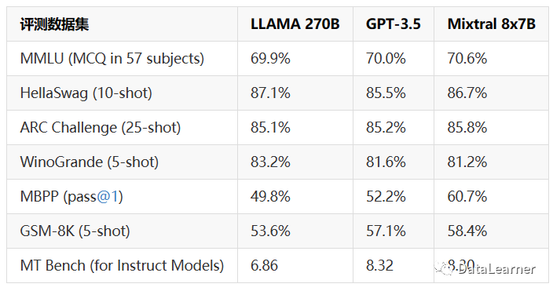
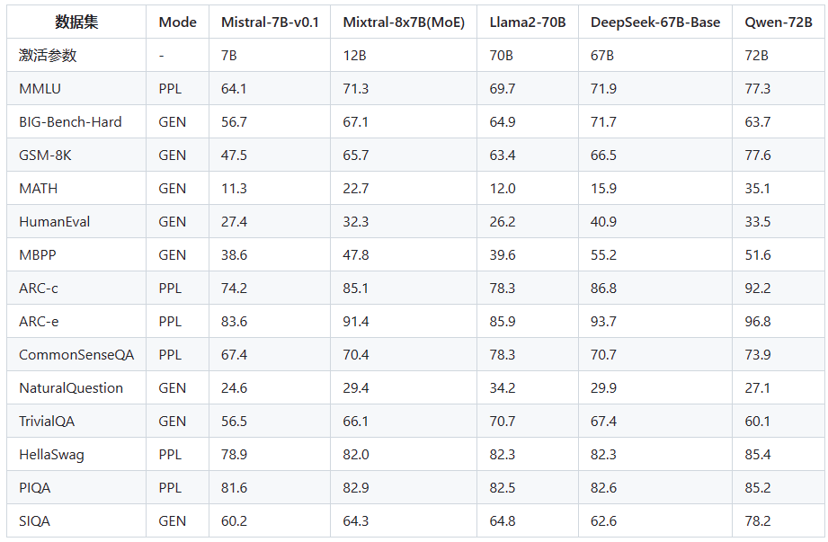
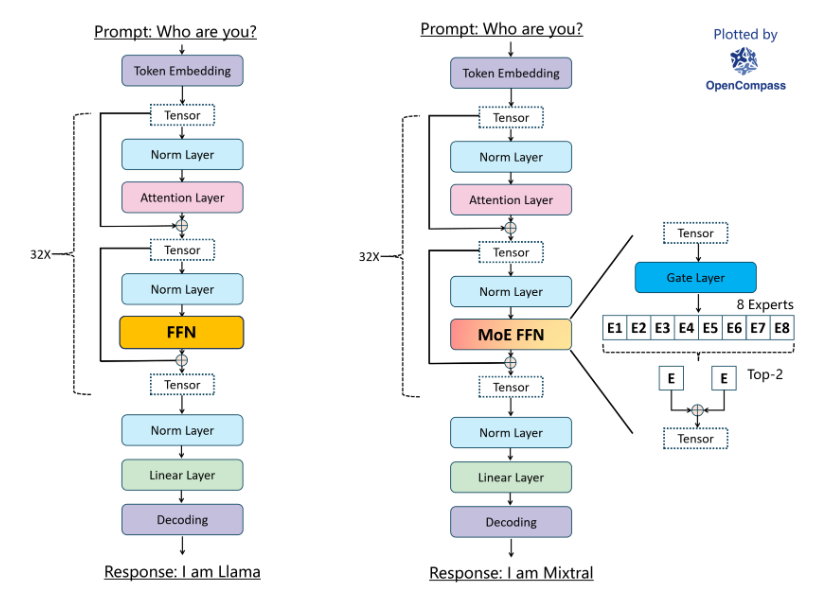

时间：20231208

混合专家模型（Mixture of Experts，MoE）

## Mistral-7B×8-MoE的特点

根据官方的介绍，Mistral-7B×8-MoE是一个高质量稀疏型的专家混合模型。是8个70亿参数规模大模型的混合。它的主要特点如下：

- 它可以非常优雅地处理**32K上下文**数据
- 除了英语外，在**法语、德语、意大利语和西班牙**语表现也很好
- 在代码能力上表现很强
- 指令微调后MT-Bench的得分8.3分（GPT-3.5是8.32、LLaMA2 70B是6.86）

在MoE模型中，有两个关键组件：

- 专家（Experts）：这些是网络中的小型子网络，每个专家通常专注于处理一种特定类型的数据或任务。专家的设计可以是多种形式，如完全连接的网络、卷积网络等。
- 门控机制（Gating Mechanism）：这是一个智能路由系统，负责决定哪些专家应该被激活来处理当前的输入数据。门控机制基于输入数据的特性，动态地将数据分配给不同的专家。

官方介绍，这个模型是基于网络数据预训练的，其中，专**家网络和门控路由是同时训练的**。

## Mistral-7B×8-MoE评估效果

此次，官方详细公布了Mistral-7B×8-MoE在各个评测数据集上的评测效果。结果如下：

Mistral-7B×8-MoE模型在各方面的指标都很不错，几乎与LLaMA2-70B在一个水平，但是由于每次只有120亿参数在工作，这意味着它的成本要远低于LLaMA2 70B，官方的说法是推理速度**比LLaMA2 70B快6倍**！

根据官方的介绍，Mistral-7B×8-MoE**实际的参数为450亿**，但是**每次运行只会利用其中120亿参数**（单个模型在56.5亿，但是可能有共享参数，**每个token会被2个模型处理**）。因此，这个模型的推理速度和成本与120亿参数规模的大模型是一样的。

## 模型架构

https://github.com/open-compass/MixtralKit/blob/main/README_zh-CN.md#-%E6%A8%A1%E5%9E%8B%E6%9E%B6%E6%9E%84

> Mixtral-8x7B-32K MoE模型主要由32个相同的MoE transformer block组成。MoE transformer block与普通的transformer block的最大差别在于其FFN层替换为了**MoE FFN**层。在MoE FFN层，tensor首先会经过一个gate layer计算每个expert的得分，并根据expert得分从8个expert中挑出top-k个expert，将tensor经过这top-k个expert的输出后聚合起来，从而得到MoE FFN层的最终输出，其中的每个expert由3个Linear层组成。值得注意的是，mixtral MoE的所有Norm Layer也采用了和LLama一样的RMSNorm，而在attention layer中，mixtral MoE的QKV矩阵中的Q矩阵shape为(4096,4096)，K和V矩阵shape则为(4096,1024)。

参考：

https://mp.weixin.qq.com/s/p6yo_0VIGHUBnGoTnFid4Q

https://mp.weixin.qq.com/s/fQ0xj8oaAtp6dI5tYuG02w