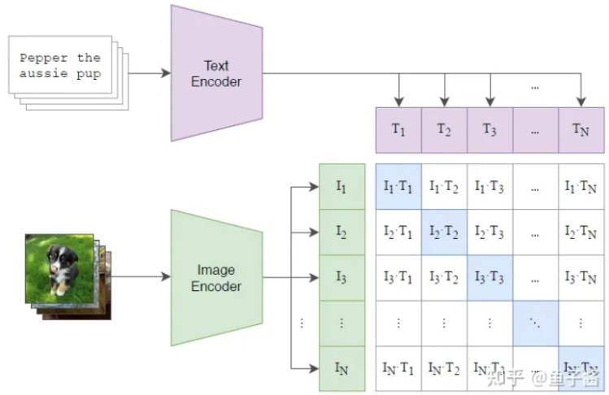
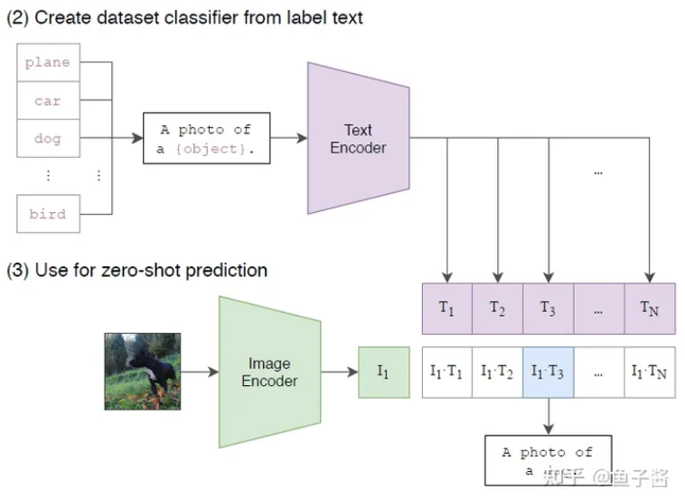
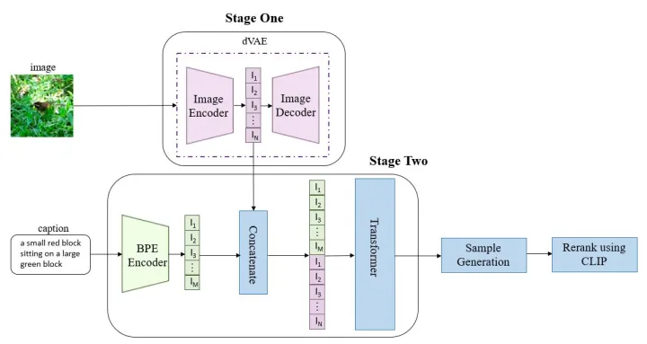
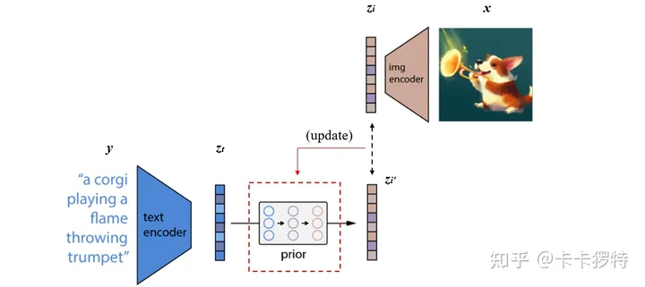

# CLIP

时间：2021年3月

机构：OpenAI

Motivation:

预训练的方法像BERT和GPT系列已经被验证很成功。对于CV领域，我们能不能也从网上搜集大量图像数据用于训练视觉表征模型呢？

因此：

1、构建image和text的联系，比如利用已有的（image，text）pair数据集，从text中学习image的表征；

2、作者考虑从网上爬取大量的（text，image）pair以扩充数据，同时这样的pairs是可以用来训练视觉表征的。作者随即在互联网上采集了4亿个（text，image）对，准备开始训练模型。

Model:

作者提出CLIP的模型，可以认为是ConVIRT的简化版。

一旦CLIP训练好了，我们就可以做zero-shot prediction了，如下图：

# DALL-E1

时间：2021.01.05

机构：OpenAI

## VQVAE

VQVAE的思路旨在学习一个codebook。什么是codebook？在NLP里，codebook就可以理解为一个小词典，里面装了最常用的单词，我们每一个长句子都能用这些词表示，这样就能达到一个压缩的效果。比如下面举了一个小例子，如果我们要编码左边这三个句子，我们需要六个词，码本大小为6，但是如果我们找到这些词的近义词：“我”，“很”，“开心”，那么我们的码本大小就为3了！这就是一个简单的量化压缩词典的过程。

在视觉里同理，我们可以找到数据集里那些**最常用的pixel**（通常有RGB三维），并把这些pixel放到词典里，我们就可以得到一个简单的visual codebook，minGPT[[2\]](https://zhuanlan.zhihu.com/p/506778898#ref_2)就是通过聚类的方式，聚类出数据集里最常用的512个RGB三维向量，作为码本。通用，这里量化的过程就是一个近似的过程，就如同上面的找近义词一样，这里会从codebook里找到最相似的pixel。

当然，这里的VQVAE并不是在pixel这个level上去学codebook的，那样似乎有些太简单粗暴，而是首先通过一个encoder，将图片映射到一个latent space，再在feature这个level上去学习出codebook。decoder呢，就是做一个反向映射，从latent space再映射回原图。

## Taming Tranformer

Codebook还有一个好处，就是说可以把图片表示为一串id序列（id就是codebook里每个visual code的id，如1、23、35、47、59这样的实数），这样就能很好地建模图像生成任务了！因为某个数据集的图片的id序列通常是满足某一种分布的，（比如1后面最可能是3，3后面最可能是14、29），这样图片生成任务就被建模成了一个NLP里经典的next-index prediction任务，对于这种问题，我们通常可以用transformer-decoder这种自回归模型去学习。

结合上面所说的，图像生成任务就被分成了两阶段，在stage1，会学习一个VQVAE，用以将图像压缩为离散编码（1、23、35...这种id序列），在stage2，再用一个自回归模型去找到这种id序列的规律，也就是分布，就可以啦。这也是DALL-E的一篇同期工作Taming Transfomer所用到的方法，至于细节上怎么做的，可以参考原文。

## DALL-E1

DALL-E1，只是把前面提到的two-stage方法给做到text2img上去了，而text2img像较于传统的图像生成，只是将image generation里的condition换为了text，TamingTransformer也能做text2img，有个很火的VQGAN+CLIP方法就是把Taming Tranformer的condition换成了CLIP text encoder对文本的输出。

DALL·E的目标是把文本token和图像token当成一个数据序列，通过Transformer进行自回归。由于图片的分辨率很大，如果把单个pixel当成一个token处理，会导致计算量过于庞大，于是DALL·E引入了一个dVAE模型来降低图片的分辨率。

DALL·E的整体流程如下：

第一个阶段，先训练一个dVAE把每张256x256的RGB图片压缩成32x32的图片token，每个位置有8192种可能的取值(也就是说dVAE的encoder输出是维度为32x32x8192的logits，然后通过logits索引codebook的特征进行组合，codebook的embedding是可学习的)。

第二阶段，用BPE Encoder对文本进行编码，得到最多256个文本token，token数不满256的话padding到256，然后将256个文本token与1024个图像token进行拼接，得到长度为1280的数据，最后将拼接的数据输入Transformer中进行自回归训练。

训练阶段，先训练dVAE模型，然后固定dVAE模型再来训练自回归的 Transformer

推理阶段，给定一张候选图片和一条文本，通过transformer可以得到融合后的token，然后用dVAE的decoder生成图片，最后通过预训练好的CLIP计算出文本和生成图片的匹配分数，采样越多数量的图片，就可以通过CLIP得到不同采样图片的分数排序

从以上流程可知，**dVAE**、**Transformer**和**CLIP**三个模型都是不同阶段独立训练的。

时间：2022.04.13

机构：OpenAI

论文：Hierarchical Text-Conditional Image Generation with CLIP Latents

# DALL-E2

## 总览

它主要包括三个部分：CLIP，先验模块prior和img decoder。其中CLIP又包含text encoder和img encoder

## 训练过程

DALL·E 2是将其子模块分开训练的，最后将这些训练好的子模块拼接在一起，最后实现由文本生成图像的功能。

**1. 训练CLIP，使其能够编码文本和对应图像**

这一步是与CLIP模型的训练方式完全一样的，目的是能够得到训练好的text encoder和img encoder。这么一来，文本和图像都可以被编码到相应的特征空间。对应上图中的虚线以上部分。

**2. 训练prior，使文本编码可以转换为图像编码**

实际的训练过程为：将CLIP中训练好的text encoder拿出来，输入文本y，得到文本编码zt。同样的，将CLIP中训练好的img encoder拿出来，输入图像 x得到图像编码zi。我们希望prior能从zt获取相对应的zi。假设zt经过prior输出的特征为zi'，那么我们自然希望zi′与zi越接近越好，这样来更新我们的prior模块。最终训练好的prior，将与CLIP的text encoder串联起来，它们可以根据我们的输入文本y生成对应的图像编码特征zi了。

在DALL·E 2 模型中，作者团队尝试了两种先验模型：自回归式Autoregressive (AR) prior 和扩散模型Diffusion prior [1]。实验效果上发现两种模型的性能相似，而因为扩散模型效率较高，因此最终选择了扩散模型作为prior模块。

**3. 训练decoder生成最终的图像**

这个过程与自编码器类似，从中间特征层还原出输入图像，但又不完全一样。我们需要生成出的图像，只需要保持原始图像的显著特征就可以了，这样以便于多样化生成，例如下图右边的示例。

DALL-E 2使用的是改进的GLIDE模型 [2]。这个模型可以根据CLIP图像编码的zi，还原出具有相同与 zi 有相同语义，而又不是与 x 完全一致的图像。

## 推理

经过以上三个步骤的训练，已经可以完成DALL·E 2预训练模型的搭建了。我们这事丢掉CLIP中的img encoder，留下CLIP中的text encoder，以及新训练好的prior和decoder。这么一来流程自然很清晰了：由text encoder将文本进行编码，再由prior将文本编码转换为图像编码，最后由decoder进行解码生成图像。

# DALL-E3

时间：2023.10

机构：OpenAI

技术报告：Improving Image Generation with Better Captions

但是，DALL-E 3的这篇技术报告重点是放在了如何合成图像的文本数据，而对于DALL-E 3具体的模型架构和实现细节并没有给出，所以OpenAI还是保留了很多细节。

当前问题：图像常规的文本描述往往过于简单（比如COCO数据集）

OpenAI解决方案：训练一个**image captioner**来合成图像的caption（模型架构是谷歌CoCa）

实验：

1、共训练了三个模型，它们的差异是**采用不同类型的caption**，分别是只用原始caption，5%的原始caption+95%的合成短caption，**5%的原始caption+95%的合成长caption**。

2、这里训练的文生图是**latent diffusion模型**，其VAE和SD一样都是8x下采样

2、text encoder采用**T5-XXL**，一方面T5-XXL可以编码更长的文本，另外一方面是T5-XXL的文本编码能力也更强。

4、这里并没有说明UNet模型的具体架构，只是说它包含3个stages，应该和SDXL类似。

