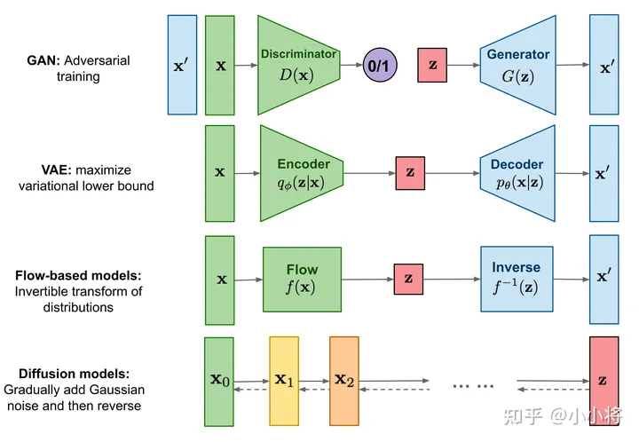
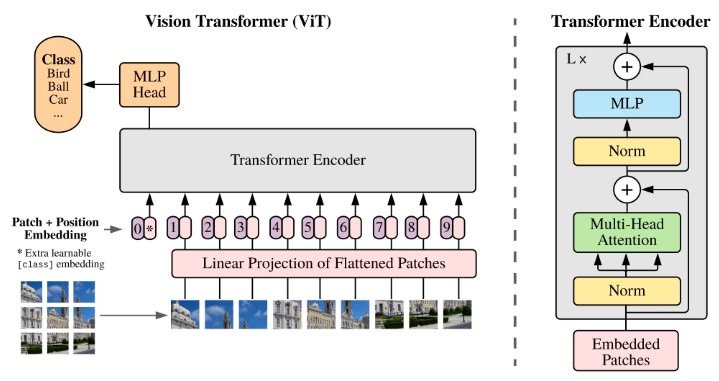

主流生成模型：

# VAE

https://blog.csdn.net/v_JULY_v/article/details/130361959?spm=1001.2014.3001.5502

AE自编码器存在的问题：绝大多数的随机的潜空间z是没有任何意义的噪声。原因在于没有显性的对z的分布进行建模。

VAE(自变分编码器，Variational Autoencoders)则是在AE的基础上，**显性的对的分布进行建模**(比如符合某种常见的概率分布)**，使得自编码器成为一个合格的生成模型**。

为了抑制自编码过程中的过拟合，VAE编码器的输出是一个正态分布，而不是一个具体的编码。VAE的损失函数除了要最小化重建图像与原图像之间的均方误差外，还要最大化每个分布和标准正态分布之间的相似度。

最终表现形式就是在目标函数Loss中加正则化：

代码实现：https://www.cnblogs.com/picassooo/p/12601785.html

# DDPM

https://blog.csdn.net/v_JULY_v/article/details/130361959?spm=1001.2014.3001.5502

DDPM（Denoising Diffusion Probabilistic Models）主要有两个贡献

 1、**从预测转换图像改进为预测噪声** (即如DiT论文所说，reformulating diffusion models to predict noise instead of pixel，可惜强调这点的文章太少了，可它是DDPM的关键，更是DDPM的本质）DDPM采用了一个U-Net 结构的Autoencoder对t时刻的高斯噪声z进行预测。

2、**DDPM只预测正态分布的均值**，虽然正态分布由均值和方差决定，但作者在这里发现，其实模型不需要学方差，只需要学习均值就行。逆向过程中高斯分布的方差项直接使用一个常数，模型的效果就已经很好。所以就再一次降低了模型的优化难度。

# ViT

2020-10

Google这篇论文《[An Image is Worth 16x16 Words: Transformers for Image Recognition at Scale](https://arxiv.org/abs/2010.11929)》提出的ViT彻底引燃了多模态的火热，更是直接挑战了此前CNN在视觉领域长达近10年的绝对统治地位。

直接用图片的像素点做Token，计算复杂度太高。有两个思路：

1、之前做法是用CNN做特征降维，然后再结合Transformer也可以。

2、这篇论文的Vision Transformer(ViT)是把整个图片切分成一个个patch(比如分割为九宫格)，这些patch作为transformer的输入。

Vision Transformer(ViT)的模型框架由三个模块组成：

考虑到在Transformer结构中，输入是一个二维的矩阵，矩阵的形状可以表示为 (N，D) ，其中 N 是sequence的长度，而 D 是sequence中每个向量的维度。

1、把图片分割成16x16像素的patch。如原图片是224x224，切分后共有N=14x14=196个patch。因为图片是3通道，所以D=16x16x3=768。

2、切分patch可以通过一个卷积层来实现，卷积核大小为16，步长为16，输入维度是3，即[224, 224, 3] -> [14, 14, 768]，然后H和W维度展开[14, 14, 768] -> [196, 768]

3、前面添加[class] token，得到[197, 768]

4、再相加position embedding，仍然是[197, 768]

值得一提的是，由于ViT不像CNN那样对图像有比较多的先验知识，即没有用太多的归纳偏置

1、具体来说，CNN的局部性locality (以滑动窗口的形式一点一点在图片上进行卷积，故会假设图片上相邻的区域会有近似的特征)，和平移等变性translation equivariance贯穿整个CNN模型的始终（卷积核就像一个模板一样，输入一致的情况下，不论图片移动到哪里，最后的输出都是一样的。所以无论先做平移还是先做卷积，最后的 结果都是一样的）。

2、对于ViT而言，也就在最后的MLP用到了局部且平移等变性，以及针对每个图片的patch加了位置编码，除这两点之外，ViT没有再专门针对CV问题做任何额外的处理

# Swin Transformer

swin transformer作为多尺度的ViT更加适合处理视觉问题，且证明transformer不但能在ViT所证明的分类任务上取得很好的效果，在检测、分割上也能取得很好的效果，而在结构上，swin transformer主要做了以下两点改进

1、获取图像多尺寸的特征

ViT都是16x16的patch，多尺寸的特征也很重要。

# DiT

# FiT

https://mp.weixin.qq.com/s/2Ea0WjZxLYzaebfMK5rZxw

# SiT

[出圈的Sora带火DiT，连登GitHub热榜，已进化出新版本SiT_澎湃号·湃客_澎湃新闻-The Paper](https://www.thepaper.cn/newsDetail_forward_26414092)