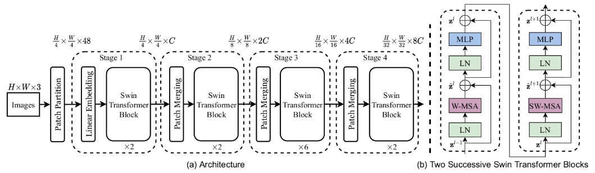
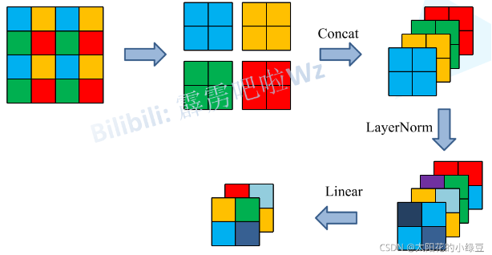
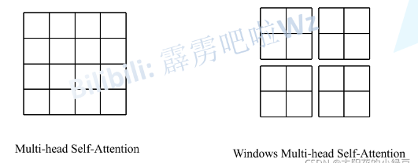
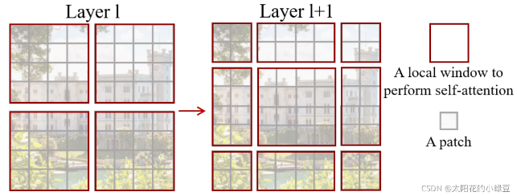
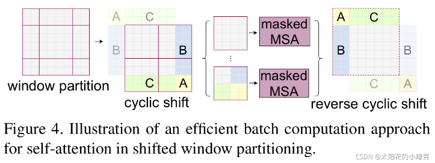
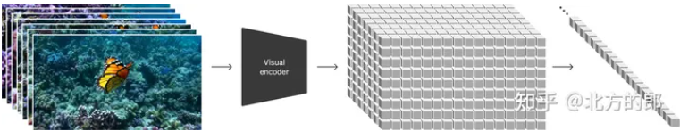
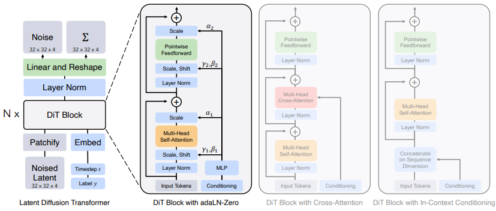

主流生成模型：

# VAE

https://blog.csdn.net/v_JULY_v/article/details/130361959?spm=1001.2014.3001.5502

AE自编码器存在的问题：绝大多数的随机的潜空间z是没有任何意义的噪声。原因在于没有显性的对z的分布进行建模。

VAE(自变分编码器，Variational Autoencoders)则是在AE的基础上，**显性的对的分布进行建模**(比如符合某种常见的概率分布)**，使得自编码器成为一个合格的生成模型**。

为了抑制自编码过程中的过拟合，VAE编码器的输出是一个正态分布，而不是一个具体的编码。VAE的损失函数除了要最小化重建图像与原图像之间的均方误差外，还要最大化每个分布和标准正态分布之间的相似度。

最终表现形式就是在目标函数Loss中加正则化：

代码实现：https://www.cnblogs.com/picassooo/p/12601785.html

# DDPM

https://blog.csdn.net/v_JULY_v/article/details/130361959?spm=1001.2014.3001.5502

DDPM（Denoising Diffusion Probabilistic Models）主要有两个贡献

 1、**从预测转换图像改进为预测噪声** (即如DiT论文所说，reformulating diffusion models to predict noise instead of pixel，可惜强调这点的文章太少了，可它是DDPM的关键，更是DDPM的本质）DDPM采用了一个U-Net 结构的Autoencoder对t时刻的高斯噪声z进行预测。

2、**DDPM只预测正态分布的均值**，虽然正态分布由均值和方差决定，但作者在这里发现，其实模型不需要学方差，只需要学习均值就行。逆向过程中高斯分布的方差项直接使用一个常数，模型的效果就已经很好。所以就再一次降低了模型的优化难度。

DDPM的训练过程分为两步：

- **Diffusion Process (又被称为Forward Process)**，不断添加噪声
- **Denoise Process（又被称为Reverse Process）**，不断去噪

DDPM用于预测噪声的核心模型**UNet**模型最早提出时，是用于解决医疗影像诊断问题的。

# ViT

2020-10

Google这篇论文《[An Image is Worth 16x16 Words: Transformers for Image Recognition at Scale](https://arxiv.org/abs/2010.11929)》提出的ViT彻底引燃了多模态的火热，更是直接挑战了此前CNN在视觉领域长达近10年的绝对统治地位。

直接用图片的像素点做Token，计算复杂度太高。有两个思路：

1、之前做法是用CNN做特征降维，然后再结合Transformer也可以。

2、这篇论文的Vision Transformer(ViT)是把整个图片切分成一个个patch(比如分割为九宫格)，这些patch作为transformer的输入。

Vision Transformer(ViT)的模型框架由三个模块组成：

考虑到在Transformer结构中，输入是一个二维的矩阵，矩阵的形状可以表示为 (N，D) ，其中 N 是sequence的长度，而 D 是sequence中每个向量的维度。

1、把图片分割成16x16像素的patch。如原图片是224x224，切分后共有N=14x14=196个patch。因为图片是3通道，所以D=16x16x3=768。

2、切分patch可以通过一个卷积层来实现，卷积核大小为16，步长为16，输入维度是3，即[224, 224, 3] -> [14, 14, 768]，然后H和W维度展开[14, 14, 768] -> [196, 768]

3、前面添加[class] token，得到[197, 768]

4、再相加position embedding，仍然是[197, 768]

值得一提的是，由于ViT不像CNN那样对图像有比较多的先验知识，即没有用太多的归纳偏置

1、具体来说，CNN的局部性locality (以滑动窗口的形式一点一点在图片上进行卷积，故会假设图片上相邻的区域会有近似的特征)，和平移等变性translation equivariance贯穿整个CNN模型的始终（卷积核就像一个模板一样，输入一致的情况下，不论图片移动到哪里，最后的输出都是一样的。所以无论先做平移还是先做卷积，最后的 结果都是一样的）。

2、对于ViT而言，也就在最后的MLP用到了局部且平移等变性，以及针对每个图片的patch加了位置编码，除这两点之外，ViT没有再专门针对CV问题做任何额外的处理

# Swin Transformer

> https://blog.csdn.net/qq_37541097/article/details/121119988

Swin Transformer: Hierarchical Vision Transformer using Shifted Windows

时间：2021

问题：

1、视觉实体的方差较大，例如同一个物体，拍摄角度不同，转化为二进制后的图片就会具有很大的差异。

2、图像分辨率高，自注意力的计算量会与像素的平方成正比。

swin transformer作为多尺度的ViT更加适合处理视觉问题，且证明transformer不但能在ViT所证明的分类任务上取得很好的效果，在检测、分割上也能取得很好的效果，而在结构上，swin transformer主要做了以下两点改进

1、获取图像多尺寸的特征。ViT都是16x16的patch，多尺寸的特征也很重要。

2、降低序列长度是图像处理中一个很关键的问题，虽然ViT把整张图片打成了16x16的patch，但图像比较大的时候，计算的复杂度还是比较高。而Swin Transformer使用窗口Window的形式将16x16的特征图划分成了多个不相交的区域(比如16个4x4的，4个8x8的)，并且只在每个小窗口(4x4或8x8)内进行多头注意力计算，大大减少计算量。之所以能这样操作的依据在于借鉴了CNN中locality先验知识。

首先将图片输入到Patch Partition模块中进行分块，即每4x4相邻的像素为一个Patch，然后在channel方向展平（flatten）。假设输入的是RGB三通道图片，那么每个patch就有4x4=16个像素，然后每个像素有R、G、B三个值所以展平后是16x3=48，所以通过Patch Partition后图像shape由 [H, W, 3]变成了 [H/4, W/4, 48]。然后在通过Linear Embeding层对每个像素的channel数据做线性变换，由48变成C，即图像shape再由 [H/4, W/4, 48]变成了 [H/4, W/4, C]。其实在源码中Patch Partition和Linear Embeding就是直接通过一个卷积层实现的，和之前Vision Transformer中讲的 Embedding层结构一模一样。

然后就是通过四个Stage构建不同大小的特征图，除了Stage1中先通过一个Linear Embeding层外，剩下三个stage都是先通过一个Patch Merging层进行下采样。然后都是重复堆叠Swin Transformer Block注意这里的Block其实有两种结构，如图(b)中所示，这两种结构的不同之处仅在于一个使用了W-MSA结构，一个使用了SW-MSA结构。而且这两个结构是成对使用的，先使用一个W-MSA结构再使用一个SW-MSA结构。所以你会发现堆叠Swin Transformer Block的次数都是偶数（因为成对使用）。

最后对于分类网络，后面还会接上一个Layer Norm层、全局池化层以及全连接层得到最终输出。图中没有画，但源码中是这样做的。

## Patch Merging

## W-MSA

Windows Multi-head Self-Attention（W-MSA）模块是为了减少计算量。首先将feature map按照MxM（例子中的M=2）大小划分成一个个Windows，然后单独对每个Windows内部进行Self-Attention。

## SW-MSA

采用W-MSA模块时，只会在每个窗口内进行自注意力计算，所以窗口与窗口之间是无法进行信息传递的。为了解决这个问题，作者引入了Shifted Windows Multi-Head Self-Attention（SW-MSA）模块，即进行偏移的W-MSA。

窗口向右、向下移动1/2：

根据上图，可以发现通过将窗口进行偏移后，由原来的4个窗口变成9个窗口了。后面又要对每个窗口内部进行MSA，这样做感觉又变麻烦了。为了解决这个麻烦，作者又提出而了Efficient batch computation for shifted configuration，一种更加高效的计算方法。

# DiT

前言：Sora研究人员首先将视频压缩到低维潜空间，然后将表示分解为时空补丁来将视频转换为补丁。

1、将视频压缩到潜空间：研究人员训练了一个降低视觉数据维度的网络。这个网络以原始视频为输入，并输出一个在时间和空间上都被压缩的潜在表示。Sora在这个压缩的潜在空间上进行训练，并在此空间内生成视频。研究人员还训练了一个相应的解码器模型，将生成的潜在表示映射回像素空间。

2、Sora是一个扩散模型；给定输入的噪声补丁（和文本提示等条件信息），它被训练来预测原始的“干净”补丁。

Scalable Diffusion Models with Transformers

2022-12

Denoising Diffusion Probabilistic Models (DDPMs)：通过逐步添加噪声来模拟数据分布，然后学习逆向过程去除噪声，以生成新的数据。DiT是DDPM在图像生成中的应用。

Latent Diffusion Models (LDMs)：使用变分自编码器将图像压缩到低维表示，然后在低维空间中训练DDPM。这样可以降低计算成本，并使DiT成为基于Transformer的DDPM的适用框架。

DiT采用的autoencoder是SD所使用的KL-f8，对于256x256x3的图像，其压缩得到的latent大小为32x32x4，这就降低了扩散模型的计算量。

Patchify层：将图像切分成多个大小为p x p的patches，并转换为长度为T的序列作为Transformer的输入。

将输入token化之后，就可以像ViT那样接transformer blocks了。但是对于扩散模型来说，往往还需要在网络中嵌入额外的条件信息，这里的条件包括timesteps以及类别标签（如果是文生图就是文本，但是DiT这里并没有涉及）。要说明的一点是，无论是timesteps还是类别标签，都可以采用一个embedding来进行编码。DiT共设计了四种方案来实现两个额外embeddings的嵌入，具体如下：

- in-context conditioning：将两个embeddings看成两个tokens合并在输入的tokens中，这种处理方式有点类似ViT中的cls token，实现起来比较简单，也不基本上不额外引入计算量。
- cross-attention：将两个embeddings拼接成一个数量为2的序列，然后在transformer block中插入一个cross attention，条件embeddings作为cross attention的key和value；这种方式也是目前文生图模型所采用的方式，它需要额外引入15%的Gflops。
- adaptive layer norm (adaLN)：采用adaLN，这里是将time embedding和class embedding相加，然后来回归scale和shift两个参数，这种方式也基本不增加计算量。
- adaLN-Zero：采用zero初始化的adaLN，这里是将adaLN的linear层参数初始化为zero，这样网络初始化时transformer block的残差模块就是一个identity函数；另外一点是，这里除了在LN之后回归scale和shift，还在每个残差模块结束之前回归一个scale，如上图所示。

最有效的是adaLN-Zero。

