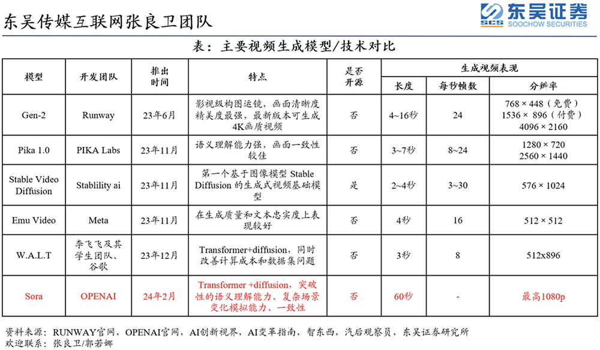
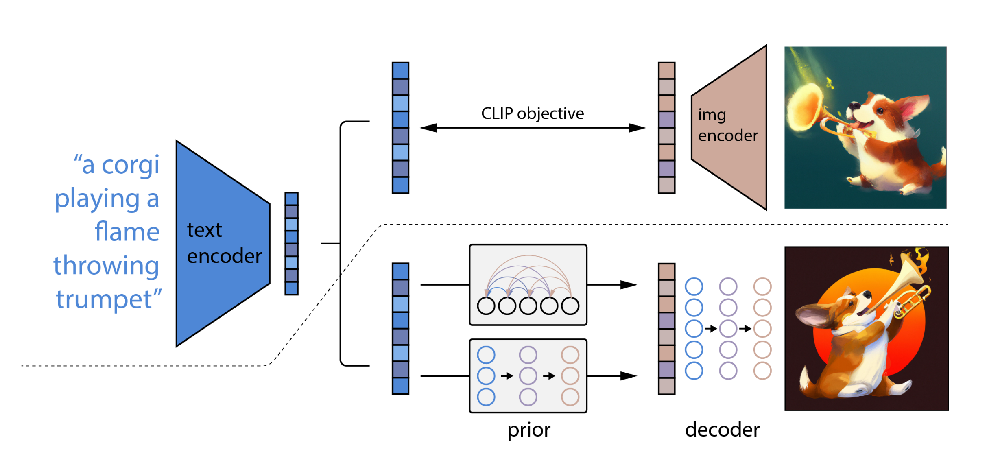
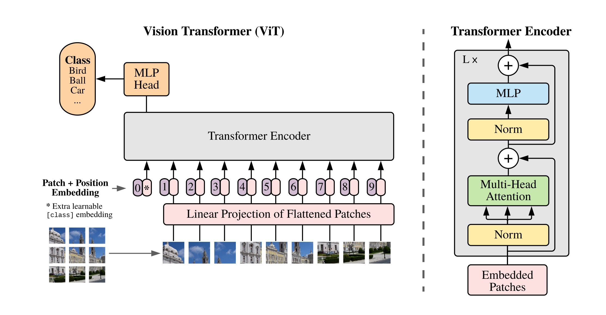
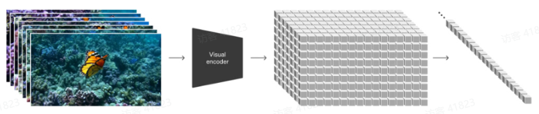

# BLIP

**BLIP**(Bootstrapping Language-Image Pretraining)是**salesforce**在2022年提出的多模态框架，是理解和生成的统一，引入了跨模态的编码器和解码器，实现了跨模态信息流动，在多项视觉和语言任务取得SOTA。

## 模型结构

**BLIP引入了编码器-解码器的多模态混合结构MED**（ Multimodal mixture of Encoder-Decoder）**，能够有效地进行多任务预学习和迁移学习。**MED包括两个单模态编码器（lmage Encoder，Text Encoder），一个以图像为基础的编码器（image-grounded text encoder）和一个以图像为基础的解码器（image-grounded text decoder）。

# CogVLM  InstructBLIP LLaVA MiniGPT4 QwenVL ShareGPT4V

# LWM

大世界模型（ Large World Model ，LWM）

WORLD MODEL ON MILLION-LENGTH VIDEO AND LANGUAGE WITH RINGATTENTION

时间：2024-2-13

机构：UC伯克利

该研究在 Llama2 7B 的基础上训练了一个大型自回归 Transformer 模型，该模型具有长达 100 万个 token 的超大上下文窗口。为了实现这一点，研究团队采用多种策略：使用书籍资料将上下文扩展到 100 万个 token，然后在长多模态序列上进行联合训练，包括文本 - 图像、文本 - 视频数据和书籍资料。

本文的贡献可总结为如下几个方面：

（a）该研究在长视频和语言序列上训练了一个拥有极大上下文尺寸的 transformers 模型，从而设立了新的检索任务和长视频理解方面的标杆。

 (b) 为了克服视觉 - 语言训练带来的挑战，该研究采取了以下措施，包括使用掩码序列以混合不同长度的序列、损失加权以平衡语言和视觉、以及使用模型生成的问答数据来处理长序列对话。

 (c) 通过 RingAttention、掩码序列打包等方法，可以训练数百万长度的多模态序列。

 (d) 完全开源 7B 参数系列模型，其能够处理超过 100 万 token 的长文本文档（LWM-Text、LWM-Text-Chat）和视频（LWM、LWM-Chat）。

# Sora

## DALLE2

**CLIP训练过程：学习文字与图片的对应关系**
如上图所示，CLIP的输入是一对对配对好的的图片-文本对(根据对应文本一条狗，去匹配一条狗的图片)，这些文本和图片分别通过Text Encoder和Image Encoder输出对应的特征，然后在这些输出的文字特征和图片特征上进行对比学习
**DALL·E2：prior + decoder**
上面的CLIP训练好之后，就将其冻住了，不再参与任何训练和微调，DALL·E2训练时，输入也是文本-图像对，下面就是DALL·E2的两阶段训练：
阶段一 prior的训练：根据文本特征(即CLIP text encoder编码后得到的文本特征)，预测图像特征(CLIP image encoder编码后得到的图片特征)
推理时，文本还是通过CLIP text encoder得到文本特征，然后根据训练好的prior得到类似CLIP生成的图片特征，此时图片特征应该训练的非常好，不仅可以用来生成图像，而且和文本联系的非常紧(包含丰富的语义信息)

阶段二 decoder生成图：常规的扩散模型解码器，解码生成图像
这里的decoder就是升级版的GLIDE(GLIDE基于扩散模型)，所以说DALL·E2 = CLIP + GLIDE

## ViT

故为降低处理的复杂度，ViT把一张图像划分为九宫格(如下图的左下角)

## 如何将视觉数据转为patch?

LLM的成功是通过token实现的。此前已有研究表明，patch对视觉数据建模非常有效。

OpenAI研究者首先将视频压缩到一个低维潜空间中，随后把这种表征分解为时空patch，这样就实现了从视频到patch的转换。时空patch最大的好处, 是可以兼容所有的数据素材（像素、尺寸、时长）。

1、研究者开发了一个网络，来减少视觉数据的维度。Sora在这个压缩后的潜空间中进行训练，之后用于生成视频。Sora 可能采用的就是 VAE 架构，而VAE一般就是ConvNet。

2、Sora在这个压缩后的潜空间中进行训练，之后用于生成视频。

3、研究者还设计了一个对应的解码器模型，用于将生成的潜数据转换回像素空间。

## DiT-扩散Transformer

1、DiT 是一个带有 Transformer 主干的扩散模型，它 = [VAE 编码器 + ViT + DDPM + VAE 解码器]

因此，视频模型Sora是一个扩散模型；它能够接受带有噪声的patch（和条件信息，如文本提示）作为输入，随后被训练，来预测原始的「干净」patch。

重要的是，Sora是基于Transformer的扩散模型。在以往，Transformer在语言模型、计算机视觉和图像生成等多个领域，都表现出卓越的扩展能力。

# I-JEPA

# V-JEPA

