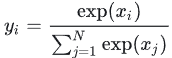

# I-JEPA

时间：2023-01

论文：Self-Supervised Learning from Images with a Joint-Embedding Predictive Architecture

## 思想

计算机视觉中的自监督学习方法包括**基于不变性的方法**和**生成式方法**。invariance-based methods 和 generative methods：

- 对比学习（CL）是典型的基于不变性的方法，通过优化编码器，使其生成同一图像的多个增强视图的相似嵌入。尽管基于不变性的预训练方法可以生成高语义级别的表示，但其**特定于手工设计的数据增强方法引入的偏置**，和**特定于图像的增强技术**限制了它们在不同任务和其他模态下的推广能力。
- 在本研究中，将掩蔽图像建模（MIM）归为生成式方法，通过从输入中重构随机破坏（掩蔽、加噪等）的 patches 来学习表示，可以在像素级别或 token 级别上进行。尽管生成式预训练方法在**先验知识需求**上和**跨模态应用方面**具有优势，但由此产生的表示往往**具有较低的语义级别**，并且在某些评估（线性探测）和迁移（语义分类任务）设置中表现不如基于不变性的预训练方法。

如何提高自监督表示的语义级别，而不依赖于通过图像变换编码的额外先验知识呢？

作者首先使用**能量模型（Energy-Based Models，EBMs）**来描述这两种自监督学习的目标。能量函数通常写作，用于衡量输入对 x，y 的 compatibility，也可以理解为 x, y是否匹配，能量越小匹配度越高。自监督学习的目标是给不匹配的输入对分配高能量，并给匹配输入对分配低能量。

- 如 CL 等基于不变性的方法可以使用图 1a 所示的**联合嵌入架构（Joint-Embedding Architectures，JEA）**来描述。CL 通过为同一输入图像随机应用手工设计的数据增强方法来构建x, y对，再通过能量函数学习为匹配的输入对输出相似的嵌入，对不匹配的输入对输出不相似的嵌入。
- 而 MIM 等生成式方式可以使用图 1b 所示的**生成式架构（Generative Architectures）**来描述。MIM 使用掩码（masking）来生成匹配的x, y对，其中 x 是输入图像 y 的掩蔽视图。额外的条件变量 z 对应于一组掩码和位置 tokens，用于指示解码器直接重建匹配信号 y  。

结合上述两种自监督学习方法的缺陷，本文在两种架构的基础上提出了**联合嵌入预测架构（Joint-Embedding Predictive Architecture，JEPA）**，如图 1c 所示。

与 Generative Architectures 在概念上类似，但关键区别在于损失函数应用于嵌入空间而不是输入空间。JEPA 通过一个额外的条件变量 z ，使用预测器网络预测匹配信号 y 的嵌入。与 JEA 不同，JEPA 不寻求对一组手工设计的数据增强不变的表示，而是在额外的条件变量 z 下寻求彼此预测的表示。

## 方法

作者提出的**基于图像的联合嵌入预测架构（Image-based JointEmbedding Predictive Architecture，I-JEPA）**如图 2 所示，通过给定的一个 context block，预测同一图像中各种 target blocks 的表示。与 MAE 的区别在于 I-JEPA 的预测是在表示空间中进行的，所以它是非生成式的。

具体来说，基于图像的联合嵌入预测体系结构使用单个 context block 来预测来自同一图像的不同 target block 的表示。context 编码器是一个 ViT，它只处理可见的 context patches。预测器是一个 tiny ViT，它接收 context 编码器的输出，并根据位置 tokens（以颜色显示）预测 target block 在特定位置的表示。target 表示是 target 编码器的输出，其权重在每次迭代中通过 context 编码器权重的指数移动平均更新。

# BLIP

**BLIP**(Bootstrapping Language-Image Pretraining)是**salesforce**在2022年提出的多模态框架，是理解和生成的统一，引入了跨模态的编码器和解码器，实现了跨模态信息流动，在多项视觉和语言任务取得SOTA。

**为什么叫Bootstrapping**，是因为训练数据来自网络图文对，包含大量噪声，所以**增加了一个在线数据打标签和清理的任务**，把处理好的数据继续用来迭代原模型。

**BLIP引入了编码器-解码器的多模态混合结构MED**（ Multimodal mixture of Encoder-Decoder）**，能够有效地进行多任务预学习和迁移学习。**包括两个单模态编码器（lmage Encoder，Text Encoder），一个以图像为基础的编码器（image-grounded text encoder）和一个以图像为基础的解码器（image-grounded text decoder）。

三个损失函数联合进行预训练：

* **图像-文本对比损失 ITC**（Image-Text Contrastive Loss）：针对图像编码器和文本编码器，通过正负图文对的对比学习，**来对齐图像和文本的潜在特征空间。**
* **图像-文本匹配损失 ITM**（Image-Text Matching Loss）：针对以图像为基础的文本编码器，通过对图文匹配性进行二分类，**建模图文多模态信息的相关性。**
* **语言建模损失 LM**（Language Modeling Loss ）：针对以图像为基础的文本解码器，通过交叉熵损失进行优化，**训练模型以自回归的方式生成目标caption。**

网络上获得的大量图文对，通常包含许多不准确甚至错误的信息，为了有效利用这种形态的数据，BLIP提出caption生成和过滤模块**CapFilt**（Captioning and Filtering），首先从噪声图文对中学习，然后生成和过滤产生新的数据集，再去迭代优化原模型。

**CapFilt包含**两个模块：**一个是captioner**，给网络图像生成caption，**另一个是Filter**，过滤原始网络文本和合成文本中的噪声caption。

Captioner和Filter都是从预训练的模型初始化的，并在人工标注数据集上单独进行微调。

* **Captioner是image-grounded text decoder，**它在人工标注数据集上以LM为目标进行微调，对给定的图像进行文本解码，这里给定网络图片，Captioner生成合成caption 。
* **Filter是image-grounded text encoder**，它根据**ITC**和**ITM**的目标进行微调，以学习文本是否与图像匹配，去除原始网络文本和合成文本中的噪音文本。
* **Bootstrap过程，**Captioner生成的图文对与Filter过滤后的网络图文，再加上人工标注的图文对结合起来，形成一个新的数据集，重新预训练一个新模型。

# LLaVA

2023-04

LLaVA主要由三部分组成：Pretrained LLM，Pretrained Vision Encoder和Projection Layers。

* Pretrianed LLM即为目前比较火的Decoder-only language model，比如LLaMA，LLaMA-2等。
* Pretrained Vision Encoder即为一个预训练的视觉编码器，通常是CLIP的中的视觉分支。
* Projection Layers即为一个简单的线形层，这个projector的作用是将image通过vision encoder得到的visual feature从visual space转化到language space从而可以输入LLM。

LLaVA的训练包含两个阶段：预训练和微调。

LLaVA的预训练阶段是在Image-Text pair数据上进行的，在这个过程之中，只有Projection layers部分是可训练的，模型的其他部分（LLM和vision encoder）都是冻住的。预训练这个阶段是为了训练一个较好的projection layer可以将visual feature映射到linguistic space。换句话说，为了让vision encoder的output space和LLM的input space实现一个对齐。这个阶段结束之后模型获得了一个初步的理解图像的能力。

LLaVA的微调阶段分为两种，一种是在instruct template数据上进行Instruct Tuning，另一种是在ScienceQA数据集上进行微调。这里我们以Instruct Tuning为主要展开。首先，这个阶段中可训练的部分包括整个LLM和projection layer。这一阶段可以对应于目前比较火的LLM的Instruction fine tuning，目的是为了让模型更好地遵循用户给出的Instruction。换句话说，为了让模型更好地和人类意图进行对齐。所以，这个阶段的作用可以类比到GPT-3向InstructGPT的转变，即模型可以更好地遵循人类指令。

# LISA：图像分割大模型

2023-08

香港中文大学终身教授**贾佳亚**团队，最新提出**LISA**大模型——理解人话，精准分割。

尽管当前多模态大模型（例如Flamingo[1], BLIP-2[2], LLaVA[3], miniGPT-4[4], Otter[5]）使得AI能够根据图像内容推理用户的复杂问题，并给出相应的文本分析和回答，但仍无法像视觉感知系统那样在图像上精确定位指令对应的目标区域（**图像分割**）。

因此，LISA通过引入一个`<SEG>`标记来扩展初始大型模型的词汇表，并采用Embedding-as-Mask的方式赋予现有多模态大型模型分割功能，最终展现出强大的零样本泛化能力。

首先将图像ximg和文本xtxt送到多模态-大语言模型F（在实验中即LLaVA），得到输出的文本结果，如果此时文本结果包含`<SEG>`标记，则表示需要通过输出分割预测来解决当前问题。反之，若不包含`<SEG>`标记，则无分割结果输出。

如果存在标记，则将`<SEG>`标记在多模态大模型F最后一层对应的embedding经过一个MLP层得到hseg，并将其与分割视觉特征f一起传递给解码器Fdec（其中分割视觉特征f由输入编码器Fenc对图像ximg进行编码得到）。

最终，Fdec根据生成最终的分割结果M。

# MiniGPT4

2023-10

MiniGPT-4的模型结构是在BLIP-2的基础上，在Q-Former之后加了一个线形层。这个线性层的作用也是将Q-Former输出的visual feature和LLM输入端的linguistic space做一个对齐。在整个的训练过程之中也只有这个线形层是可训练的。

预训练阶段：

这个阶段作者收集了Conceptual Caption, SBU和LAION数据集共5million的图像文本对，然后对MiniGPT-4进行了预训练。作者发现预训练之后MiniGPT-4的生成效果并不好，会有重复，分裂和无关等问题。所以进行了第二阶段微调的训练。

微调阶段：

首先作者从Conceptual Caption中随机抽取了5K张图片，然后利用预训练之后的MiniGPT-4生成了对这些图片更详细的描述，并用ChatGPT对这些生成的描述尽心了语法，标点符号等方面的修改，最终得到3.5K个质量较好的图像文本对。然后，作者将这3.5K个图像文本对组织成[Image, Instruction; Caption]的形式，并在这上面对MiniGPT-4继续训练。

# QwenVL

2023-08

架构：

1、采用大型语言模型作为其基础组件。Qwen-7B(Qwen, 2023)的预训练权重进行初始化。

2、视觉编码器使用Vision Transformer(ViT)(Dosovitskiy et al., 2021)架构。使用Openclip的ViT-bigG(Ilharco et al., 2021)的预训练权重进行初始化。

3、位置感知的视觉语言适配器:为了缓解长图像特征序列带来的效率问题,Qwen-VL引入了一个压缩图像特征的视觉语言适配器。该适配器包含一个随机初始化的单层交叉注意力模块。该模块使用一组可训练向量(嵌入)作为查询向量,并使用来自视觉编码器的图像特征作为键进行交叉注意力操作。这种机制将视觉特征序列压缩为固定长度256。

训练方法：

1、第一阶段,我们主要利用大规模的弱标记网络爬取的图像-文本对

2、第二阶段的多任务预训练中,我们引入了高质量和细粒度的VL注释数据,以及较大的输入分辨率和交错的图像-文本数据。

3、通过指令微调对Qwen-VL预训练模型进行了微调,以增强其遵循指令和对话能力,得到交互式的Qwen-VL-Chat模型。指令调谐数据量为35万。

# MiniGPT-5

2023-10

该研究旨在为大型语言模型赋予多模态生成能力。为此，研究人员提出了一个结构化的框架，将预训练的多模态大型语言模型与文本到图像生成模型相结合。为了弥合不同模型领域之间的差异，他们引入了称为“generative vokens”的特殊视觉标记，这些标记能够指导基于原始图像的训练。此外，他们还采用了两个阶段的训练方法，并结合无分类器引导策略来进一步提高生成质量。

输入阶段：

（这部分其实就是MiniGPT-4，然后添加n个图片token）

由于原始 LLM 的 V 词汇仅包含文本标记，为此，我们引入了一组特殊标记 。 作为生成 voken 进入 LLM 的词汇表。这些 voken 在 LLM 中的输出隐藏状态被用于后续图像生成，而这些 voken 的位置可以表示在交替文图的输出中的位置。当所有预训练权重在 MiniGPT-4 中固定时，可训练参数包括额外的输入嵌入θvoken input 和输出嵌入θvoken output。

输出阶段：

为了准确地对齐生成令牌与生成模型，我们设计了一个紧凑的映射模块来匹配维度，并结合了几个监督损失，包括文本空间损失和潜在扩散模型损失。

文本空间损失：在训练过程中，我们将Vokens放在真实图像的位置，并训练模型以预测文本生成中的vokens。

潜在扩散模型损失：输出隐藏状态hvoken应该与文本条件图像生成模型的文本条件特征空间对齐，以引导扩散模型生成真实图像。我们使用潜在扩散模型 (LDM) 的损失作为指导。在训练期间，首先通过预训练的变分自编码器 (VAE) 将真实图像转换为潜在特征 z0。然后，我们将噪声 e 添加到 z0 中以获得噪声潜在特征 zt。使用预训练的 U-Net 模型计算潜在扩散模型损失。

训练策略：

我们观察到直接在有限的交替文本和图像数据集上训练会导致对齐错误和降低图像质量。因此，我们采用两种不同的训练策略来缓解这个问题。第一个策略包括使用classifeir-free guidance，该技术通过扩散过程放大生成令牌的有效性。第二个策略分为两个阶段：首先进行预训练阶段，专注于粗粒度特征对齐，然后进行微调阶段，专门用于复杂特征学习。

无条件引导（CFG）：分类器免费指导（Classifier-free Guidance）是一种用于增强生成模型性能的技术。它通过在训练过程中引入条件和无条件生成的混合来实现这一点，从而提高了生成模型对输入数据的理解能力。具体来说，在训练期间，我们以 10% 的概率用零特征替换 hvoken ，得到无条件特征 h0。在推理时， 无条件特征作为负提示。

双阶段训练策略：考虑到纯文本生成与文本图像生成之间的非平凡域转移，我们提出了一个双阶段训练策略：单模对齐阶段（UAS）和多模学习阶段（MLS）。最初，在单个文本文本图像对数据集（如CC3M）中，我们将voken特征与图像生成特征进行对齐，其中每个数据样本仅包含一个文本和一个图像，而文本通常是图像的标题。在单模态对齐阶段之后，模型能够为单个文本描述生成图像，但在交替视觉语言生成方面遇到困难，包括多个文本-图像对，并且需要复杂的推理来同时生成文本和图像。为此，在多模态学习阶段，我们进一步使用包含 VIST 等交替视觉语言数据集的 PEFT 参数微调我们的模型，其中数据样本具有几个步骤，文本与图像相关联并且文本按顺序相关。在此阶段，我们从数据集中构建了三种类型的任务，包括：（1）仅文本生成：给定下一个图像，生成相关的文本；（2）仅图像生成：给定下一个文本，生成相关的图像；以及（3）多模式生成：通过给定上下文生成文本-图像对。

# LWM

大世界模型（ Large World Model ，LWM）

WORLD MODEL ON MILLION-LENGTH VIDEO AND LANGUAGE WITH RINGATTENTION

时间：2024-2-13

机构：UC伯克利

在传统方法中，AI模型往往只能处理较短的文本或视频片段，缺乏对长时间复杂场景的理解能力。然而，现实世界中的许多场景，如长篇书籍、电影或电视剧，都包含了丰富的信息，需要更长的上下文来进行深入理解。为了应对这一挑战，LWM团队采用了环形注意力(RingAttention)技术，成功扩展了模型的上下文窗口，使其能够处理长达100万个令牌(1M tokens)的序列。

## Stage I: 语言模型

这一阶段的目标是首先开发LWM-Text和LWM-Text-Chat

## 扩展上下文

为扩展语言模型的上下文，我们采用了以下方法： 

1、使用RingAttention实现长文档的可扩展训练。 

2、在逐渐增加的上下文长度数据上进行渐进式训练。

3、通过扩展RoPE中的θ参数实现位置编码的外推。

## 对话微调

我们从Books3数据集中的文档构建了一个简单的QA数据集，以学习长上下文对话能力。具体做法是将每个文档分割成固定的1000 token的块，输入到短上下文语言模型中，提示其为每个段落生成一个问答对。然后，对于给定的上下文长度（如32K），我们将相邻的块连接在一起构成一个32K token的样本，并以对话的形式将相关的QA对附加在序列的末尾。在微调阶段，模型在UltraChat和自定义问答数据集上进行训练，比例为7:3。

## 对话微调

## Stage II：视觉-语言模型

架构修改：在第一阶段的基础上，对LWM和LWM-Chat进行修改，使其能够接受视觉输入。具体来说，使用预训练的VQGAN将256x256的输入图像转换为16x16的离散token，对视频进行逐帧的VQGAN编码并将编码连接起来。此外，引入了特殊的标记符号和来区分文本和视觉token，以及和来标记图像和视频帧的结束。

训练步骤：从LWM-Text-1M模型初始化，采用与第一阶段类似的逐步增加序列长度的训练方法，首先在1K tokens上训练，然后是8K tokens，最后是32K、128K和1M tokens。训练数据包括文本-图像对、文本-视频对以及下游任务的聊天数据，如文本-图像生成、图像理解、文本-视频生成和视频理解。在训练过程中，逐步增加下游任务的混合比例。

第二阶段通过逐步增加序列长度并在大量文本-图像和文本-视频数据上训练，成功扩展了第一阶段的语言模型，使其具备视觉理解能力。这一阶段的模型可以处理长达1M tokens的多模态序列，并在长视频理解、图像理解和生成等方面展现出强大的能力。

# RingAttention

局部的softmax和全局的softmax可以推出一个公式关系。利用这一点，flash-attention使用SRAM来计算局部的attention，再规约到全局的attention，并将attention包装为一个CUDA kernel，大大加速attention计算速度，并减小现存占用。

ring attention则先让一个GPU计算attention的一个局部，整个GPU多卡集群就可以计算出全局的attention，这样就大大扩展了Transformer序列长度。

## Softmax分解

softmax:

注意到softmax函数有平移不变的性质：

一般的softmax实现都是利用这个性质，给分子分母同时减去最大值，这样取指数的时候就不容易越界了:

flash-attention则利用这个性质，来大幅提高softmax算子的局部性。将x向量分块，先对分块计算，然后结合所有分块的结果进行组合，计算出最终softmax结果。

例如，考虑把x分成两个块：

找到局部最大值，和全局最大值：

对于第一个块里面的输出值，计算为：

所以呢，通过计算局部块的指数 exp ，累积和 ，以及最值  并保留下来，就可以算出全局的softmax了。

## Flash Attention

flash attention是一个attention的算子，主要目的是加速attention的计算。

flash-attention的核心思想就是，把attention的计算分成一小块一小块的，放在SRAM里面算，算完以后再通过前面介绍的关系，把全局的attention值算出来。大大提升了attention的计算速度。

GPU里面的存储有个层次结构。

* HBM (high bandwidth memory，可以认为就是cuda编程里面的global memory)就是显卡上边的memory，容量大，但是速度慢; 
* SRAM (Static Random-Access Memory，可以认为就是cuda编程里面的shared memory)，容量小，但是速度快。

## Ring Attention

我们希望 context length 能随卡数线性扩展，卡越多，则 context length 越长。那么一个自然的思路就是让每张卡去算 1/n 的 context length。ring attention 就是基于这种切分的方法。

这个attention长度的扩展还是根据GPU数量线性增加的，有多少GPU就能扩多长。

# V-JEPA

# AnyGPT

复旦大学 2024-02 AnyGPT: Unified Multimodal LLM with Discrete Sequence Modeling

数据：我们利用现有的生成模型合成了各种模态交错的指令数据集AnyInstruct，包含108k条多轮对话样本，503k条语音，205k张图片和113k条音乐。此外，我们从现有的指令数据集中筛选并清洗了100k条适合朗读的数据，并合成了一个语音对话数据集，以增强模型的语音对话能力。

* 图像分词器  我们使用SEED分词器进行图像分词。SEED分词器包括几个 组件，包括ViT编码器， 因果Q-Former，VQ码书，多层感知器（MLP），以及一个UNet解 码器。SEED将224 × 224的RGB图像作为输入，ViT编码器将图像 编码为16 ×16个补丁，然后因果Q-Former将补丁特征转换为32个因果嵌入。一个有8192个 条目的码书将嵌入离散化为一系列量化代码。MLP用于将视觉代码解码为生成嵌入，该嵌入 与预训练的unCLIP Stable Diffusion的潜在空间对齐。最后，UNet解码器用于将生成嵌入恢复为原 始图像。
* 语音分词器  我们使用的语音分词器 是SpeechTokenizer， 采用带有剩余矢量量化（RVQ）的编码器-解 码器架构。SpeechTokenizer将单声道音频序 列压缩为离散化矩阵，使用八个具有1024个 条目的分层量化器，并实现50 Hz的帧速率。第一个量化器层捕获语义内容，而第2到8层 编码语调细节。因此，10秒音频被转换为 一个500 × 8矩阵，分为语义和声韵标记。我们采用一个在Commonvoice和Librispeech数据 集上预训练的SpeechTokenizer变体。
* 音乐分词器   尽管语音和音乐共享相似的数据 格式，但它们在实质内容上的差异使我们将 它们视为具有各自分词器的不同模态。对于音 乐，我们使用Encodec(D’efossez et al., 2022)作 为音乐分词器，这是一个带有使用剩余矢量 量化（RVQ）进行量化的卷积自动编码器，并 在20,000首音乐曲目上预训练。我们使用一个 现成的Encodec变体1，处理32kHz的单声道音 频，并实现50Hz的帧速率。生成的嵌入使用 具有2048个条目的四个量化器进行量化，从而 形成一个综合音乐词汇量大小为8192的矩阵。 

# MiniGemini：图像理解和生成大模型

时间：2024-04

香港中文大学终身教授贾佳亚团队提出多模态模型**Mini-Gemini**

Mini-Gemini还提供了2B小杯到34B的超大杯，最强模型在多个指标上相比谷歌的Gemini Pro甚至GPT-4V都不遑多让。

核心在于三点：

**(1) 用于高清图像的双编码器机制**

Mini-Gemini 将传统所使用的 ViT 当做低分辨率的 Query，而使用卷积网络 (ConvNeXt ) 将高分辨率的图像编码成 Key 和 Value。使用 Transformer 中常用的 Attention 机制，来挖掘每个低分辨率 Query 所对应的高分辨率区域。从而在保持最终视觉 Token 数目不变的情况下去提升对高清图像的响应，保证了在大语言模型 (LLM) 中对于高清图像的高效编码。值得一提的是，由于高分辨率分支卷积网络的使用，可以根据需要对图像所需的分辨率自适应调整，能够遇强则强。

**(2) 更高质量的数据**

作者基于开源数据，构建了一个高指令的数据集**，**可以促进精确的图像理解和基于推理的生成。

**(3) 训练阶段结合生成模型数据拓展**

对于图像的生成部分，Mini-Gemini 借助了 SDXL，使用 LLM 推理后所生成的文本链接两个模型，类似于 DALLE3 的流程。让 MLLM 通过特殊的 token 来激活输出适合 DALLE3 或者 SDXL 的文本，然后将该文本直接丢给这些模型，实现文生图功能。

通过在用户输入指令最后显式的写 `<GEN>`   token，然后 MLLM 会在回复的最后返回`<h>` 和 `</h> ` 以及中间内容。这个内容就可以直接丢给 SDXL 了。

# LLama3

