# Dreambooth

2022-04

背景：

文生图模型可以根据prompt生成高质量图片，但是模型不能保留ID，在不同情境中生成新颖的图片。（即主角不变，只改变背景）。

DreamBooth是一种个性化文生图模型：给定某个物体的几张图片作为输入，通过微调预训练的文生图模型（如Imagen），将一个独特的标识符和该物体进行绑定，这样就可以通过含有该标识符的prompt在不同场景下生成包含该物体的新颖图片。

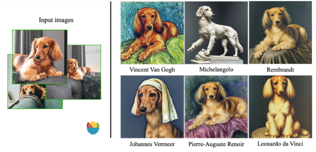

方法：

作者希望将输入图片中的物体与一个特殊标识符绑定在一起，即用这个特殊标记符来表示输入图片中的物体。因此作者为微调模型设计了一种prompt格式：`a [identifier] [class noun]`，即将所有输入图片的promt都设置成这种形式，其中`identifier`是一个与输入图片中物体相关联的特殊标记符，`class noun`是对物体的类别描述。这里之所以在prompt中加入类别，是因为作者想利用预训练模型中关于该类别物品的先验知识，并将先验知识与特殊标记符相关信息进行融合，这样就可以在不同场景下生成不同姿势的目标物体。

例如：

- 3-10张图片, 最好是不同角度，且背景有变化的图片
- 类名class name+独特标识符unique identifier，例如：instance prompt: a photo of **Halley** Dog; class prompt: a photo of **Dog**。这里Halley是独特标识符，Dog是类名。
- 微调即可。

# Textual Inversion

时间：2022-08

> **embedding是textual inversion的结果，因此textual inversion也可以称为embedding。该方法只需要3-5张图像，通过定义新的关键词，就能生成和训练图像相似的风格。**

背景：Stable Diffusion它们的Embedding空间的表现力足以捕捉基本的语义信息，但是这两者都无法准确捕捉概念的外观，将它们用于特定主题的图像生成会导致相当大的视觉差异。如果为每个新概念使用特定数据集重新训练模型，那成本将非常高，并且对少数示例图片进行finetune通常会导致灾难性的遗忘。

本文提出Textual Inversion方法，只需使用用户提供的3~5张概念图片，通过学习文图生成模型Text Embedding空间中的伪词（pseudo-word）来表示这些概念。然后把这些伪词组合成自然语言的句子，指导个性化生成。

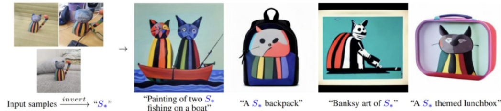

原理：

- 输入字符串中的每个词（**word**）或子词（**sub-word**）都被转换为一个标记（**Token**），它是预定义词典中的索引（参见**BPE**算法）；
- 然后将每个**Token**对应到一个唯一的嵌入向量（**embedding**），这些嵌入向量通常作为文本编码器的一部分进行学习；
- 选择这个嵌入向量空间作为反演（**Inversion**）的目标，指定一个占位符字符串 **S\*** 来表示希望学习的新概念；
- 用新学习的嵌入向量 **v\*** 替换与新概念关联的嵌入向量，即将概念注入（**inject**）到词汇表中；
- 跟处理其它单词一样，用该概念字符组成新句子，例如： A photo of **S\***, A painting in the style of **S\*.**

因此，Textual Inversion只需要训练文本嵌入层即可，而Dreambooth理念需要微调文生图模型。

# Hypernetworks

hypernetworks是一种fine tune的技术，最开始由novel AI开发。hypernetworks是一个附加到stable diffusion model上的小型网络，用于修改扩散模型的风格。

既然Hypernetworks会附加到diffusion model上，那么会附加到哪一部分呢？答案仍然是UNet的cross-attention模块，Lora模型修改的也是这一部分，不过方法略有不同。

hypernetworks是一个很常见的神经网络结构，具体而言，是一个带有dropout和激活函数的全连接层。通过插入两个网络转换key和query向量。

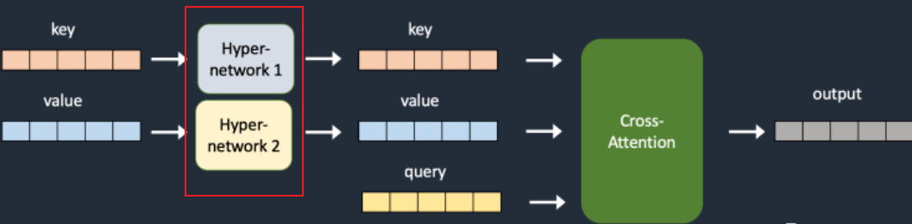

和其他方法的对比：

LoRA: Lora模型和Hypernetworks比较相似，都是通过作用于UNet的cross-attention模块，改变生成图像的风格。区别在于LoRA改变的是cross-attention的权重，而Hypernetworks插入了其他的模块。LoRA的结果通常比Hypernetworks更好，而且模型结构都很小，基本都低于200Mb。值得注意的是，LoRA指的是一种数据存储的方式，没有定义训练过程，因此可以和Dreambooth和其他的训练方式结合起来使用。

embeddings: 是textual inversion方法的结果，和Hypernetworks方法一样，不会改变模型，会定义一些新的关键字实现某些样式。embedding和Hypernetworks作用的地方不同。embedding在text encoder中创造新的embedding达到左右模型生成图片的效果。根据一些参考资料，embedding的效果比Hypernetworks要稍好一些。

# ControlNet

时间：2023-02

ControlNet可以从提供的参考图中获取布局或者姿势等信息, 并引导diffusion model生成和参考图类似的图片。调整prompt确实是一件费时费力的事情，而有了ControlNet则可以精确的控制生成图片的细节(当然, 也依赖于你已经有一张参考图了)。

为了能继承大模型的能力, ControlNet将原来大模型的参数分为两部分, 分别是**可训练**和**冻结**的。

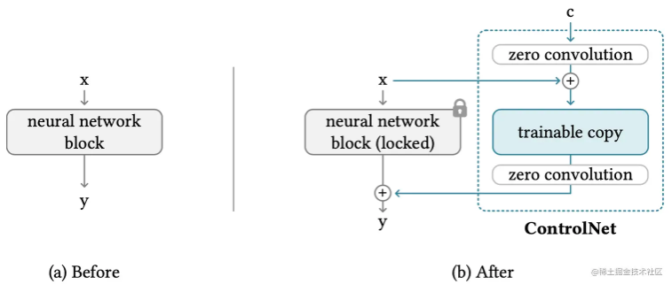

图(a)是之前stable diffusion的输出, 图(b)和图(a)的区别在于添加了ControlNet的结构, 具体而言是将`neural network block`复制了一份, 作为`trainable copy`,并且`neural network block`的网络参数会被冻结住。而且`trainable copy`前后会有`zero convolution`, `zero convolution`其实是1*1的卷积。最后会将`neural network block`和`trainable copy`的特征相加。

Before前模型是这样的：

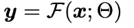

After模型是这样的：

并且，训练前：

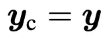

上一部分描述了ControlNet如何控制单个神经网络块，论文中作者是以Stable Diffusion为例子，讲了如何使用ControlNet对大型网络进行控制。灰色部分是原来stable diffusion的结构, 蓝色部分是从U-Net的encode对应部分copy, 经过`zero convolution`后和U-Net的decode相加。

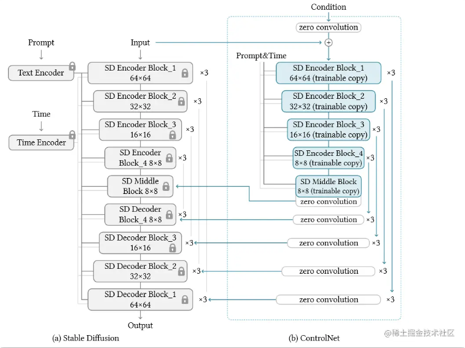

虽然ControlNet新加了些模型结构, 但由于大部分参数都被冻结, 因此训练时实际上只用原来stable diffusion模型的23%显存和34%的训练时间, 可以在单张40GB的A100卡上做训练（50k数据）。

# AnyDoor

时间：2023-07

机构：香港大学、阿里集团、蚂蚁集团联合开源

AnyDoor实现了零样本的图像嵌入，主要功能是“图像传送”，点两下鼠标，就能把物体无缝「传送」到照片场景中，光线角度和透视也能自动适应。例如，将女生的蓝色短袖换成其他样式的红色衣服。

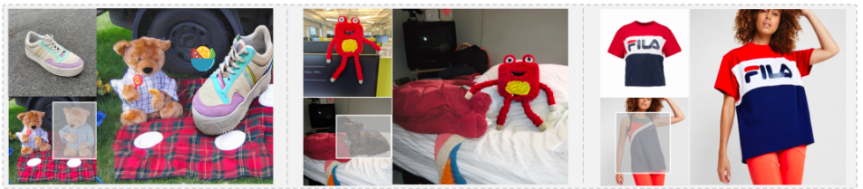

工作原理：

首先采用分割模块从对象中删除背景，然后使用ID提取器获取其**ID Tokens**。然后，我们对“干净”的对象应用高通滤波器，将所得的高频图(HF-Map)与期望位置的场景拼接起来，并使用细节提取器以纹理细节补充ID提取器。最后，将**ID Tokens**和**Detail Maps**注入预训练的扩散模型。

细节：

1、ID Extractor使用自监督式的物体提取并转换成token，这一步使用的编码器是以目前最好的自监督模型DINO-V2为基础设计的。

2、ID Extractor专注于细节提取；而"HF-Map"高频图侧重于全局信息。

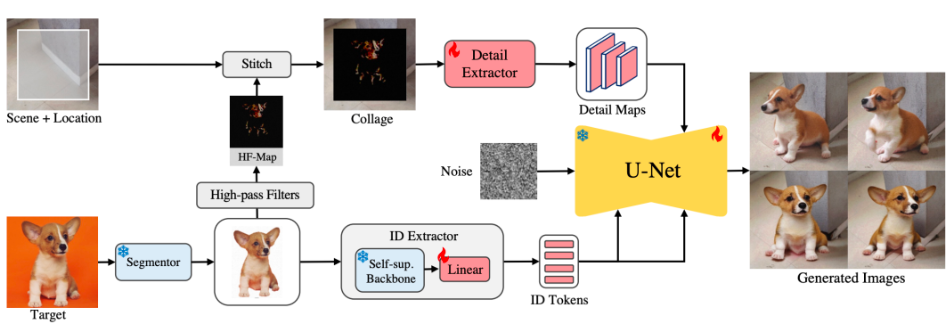

# IP-Adapter

时间：2023-08

机构：腾讯

“垫图”这个概念大家肯定都不陌生，此前当无法准确用prompt描述心中那副图时，最简单的办法就是找一张近似的，然后img2img流程启动，一切搞定。img2img有它绕不过去的局限性，比如对prompt的还原度不足、生成画面多样性弱，特别是当需要加入controlnet来进行多层控制时，参考图、模型、controlnet的搭配就需要精心挑选。

如下图，img2img生成画面多样性弱：对参考图依赖强，对提示词依赖弱。

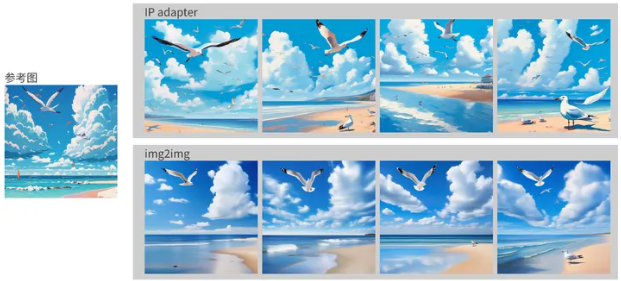

IP-Adapter （Image Prompt Adapter）基于解耦的交叉注意力机制，允许模型同时处理文本和图像信息，而不会互相干扰。

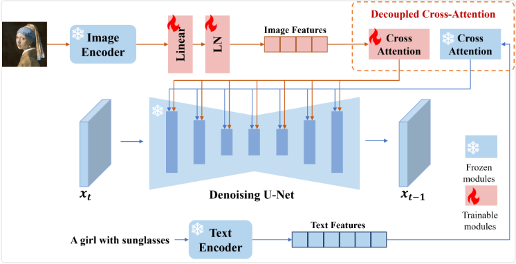

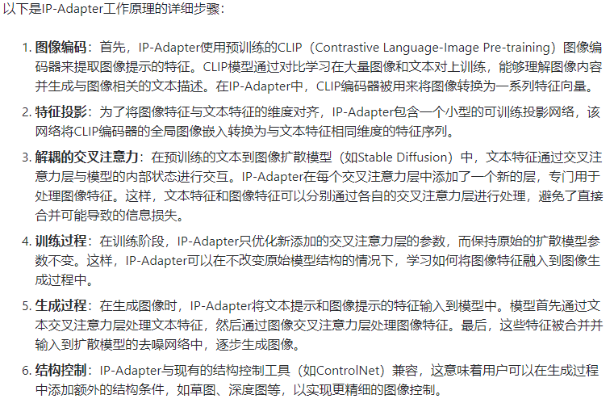

# PhotoMaker

时间：2023-12

机构：腾讯

特点：不用训练，就能复刻人脸（因为这里主要训练了人脸数据）。

PhotoMaker 主要通过将任意数量的输入图像编码成堆叠的ID嵌入来保存信息。这种嵌入不仅可以全面封装人物特征，还可以容纳不同 ID 的特征以便后续集成。它的工作原理是从文本编码器和图像编码器分别获得来源，通过合并和提取相应类的ID嵌入。从而很好地生成统一ID的内容。简单来说，PhotoMaker能够在保留人物特征的情况下，轻松更换多种风格也不失真，同时，它还满足高质量输出，最终出来的效果相对好很多。

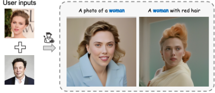

在实现机制上，PhotoMaker先从文本和图像编码器中获取相应的嵌入，然后通过合并类别嵌入和图像嵌入来形成融合嵌入。这些嵌入最终被串联成堆叠ID嵌入，供后续的Diffusion Model生成图像使用。

# InstantID

时间：2024-01

机构：据说是小红书

目前基于`diffusion model`做定制生成主要有两类方法：inference before fine-tune和inference without fine-tune。inference before fine-tune方法每次有新的概念都需要训练模型，相对繁琐，但效果较好，代表工作有`DreamBooth`, `lora`, `textual inversion`等。inference without fine-tune的方法需要预先在大量数据上训练一个鲁棒的object embedding提取模型，推理时无需再次训练，代表工作有`AnyDoor`， `IPAdapter`等。

人脸的定制生成往往需要更加细粒度（fine-grain）的特征提取，现有的基于inference without fine-tune的方法做的都不是很好。本文提出了一种即插即用plug-and-play 定制人脸生成模型（Plugability），给定一张人脸照片，就能生成指定风格和pos的照片。InstantID不仅前期训练成本低（compatibility），还能实现inference without fine-tune （Tuning-free）和高保真图像的生成。（Superior performance）。取得了fidelity、efficiency、flexible三者很好的平衡。

为了实现上述目的，设计了3个模块

- `ID embedding`: 用于提取reference image的人脸特征。
- `Adapted module`：用于将人脸特征融入到`diffusion model`中
- `IdentityNet`：用于将人脸的spatial 信息融入到`diffusion model`中

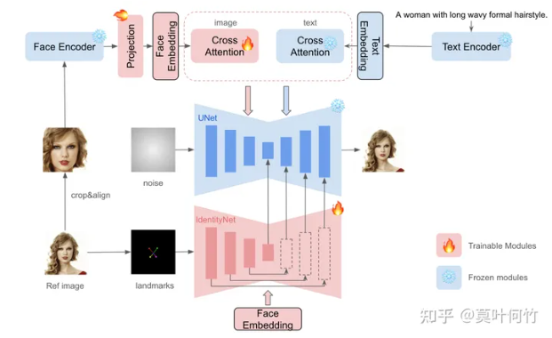

三个模块的作用和原理：

1、`ID embedding`：作者认为`CLIP`的训练用了大多数弱对齐的语料，这导致`CLIP` image encoder提取的特征来自广泛模糊的语义信息，对于ID级别的特征提取的粒度是不够的。因此作者此处用了人脸领域的预训练模型antelopev2提取Id embedding。

2、`Adapted module`：这篇paper参考了`IP-Adapter`的方法，分别将image embedding和text embedding融入到decoupled cross-attention中。

3、`IdentityNet`：`IdentityNet`的核心目的是给`diffusion model`增加spatial control的能力,来弥补损害的text edit能力。作者采用`Controlnet`的思路来实现`IdentityNet`。

# FlashFace

