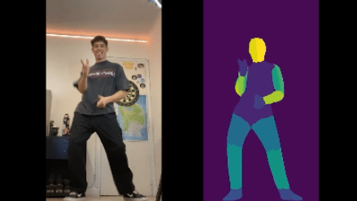

# Vid2DensePose

Vid2DensePose 是一款功能强大的工具，旨在将 **DensePose** 模型应用于视频，为每个帧生成详细的“部分索引”可视化。该工具对于增强动画特别有用，特别是与 MagicAnimate 结合使用以实现时间一致的人体图像动画。

# DensePose

DensePose是Meta开源的项目，可以将 RGB 图像的所有人体像素映射到人体的 3D 表面。

具体来说，DensePose 利用深度学习将 2D RPG 图像坐标映射到 3D 人体表面，把一个人分割成许多 UV 贴图（UV 坐标），然后处理密集坐标，实现动态人物的精确定位和姿态估计。

# Magic Animate 

字节开源项目，它可以从单张图片和一个动作视频中生成动画视频。（多人也是可以的）

是一个基于扩散模型的人类图像动画框架，意在强调时间一致性，忠实保留参考图像并提高动画的真实感，可以在推理的过程中产生平滑的视频。

# Animate Anyone

阿里项目，但是没有开源。被字节秒了！

角色+动作+视频平滑控制

* referenceNet用来进行角色控制
* pose guider进行动作的编码
* 最后使用temperal layer进行时延的训练，使得最后的图像序列在时间上保证连续性

# Magic-Me: Identity-Specific Video Customized Diffusion