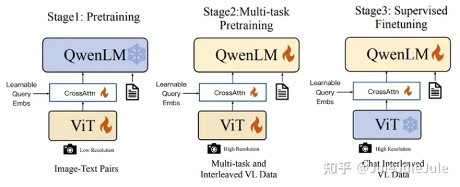

> https://zhuanlan.zhihu.com/p/682893729

# LLaVA

2023-04

LLaVA主要由三部分组成：Pretrained LLM，Pretrained Vision Encoder和Projection Layers。

* Pretrianed LLM即为目前比较火的Decoder-only language model，比如LLaMA，LLaMA-2等。
* Pretrained Vision Encoder即为一个预训练的视觉编码器，通常是CLIP的中的视觉分支。
* Projection Layers即为一个简单的线形层，这个projector的作用是将image通过vision encoder得到的visual feature从visual space转化到language space从而可以输入LLM。

LLaVA的训练包含两个阶段：预训练和微调。

LLaVA的预训练阶段是在Image-Text pair数据上进行的，在这个过程之中，只有Projection layers部分是可训练的，模型的其他部分（LLM和vision encoder）都是冻住的。预训练这个阶段是为了训练一个较好的projection layer可以将visual feature映射到linguistic space。换句话说，为了让vision encoder的output space和LLM的input space实现一个对齐。这个阶段结束之后模型获得了一个初步的理解图像的能力。

LLaVA的微调阶段分为两种，一种是在instruct template数据上进行Instruct Tuning，另一种是在ScienceQA数据集上进行微调。这里我们以Instruct Tuning为主要展开。首先，这个阶段中可训练的部分包括整个LLM和projection layer。这一阶段可以对应于目前比较火的LLM的Instruction fine tuning，目的是为了让模型更好地遵循用户给出的Instruction。换句话说，为了让模型更好地和人类意图进行对齐。所以，这个阶段的作用可以类比到GPT-3向InstructGPT的转变，即模型可以更好地遵循人类指令。

# MiniGPT-4

2023-10

MiniGPT-4的模型结构是在BLIP-2的基础上，在Q-Former之后加了一个线形层。这个线性层的作用也是将Q-Former输出的visual feature和LLM输入端的linguistic space做一个对齐。在整个的训练过程之中也只有这个线形层是可训练的。

预训练阶段：

这个阶段作者收集了Conceptual Caption, SBU和LAION数据集共5million的图像文本对，然后对MiniGPT-4进行了预训练。作者发现预训练之后MiniGPT-4的生成效果并不好，会有重复，分裂和无关等问题。所以进行了第二阶段微调的训练。

微调阶段：

首先作者从Conceptual Caption中随机抽取了5K张图片，然后利用预训练之后的MiniGPT-4生成了对这些图片更详细的描述，并用ChatGPT对这些生成的描述尽心了语法，标点符号等方面的修改，最终得到3.5K个质量较好的图像文本对。然后，作者将这3.5K个图像文本对组织成[Image, Instruction; Caption]的形式，并在这上面对MiniGPT-4继续训练。

# QwenVL

2023-08

模型的结构和BLIP-2以及MiniGPT-4都差不。

# MiniGPT-5

2023-10

该研究旨在为大型语言模型赋予多模态生成能力。为此，研究人员提出了一个结构化的框架，将预训练的多模态大型语言模型与文本到图像生成模型相结合。为了弥合不同模型领域之间的差异，他们引入了称为“generative vokens”的特殊视觉标记，这些标记能够指导基于原始图像的训练。此外，他们还采用了两个阶段的训练方法，并结合无分类器引导策略来进一步提高生成质量。

输入阶段：

（这部分其实就是MiniGPT-4，然后添加n个图片token）

由于原始 LLM 的 V 词汇仅包含文本标记，为此，我们引入了一组特殊标记 。 作为生成 voken 进入 LLM 的词汇表。这些 voken 在 LLM 中的输出隐藏状态被用于后续图像生成，而这些 voken 的位置可以表示在交替文图的输出中的位置。当所有预训练权重在 MiniGPT-4 中固定时，可训练参数包括额外的输入嵌入θvoken input 和输出嵌入θvoken output。

输出阶段：

为了准确地对齐生成令牌与生成模型，我们设计了一个紧凑的映射模块来匹配维度，并结合了几个监督损失，包括文本空间损失和潜在扩散模型损失。

文本空间损失：在训练过程中，我们将Vokens放在真实图像的位置，并训练模型以预测文本生成中的vokens。

潜在扩散模型损失：输出隐藏状态hvoken应该与文本条件图像生成模型的文本条件特征空间对齐，以引导扩散模型生成真实图像。我们使用潜在扩散模型 (LDM) 的损失作为指导。在训练期间，首先通过预训练的变分自编码器 (VAE) 将真实图像转换为潜在特征 z0。然后，我们将噪声 e 添加到 z0 中以获得噪声潜在特征 zt。使用预训练的 U-Net 模型计算潜在扩散模型损失。

训练策略：

我们观察到直接在有限的交替文本和图像数据集上训练会导致对齐错误和降低图像质量。因此，我们采用两种不同的训练策略来缓解这个问题。第一个策略包括使用classifeir-free guidance，该技术通过扩散过程放大生成令牌的有效性。第二个策略分为两个阶段：首先进行预训练阶段，专注于粗粒度特征对齐，然后进行微调阶段，专门用于复杂特征学习。

无条件引导（CFG）：分类器免费指导（Classifier-free Guidance）是一种用于增强生成模型性能的技术。它通过在训练过程中引入条件和无条件生成的混合来实现这一点，从而提高了生成模型对输入数据的理解能力。具体来说，在训练期间，我们以 10% 的概率用零特征替换 hvoken ，得到无条件特征 h0。在推理时， 无条件特征作为负提示。

双阶段训练策略：考虑到纯文本生成与文本图像生成之间的非平凡域转移，我们提出了一个双阶段训练策略：单模对齐阶段（UAS）和多模学习阶段（MLS）。最初，在单个文本文本图像对数据集（如CC3M）中，我们将voken特征与图像生成特征进行对齐，其中每个数据样本仅包含一个文本和一个图像，而文本通常是图像的标题。在单模态对齐阶段之后，模型能够为单个文本描述生成图像，但在交替视觉语言生成方面遇到困难，包括多个文本-图像对，并且需要复杂的推理来同时生成文本和图像。为此，在多模态学习阶段，我们进一步使用包含 VIST 等交替视觉语言数据集的 PEFT 参数微调我们的模型，其中数据样本具有几个步骤，文本与图像相关联并且文本按顺序相关。在此阶段，我们从数据集中构建了三种类型的任务，包括：（1）仅文本生成：给定下一个图像，生成相关的文本；（2）仅图像生成：给定下一个文本，生成相关的图像；以及（3）多模式生成：通过给定上下文生成文本-图像对。

