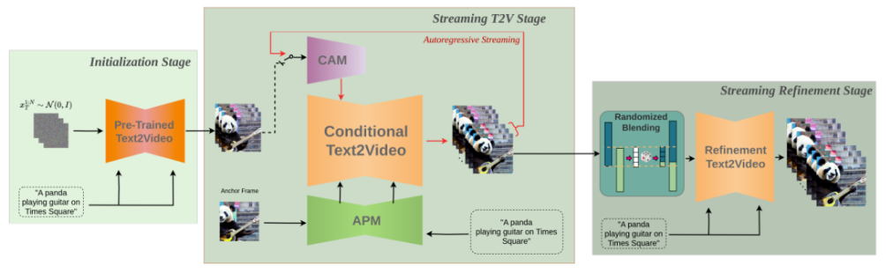
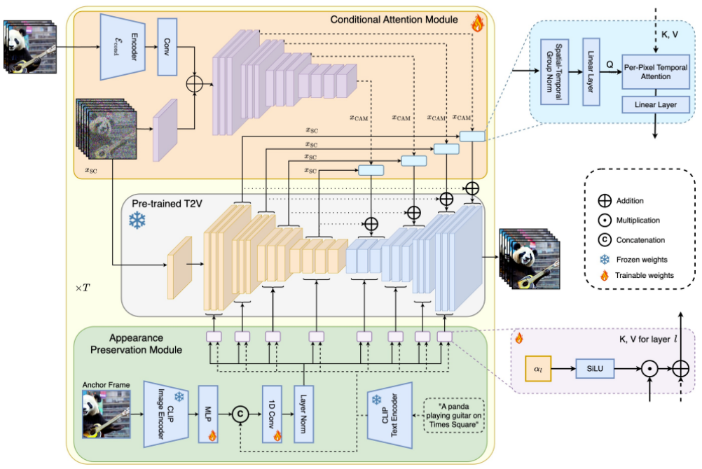

# Sora

## DALLE2

**CLIP训练过程：学习文字与图片的对应关系**
如上图所示，CLIP的输入是一对对配对好的的图片-文本对(根据对应文本一条狗，去匹配一条狗的图片)，这些文本和图片分别通过Text Encoder和Image Encoder输出对应的特征，然后在这些输出的文字特征和图片特征上进行对比学习
**DALL·E2：prior + decoder**
上面的CLIP训练好之后，就将其冻住了，不再参与任何训练和微调，DALL·E2训练时，输入也是文本-图像对，下面就是DALL·E2的两阶段训练：
阶段一 prior的训练：根据文本特征(即CLIP text encoder编码后得到的文本特征)，预测图像特征(CLIP image encoder编码后得到的图片特征)
推理时，文本还是通过CLIP text encoder得到文本特征，然后根据训练好的prior得到类似CLIP生成的图片特征，此时图片特征应该训练的非常好，不仅可以用来生成图像，而且和文本联系的非常紧(包含丰富的语义信息)

阶段二 decoder生成图：常规的扩散模型解码器，解码生成图像
这里的decoder就是升级版的GLIDE(GLIDE基于扩散模型)，所以说DALL·E2 = CLIP + GLIDE

## ViT

故为降低处理的复杂度，ViT把一张图像划分为九宫格(如下图的左下角)

## 如何将视觉数据转为patch?

LLM的成功是通过token实现的。此前已有研究表明，patch对视觉数据建模非常有效。

OpenAI研究者首先将视频压缩到一个低维潜空间中，随后把这种表征分解为时空patch，这样就实现了从视频到patch的转换。时空patch最大的好处, 是可以兼容所有的数据素材（像素、尺寸、时长）。

1、研究者开发了一个网络，来减少视觉数据的维度。Sora在这个压缩后的潜空间中进行训练，之后用于生成视频。Sora 可能采用的就是 VAE 架构，而VAE一般就是ConvNet。

2、Sora在这个压缩后的潜空间中进行训练，之后用于生成视频。

3、研究者还设计了一个对应的解码器模型，用于将生成的潜数据转换回像素空间。

## DiT-扩散Transformer

1、DiT 是一个带有 Transformer 主干的扩散模型，它 = [VAE 编码器 + ViT + DDPM + VAE 解码器]

因此，视频模型Sora是一个扩散模型；它能够接受带有噪声的patch（和条件信息，如文本提示）作为输入，随后被训练，来预测原始的「干净」patch。

重要的是，Sora是基于Transformer的扩散模型。在以往，Transformer在语言模型、计算机视觉和图像生成等多个领域，都表现出卓越的扩展能力。

# SVD

# AnimateDiff

# StreamingT2V

时间：2024-03

机构：PicsArt AI Research

近日，Picsart AI Resarch 等团队联合发布了 StreamingT2V，可以生成长达 1200 帧、时长为 2 分钟的视频，一举超越 Sora。

同时，作为开源世界的强大组件，StreamingT2V 可以无缝兼容 SVD 和 animatediff 等模型。

StreamingT2V 的关键组件包括：

（i）称为条件注意力模块（CAM）的短期记忆块，它通过注意机制根据从前一个块中提取的特征来调节当前一代，从而实现一致的块过渡；

（ii）称为外观保留模块（APM）的长期记忆块，它从第一个视频块（锚定帧）中提取高级场景和对象特征，并用于所有视频块的生成流程，保持视频全局场景、外观的一致性；

（iii）一种随机混合方法，用于增强视频分辨率和质量，通过自回归增强的方法，优化视频的分辨率，同时保持视频的时间连贯性。

长视频生成部分由初始化阶段（Initialization Stage）和流式文生视频阶段（Streaming T2V Stage）构成。在生成得到了长视频（80、240、600、1200 或更多帧）之后，他们再通过流式优化阶段（Streaming Refinement Stage）来提升视频质量。

初始化阶段：使用一个预训练的文生视频模型（比如可以使用 SVD）来生成第一个 16 帧的视频块；

流式文生视频阶段：以自回归方式生成后续帧的新内容。

* CAM 可以利用之前视频块最后 8 帧的短期信息，实现块之间的无缝切换。
* APM 模块来提取一张固定锚帧的长期信息，使自回归过程能稳健地应对事物和场景细节在生成过程中的变化。

流式优化阶段：这个过程会以自回归方式使用一个高分辨率文生短视频模型（如可使用 MS-Vid2Vid-XL），再搭配上新提出的用于无缝视频块处理的随机混合方法。而且后一步无需额外的训练，这使得该方法无需较高的计算成本。

**条件注意力模块** CAM

首先，将所使用的预训练文生（短）视频模型记为 Video-LDM。注意力模块（CAM）的构成是一个特征提取器、一个向 Video-LDM UNet 注入的特征注入器。

其中特征提取器使用了逐帧的图像编码器，之后是与 Video-LDM UNet 直到中间层一直使用的一样的编码器层（并通过 UNet 的权重初始化）。

对于特征注入，这里的设计则是让 UNet 中的每个长程跳跃连接通过交叉注意力关注 CAM 生成的相应特征。

**外观保留模块** APM

APM 模块可通过使用固定锚帧中的信息来将长期记忆整合进视频生成过程中。这有助于维持视频块生成过程中的场景和对象特征。

为了让 APM 能平衡处理锚帧和文本指令给出的引导信息，该团队做出了两点改进：（1）将锚帧的 CLIP 图像 token 与文本指令的 CLIP 文本 token 混合起来；（2）为每个交叉注意力层引入了一个权重来使用交叉注意力。

**自回归视频增强**

为了自回归地增强 24 帧的生成视频块，这里使用的是高分辨率（1280x720）的文生（短）视频模型（Refiner Video-LDM，见图 3）。这个过程的做法是首先向输入视频块加入大量噪声，然后再使用这个文生视频扩散模型来进行去噪处理。

不过，这种方法不足以解决视频块之间的过渡不匹配的问题。

# LoopAnimate

