# Mamba起源

## 问题

RNN问题：

1、没法并行训练，所以训练慢、推理快（只依赖上个状态和输入）。

2、虽然每个隐藏状态都是所有先前隐藏状态的聚合，然随着时间的推移，RNN 往往会忘记某一部分信息。

Transformer问题：

1、虽然可以并行+不遗忘，但是其注意力机制的计算复杂度和序列长度的平方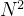成正比

2、推理也慢，生成下一个token任务中，要算所有token的注意力

Transformer复杂度在于矩阵计算的复杂度：

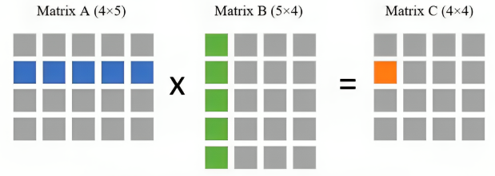

因为我们需要拿第一个矩阵的每一行去与第二个矩阵的每一列做点乘，所以总共就需要  次点乘。而每次点乘又需要 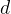 次乘法，所以总复杂度就为 

## 状态空间模型 (The State Space Model, SSM)

SSM 是用于描述这些状态表示并根据某些输入预测其下一个状态可能是什么的模型。

RNN就是一个状态空间模型（但是，RNN是离散的，下节讲）。

注意：SSM不是使用离散序列，而是将*连续序列作为输入*，并预测输出序列。注意这里下标是用t表示。

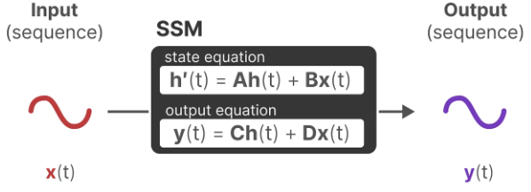

下图建立了对SSM中两个核心方程的统一视角：

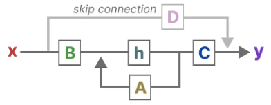

有两个问题：

1、把连续时间的SSM进行离散化：线性状态空间层

2、状态转移矩阵A怎么保留历史信息？

## 线性状态空间层 (Linear State-Space Layer, LSSL)

> LSSL[[a.2\]](https://maartengrootendorst.substack.com/p/a-visual-guide-to-mamba-and-state)的核心思想是把连续时间的SSM进行离散化，得到两种离散化的表示（循环形式和卷积形式）

通常而言，我们的输入是离散的，例如一个文本序列。为了将离散的输入变成SSM可用的连续信号，我们使用零阶保持技术（Zero-order hold technique）。

> 有几种有效的离散化方法，如欧拉方法、零阶保持器(Zero-order Hold, ZOH)方法或双线性方法。欧拉方法是最弱的，但在后两种方法之间的选择是微妙的。事实上，S4论文采用的是双线性方法，但Mamba使用的是ZOH。

零阶保持技术的原理：每次我们接收到一个离散信号时，我们都保持它的值，直到我们接收到一个新的离散信号。我们保存该值的时间由一个新的可学习参数表示，称为步长∆。

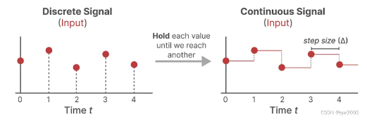

现在我们有了一个连续的信号作为输入，我们可以生成一个连续的输出，并且只根据输入的时间步长对值进行采样。这个采样的值就是我们离散化的输出。

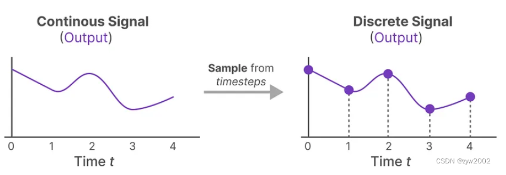

从数学的角度而言，我们可以按照如下的方式应用零阶保持技术

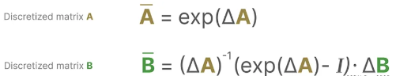

离散化SSM有两种表示方法：循环表示、卷积表示。

循环表示：和RNN一样，在每个时间步长，我们计算当前输入x如何影响前一个状态h，然后计算预测输出y。

注意，这里用下标k表示离散的。

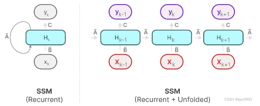

卷积表示：

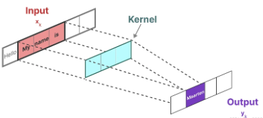

推理：

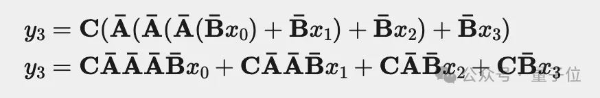

所以可以抽取出Kernel：

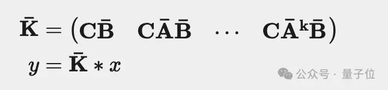

**LSSL的设计思路**

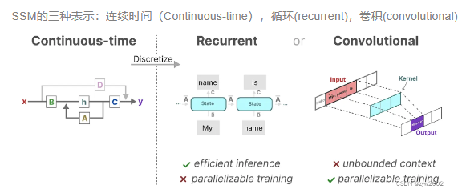

有了这些表示，我们可以使用一个巧妙的技巧，即根据任务选择一种表示。在训练过程中，我们使用可以并行化的卷积表示，在推理过程中，我们使用高效的循环表示。这种混合表示就被称为LSSL。

LSSL的一个重要特性是线性时间不变（Linear Time Invariance, LTI）
LTI声明SSM参数A、B和C对于所有时间步都是固定的。这意味着矩阵A、B和C对于SSM生成的每个token都是相同的。换句话说，无论你给SSM什么序列，**A、B和C的值都保持不变**。我们有一个不感知内容(**not content-aware**)的静态表示。

## 结构化序列空间模型 （Structured State Spaces for Sequences, S4）

S4是一个 线性时间不变的状态空间模型：linear time invariant (LTI) state space model (SSM)

矩阵A本质上是用来产生隐藏状态的。但是我们知道RNN会遗忘。

**我们应该如何创建矩阵A，使其可以保留更多的上下文信息呢？**

这里使用的是使用Hippo(Hippo的全称是High-order Polynomial Projection Operator，其对应的论文为：HiPPO: Recurrent Memory with Optimal Polynomial Projections)，解决如何在有限的存储空间中有效地解决序列建模的长距离依赖问题。

HiPPO试图将它迄今为止看到的所有输入信号压缩为一个系数向量。

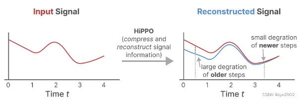

HiPPO使用矩阵A来构建状态表示，可以很好地捕获最近的token并衰减旧的token。说白了， **通过函数逼近产生状态矩阵 A 的最优解**，其公式可以表示如下

推理过程可参考：[重温SSM（一）：线性系统和HiPPO矩阵 - 科学空间|Scientific Spaces (kexue.fm)](https://kexue.fm/archives/10114)

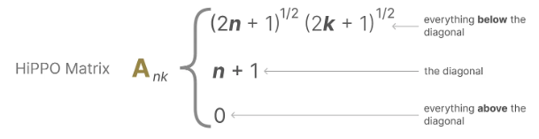

假设矩阵A的大小是4 × 4 4\times 44×4, 那么它的HiPPO Matrix的表示如下：

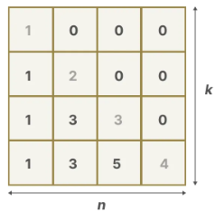

如此，S4的定义就出来了：结构化状态空间——Structured State Space for Sequences

1、是一个状态空间模型SSM

2、可以离散化表示

3、通过HiPPO可以有效处理长序列的 SSM

离散化后，表示如下：

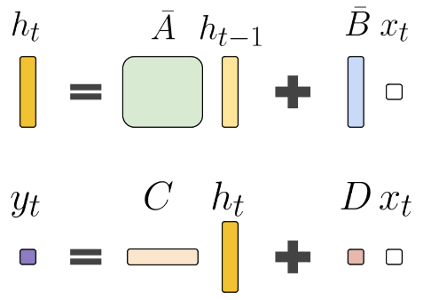

## 补充：什么是零阶保持

h（状态）可以表示为微分方程（信号处理等领域）：

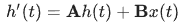

根据导数定义，对于小的$\Delta$ ：

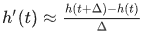

所以有：

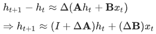

所以有一个离散化过程：

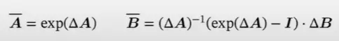

# Mamba

Mamba是一种状态空间模型(SSM)架构，它改进了S4架构。它有时也被称为S6或者selective SSM。

## Mamba要解决什么问题？

SSM和S4无法选择性的关注指定的输入（*the ability to focus on or ignore particular inputs*）。矩阵A、B和C的静态性质导致了其无法进行内容感知（content-awareness）。

举例：

在选择性复制任务中，SSM的目标是复制输入的一部分并按顺序输出.

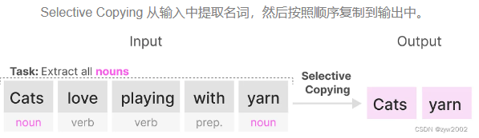

## 特征1：选择性状态空间模型

线性时间不变的time-invariant SSM的潜在问题是，矩阵A、B和C的静态性质导致了其无法进行内容感知（content-awareness）。

- 高效的模型必须有一个小的状态(比如RNN或S4)
- 而有效的模型必须有一个包含来自上下文的所有必要信息的状态(比如transformer)

Mamba 致力于保留一个小的且有用的状态信息， 兼顾性能和效率。

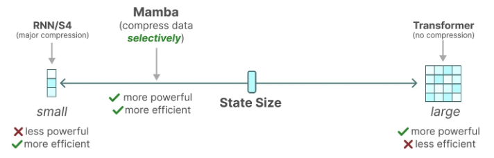

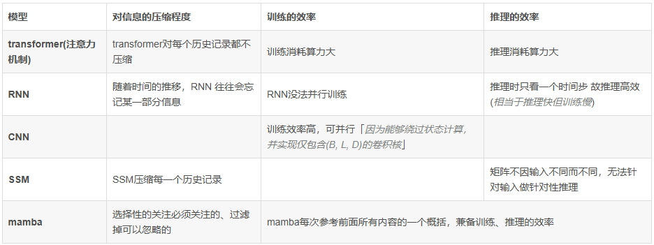

SSM中Input和Output的维度：B表示batch size, L表示序列长度，D表示输入张量的大小。

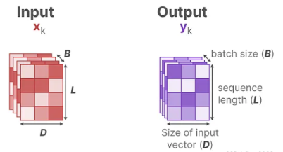

在结构化状态空间模型(S4)中，矩阵A、B和C与输入无关，因为它们的维数N和D是静态的，不会改变。

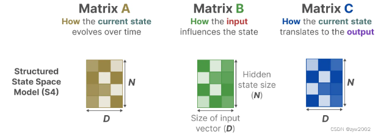

* **第一阶段：** 通常采用固定公式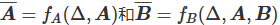 将“连续参数”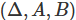 转化为“离散参数” 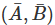  ，且离散方法 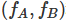 可以使用多种规则，如零阶保持。
* **第二阶段：** 模型可以用两种方式计算：RRN或CNN。

相反，Mamba通过合并输入的序列长度和批次大小，使矩阵B和C，甚至步长∆依赖于输入:

> 注意：矩阵A保持不变，因为我们希望状态本身保持静态，但它被影响的方式(通过B和C)是动态的。

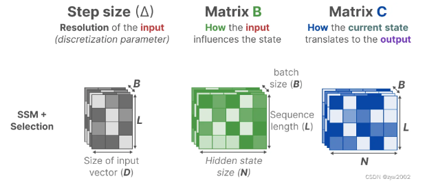

当步长较小（即∆较小）时，模型更倾向于忽略特定的单词，而更多地依赖前一个上下文。这意味着模型更注重前面的单词对当前单词的影响，而忽略了较远距离的单词。
相反，当步长较大（即∆较大）时，模型更多地关注当前输入单词而不是上下文。这意味着模型更多地考虑当前输入单词对上下文的影响，而不是依赖于前一个上下文来决定当前单词的特征。

数据维度这么表示：

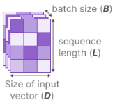

B是batch size

L是sequence length

D是每个token的dimension（如512，768等）

N是隐藏层维度，就是矩阵A中状态的维度。之前都是用A=(DxN)去记录当前token的状态。

在结构化状态空间模型(S4)中，矩阵A、B和C与输入无关，因为它们的维数N和D是静态的，不会改变。虽然A、B、C是可学习的参数，但是他们前向计算时固定不变。

在Mamaba中，作者在输入中加入了B和L参数，让B矩阵、C矩阵、$\Delta$ 成为**输入的函数**，让模型能够根据输入内容自适应地调整其行为。

个人理解：

1、SSM中的A,B,Δ是固定的，离散值$\bar{A}$, $\bar{B}$也是固定的；而Mamba中的B和C是输入x的函数，是可变的，离散值$\bar{A}$, $\bar{B}$也就是可变的。

2、B相当于输入门，C相当于输出门，$\Delta$ 在这里对上下文L做离散化，相当于遗忘门。

3、较小的步长∆更关注上下文，而较大的步长∆更关注输入单词。所以这里是选择性的。

## 特性2：并行扫描

由于(B,C,∆)这些矩阵现在是动态的了，因此无法使用卷积表示来计算它们。

RNN是用for循环一步一步更新Hidden，这叫扫描操作。然而在这种状态下也可以并行化。

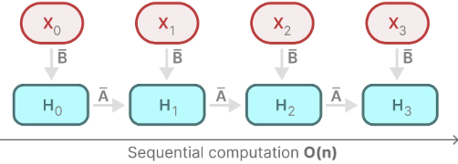

Mamba通过并行扫描(parallel scan)，加速了计算。

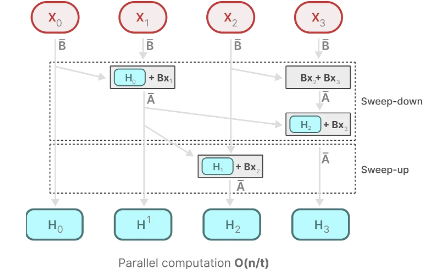

## 特性3：硬件感知

GPU的一个缺点是它们在小型但高效的SRAM和大型但略低效率的DRAM之间的传输(IO)速度有限。频繁地在SRAM和DRAM之间复制信息成为瓶颈。

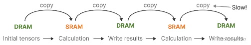

与Flash Attention一样，Mamba试图限制从DRAM切换到SRAM的次数，反之亦然。它通过**核融合**来实现这一点，核融合允许模型防止写入中间结果，并持续执行计算，直到完成。

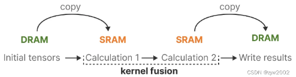

我们可以通过可视化Mamba的基本架构来查看DRAM和SRAM分配的具体实例:

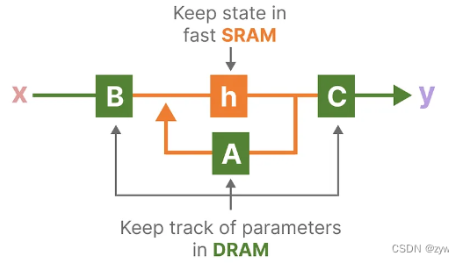

这里将下列代码融合到一个内核中:

* 用∆离散化步长
* 选择性扫描算法
* 与C相乘

硬件感知算法的最后一部分是重计算 (recomputation)。
中间状态不保存，但对于反向传递计算梯度是必要的。相反，作者在反向传递期间重新计算这些中间状态。虽然这看起来效率不高，但与从相对较慢的DRAM读取所有中间状态相比，它的开销要小得多。

## Mamba架构

Selective SSM的示意图

1、首先，输入Xt通过选择性机制映射得到Bt，∆，Ct
2、然后使用∆，用零阶保持技术对A和Bt进行离散化
3、离散化后的B和输入Xt相乘，离散化后的A和原始状态ht-1相乘，将这两项相加得到新的状态ht 
4、新状态和Ct相乘，得到输出yt 

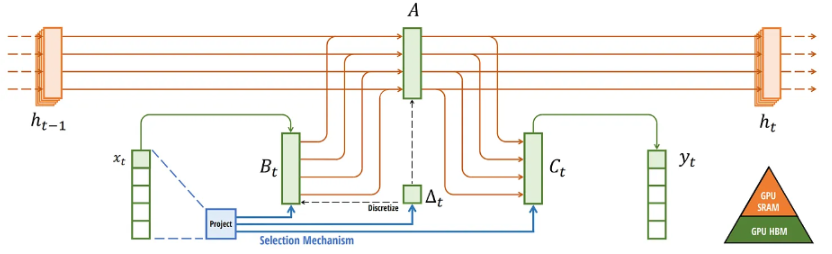

Mamba将大多数SSM架构比如H3的基础块，与现代神经网络比如transformer中普遍存在的门控MLP相结合，组成新的Mamba块，重复这个块，与归一化和残差连接结合，便构成了Mamba架构

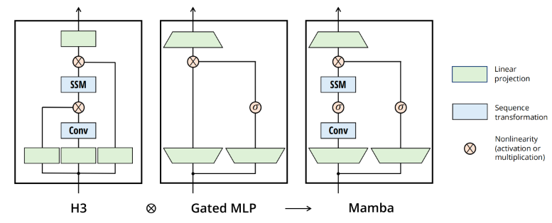

问题1：为何要做线性投影

经过线性投影后，输入嵌入的维度可能会增加，以便让模型能够处理更高维度的特征空间，从而捕获更细致、更复杂的特征

问题2：为什么SSM前面有个卷积？

SSM之前的CNN负责提取局部特征(因其擅长捕捉局部的短距离特征)，而SSM则负责处理这些特征并捕捉序列数据中的长期依赖关系，两者算互为补充

问题3：什么是Gated MLP？

这里就是self-attention

和Transformer一样，我们可以将多个Mamba块堆叠起来，并将它们的输出作为下一个Mamba块的输入:

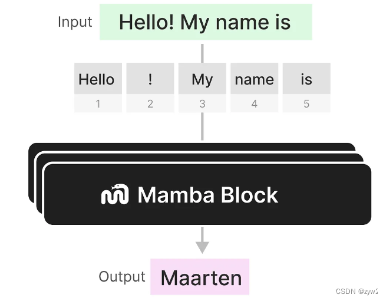

每个Mamba Block 来实现 selective SSM + Gated MLP

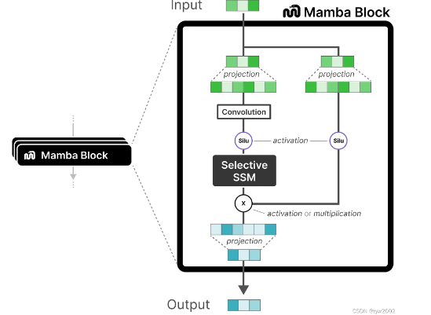

在查看代码实现时，我们可以进一步扩展此架构，并探索端到端的示例。变化包含`normalization layers`和用于选择输出标记的`softmax`。

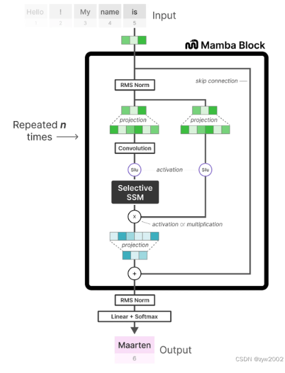

## 补充：Mamba是RNN吗

RNN和CNN可以互相转换的条件：y可以独立计算，且y计算的pattern类似（共用一个kernel）

Mamba的计算pattern也是动态的，Mamba意识到，只要能并行就行了，管他干嘛计算。

但是传统RNN不能并行计算的原因：

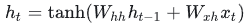

激活函数是非线性的，非办法运用乘法分配律，因此传统RNN不行。

Mamba 是一种 RNN, 而且对 RNN 做了很多有趣的改造。

1、Mamba 去掉了 RNN 的非线性。可以利用GPU。

2、Mamba 的 hidden state 的维度比较高。如果一个输入 token 的 embedding 的维度是 d. Mamba 则会单独处理每一个维度, 而且每个维度的 hidden state 的 dimension 是 N. 也就是说, 总的维度 dN. 

3、Mamba 的 A 矩阵在设计时就关注到了让 hidden state 更好的记忆这个问题。

4、Mamba 让每个位置都用一套不同的参数。

从上面的分析看, Mamba 是简化了传统 RNN 非线性, 但是增加了其参数量和复杂度。

## 补充：并行扫描算法

Mamba作者用了Belloch算法，即并行前缀和扫描。

**累加求和**：用for循环，时间复杂度是n。

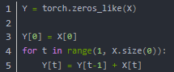

**并行累加求和**：利用结合律，可以在logn时间内完成计算。

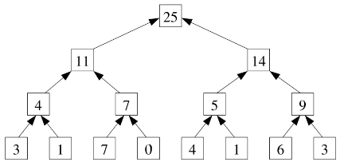

**并行前缀累加求和**：第一步自下向上，完成累加求和；第二部自上向下，完成前缀累加求和。

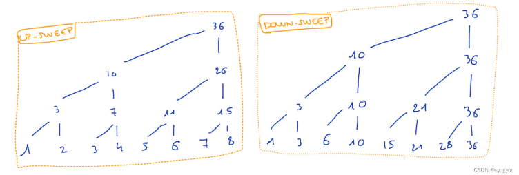

**Belloch算法**：前缀求和，和**累加求和**的区别是，前缀和不包括自身的值。（和上面算法类似，略）

# Jamba

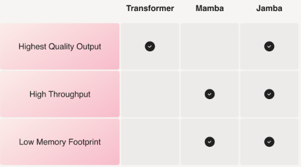

Jamba = Mamba + Transformer + MoE

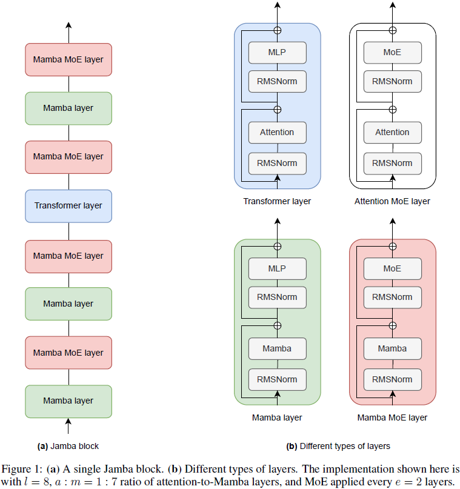

# Mamba2

Mamba1的并行扫描算法在硬件效率上仍然远不如注意力机制，原因在于，目前常用的GPU、TPU等加速器，是为矩阵乘法进行过专门优化的。推理还行，训练不行。

Mamba-2的核心，是结构化状态空间对偶性（State Space Duality，SSD）的概念： 

1. **SSD模型**指的是一个特定的独立层，比如注意力层或状态空间模型（SSM），可以被整合到深度神经网络中； 

2. **SSD框架**是一个用于推理该模型（以及更多理论连接）的通用框架； 

3. **SSD算法**是一种比以前的SSM更高效地计算SSD层的算法

