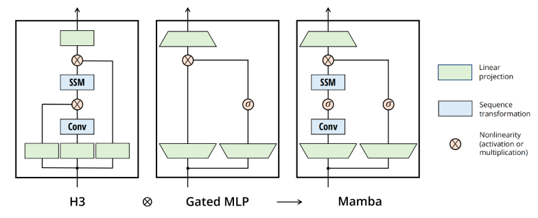

# Mamba起源

## 问题

RNN问题：

1、没法并行训练，所以训练慢、推理快（只依赖上个状态和输入）。

2、虽然每个隐藏状态都是所有先前隐藏状态的聚合，然随着时间的推移，RNN 往往会忘记某一部分信息。

Transformer问题：

1、虽然可以并行+不遗忘，但是其注意力机制的计算复杂度和序列长度的平方成正比

2、推理也慢，生成下一个token任务中，要算所有token的注意力

Transformer复杂度在于矩阵计算的复杂度：

因为我们需要拿第一个矩阵的每一行去与第二个矩阵的每一列做点乘，所以总共就需要  次点乘。而每次点乘又需要  次乘法，所以总复杂度就为 

## 状态空间模型 (The State Space Model, SSM)

SSM 是用于描述这些状态表示并根据某些输入预测其下一个状态可能是什么的模型。

RNN就是一个状态空间模型（但是，RNN是离散的，下节讲）。

注意：SSM不是使用离散序列，而是将*连续序列作为输入*，并预测输出序列。注意这里下标是用t表示。

下图建立了对SSM中两个核心方程的统一视角：

## 线性状态空间层 (Linear State-Space Layer, LSSL)

> LSSL[[a.2\]](https://maartengrootendorst.substack.com/p/a-visual-guide-to-mamba-and-state)的核心思想是把连续时间的SSM进行离散化，得到两种离散化的表示（循环形式和卷积形式）

通常而言，我们的输入是离散的，例如一个文本序列。为了将离散的输入变成SSM可用的连续信号，我们使用零阶保持技术（Zero-order hold technique）。

> 有几种有效的离散化方法，如欧拉方法、零阶保持器(Zero-order Hold, ZOH)方法或双线性方法。欧拉方法是最弱的，但在后两种方法之间的选择是微妙的。事实上，S4论文采用的是双线性方法，但Mamba使用的是ZOH。

零阶保持技术的原理：每次我们接收到一个离散信号时，我们都保持它的值，直到我们接收到一个新的离散信号。我们保存该值的时间由一个新的可学习参数表示，称为步长∆。

现在我们有了一个连续的信号作为输入，我们可以生成一个连续的输出，并且只根据输入的时间步长对值进行采样。这个采样的值就是我们离散化的输出。

从数学的角度而言，我们可以按照如下的方式应用零阶保持技术

离散化SSM有两种表示方法：循环表示、卷积表示。

循环表示：和RNN一样，在每个时间步长，我们计算当前输入x如何影响前一个状态h，然后计算预测输出y。

注意，这里用下标k表示离散的。

卷积表示：

推理：

所以可以抽取出Kernel：

1、在训练过程中，我们使用可以并行化的卷积表示，在推理过程中，我们使用高效的循环表示。这种混合表示就被称为LSSL。

2、LSSL的一个重要特性是线性时间不变（Linear Time Invariance, LTI）
LTI声明SSM参数A、B和C对于所有时间步都是固定的。这意味着矩阵A、B和C对于SSM生成的每个token都是相同的。换句话说，无论你给SSM什么序列，A、B和C的值都保持不变。我们有一个不感知内容(not content-aware)的静态表示。

## 结构化序列空间模型 （Structured State Spaces for Sequences, S4）

S4是一个 线性时间不变的状态空间模型：linear time invariant (LTI) state space model (SSM)

矩阵A本质上是用来产生隐藏状态的。但是我们知道RNN会遗忘。

我们应该如何创建矩阵A，使其可以保留更多的上下文信息呢？

这里使用的是使用Hippo(Hippo的全称是High-order Polynomial Projection Operator，其对应的论文为：HiPPO: Recurrent Memory with Optimal Polynomial Projections)，解决如何在有限的存储空间中有效地解决序列建模的长距离依赖问题。

HiPPO试图将它迄今为止看到的所有输入信号压缩为一个系数向量。

HiPPO使用矩阵A来构建状态表示，可以很好地捕获最近的token并衰减旧的token。说白了， **通过函数逼近产生状态矩阵 A 的最优解**，其公式可以表示如下

假设矩阵A的大小是4 × 4 4\times 44×4, 那么它的HiPPO Matrix的表示如下：

如此，S4的定义就出来了：结构化状态空间——Structured State Space for Sequences

1、是一个状态空间模型SSM

2、可以离散化表示

3、通过HiPPO可以有效处理长序列的 SSM

离散化后，表示如下：

## 补充：什么是零阶保持

h（状态）可以表示为微分方程（信号处理等领域）：

根据导数定义，对于小的$\Delta$ ：

所以有：

所以有一个离散化过程：

# Mamba

Mamba是一种状态空间模型(SSM)架构，它改进了S4架构。它有时也被称为S6或者selective SSM，它对S4进行了两项重要修改:

* 选择性扫描算法(selective scan algorithm），允许模型过滤相关或者不相关的信息
* 硬件感知的算法(hardware-aware algorithm)，允许通过并行扫描(parallel scan)、核融合(kernel fusion)和重计算(recomputation)有效地存储(中间)结果。

## 选择性状态空间模型

线性时间不变的time-invariant SSM的潜在问题是，矩阵A、B和C的静态性质导致了其无法进行内容感知（content-awareness）。

- 高效的模型必须有一个小的状态(比如RNN或S4)
- 而有效的模型必须有一个包含来自上下文的所有必要信息的状态(比如transformer)

Mamba 致力于保留一个小的且有用的状态信息， 兼顾性能和效率。

数据维度这么表示：

B是batch size

L是sequence length

D是每个token的dimension

N是隐藏层维度，就是矩阵A中状态的维度。之前都是用A=(DxN)去记录当前token的状态。

在结构化状态空间模型(S4)中，矩阵A、B和C与输入无关，因为它们的维数N和D是静态的，不会改变。虽然A、B、C是可学习的参数，但是他们前向计算时固定不变。

在Mamaba中，作者在输入中加入了B和L参数，让B矩阵、C矩阵、$\Delta$ 成为输入的函数，让模型能够根据输入内容自适应地调整其行为。

个人理解：

1、B是batch，没什么影响。L是长度，类似于Transformer上下文长度。主要是L长度影响了$\Delta$ ，$\Delta$ 又影响了A和B。

2、B相当于输入门，C相当于输出门，$\Delta$ 在这里做离散化，相当于遗忘门。

3、较小的步长∆更关注上下文，而较大的步长∆更关注输入单词。所以这里是选择性的。

Selective SSM的示意图

## 并行扫描

由于A B C这些矩阵现在是动态的了，因此无法使用卷积表示来计算它们。

RNN是用for循环一步一步更新Hidden，这叫扫描操作。然而在这种状态下也可以并行化。

Mamba通过并行扫描(parallel scan)，加速了计算。

## Flash Attention

为了让传统的SSM在现代GPU上也能高效计算，Mamba中也使用了Flash Attention技术

1、简而言之，利用内存的不同层级结构处理SSM的状态，减少高带宽但慢速的HBM内存反复读写这个瓶颈
2、具体而言，就是限制需要从 DRAM 到 SRAM 的次数(通过内核融合kernel fusion来实现)，避免一有个结果便从SRAM写入到DRAM，而是待SRAM中有一批结果再集中写入DRAM中

## 简化的SSM架构

将大多数SSM架构比如H3的基础块，与门控MLP相结合，组成新的Mamba块，重复这个块，与归一化和残差连接结合，便构成了Mamba架构

最终在更高速的SRAM内存中执行离散化和递归操作，再将输出写回HBM，具体来说

1、直接将SSM参数(Δ,A,B,C)从慢速HBM加载到快速SRAM中

2、在SRAM中进行离散化

3、在SRAM中进行并行scan，得到输出

4、multiply and sum with C，得到(B,L,D)的最终输出写回HBM

## 补充：Mamba是RNN吗

RNN和CNN可以互相转换的条件：y可以独立计算，且y计算的pattern类似（共用一个kernel）

Mamba的计算pattern也是动态的，Mamba意识到，只要能并行就行了，管他干嘛计算。

但是传统RNN不能并行计算的原因：

激活函数是非线性的，非办法运用乘法分配律，因此传统RNN不行。

Mamba 是一种 RNN, 而且对 RNN 做了很多有趣的改造。

1、Mamba 去掉了 RNN 的非线性。可以利用GPU。

2、Mamba 的 hidden state 的维度比较高。如果一个输入 token 的 embedding 的维度是 d. Mamba 则会单独处理每一个维度, 而且每个维度的 hidden state 的 dimension 是 N. 也就是说, 总的维度 dN. 

3、Mamba 的 A 矩阵在设计时就关注到了让 hidden state 更好的记忆这个问题。

4、Mamba 让每个位置都用一套不同的参数。

从上面的分析看, Mamba 是简化了传统 RNN 非线性, 但是增加了其参数量和复杂度。

## 补充：并行扫描算法

Mamba作者用了Belloch算法，即并行前缀和扫描。

**累加求和**：用for循环，时间复杂度是n。

**并行累加求和**：利用结合律，可以在logn时间内完成计算。

**并行前缀累加求和**：第一步自下向上，完成累加求和；第二部自上向下，完成前缀累加求和。

**Belloch算法**：前缀求和，和**累加求和**的区别是，前缀和不包括自身的值。（和上面算法类似，略）

# Jamba

https://mp.weixin.qq.com/s/lCUr6qN1SkyRJTZWI9Jtvg