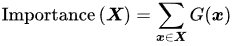
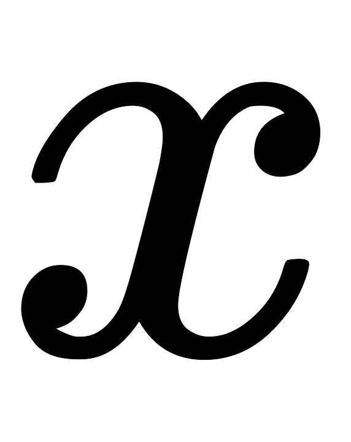

# MoE优缺点

优点：

1、训练速度更快，效果更好；

2、相同参数，推理成本低；

3、计算成本不变，可以扩大模型到非常大的规模；

4、多任务学习能力。

缺点：

1、训练不稳定

2、通信成本高

3、MoE由于其稀疏性，使得在Fine-tuning过程中容易出现过拟合。

4、MoE的设计相对复杂，可能需要更多的工程努力来实现和优化。

# Adaptive mixtures of local experts

时间：1991

作者：Michael Jordan 和 Geoffrey Hinton

论文提出了使用多个模型（即专家，Experts ）去学习，使用一个门控网络（ Gating Network）来决定每个数据应该被哪个模型去训练，这样就可以减轻不同类型样本之间的干扰。

c是样本，o是专家i的输出，p是权重，d是期望输出。损失函数如下：

在论文中，作者提到这个损失函数可能会导致专家网络之间的**强烈耦合**，因为一个专家网络的权重变化会影响到其他专家网络的loss。这种耦合可能会导致多个专家网络被用于处理每条样本，而不是专注于它们各自擅长的子任务。为了解决这个问题，论文提出了重新定义损失函数的方法，以**鼓励专家网络之间的相互竞争**。

系统倾向于将每个样本分配给一个单一expert。当一个expert在给定样本上的的loss小于所有expert的平均loss时，它对该样本的门控score会增加；当它的表现不如平均loss时，它的门控score会减少。这种机制鼓励expert之间的竞争，而不是合作，从而提高了学习效率和泛化能力。

论文还提到对上面的公式的损失函数进行修改，效果会更好，新的损失函数如下：

这样做有什么好处呢，我们可以对比一下二者在反向传播的时候有什么样的效果：

原公式的导数，只会跟当前expert有关。新的公式还考虑其他experts跟当前样本c 的匹配程度。

# Sparsely-Gated MoE

> 在 2010 至 2015 年间，两个独立的研究领域为混合专家模型 (MoE) 的后续发展做出了显著贡献：
>
> **组件专家：**在传统的 MoE 设置中，整个系统由一个门控网络和多个专家组成，MoE 通常被视为整个模型的一部分。然而，[Eigen、Ranzato 和 Ilya 的研究](https://link.zhihu.com/?target=https%3A//arxiv.org/abs/1312.4314) 探索了将 MoE 作为更深层网络的一个组件。这种方法允许**将 MoE 嵌入到多层网络中的某一层**，使得模型既大又高效。
>
> **条件计算**（Conditional Computation）**：**传统的神经网络通过每一层处理所有输入数据。在这一时期，Yoshua Bengio 等研究人员开始探索**基于输入 token 动态激活或停用网络组件**的方法。

时间：2017

作者：Shazeer，Geoffrey Hinton 和 Jeff Dean （谷歌团队）

和 1991 年Adaptive mixtures of local experts的工作对比，这里的 Sparsely-Gated MoE 主要有两个区别：

- **Sparsely-Gated**：不是所有expert都会起作用，而是极少数的expert会被使用来进行推理。这种稀疏性，也使得我们可以使用海量的experts来把模型容量做的超级大。
- **token-level**：前面那个文章，是 sample-level 的，即不同的样本，使用不同的专家，但是这篇则是 token-level 的，一个句子中不同的 token 使用不同的专家。

下图是Sparsely-Gated MoE的模型结构，被运用于RNN结构中：

上图中，每个 token，都会有一个 MoE Layer，每个 MoE layer 中包含了一堆的 experts，每个 expert都是一个小型的 FFN，还有一个 Gating Network 会根据当前 token，选择少数几个 expert 来进行计算。

## 稀疏性

原来所有 expert 都会对所有输入进行运算，再通过门控网络的输出进行加权和，如果 experts 的数量太大，就会导致计算量非常大。

如果门控网络用softmax，这个网络将学习将输入发送给哪个 expert。

门控网络倾向于收敛到一种状态，总是为相同的几个专家产生大的权重。这种不平衡是自我强化的，因为受到青睐的专家训练得更快，因此被门控网络更多地选择。这种不平衡可能导致训练效率低下，因为某些专家可能从未被使用过。解决方法有两个：

1、在门控中添加噪声，noise 项则可以使得不同 expert 的负载更加均衡。

2、

## 负载均衡：噪声

在门控方法引入了一些可调整的噪声，然后保留前 k 个值。

1、添加噪声

2、选择保留前K个值

3、对于非 TopK 的部分，由于值是负无穷，这样在经过 Softmax 之后就会变成 0，不会被选中。在具体实验中，作者使用的 K=2~4。

## 负载均衡：损失函数

他们定义了一个额外的损失函数，这个损失函数被添加到模型的整体损失函数中。这个额外的损失鼓励所有专家具有相等的重要性。

1、定义了专家相对于一批训练样本的重要性

2、损失函数等于重要性值集合的CV（coefficient of variation）平方，乘以一个手动调整的缩放因子w

这个损失确保所有专家接收到大致相等数量的训练样本，从而平衡了专家之间的选择。

# GShard

时间：2021

机构：谷歌

贡献：第一个将 MoE 的思想拓展到 Transformer 上的工作。

GShard 把Transformer 的 encoder 和 decoder 中，每隔一个的 FFN 层，替换成 MoE 层，使用的都是 Top-2 门控网络。

这种架构对于大规模计算非常有效：当扩展到多个设备时，MoE 层在不同设备间共享，而其他所有层则在每个设备上复制。

实现 MoE 跨设备分片的关键技术是模型并行化（model parallelism）和数据并行化（data parallelism）的结合。在模型并行化中，模型的不同部分（在这里是 MoE 层的专家网络）被分配到不同的设备上。在数据并行化中，输入数据（token）被分割成多个部分，每个部分被分配给不同的设备进行处理。

在平衡输入和提升效率方面，Gshard做了如下优化：

1、Random routing：在top-2的设置中，第一个专家一定会被选中，而第二个专家则根据概率进行选择。

2、Expert capacity：给专家设置专家能够学习的最大token数量。如果一个专家的学习超过负载阈值，token将已residual的方式接入下一层，或者直接丢弃这个token。因为每个tensor的大小都是预先设定的，训练前我们不知道会有多少token经过这个tensor，所以需要为其设置一个固定的capacity阈值。

# Switch Transformers

时间：2022

机构：谷歌

尽管混合专家模型 (MoE) 显示出了很大的潜力，但它们在训练和微调过程中存在稳定性问题。[Switch Transformers](https://arxiv.org/abs/2101.03961) 是一项非常激动人心的工作，它深入研究了这些话题。作者甚至在 Hugging Face 上发布了一个 [1.6 万亿参数的 MoE](https://huggingface.co/google/switch-c-2048)，拥有 2048 个专家，你可以使用 `transformers` 库来运行它。

Switch Transformer和GShard类似，模型的每一层都是一个专家网络的集合，输入数据会被动态地路由到不同的专家进行处理。

设置一组具有预定缓冲区容量的专家，给专家分配给前k个令牌，产生一个令牌到专家的得分矩阵，然后用该矩阵做出路由决策。 

## 稀疏路由

与最初使用至少两个专家的想法相反，Switch Transformer 采用了简化的单专家策略，每次只选择一个专家。这种方法的效果包括：

- 减少了路由计算，一个 token 每次只路由到一个专家
- 每个专家的 batch size（专家容量、Expert Capacity） 至少可以减半
- 简化路由的实现，降低了 MoE 中的通信成本

## Expert Capacity

Switch Transformers 也对 **专家容量** 这个概念进行了研究。

专家容量的作用就是将 batch 中的总 token 数平均分配给所有专家。然后，为了应对 token 分布不均的情况，会通过一个容量因子（capacity factor）来扩展每个专家的容量。

容量因子是一个大于 1.0 的数，它的作用是为每个专家提供额外的缓冲空间，以容纳可能超出平均分配的 token。这样，即使某些专家接收到的 token 数量超过了平均值，也能够处理这些额外的 token，而不会因为容量不足而导致计算跳过。

GShard中对于这些溢出的 token，模型会跳过计算，直接将 token 的表示通过残差连接传递到下一层。

如果容量因子设置得过高，会导致计算资源和内存的浪费。在论文中，Switch Transformers 在低容量因子 (例如 1 至 1.25) 下表现出色。

## 负载均衡：损失函数

我们希望 batch 中的所有 token 能够均匀地分配给个专家。这意味着每个专家应该处理相同数量的token，即每个专家处理的 token 比例应该是  。

 是所有输入token  被路由到专家  的概率，其中  是给定 token  被路由到专家  的概率：

 是 batch 中分配给专家  的 token 占比，其中T是所有token，B是batch；

给定  个专家，我们希望：

所以，损失函数是：

 是一个超参数，用于调整辅助 loss 的权重。论文中选择了  ，这个值足够大，可以确保负载均衡，同时又足够小，不会压倒主要的交叉熵目标（即主要的训练损失）。

## 改进训练

1、用 `bfloat16` 精度训练专家，同时对其余计算使用全精度进行（float32）。

2、权重矩阵通常是从一个截断的正态分布，其均值为0，标准差由一个超参数 s 决定。较小的初始化规模有助于提高模型效果和减少训练过程中的不稳定性。

3、为了解决 Fine-Tuning 过程中的过拟合问题，作者提出了增加 dropout的策略，特别是在专家层（expert layers）中。他们称之为“expert dropout”，即在 Fine-Tuning 时只在专家层增加 dropout 率。

4、数据、模型、专家并行

# GLaM

时间：2022

机构：谷歌

和GShard很像，不做过多介绍。

# ST-MoE

作者提出了一种新的辅助损失函数，称为 **Router z-loss**，用于提高稀疏模型的训练稳定性，同时保持或稍微提高模型质量。

在 MoE 模型中，每个输入 token 可能被路由到多个专家，但通常只有一个专家层会被激活。为了确保路由器能够稳定地工作并产生高质量的输出，作者引入了 Router z-loss。这个损失函数的目标是鼓励路由器产生较小的logits 值，因为较大的 logits 值在 softmax 激活函数中会导致较大的梯度，这可能会引起训练不稳定。

Router z-loss 的定义如下：

B是Batch中Token的数量，N是专家的数量，x是路由器的logits，这个损失函数通过惩罚较大的logits值来工作，因为这些值在 softmax 函数中会导致较大的梯度。通过这种方式，Router z-loss 有助于减少训练过程中的不稳定性，并可能提高模型的泛化能力。

