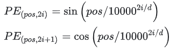

# Sinusoidal（正弦位置编码）

基于Sinusoidal的位置编码最初是由谷歌在论文Attention is All You Need中提出的方案，用于Transformer的位置编码。具体计算方式如下所示：

其中pos是位置，i表示维度，d是维度长度（在论文中，是512)。

看起来是通过sin和cos函数将位置编码的取值固定在了[-1, 1]之前，但是为什么不用线性函数？而且这里面的10000是怎么想到的？

谷歌在论文里面给出了解释：

- 具有**相对位置表达能力**：Sinusoidal可以学习到相对位置，对于固定位置距离的k，PE(i+k)可以表示成PE(i)的线性函数。
- 两个**位置向量的内积只和相对位置 k 有关**。
- Sinusoidal编码具有**对称性**。
- 随着k的增加，内积的结果会直接减少，即会存在**远程衰减**。

下面我们来分析一下为什么会有上面四点结论。

## 1 相对位置表达能力

Sinusoidal可以学习到相对位置，对于固定位置距离的k，PE(i+k)可以表示成PE(i)的线性函数。证明如下：

其中u, v为关于k的常数，所以可以证明PE(i+k)可以由PE(i)线性表示。

## 2 内积只和相对位置 k 有关

Attention中的重要操作就是内积。计算两个位置的内积PE(t+k)PE(t)如下所示：

可以看到，最终的结果是关于k的一个常数。这表明两个位置向量的内积只和相对位置k有关。

通过计算，很容易得到PE(t+k)PE(t) = PE(t)PE(t-k)，这表明Sinusoidal编码具有**对称性**。

## 3 远程衰减

可以发现，随着k的增加，位置向量的内积结果会逐渐降低，即会存在**远程衰减**。 如下图所示：

## 4 为什么选择参数base=10000

这里可以从sin/cos的周期性角度进行分析。分析周期可以发现，维度i的周期为 ，中0 <= i < d，因此周期T的范围是 。

固定d为100，维度i=10，绘制不同base下的position embedding，如下图所示：

可以看到随着base的变大，周期会明显变长。Transformer选择比较大的base=10000，可能是为了能更好的区分开每个位置。

## 5 正弦编码是否真的具备外推性？

在前面的图中，似乎Sinusoidal只和相对位置有关。但是实际的Attention计算中还需要与attention的权重W相乘，即。这时候内积的结果就不能反映相对距离，如下图所示：

# RoPE (旋转位置编码)

## 回顾RoPE

> RoPE是目前唯一一种可以用于线性Attention的相对位置编码。

m,n表示位置，我们希望：（因为attention计算有乘法）

但是，乘法有交换律，这是我们不希望得到的：

乘法有交换律，怎么解决：

* 矩阵乘法不存在交换律；
* 复数乘法有类似的公式，且满足交换律。

用Re[]表示复数的实部，用复数推理，有：

我们要计算q,k的注意力，我们希望q,k的实数部分与m,n无关，虚数部分用上面公式计算。所以有：

上式m是位置，$\theta$是超参数，可以理解为位置编码旋转的角度。

根据复数乘法的几何意义，该变换实际上对应着向量的旋转，所以我们称之为“旋转式位置编码”，它还可以写成矩阵形式：

由于内积满足线性叠加性，因此任意偶数维的RoPE，我们都可以表示为二维情形的拼接，即

> 向量的线性叠加性指：内积的顺序不影响结果。我理解q和v要做内积，再加上位置编码不影响。

Q和V矩阵计算完成后，Attention就自动包含相对位置信息。

由于Rm矩阵的稀疏性，所以直接用矩阵乘法来实现会很浪费算力，推荐通过下述方式来实现RoPE：

最后，$\theta$作者沿用了Sinusoidal位置编码的方案，它可以带来一定的远程衰减性。

从图中我们可以看到**随着相对距离的变大，内积结果有衰减趋势**的出现。因此，选择10000，确实能带来一定的远程衰减性。

## RoPE外推问题

虽然RoPE理论上可以编码任意长度的绝对位置信息，并且sin/cos计算就能将任意长度的相对位置信息表达出来，但是实验发现RoPE仍然存在**外推问题**，即测试长度超过训练长度之后，模型的效果会有显著的崩坏，具体表现为**困惑度（Perplexity，PPL）**等指标显著上升。

我们可以通过画图来验证, 将向量 q 和向量 k 设置为全一向量, 固定向量 q 的索引位置, 画出向量 k 的索引位置 和 **注意力分数** 之间的关系图:

从图一和图二可以看出, **相对位置** 和 **注意力分数** 之间是震荡递减的关系。

从图三可以看出, 当 **相对位置** 超过一万时, 震荡递减关系就不存在了。

在图四中，我们将 d 的值设置为 8, 可以发现, 两者之间还是 周期函数, 周期大概在 10000 左右, 这符合我们对三角函数的认知。也就是说, 图一到图三中呈现的震荡递减关系只是因为 周期不够大! 初步估算, 当 d 的值为 32 时, 周期应该是 亿级别的, 因此正常完全够用。

初步感觉, 直接外推对于 RoPE 来说并不是一个大问题。可是实验发现, 如果这样做, 性能会下降特别多。

实验分析：词向量维度d=64，训练句子长100，词向量的第i=0维时，Q的计算结果（只计算和位置相关的变量）：

实验分析：词向量维度d=64，训练句子长100，词向量的第i=10维时，Q的计算结果（只计算和位置相关的变量）：

## 线性内插（Position Interpolation）

怎么办呢? [国外网友 kaiokendev](https://link.zhihu.com/?target=https%3A//kaiokendev.github.io/til%23extending-context-to-8k) 和 Meta的论文Extending Context Window of Large Language Models via Positional Interpolation，几乎同时提出了一种方式: **线性内插** (Positional Interpolation)：

如下图，将推理长度映射到训练长度：

## NTK-aware Scaled RoPE (非线性的插值)

参考：https://zhuanlan.zhihu.com/p/662790439

**线性内插** 虽然效果还可以, 但需要增量训练, 有没有办法在不需要增量训练的情况下实现长度外推呢? 于是, 有人想到, 对于向量 q 和 k, 靠前的维度 **直接外推**, 靠后的维度 **线性内插**:

这样的效果如何呢? 根据实验, 在不进行增量训练的情况下, **线性内插** 的性能下降了近 40%, 而这种方案的性能下降仅仅为 5%, 可以说效果非常好了。

为什么叫这个名字，这种方法是基于Neural Tangent Kernel（NTK）理论和RoPE插值进行改进。

## dynamic_ntk

接着, 有人提出更一般的形式:

其中，$\alpha$是一个超参数，设为2时，效果不错。

## window_attn

参考：https://zhuanlan.zhihu.com/p/134748587

Window attention，将注意力限制在一个上下文窗口内，防止模型关注到太远的内容。并在不同层采用不同的窗口大小，较低的层使用较短的窗口，而较高的层使用较长的窗口。

具体用那种windown attention不知道。感觉像是sliding window attention

## LogN-Scaling

论文：Overcoming a theoretical limitation of self-attention

在计算attention时，引入一个缩放因子logn，有助于泛化长度。

这里的logn不合理，参考：https://spaces.ac.cn/archives/8823

# LongRoPE

论文：LongRoPE: Extending LLM Context Window Beyond 2 Million Tokens

时间：2024-02

机构：微软

LongRoPE能够在仅需最多1000步的微调内，即可完成从短上下文到长上下文的扩展。同时还能保持原有短上下文窗口的性能。

三大关键创新：

△ 非均匀位置插值：通过识别和利用位置插值中的两种非均匀性，LongRoPE为微调提供了更好的初始化，允许在无需微调的场景下实现8倍的扩展。

△ 渐进式扩展策略：采用先微调一个256k长度LLM，然后进行第二次位置插值以达到2048k上下文窗口的策略，避免了直接在极长文本上微调的需要。

△ 调整性能以恢复短上下文窗口性能：通过在扩展LLM上调整RoPE重缩放因子，缓解了原始（较短）上下文窗口性能下降的问题。

# Infini-Transformer

论文：Leave No Context Behind: Efficient Infinite Context Transformers with Infini-attention

时间：2024-04

机构：Google

## 背景

对于人工智能(AI)来说，内存资源是神经网络模型进行高效计算的必要条件。然而，由于Transformers 中的注意力机制在内存占用和计算时间上都表现出二次复杂度，所以基于Transformer的大模型就更加依赖内存资源。

对于批量大小为 512、上下文长度为 2048 的 500B 模型，注意力键值 (KV) 状态的内存占用为 3TB。这意味着对于标准的Transformer架构大模型，要想支持的越长的上下文，那么需要的内存成本也将越高。为了降低内存成本，且要让LLMs能够支持更长的上下文，这无疑是一项非常具有挑战的任务。

面对超长序列，相比注意力机制，内存压缩系统更具扩展性。内存压缩不使用随输入序列长度而增长的数组，而是在有限的内存资源上，维护固定数量的参数来进行信息的存储和回调。然而，目前的LLMs尚未有一种有效、实用的内存压缩技术，可以在简单性与质量之间取得平衡。

基于以上背景，本文作者提出了一种新方法，能够让基于Transformer的大模型在有限内存、计算资源的条件下，处理无限长的上下文输入。

## 回顾Transformer-XL

Transformer 输入长度是固定的较小值。在预训练时，需要将语料切分成这样无数个段分别预训练，因此模型能够捕获的最长上下文就是段的大小，不具备长上下文能力。如下图所示，训练时 Segment 1 和 Segment 2 之间是没有关联的。

Transformer-XL 提出了一种以空间换时间的方案：

每次输入仍然是固定长度的 Segment，但是它会将上一个 Segment 每一层结点的 key 和 value 缓存起来，以供下一个 Segment 来做 attention，每一个 Segment 都能捕获上一个 Segment 的信息，这样就实现了长上下文的建模。缺点也很明显：只往前存储了一个 Segment 的信息，还是存在信息丢失的问题。

## Infini-Transformer

这篇论文用 Infini-attention 与其做了对比，认为最大的优势就是能够拥有完整的历史上下文。与Transformer-XL类似，Infini-Transformer处理的是一系列片段。即在每个片段内计算 standard causal 点积attention context（注意力上下文）。因此，点积注意力计算在某种意义上是局部的，它覆盖了索引为 S 的当前片段的总共 N 个标记。

然而，局部注意力在处理下一个片段时会丢弃前一个片段的注意力状态。在Infini-Transformer中，并没有忽略旧的键值（KV）注意力状态，而是通过内存压缩技术重新使用它们来保持整个上下文历史。因此，Infini-Transformer的每个注意力层都具有全局压缩和局部细粒度状态，这就是前面提到的无限注意力（Infini-attention）。

## Infini-attention

大致思想：设置一个记忆矩阵M，存储上文得到的信息。每轮都用当前的Q从M矩阵中检索出信息A，然后再用当前的K和V更新M矩阵。

Infini-Transformer模型的关键组成部分为：Infini-attention，这是一种新型Attention技术，如下图所示。 它将计算局部和全局上下文状态，并将它们组合到一块作为输出。与多头注意力（MHA）类似，除了点积注意力之外，它还为每个注意力层维护 H 个并行压缩内存（H 是注意力头的数量）。

其中：

**Causal scaled dot-product Attention** 在Infini-attention机制中发挥了重要作用。Scaled Dot-product Attention是多头注意力（Multi-head Attention, MHA）的一个变种，它在处理序列数据时能够有效地捕捉序列中的依赖关系。对于MHA，本文并行地为序列中的每个元素计算H个注意力上下文向量，将它们沿着第二维拼接起来，最后将拼接后的向量投影到模型空间以获得注意力输出。

**Compressive Memory** 它通过固定数量的参数关联矩阵来存储和检索信息，当处理新的输入序列时，模型会更新关联矩阵中的参数，以存储当前序列的信息。更新过程通常涉及到将新的键值对（KV）与记忆矩阵中的现有参数进行某种形式的结合。在处理后续序列时，模型会利用查询向量（Query）来检索关联矩阵中的信息，从而获取之前序列的上下文信息。

# MEGALODON 

论文：MEGALODON: Efficient LLM Pretraining and Inference with Unlimited Context Length

时间：2024-04

机构：Meta

MEGALODON 继承了 MEGA（带有门控注意力的指数移动平均）的架构，并进一步引入了多种技术组件来提高其能力和稳定性，包括复数指数移动平均（CEMA）、时间步归一化层、归一化注意力机制和具有两个特征的预归一化（pre-norm）残差配置。

# 附：复数

**极坐标系**

用角度和长度描述位置的坐标系

只有一条射线轴，叫极轴。O是极点。r是极径。$\theta$是极角。

有了上述三个要素，空间中任意一点都可以用序对 (r, $\theta$ ) 表示。

**极坐标与直角坐标转换**

极坐标转换为直角坐标：

直角坐标转极坐标：

**复数**

定义复数z=a+bi，其中a是实部，b是虚部，i是虚数单位，$i^2 = -1$ 。

**复数的共轭**

复数的模是：$||z|| = \sqrt{a^2 + b^2}$

> 「共轭」是数学中一个比较有逼格的词。「轭」是牛拉车用的木头，同时拉一辆车的两头牛，就是「共轭」关系。把这种关系引申到数学中，只要是成对的东西，又找不着一个更合适的叫法时，就常常称它们为「共轭」，这个「轭」并不总能找到相应的数学概念。

假如有复数z=a+bi, 那么它的共轭是$\bar{z} = a-bi$ 。他们的模的平方相等。

**复数的几何意义**

考虑一个二维笛卡尔坐标系上的一个半径为R的圆。这个坐标系的x轴为实轴，y坐标为虚轴。

有夹角$\alpha$，

极坐标表示为$(r, \alpha)$ ， 

复平面坐标为$(r cos \alpha, ri sin \alpha)$ ， 

模长为$r=||z|| = \sqrt{a^2 + b^2}$ ，

已知欧拉公式是：

根据欧拉公式和共轭性质，可以推出：

所以，对于任意一个复数z=a+bi，可以表示为：

根据矩阵乘法

对于欧拉公式的表示法，乘法是一样的：

从欧拉公式的表示下很容易得出复数乘法的几何意义，相乘之后还是一个复数，这个复数的模长是z1z2，与x轴夹角是他们两个之和。

**复数的向量表示**

**复数的矩阵表示**

假设复平面内，复数与实轴夹角为$\theta$ :

所以，复数表示空间逆时针旋转90度，缩放$||z||$倍。

# 附：相位和周期

相位发生在周期性的运动之中，相位最直接的理解是角度。这个角度存在于匀速圆周运动之中。

根据傅立叶变换，任何一个周期性运动都可以分解为一系列简谐运动的合成。最简单的简谐运动就是弹簧振子：一个弹簧连接一个小球的往复运动。

为了描述这个运动，我们可以把它类比为一个逆时针的匀速圆周运动的水平分量。

假设某个时刻，  简谐运动的物体位于P点，对应匀速圆周运动上的小球位于图中P’点，它与圆心的连线OP’与水平向右方向夹角为θ，那么这个θ就称为相位角或相位。

相位角会随着时间而发生变化。如果最初 t=0时θ=φ ，那么φ就称为初相位。随着P'点以角速度 ω 旋转，相位角会变为 θ=ωt+φ 。

这样，物体P'的水平坐标就可以求出来了， x=Acos(ωt+φ)， 这也就是做简谐运动的质点P点的位移随时间的变化规律。

