# DoRA

https://zhuanlan.zhihu.com/p/682556551

LoRA原理：

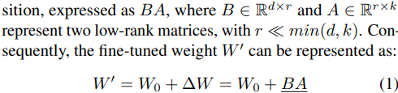

LoRA（Low Rank Adaptation，低秩适应）有一个潜在的继承者，称为 DoRA。DoRA可以看作是建立在LoRA之上的改进或扩展。DoRA是最近一篇论文《DoRA: Weight-Decomposed Low-Rank Adaptation》（《DoRA：权重分解的低秩适应》）提出的。

DoRA 方法首先将预训练的权重矩阵分解为幅度向量 （m） 和方向矩阵 （V）。然后，它采用方向矩阵 V 并对其应用标准的LoRA，即：

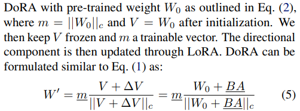

开发这种方法的动机是基于分析和比较 LoRA 和全面微调模式的区别。论文发现，LoRA可以按比例增加或减少幅度和方向更新，但似乎缺乏像完全微调那样仅进行细微的方向变化的能力。因此，研究人员提出了幅度和方向分量的解耦。换句话说，他们的 **DoRA 方法旨在仅将 LoRA 应用于方向分量（同时还允许单独训练幅度分量）**。

请注意，在 DoRA 中引入幅度向量 m 比标准 LoRA 多添加 0.01% 的参数。然而，在LLM和视觉转换器基准测试中，他们发现，如果DoRA等级减半，即**当DoRA仅使用常规LoRA的一半参数时，DoRA的性能甚至优于LoRA**。

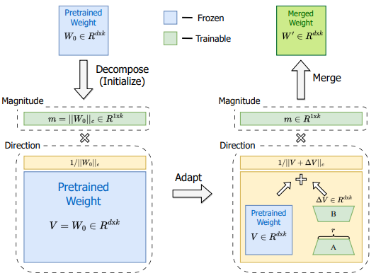

# instructGPT

参考：[ChatGPT技术原理解析：从RL之PPO算法、RLHF到GPT4、instructGPT-CSDN博客](https://blog.csdn.net/v_JULY_v/article/details/128579457)

## 发展历史

2017年6月OpenAI联合DeepMind首次正式提出的：Deep Reinforcement Learning from Human Preferences，即*基于人类偏好的深度强化学习*，简称**RLHF**

2017年7月的OpenAI团队提出的对TRPO算法的改进：**PPO**算法

2017年6月，Transformer

2018年，GPT：Decoder-only架构

2019年，GPT2：zero-shot, one-shot, few-shot learning

2020年，GPT3：给few-shot learning起名叫In-context learning，有人也称为隐士学习。

2022年1月，Google的FLAN

* 提出Instruction Fine-Tuning (IFT)指令微调；给few-shot learning起名叫prompt learning

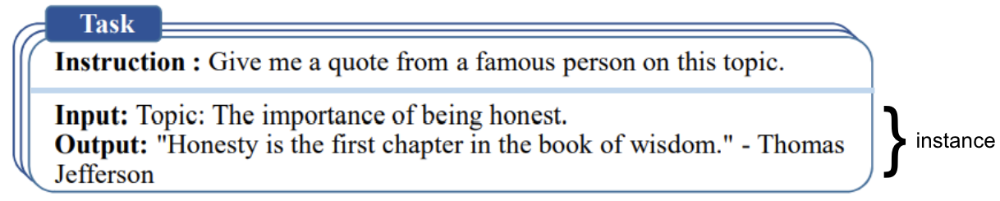

2022年1月，Google提出思维链技术(Chain of Thought，简称**CoT**)

* 不论是few-shot还是zero-shot，在加入Cot技术之后，都能回答此前不能回答的某些数学推理问题，甚至出现了风靡一时的“let's think step by step”的梗(通过该条语句可以激发模型的推理能力)

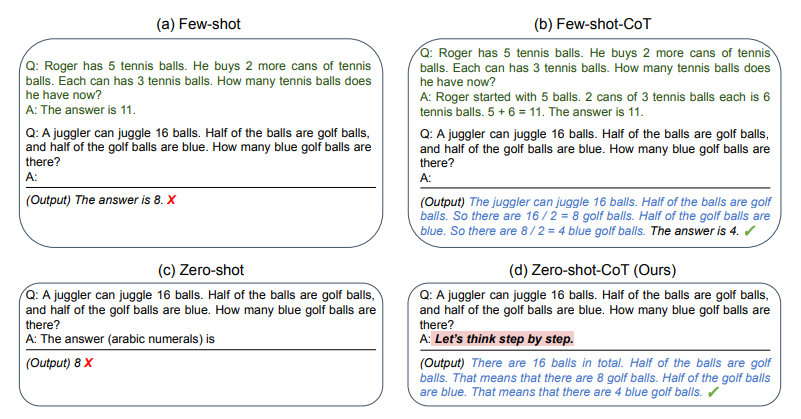

2022年3月，instructGPT：GPT3 + instruction tuning + RLHF + PPO

2022年11月的**ChatGPT**：语言模型层面的核心架构是**GPT3.5**(基于Transformer-Decoder的Masked Self-Attention且融合了Codex的代码/推理能力、instruction tuning等技术) **+ RLHF + PPO3**

2023年3月中旬，OpenAI正式对外发布**GPT-4**，增加了多模态(支持图片的输入形式)，且ChatGPT底层的语言模型直接从GPT3.5升级到了GPT4

## instructGPT三阶段

**阶段1：利用人类的问答数据去对GPT3进行有监督训练出SFT模型(作为baseline)**

收集客户和标注者问答数据，13k，训练一个SFT模型

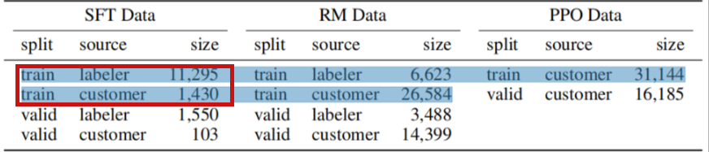

**阶段2：通过RLHF的思路训练一个奖励模型RM**

替换SFT模型的最后一层unembedding layer，初始化RM模型（因为175B不稳定，最后用6B模型）。利用SFT模型，在33k问题上回答，每个问题有四个回答。人工对这4个回答的好坏进行标注且排序，排序的结果用来训练一个奖励模型RM，具体做法就是学习排序结果从而理解人类的偏好。

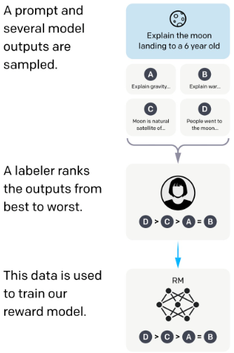

**阶段3：通过训练好的RM模型预测结果且通过PPO算法优化模型策略**

让第一阶段微调好的SFT模型初始化为一个PPO模型。PPO模型在31k问题上生成答案，让RM模型评估，通过不断更大化奖励而优化PPO模型的生成策略。这一步可以和第二步交替进行多轮。

# RAILF

参考：[RLHF的替代之DPO原理解析：从RLHF、Claude的RAILF到DPO、Zephyr_dpo rlhf-CSDN博客](https://blog.csdn.net/v_JULY_v/article/details/134242910)

# DPO

https://www.cnblogs.com/lemonzhang/p/17910358.html

在之前，我们已经了解到基于人类反馈的强化学习[RLHF分为三个阶段](https://www.cnblogs.com/lemonzhang/p/17819158.html)：全监督微调（SFT）、奖励模型（RM）、强化学习（PPO）。但是RLHF面临缺陷：**RLHF 是一个复杂且经常不稳定的过程**，首先拟合反映人类偏好的奖励模型，然后使用强化学习微调大型无监督 LM，以最大化这种估计奖励，而不会偏离原始模型太远。为解决这一问题，**提出一个直接偏好优化 (DPO) 的新算法：通过利用奖励函数与最优策略之间的映射关系，证明这个受限的奖励最大化问题可以通过单阶段的策略训练来精确优化，本质上是在人类偏好数据上解决一个分类问题**。DPO是稳定的、性能和计算成本轻量级的，无需拟合奖励模型，在微调期间从 LM 中采样，或执行显着的超参数调整。通过实验表明：DPO 进行微调超过了 RLHF 效果，并提高了摘要和单轮对话的响应质量。

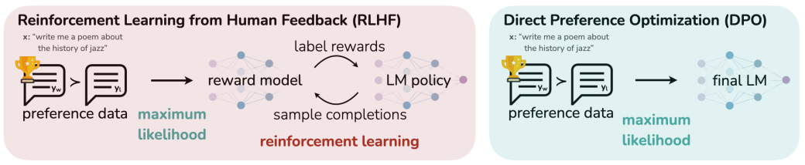

与RLHF不同，DPO不依赖于明确的奖励建模或强化学习。它针对与RLHF相同的目标，但提供了一种更简单、更直接的培训方法。

**DPO的工作原理：增加偏好样本的对数概率与减小非偏好样本响应的对数概率。它结合了动态加权机制，以避免仅使用概率比目标时遇到的模型退化问题。**

DPO依赖于理论上的偏好模型，如Bradley-Terry模型，来测量奖励函数与经验偏好数据的对齐程度。**与传统方法不同，传统方法使用偏好模型来训练奖励模型，然后基于该奖励模型训练策略，DPO直接根据策略定义偏好损失。给定一个关于模型响应的人类偏好数据集，DPO可以使用简单的二元交叉熵目标来优化策略，无需在训练过程中明确学习奖励函数或从策略中采样。**

**（1）原RLHF的优化目标**：最大化奖励和最小化参考策略的KL散度

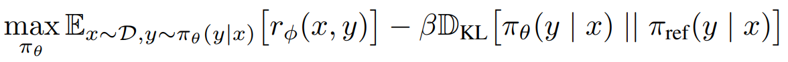

**（2）DPO优化目标：**利用了从奖励函数到最优策略的解析映射，允许直接使用人类偏好数据进行简化的优化过程

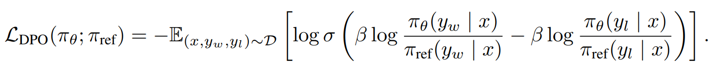

该目标增加了对偏好数据 $y_w$ 的可能性，并减少了非偏好数据 $y_l$ 的可能性。这些示例按照隐式奖励模型的评级加权，由 $\beta$ 缩放.

**优点：**

1、DPO不依赖于明确的奖励建模或强化学习。它针对与RLHF相同的目标，但提供了一种更简单、更直接的培训方法。

**缺点：**

1、稳健性：DPO 的一个缺点是它在人类偏好数据集上很快就会过拟合。为了避免这种情况，谷歌 DeepMind 的研究人员引入了身份偏好优化（IPO），这种方法为 DPO 损失添加了一个正则，能够在不使用「提前停止」等技巧的情况下让模型收敛。

2、对成对偏好数据进行分配：与大多数比对方法一样，DPO 需要一个成对偏好数据集，能够根据一组标准（如有益性或有害性），来标记哪种模型响应更好。在实践过程中，创建这些数据是一项耗时且成本高昂的工作。ContextualAI 最近提出了一种有趣的替代方案，称为 Kahneman-Taversky 优化（KTO），它完全根据被标记为「好」或「坏」的样本来定义损失函数。这些标签更容易获得，可以说 KTO 是一种很有前景的方法，可以不断更新在生产环境中运行的聊天模型（例如在聊天 UI 中看到的图标👍或👎）。

3、多样性下滑，效果差于PPO。[DPO替代RLHF可造成多一倍的性能损失 - 知乎 (zhihu.com)](https://zhuanlan.zhihu.com/p/673047773)

# KTO

# DPO & IPO & KTO 对比

参考：

[人类偏好优化算法哪家强？跟着高手一文学懂DPO、IPO和KTO | 机器之心 (jiqizhixin.com)](https://www.jiqizhixin.com/articles/2024-02-19)

实验1：

* 模型：OpenHermes-2.5-Mistral-7B
* 数据集：orca_dpo_paries 数据集

只有一个超参数β，结果如下：

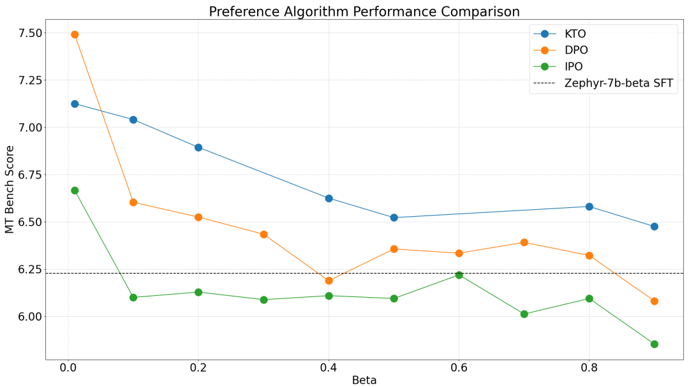

结论：

1、DPO 可以获得最高分数。

2、KTO 在多数情况下，效果最好。

3、IPO 虽然有更强的理论保证，但大多情况下都比基础模式更糟糕。

实验2：

* 模型：Zephyr-7b-β-sft
* 数据集：ultrafeedback-binarized 数据集

只有一个超参数β，结果如下：

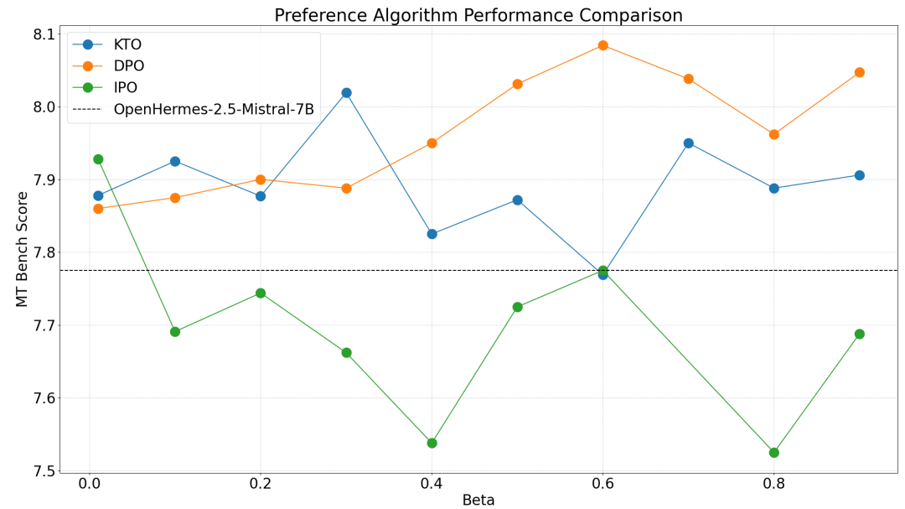

结论：DPO > KTO > IPO

总结：

1、超参数beta很重要

2、多数情况下 DPO > KTO > IPO

# ORPO

# SimPO

