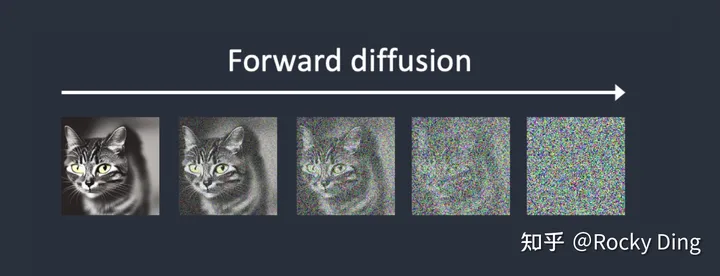
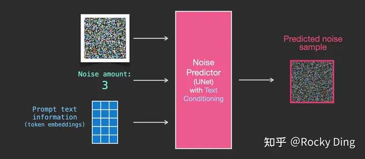
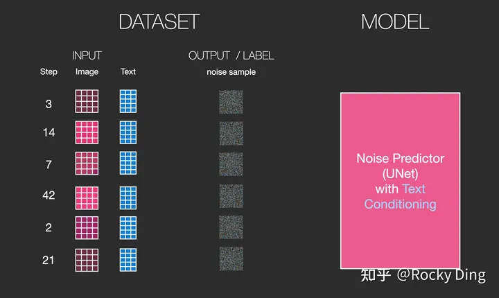
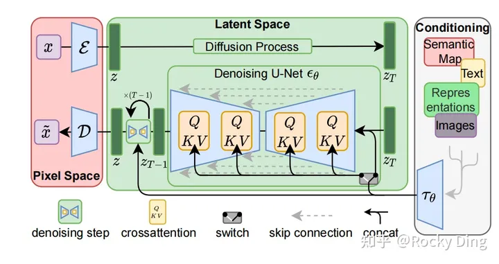

时间：2022年8月

机构：Stability AI


# SD原理

## 通俗易懂

SD可以文生图、图生图、图片修复inpainting。

1、如果是文生图：输入文本信息，再用random函数生成一个Latent Feature作为输入。

2、如果是图生图：输入文本信息，将原图片通过图像编码器（VAE Encoder）生成Latent Feature（隐空间特征）作为输入。


SD有三大模块：CLIP、UNet、VAE

1、CLIP Text Encoder负责文本嵌入。嵌入向量辅助UNet生图。

2、VAE负责将图片编码或解码。编码：将图像压缩到Latent Feature，解码：将图像从Latent Feature重建出来。

3、U-Net网络负责预测噪声，不断优化生成过程，在预测噪声的同时不断注入文本语义信息。而schedule算法对每次U-Net预测的噪声进行优化处理（动态调整预测的噪声，控制U-Net预测噪声的强度），从而统筹生成过程的进度。在SD中，U-Net的迭代优化步数大概是50或者100次，在这个过程中Latent Feature的质量不断的变好（纯噪声减少，图像语义信息增加，文本语义信息增加）。


## 核心原理

与GAN等生成式模型一致的是，SD模型同样学习拟合训练集分布，并能够生成与训练集分布相似的输出结果，但与GAN相比，SD模型训练过程更稳定，而且具备更强的泛化性能。这些都归功于扩散模型中核心的**前向扩散过程（forward diffusion process）**和**反向生成过程（reverse generation process）。**

此外，扩散模型早就有了，而Latent大大降低了显存。让SD变得易用。

**前向扩散**

在前向扩散过程中，SD模型持续对一张图像**添加高斯噪声**直至变成随机噪声矩阵。扩散是固定的，有Schedule算法进行控制。

**反向生成**

而在反向生成过程中，SD模型进行**去噪声过程**，将一个随机噪声矩阵逐渐去噪声直至生成一张图像。




总结：

**SD模型是生成式模型**，输入可以是图片，文本以及两者的结合，输出是生成的图片。

**SD模型属于扩散模型**，扩散模型的整体逻辑的特点是过程分步化与可迭代，这给整个生成过程引入更多约束与优化提供了可能。

**SD模型是基于Latent的扩散模型**，将输入数据压缩到Latent隐空间中，比起常规扩散模型，大幅提高计算效率的同时，降低了显存占用，成为了SD模型破圈的关键一招


## UNet训练过程

**【1】训练集加入噪声**

SD模型训练时，我们需要输入加噪的数据集，每一次迭代我们用random函数生成从强到弱各个强度的噪声，通常来说会生成0-1000一共1001种不同的噪声强度。


在训练过程中，我们首先对干净样本进行加噪处理，采用多次逐步增加噪声的方式，直至干净样本转变成为纯噪声。


**【2】训练中去噪**

使用U-Net预测噪声，并结合Schedule算法逐步去噪。


如下图所示分为四个步骤：从训练集中选取一张加噪过的图片和噪声强度（timestep），然后将其输入到U-Net中，让U-Net预测噪声（下图中的Unet Prediction），接着再计算预测噪声与真实噪声的误差（loss），最后通过反向传播更新U-Net的参数。

输入加噪图片 - 输出预测噪声 = 实际图片


**【3】语义信息对图片生成的控制**

在SD模型的训练中，每个训练样本都会对应一个标签，我们将对应标签通过CLIP Text Encoder输出Text Embeddings，并将Text Embeddings以**Cross Attention**的形式与U-Net结构耦合，使得每次输入的图片信息与文字信息进行融合训练，如下图所示：




**【4】SD模型训练时的输入**

有了上面的介绍，**我们在这里可以小结一下SD模型训练时的输入，一共有三个部分组成：图片，文本，噪声强度**。其中图片和文本是固定的，而噪声强度在每一次训练参数更新时都会随机选择一个进行叠加。



# SD网络结构详解

## SD整体架构

**Stable Diffusion模型整体上是一个End-to-End模型**，主要由VAE（变分自编码器，Variational Auto-Encoder），U-Net以及CLIP Text Encoder三个核心组件构成。

在FP16精度下Stable Diffusion模型大小2G（FP32：4G），其中U-Net大小1.6G，VAE模型大小160M以及CLIP Text Encoder模型大小235M。其中U-Net结构包含约860M参数，以FP32精度下大小为3.4G左右。



## VAE

在Stable Diffusion中，VAE（变分自编码器，Variational Auto-Encoder）的Encoder（编码器）结构能将输入图像转换为低维Latent特征，并作为U-Net的输入。VAE的Decoder（解码器）结构能将低维Latent特征重建还原成像素级图像。


## U-Net

在Stable Diffusion中，**U-Net模型是一个关键核心**，作为扩散模型其主要是**预测噪声残差**，并结合Sampling method（调度算法：PNDM，DDIM，K-LMS等）对输入的特征矩阵进行重构，**逐步将其从随机高斯噪声转化成图片的Latent Feature**。

Stable Diffusion中的U-Net，在传统深度学习时代的Encoder-Decoder结构的基础上，**增加了ResNetBlock（包含Time Embedding）模块，Spatial Transformer（SelfAttention + CrossAttention + FeedForward）模块以及CrossAttnDownBlock，CrossAttnUpBlock和CrossAttnMidBlock模块**。


## CLIP

**CLIP模型包含Text Encoder和Image Encoder两个模型。**在训练时，从训练集中随机取出一张图片和标签文本。CLIP模型的任务主要是通过Text Encoder和Image Encoder分别将标签文本和图片提取**embedding向量**，然后用**余弦相似度**来比较两个embedding向量的**相似性**，以判断随机抽取的标签文本和图片是否匹配，并进行梯度反向传播，不断进行优化训练。


在Stable Diffusion中主要使用了Text Encoder模型。**CLIP Text Encoder模型将输入的文本Prompt进行编码，转换成Text Embeddings（文本的语义信息）**，通过前面一章节提到的U-Net网络中的CrossAttention模块嵌入Stable Diffusion中作为Condition，对生成图像的内容进行一定程度上的控制与引导，目前SD模型使用的的是CLIP ViT-L/14 中的Text Encoder模型。

CLIP ViT-L/14 中的Text Encoder是只包含Transformer结构的模型，一共由12个CLIPEncoderLayer模块组成，具体CLIP Text Encoder模型结构如下图所示。其中特征维度为768，token数量是77，**所以输出的Text Embeddings的维度为77x768**。


# 应用

## diffuers库

huaggingface开源的库。

安装

```
pip install diffusers
pip install transformers==4.27.0 accelerate==0.12.0 safetensors==0.2.7 invisible_watermark
```

从hugggingface下载模型

其中text_encoder，scheduler，unet，vae分别代表了上面讲到过的SD模型的核心结构。


代码

有时候我们运行完pipeline之后，会出现纯黑色图片，这表示我们本次生成的图片触发了NSFW机制，出现了一些违规的图片，我们可以修改seed重新进行生成。

```
from diffusers import StableDiffusionPipeline

#初始化SD模型，加载预训练权重
pipe = StableDiffusionPipeline.from_pretrained("runwayml/stable-diffusion-v1-5")
#使用GPU加速
pipe.to("cuda")
#如GPU的内存少于10GB，可以加载float16精度的SD模型
pipe = StableDiffusionPipeline.from_pretrained("runwayml/stable-diffusion-v1-5", revision="fp16", torch_dtype=torch.float16)
#接下来，我们就可以运行pipeline了
prompt = "a photograph of an astronaut riding a horse"
image = pipe(prompt).images[0]
```

文生图流程图

