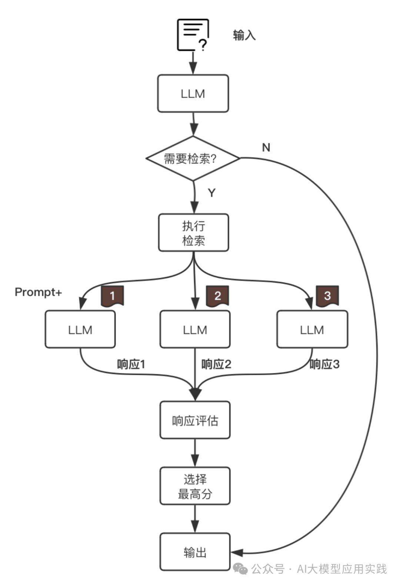
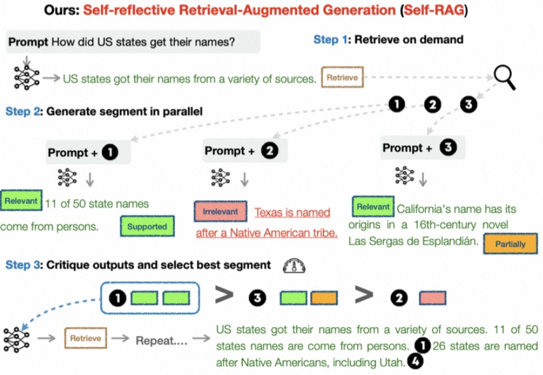
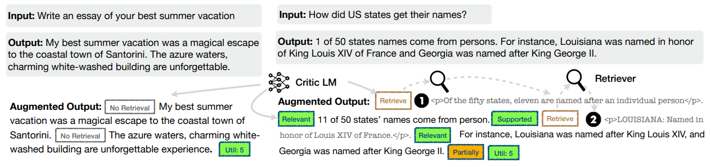
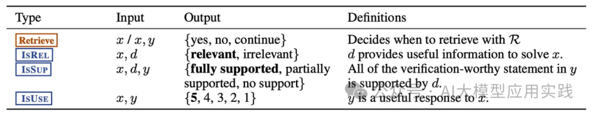
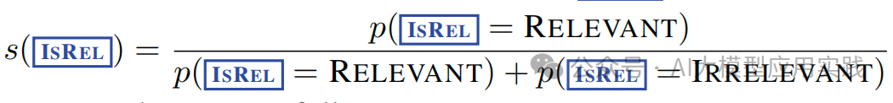
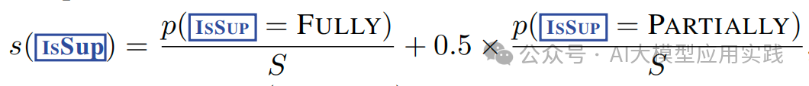
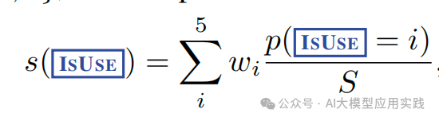
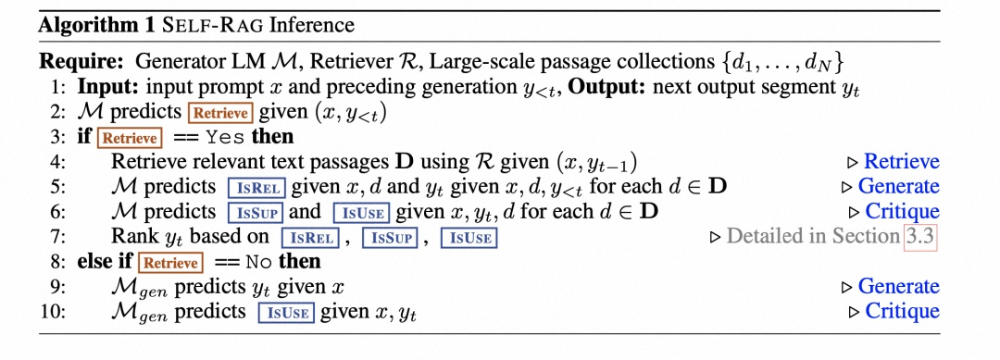

Self-RAG: Learning to Retrieve, Generate, and Critique through Self-Reflection

2023-10

# 工作原理

**1. 检索判断。** 相对于经典RAG中直接用输入问题检索知识文档，在Self-RAG中首先由模型来决定是需要检索，还是直接输出。

**2. 按需检索：**

- **如果无需检索** （比如”给我创作一首歌颂母爱的诗歌“），则由模型直接生成。
- **如果需要检索（** 比如”介绍我公司最受欢迎的产品“），则让应用执行检索动作，检索出最相关的Top_K知识。

**3. 增强生成。** 使用检索出的K个相关知识与输入问题组装Prompt，一起生成K个输出。（作为对比，在经典RAG中通常是把排序后的K个知识一起组装到Prompt后交给LLM做一次生成输出）。

**4. 评判、选择与输出。** 对上一步中增强生成的K个输出响应进行评估打分，并选择分数最高的一个作为最终结果。

流程如下：

输出如下：（左侧无检索，右侧有检索）

# 四种评判指标

仔细看上面的流程，会发现一共会涉及到两个环节需要借助LLM进行评判：

- **是否需要知识检索以实现增强？**
- **如何对多个输出的响应结果计算评分？**

在这两个环节中Self-RAG共设计了四种类型的评判指标，在原文中用了比较严谨的科学化定义：

这里用简单的方式先来理解这四种评判指标，后续再看如何生成这些指标：

**1. Retrieve：是否需要知识检索**

**表示LLM后续的内容生成是否需要做额外知识检索** 。取值：

- **[No Retrieval]** ：无需检索，LLM直接生成
- **[Retrieval]** ：需要检索
- **[Continue to Use Evidence]** ：无需检索，使用之前内容

**2. IsRel：知识相关性（知识 => 问题）**

**表示检索出来的知识是否提供了解决问题所需的信息** 。取值：

- **[Relevant]：** 检索出来的知识与需要解决的问题足够相关
- **[Irrelevant]：** 检索出来的知识与需要解决的问题无关

**3. IsSup：响应支持度（知识 => 响应）**

**表示生成的响应内容是否得到检索知识的足够支持** 。取值：

- **[Fully supported]** ：输出内容陈述被检索的知识完全支持。
- **[Partially supported]** ：输出内容陈述只有部分被检索的知识所支持，另一部分和问题无关。
- **[No support / Contradictory]** ：输出内容不被检索的知识所支持（即编造）。

**4. IsUse：响应有效性（响应 => 问题）**

**表示生成的响应内容对于回答/解决输入问题是否有用。** 取值：

- **[Utility : \*x\*]** ：按有效的程度x分成1-5分，即最高为[Utility:5]

# 如何生成评判指标？

那么这四种类型的评判指标如何生成呢？又是在什么时候生成？

一种容易想到的方式是 **借助LLM与Prompt来判断** ，比如把输入问题与检索知识交给大模型，要求其判断两者相关性，从而得出IsRel（相关性）指标。这种方式的好处是完全在应用层实现，但缺点是：

- 过多的LLM交互会带来响应性能下降与tokens成本升高
- 生成的评判指标只能定性的判断，难以量化

**Self-RAG采用了一种不同的方法：通过微调训练LLM，让LLM在推理过程中实现自我反省，直接输出代表这些指标的标记性Tokens，即“自省Tokens”。** 在Self-RAG的开源项目中提供了一个基于llama微调的模型 **selfrag_llama2_7b** 。

如：

**Response：** **[Relevant]** 字节调动的Coze是一个大语言模型的应用开发平台，其提供了一站式开发LLM应用的相关工具、插件与编码环境. **[Partially supported] [Utility:5]**

 

# 如何参考指标来计算评分？

这里需要借助到LLM推理时，输出的token的 **logprobs**，也就是对数概率。 

**【IsRel】：知识相关度**

**【IsSup】：响应支持度**

**【IsUse】：响应有效性**

# 算法描述

问题形式化和概述

# 案例

测试两个问题，一个无需检索，一个需要检索知识
query_1 = "写一首歌颂母爱的小诗"
query_2 = "能否介绍下字节跳动的AI平台Coze？"

第一个问题的输出：

Response: Mother love, so pure and true, A bond that's stronger than any tie. **[No Retrieval]** You give your all, 【此处省略】 ......follow its owners everywhere. **[Utility:5]**

第一个问题是一个创作问题，并不涉及具体事实，显然无需检索额外知识。因此推理结果中带有 **[No Retrieval]** 的标记（红色部分）。

第二个问题的输出：

Response: **[Relevant]** Coze is a platform developed by ByteDance, the parent company of TikTok, for building and deploying large-scale AI models. **[Fully supported]** It provides an all-in-one development platform that includes tools for training, testing, and deploying AI models. **[Utility:5]**

第二个问题是一个事实性问题。这里可以看到，在推理过程中，LLM会发现需要额外知识补充，并且响应中带有自省token标记（红色部分）。比如包括了相关性[Relevant]，响应支持度[Fully Supported]，以及答案有用性[Utility:5]，这些也都是后续需要进一步评分的指标。