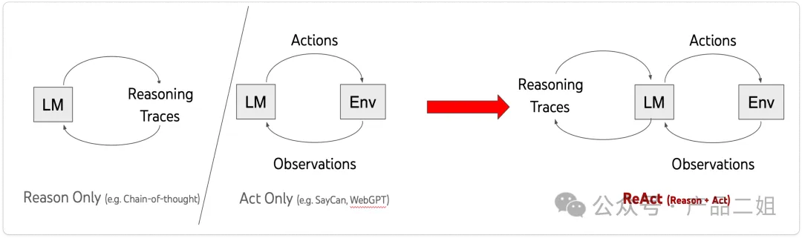

# 设计模式

# 1. ReAct

**1.生成提示词。**首先，将代码中预设好 ReAct 的提示词模板(格式为Quesion->Thought->Action->Observation)和用户的问题进行合并。得到的提示词是这样的。

**2.调用大模型生成Thought+Action。** 接下来将 few shot 提示词发给大模型。如果直接将上述提示词发给大模型，大模型生成将针对用户问题生成一堆 Thought，Action 和 Observation，但显然这里 Action 还没有展开，我们并不希望大模型输出 Observation。在代码里通过 Stop.Observation 来控制大模型遇到Observation后停止输出，于是大模型仅仅返回 Thought 和 Action，而不会把 Observation 给生成出来。

**3.调用外部工具。**拿到 Action 之后，大模型就可以调用外部工具了。首先判断这里的 Action 是不是 Finish，如果不是我们就可以利用大模型把 Action 后面的自然语言转换为外部工具能识别的 API 接口，这个转换过程就是大模型的 function calling 功能，本质上是对大模型进行微调，专门用于语言格式转换的模型，但并非所有的大模型都支持 function calling。

**4. 生成Observation。**API 接口返回后，还会将接口返回内容转换为自然语言输出，生成 Observation，然后将 Observation 的内容，加上刚刚的 Thought， Action 内容输入给大模型，重复第 2，3 步，直至 Action 为Finish 为止。

**5.完成输出。**将最后一步的 Observation 转化为自然语言输出给用户。

# 2. Plan and solve

顾名思义这种设计模式是先有计划再来执行。ReAct更适合 完成已规范Plan的任务，那么 Plan & solve 更适合完成需要指定计划的任务：你需要计划，并且过程中计划可能会变化。

提示词模板方面，论文标题中说得很直白，《Plan-and-Solve Prompting: Improving Zero-Shot Chain-of-Thought Reasoning by Large Language Models》，简言之就是 Zero shot 的提升，下图是作者代码中给出的一些 PS-Plan and Solve 提示词。

架构上它的组成是这样的：

> - 规划器：负责让 LLM 生成一个多步计划来完成一个大任务。代码中有 Planner 和和 Replanner，Planner 负责第一次生成计划；Replanner 是指在完成单个任务后，根据目前任务的完成情况进行 Replan，所以 Replanner 提示词中除了 Zeroshot，还会包含：目标，原有计划，和已完成步骤的情况。
> - 执行器：接受用户查询和规划中的步骤，并调用一个或多个工具来完成该任务。

# 3. REWOO

REWOO(Reason without Observation)这种方法是相对 ReAct中的Observation 来说的，ReAct 提示词结构是 Thought→ Action→ Observation, 而 REWOO 把 Observation 去掉了。但实际上，REWOO 只是将 Observation 隐式地嵌入到下一步的执行单元中了，即由下一步骤的执行器自动去 observe 上一步执行器的输出。

架构上它由三个组件组成：

> - Planner：负责生成一个相互依赖的“链式计划”，定义每一步所依赖的上一步的输出。
> - Worker：循环遍历每个任务，并将任务输出分配给相应的变量。当调用后续调用时，它还会用变量的结果替换变量。
> - Solver：求解器将所有这些输出整合为最终答案。

# 4. LLM Compiler

Compiler-编译一词在计算机科学的意义就是如何进行任务编排使得计算更有效率，原论文题目是《An LLM Compiler for Parallel Function Calling》，很直白，就是通过**并行Function calling来提高效率**，比如用户提问张译和吴京差几岁，planner 搜索张译年龄和搜索吴京年龄同时进行，最后合并即可。

提示词里对 Planner 的要求是这样的，重点是希望生成一个 DAG(Direct Acyclic Graph, 有向无环图。

架构上有一个 Planner(规划器)，有一个 Jointer(合并器)。

# 5. Basic Reflection

Basic Reflection 可以类比于学生(Generator)写作业，老师(Reflector)来批改建议，学生根据批改建议来修改，如此反复。

提示词就是复刻师生之间的交互。

架构上有一个 Generator，一个 Reflector。

# 6. Reflexion

Reflexion 是 Basic reflection 的升级版，相应论文标题是《Reflexion: Language Agents with Verbal Reinforcement Learning》，本质上是强化学习的思路。和 Basic reflection 相比，引入了外部数据来评估回答是否准确，并强制生成响应中多余和缺失的方面，这使得反思的内容更具建设性。

提示词方面：会让大模型针对问题在回答前进行反思和批判性思考，反思包括有没有漏掉(missing)或者重复(Superfluous)，然后回答问题，回答之后再有针对性的修改(Revise)

架构上，有一个 Responder：自带批判式思考的陈述 Critique；有一个 Revisor：以 Responder 中的批判式思考作为上下文参考对初始回答做修改。

# 7. LATS

LATS 相应论文标题是《Language Agent Tree Search Unifies Reasoning Acting and Planning in Language Models》，很直白：是 Tree search + ReAct+Plan&solve 的融合体。在原作的图中，我们也看到 LATS 中通过树搜索的方式进行 Reward(强化学习的思路)，同时还会融入 Reflection，从而拿到最佳结果。所以：

**LATS = Tree search + ReAct+Plan&solve + Reflection + 强化学习**

提示词模板方面和之前的 reflection，plan&solve，ReAct 差别不大，只是上下文中多了对树搜索结果的评估和返回结果。

架构上，就是多轮的 Basic Reflection， 多个 Generator 和 Reflector。

# 8. Self-Discover

Self-discover 的核心是让大模型在更小粒度上 task 本身进行反思，比如前文中的 Plan&Slove 是反思 task 是不是需要补充，而 Self-discover 是对 task 本身进行反思。

提示词方面，Self-discover 列出一系列的反思方式让 agent 来选择：

结构上，Self-Discover 如下图所示：

> - Selector: 从众多的反省方式中选择合适的反省方式；
> - Adaptor: 使用选择的反省方式进行反省；
> - Implementor: 反省后进行重新 Reasoning;

# 10. Storm

Storm 相应论文标题是《 Assisting in Writing Wikipedia-like Articles From Scratch with Large Language Models》，很直白：可以从零生成一篇像维基百科的文章。主要思路是先让 agent 利用外部工具搜索生成大纲，然后再生成大纲里的每部分内容。

提示词模板方面主要围绕如何生成大纲，如何丰富大纲内容来展开。

架构上，就是先有 topic， 然后生成大纲，根据大纲丰富内容。这里会有一个大纲生成器，一个内容生成器。

