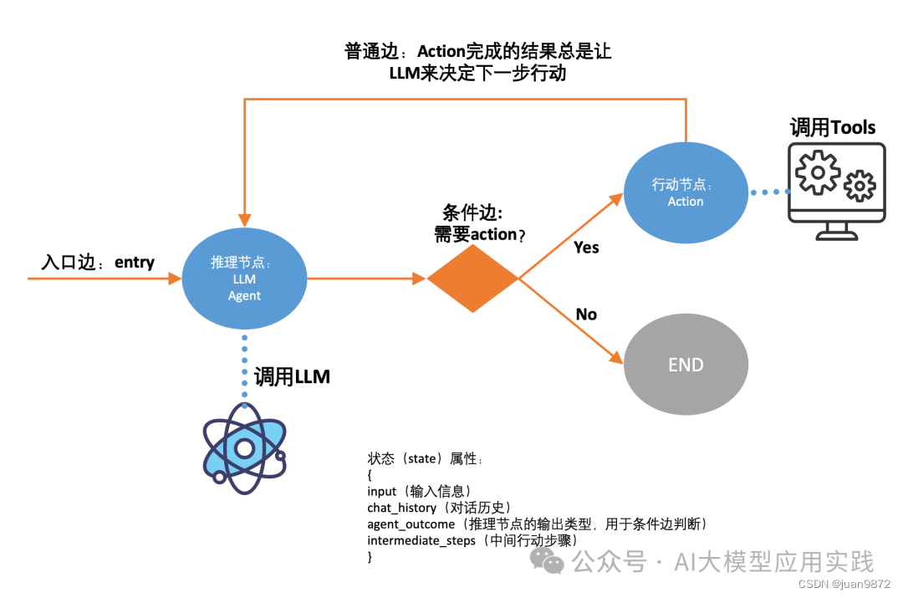

参考：

[彻底搞懂LangGraph【1】：构建复杂智能体应用的LangChain新利器_智能体构建器-CSDN博客](https://blog.csdn.net/juan9872/article/details/137658555)


# LCEL

**LCEL即LangChain Express Language，**即LangChain表达语言。这是LangChain提供的一种简洁的、用于组装上述“链”的声明性方式。

例子：

```
prompt = ChatPromptTemplate.from_template("讲一个关于 {topic} 的笑话")
model = ChatOpenAI(model="gpt-4")
output_parser = StrOutputParser()
chain = prompt | model | output_parser
#调用chain
chain.invoke({"topic": "冰淇淋"})
```

# 入门

Langchain中有Agent，为什么还要设计LangGraph？

比如，设计一个ReAct范式的Agent：

```
def search(query: str) -> str:
	"""此处省略"""
    pass

agent = (
{input:{输入信息}, agent_scratchpad:{中间步骤}}
| prompt
| model
| AgentOutputParser()
)

agent_executor = AgentExecutor(agent=agent, tools=tool_list, verbose=True)
agent_executor.invoke({"input": "whats the weather in New york?"})
```

AgentExecutor调用的过程主要就是两个步骤：

1. 通过大模型来决定采取什么行动，使用什么工具，或者向用户输出响应（如运行结束时）；
2. 执行1步骤中的行动，比如调用某个工具，并把结果继续交给大模型来决定，即返回步骤1.

**AgentExecutor：尽管支持“循环”，但缺乏精确控制能力，在构建复杂Agent的时候受限。**

1. 某个Agent要求首先强制调用某个Tool
2. 在 Agent运行过程中增加人机交互步骤
3. 能够灵活更换Prompt或者背后的LLM
4. 多Agent（Multi-Agent）智能体构建的需求，即多个Agent协作完成任务的场景支持。（这也是Langchain相对于竞争对手Autogen等最薄弱的能力之一，也是众多开发者千呼万唤的特性）


**LangGraph的几个基本概念：**

1、**StateGraph**：这是代表整个状态图的基础类。

2、**Nodes**：节点。在有了图之后，可以向图中添加节点，节点通常是一个可调用的函数、一个可运行的Chain或者Agent。有一个特殊的节点叫END，进入这个节点，代表运行结束。

3、**Edges**：边。有了节点后，需要向图中添加边，边代表从上一个节点跳转到下一个节点的关系。目前有三种类型的边：

* **Starting Edge**：一种特殊的边。用来定义任务运行的开始节点，所以它没有上一个节点。
* **Normal Edge**：普通边。代表上一个节点运行完成后立即进入下一个节点。比如在调用Tools后获得结果后，立刻进入LLM推理节点。
* **Conditional Edge**：条件边。代表上一个节点运行完成后，需要根据条件跳转到某个节点，因此这种边不仅需要上游节点、下游节点，还需要一个条件函数，根据条件函数的返回来决定下游节点。


使用LangGraph实现ReAct智能体：



简单的实现代码如下（省略了部分细节）：

```
# 定义一个Graph，传入state定义（参考上图state属性）
workflow = StateGraph(AgentState)
 
# 两个节点
 
#节点1: 推理节点，调用LLM决定action，省略了runreason细节
workflow.add_node("reason", run_reason)
 
#节点2: 行动节点，调用tools执行action，省略executetools细节
workflow.add_node("action", execute_tools)
 
#入口节点：总是从推理节点开始
workflow.set_entry_point("reason")
 
#条件边：根据推理节点的结果决定下一步
workflow.add_conditional_edges(
"reason",
should_continue, #条件判断函数（自定义，根据状态中的推理结果判断）
{
"continue": "action", #如果条件函数返回continue，进action节点
"end": END, #如果条件函数返回end，进END节点
},
)
 
#普通边：action结束后，总是返回reason
workflow.add_edge("action", "reason")
 
#编译成app
app = workflow.compile()
 
#可以调用app了，并使用流式输出
inputs = {"input": "you task description", "chat_history": []}
for s in app.stream(inputs):
print(list(s.values())[0])
print("----")
```


