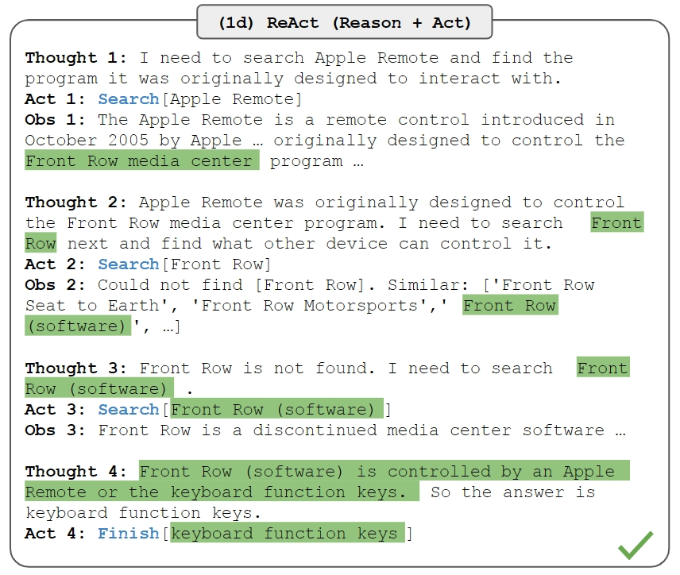

# 引言

从今年 3 月 AutoGPT 推出后，Generative Agent、GPT-Engineer、BabyAGI 项目的爆发将 LLM 地叙事代入了新的阶段。Lillian 在自己的 Twitter 中也认为“This is probably just a new era”。

2023 年 6 月，OpenAI 的 Safety 团队负责人 Lilian Weng 发布了一篇 6000 字的博客介绍 AI Agent，并认为这将使 LLM 转为通用问题解决方案的途径之一。Lilian Weng 表示 AI Agent 主要由规划（Planning）、记忆（Memory）、工具使用（Tool Use）三个核心组件构成，其核心概念是使用 LLM 解决问题，让 LLM 学会使用工具，可以大扩展其能力。

1、规划（Planning）

* 子目标和分解：AI Agents 能够将大型任务分解为较小的、可管理的子目标，以便高效的处理复杂任务；
* 反思和细化：Agents 可以对过去的行为进行自我批评和反省，从错误中吸取经验教训，并为接下来的行动进行分析、总结和提炼，这种反思和细化可以帮助 Agents 提高自身的智能和适应性，从而提高最终结果的质量。

2、记忆 （Memory）

* 短期记忆：所有上下文学习都是依赖模型的短期记忆能力进行的；
* 长期记忆：这种设计使得 AI Agents 能够长期保存和调用无限信息的能力，一般通过外部载体存储和快速检索来实现。

3、工具使用（Tool use）

* AI Agents 可以学习如何调用外部 API，以获取模型权重中缺少的额外信息，这些信息通常在预训练后很难更改，包括当前信息、代码执行能力、对专有信息源的访问等。

人大高瓴 AI 学院团队在 8 月发布综述论文《A Survey on Large Language Model based Autonomous Agents》，研究者基于以往研究总结了一项 Agent 设计架构，由分析模块、记忆模块、规划模块和动作模块组成。

① 分析模块：用于识别智能体是什么角色。在现有的工作中，有三种常用的策略来生成智能体配置文件：手工制作方法、LLM-generation 方法、数据集对齐方法。

② 记忆模块：用于记忆从环境中感知到的信息，并利用记录的记忆来促进智能体未来的动作。

③ 规划模块：用于将复杂任务分解为简单的子任务，然后由智能体逐一解决。论文介绍了两种规划模块：没有反馈的规划以及有反馈的规划。

④ 动作模块：用于将智能体的决策转化为具体的结果输出。它直接与环境交互，决定智能体完成任务的有效性。

复旦 FudanNLP 团队在 9 月发布综述论文《The Rise and Potential of Large Language ModelBased Agents: A Survey》，研究者所总结的 Agent 框架则是由控制端、感知端和行动端三部分组成。

① 控制端（Brain）：通常由 LLMs 构成，是智能代理的核心。它不仅可以存储记忆和知识，还承担着信息处理、决策等不可或缺的功能。它可以呈现推理和计划的过程，并很好地应对未知任务，反映出智能代理的泛化性和迁移性。

② 感知端（Perception）：将智能代理的感知空间从纯文本拓展到包括文本、视觉和听觉等多模态领域，使代理能够更有效地从周围环境中获取与利用信息。

③ 行动端（Action）：除了常规的文本输出，还赋予代理具身能力、使用工具的能力，使其能够更好地适应环境变化，通过反馈与环境交互，甚至能够塑造环境。

# Agent本质

本质上就是写prompt，让模型仿照你的方式来进行执行的一种应用范式，prompt里面包含一些tools的描述，然后我们可以根据模型的输出使用一些外部tools(例如计算器，搜索API，数据库，程序接口，各种模型的API)

目前有两种类型的Agents：

- Action agents: 在每个时间步长，使用所有先前操作的输出来决定下一个操作.
- Plan-and-execute agents：预先决定完整的行动顺序，然后在不更新计划的情况下全部执行。

Action Agents适合小型的任务，而plan-and-execute agents更适合需要保持长期目标的复杂任务，通常最好的方法是通过让plan-and-execute agent使用action agents来执行计划，将action agents的动态性与plan-and-execute agent的计划能力相结合。

# Agent类型

一个Agent的基本组成应该包含如下四个方面**规划**（planning), **工具**（Tools), **执行**(Action), 和**记忆**(Memory)。

Agent Planning是Agent能力的核心，一个好的规划决定了agent能否顺利执行以及解决问题，规划简单来说就是**任务分解(Task Decomposition)**; 把复杂的问题划分成可以一步步解决的小步骤，以及不断根据**反馈(feedback)**去重新调整策略。

## Chain of thought

**Chain-of-Thought**是常见用来引导模型进行任务分解的大模型**提示(prompting)**方法，其主要方法就是提供任务分解的**少量示例(few-shot examples)**，利用大模型的**上下文学习能力(In-context learning)**去模仿进行类似的**任务分解和规划**。

chain of tree也是用于任务分解和规划。

## Self-ask

提出self ask方式的论文 [Measuring and Narrowing the Compositionality Gap in Language Model](https://link.zhihu.com/?target=https%3A//arxiv.org/abs/2210.03350) ，作者的英文介绍文 [Self-ask Prompting](https://link.zhihu.com/?target=https%3A//ofir.io/Self-ask-prompting/) 。

主要思路：引导LLM将一个复杂的问题拆分为简单的问题，逐个回答，然后汇总成为答案。

实施细节：

1、如上图，白色背景的是prompt，绿色背景的文本是LM的输出，下划线的是inference-time的问题。通过上文样本提示LLM输出Follow-up和immediate answer步骤。

2、拆分出的子问题，不依赖LLM自己进行回答，而是调用外部搜索工具进行回答。并把结果交给LLM继续思考推理。

## ReAct(Yao et al.)

ReAct是 Reasoning + Acting的简写，提出的论文是 [ReAct: Synergizing Reasoning and Acting in Language Models](https://link.zhihu.com/?target=https%3A//arxiv.org/abs/2210.03629) ，一个结合Langchain的详细介绍可以见 [https://tsmatz.wordpress.com/2023/03/07/react-with-openai-gpt-and-langchain/](https://link.zhihu.com/?target=https%3A//tsmatz.wordpress.com/2023/03/07/react-with-openai-gpt-and-langchain/) 。

ReAct也是引导LLM将复杂的问题解决过程拆解为简单的步骤，差异是：ReAct每次让LLM输出一个当前的【思考】和【要做的动作】，这个动作并不只限于检索信息，可以是调用任何工具。

这样ReAct引入了外部工具的概念，让LLM能够通过这种步进式的方式逐步思考并调用外部工具，根绝外部工具的结果进一步思考循环。同时也可以仅仅是输出一步思考，并继续下去，类似CoT。

这个过程仍然是靠few-shot的方式给例子，引导LLM类似的“思考”，并按格式返回后续步骤的信息。（上图没给few-shot，Langchain中用的是Few-shot方式）

## ReWoo(Binfeng Xu et al.)

**ReWOO**是类似在ReACT架构基础上，去掉了观察（observation)这个模块，取而代之的是把整个planning过程划分成**'Planner', 'Worker'**和**'Slover**'分别去进行规划、执行和总结三个部分，在API消耗和精度上都有所提升。

# Agent大全

agent太多了，这里有一个agent大全：

https://github.com/e2b-dev/awesome-ai-agents

开发Agent工具：CrewAI、Langraph、Autogen等