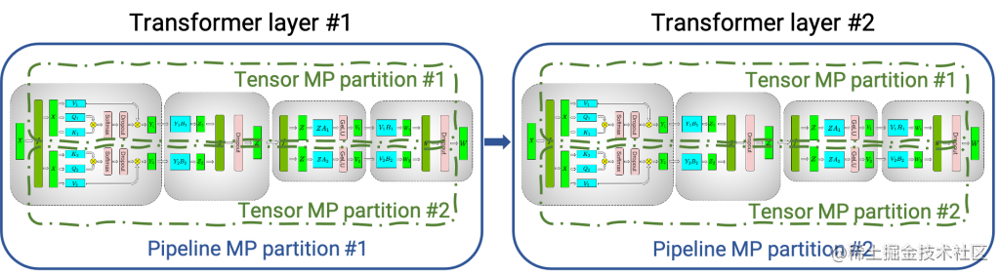

最近几个月，随着ChatGPT的现象级表现，大模型如雨后春笋般涌现。而模型推理是抽象的算法模型触达具体的实际业务的最后一公里。

但是在这个环节中，仍然还有很多已经是大家共识的痛点和诉求，比如：

- 任何线上产品的用户体验都与服务的响应时长成反比，复杂的模型如何极致地压缩请求时延？
- 模型推理通常是资源常驻型服务，如何通过提升服务单机性能从而增加QPS，同时大幅降低资源成本？
- 端-边-云是现在模型服务发展的必然趋势，如何让离线训练的模型“瘦身塑形”从而在更多设备上快速部署使用？

因此，模型推理的加速优化成为了AI界的重要研究领域。

本文给大家分享大模型推理加速引擎FasterTransformer的基本使用。

## FasterTransformer简介

NVIDIA FasterTransformer (FT) 是一个用于实现基于Transformer的神经网络推理的加速引擎。 它包含Transformer块的高度优化版本的实现，其中包含编码器和解码器部分。使用此模块，您可以运行编码器-解码器架构模型（如：T5）、仅编码器架构模型（如：BERT）和仅解码器架构模型（如： GPT）的推理。

`FT` 框架是用 `C++/CUDA` 编写的，依赖于高度优化的 cuBLAS、cuBLASLt 和 cuSPARSELt 库，与 [NVIDIA TensorRT](https://link.juejin.cn/?target=https%3A%2F%2Fdeveloper.nvidia.com%2Fblog%2Foptimizing-t5-and-gpt-2-for-real-time-inference-with-tensorrt%2F) 等其他编译器相比，FT 的特点是它支持**以分布式方式推理 Transformer 大模型**。

下图显示了如何使用张量并行 (TP) 和流水线并行 (PP) 技术将基于Transformer架构的神经网络拆分到多个 GPU 和节点上。

- 当每个张量被分成多个块时，就会发生张量并行，并且张量的每个块都可以放置在单独的 GPU 上。在计算过程中，每个块在不同的 GPU 上单独并行处理；最后，可以通过组合来自多个 GPU 的结果来计算最终张量。
- 当模型被深度拆分，并将不同的完整层放置到不同的 GPU/节点上时，就会发生流水线并行。

在底层，节点间或节点内通信依赖于 MPI 、 NVIDIA NCCL、Gloo等。因此，使用FasterTransformer，您可以在多个 GPU 上以张量并行运行大型Transformer，以减少计算延迟。同时，TP 和 PP 可以结合在一起，在多 GPU 节点环境中运行具有数十亿、数万亿个参数的大型 Transformer 模型。

除了使用 C ++ 作为后端部署，FasterTransformer 还集成了 TensorFlow（使用 TensorFlow op）、PyTorch （使用 Pytorch op）和 Triton作为后端框架进行部署。当前，TensorFlow op 仅支持单 GPU，而 PyTorch op 和 Triton 后端都支持多 GPU 和多节点。

目前，FT 支持了 Megatron-LM GPT-3、GPT-J、BERT、ViT、Swin Transformer、Longformer、T5 和 XLNet 等模型。您可以在 GitHub 上的 FasterTransformer库中查看最新的支持矩阵。

FT 适用于计算能力 >= 7.0 的 GPU，例如 V100、A10、A100 等。

下图展示了 GPT-J 6B 参数的模型推断加速比较：

