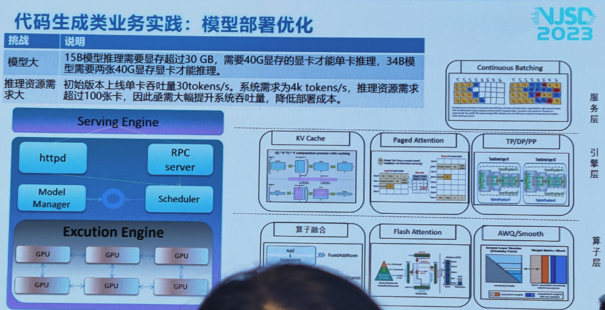
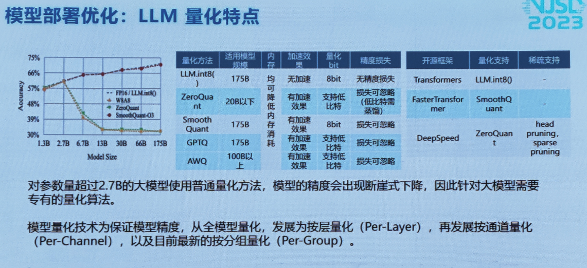
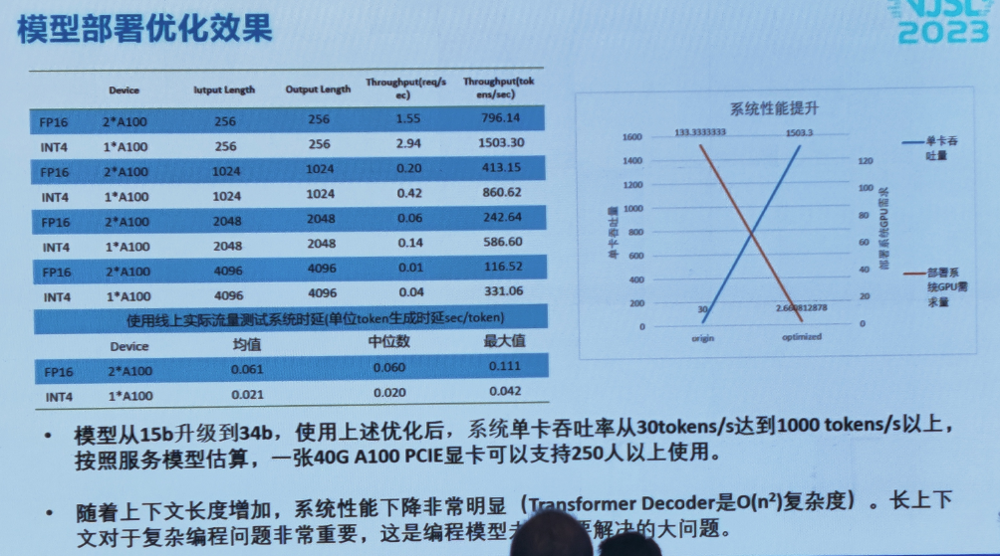

# 中兴PPT

1000并发：初始版本单卡吞吐量30token/s，系统需求为4k token/s, 。

优化技术：FlashAttention, KV Cache, Continuous Batching等

瓶颈：

特点：

最终用了4张40G A100，供1000人用。

所以，他们用了Int4量化模型。

# 技术总结

## 一、服务层

### Continuous Batching

优点：加速计算

参考：https://zhuanlan.zhihu.com/p/657586838

## 二、引擎层

### KV Cache

优点：加速计算

参考：https://zhuanlan.zhihu.com/p/662498827

### Paged Attention

优化KV Cache。KV Cache需要占用连续显存，造成碎片化，浪费空间。受操作系统中虚拟内存和分页经典思想启发，PagedAttention 允许在非连续的内存空间中存储连续的 key 和 value。

这种内存效率的提升被证明非常有用，允许系统将更多序列进行批处理，提高 GPU 使用率，显著提升吞吐量。

参考：

https://zhuanlan.zhihu.com/p/661152161

### TP/DP/PP

并行化方案：主要解决模型、数据太大的问题。

参考：

https://zhuanlan.zhihu.com/p/581677880

## 三、算子层

### 算子融合

理解：软硬件结合解决。框架层面、结合硬件。

参考：

[什么是算子融合-怎么搞 - 知乎 (zhihu.com)](https://zhuanlan.zhihu.com/p/664070841#:~:text=算子融合（Operator Fusion）是一种常用的优化技术，常用于深度学习和其他计算密集型任务中。 基本操作就是将多个连续的操作或算子合并成一个单一的算子，以减少计算和内存开销。,使用算子融合非常有助于提高执行效率，减少数据传输和临时存储的需要，以及提高缓存利用率。 其实它是一种直接的优化"少动数据多计算"，通过 这种方式达到了更多的利用计算资源。)

[Op Fusion（一）： 什么是算子融合 - 知乎 (zhihu.com)](https://zhuanlan.zhihu.com/p/581755093)

### Flash Attention

两个观点：

1、本方法主要是减少内存访问的开销（瓶颈）；其他人主要是专注于减少FLOP，所以他们计算速度没加快。。

2、为了减少内存读写，将softmax矩阵分块计算，最终Flash Attention计算是线性的。

参考：

https://zhuanlan.zhihu.com/p/661152161

https://zhuanlan.zhihu.com/p/651280772

### 量化Quantization

LLM.int8()、ZeroQuant、SmoothQuant、GPTQ、AWQ、SqueezeLLM、QLora

参考：

https://zhuanlan.zhihu.com/p/645308698

https://zhuanlan.zhihu.com/p/667455383

# 其他

推荐：

大语言模型推理加速技术：https://zhuanlan.zhihu.com/p/667455383

