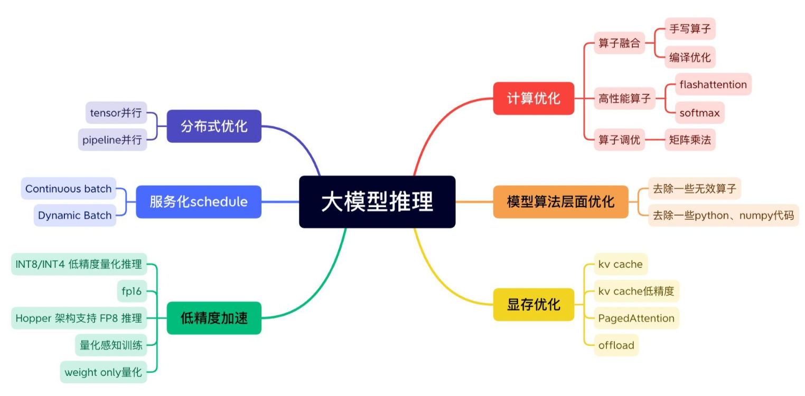
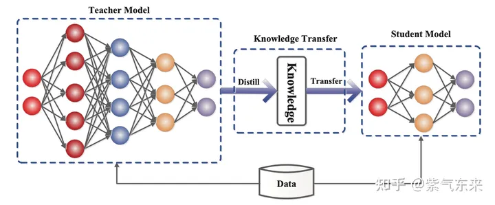

参考：

https://zhuanlan.zhihu.com/p/656485997

https://zhuanlan.zhihu.com/p/642412124

https://zhuanlan.zhihu.com/p/646772063

# 优化技术

LLM 推理服务重点关注两个指标：吞吐量和时延：

- 吞吐量：主要从系统的角度来看，即系统在单位时间内能处理的 tokens 数量。计算方法为系统处理完成的 tokens 个数除以对应耗时，其中 tokens 个数一般指输入序列和输出序列长度之和。吞吐量越高，代表 LLM 服务系统的资源利用率越高，对应的系统成本越低。
- 时延：主要从用户的视角来看，即用户平均收到每个 token 所需位时间。计算方法为用户从发出请求到收到完整响应所需的时间除以生成序列长度。一般来讲，当时延不大于 50 ms/token 时，用户使用体验会比较流畅。

吞吐量关注系统成本，高吞吐量代表系统单位时间处理的请求大，系统利用率高。时延关注用户使用体验，即返回结果要快。这两个指标一般情况下需要会相互影响，因此需要权衡。例如， 提高吞吐量的方法一般是提升 batchsize，即将用户的请求由串行改为并行。但 batchsize 的增大会在一定程度上损害每个用户的时延，因为以前只计算一个请求，现在合并计算多个请求，每个用户等待的时间变长。

LLM 推理性能优化主要以提高吞吐量和降低时延为目的，下面详细展开描述。

# 一、显存优化：缓存

## KV Cache

缓存前面token的k和v

## Paged Attention

一种高效管理KV Cache的技术，来源于操作系统中的分页内存管理，以高效充分利用碎片显存。

# 一、显存优化：模型压缩

## 稀疏

实现稀疏(Sparsity)的一个重要方法是剪枝(Pruning)。剪枝是在保留模型容量的情况下，通过修剪不重要的模型权重或连接来减小模型大小。 它可能需要也可能不需要重新培训。 修剪可以是非结构化的或结构化的。

- 非结构化剪枝允许删除任何权重或连接，因此它不保留原始网络架构。 非结构化剪枝通常不适用于现代硬件，并且不会带来实际的推理加速。
- 结构化剪枝旨在维持某些元素为零的密集矩阵乘法形式。 他们可能需要遵循某些模式限制才能使用硬件内核支持的内容。 当前的主流方法关注结构化剪枝，以实现 Transformer 模型的高稀疏性。

## 蒸馏

[知识蒸馏](https://link.zhihu.com/?target=https%3A//arxiv.org/abs/2006.05525)是一种构建更小、更便宜的模型（“student 模型”）的直接方法，通过从预先训练的昂贵模型中转移技能来加速推理（“ teacher 模型”）融入 student。 除了与 teacher 匹配的输出空间以构建适当的学习目标之外，对于如何构建 student 架构没有太多限制。

在 Transformer 中一个典型案例是[DistilBERT](https://link.zhihu.com/?target=https%3A//arxiv.org/abs/1910.01108)，模型参数减少 40%，速度提升71%。在大模型时代，蒸馏可以与量化、剪枝或稀疏化技术相结合，其中 teacher 模型是原始的全精度密集模型，而 student 模型则经过量化、剪枝或修剪以具有更高的稀疏级别，以实现模型的小型化。

## 量化

回归到 LLM 模型推理吞吐量和时延这两个重要的性能指标上：吞吐量的提升主要受制于显存容量，如果降低推理时显存占用量，就可以运行更大的 batchsize，即可提升吞吐量；LLM 推理具有 Memory-bound 特点，如果降低访存量，将在吞吐量和时延两个性能指标上都有收益。低比特量化技术可以降低显存占用量和访存量，其能取得加速的关键在于显存量和访存量的节省以及量化计算的加速远大于反量化带来的额外开销。

# 二、高性能计算：算子优化

## 算子融合

将计算步骤融合在一起，提高计算效率。

算子融合一般需要定制化实现算子 CUDA kernel，因此对 GPU 编程能力要求较高。随着编译器技术的引入，涌现出 OpenAI Triton 、TVM 等优秀的框架来实现算子融合的自动化或半自动化，并取得了一定的效果。

## 算子优化：FlashAttention

1、本方法主要是减少内存访问的开销（瓶颈）；其他人主要是专注于减少FLOP，所以他们计算速度没加快。。

2、为了减少内存读写，将softmax矩阵分块计算，最终Flash Attention计算是线性的。

# 二、高性能计算：并行化

数据并行DP

张量并行TP：Tensor切分。**Tensor Parallelism** 

流水线并行PP ：Transformer层切分。**Pipeline Parallelism** 

# 二、高性能计算：服务优化

## 动态批处理

Continuous Batching、Dynamic Batching 

Continuous Batching是从时间角度理解，Dynamic Batching 是从空间角度理解。

## 异步Tokenize/Detokenize

Tokenize / Detokenize 过程在 CPU 上执行，期间 GPU 处于空闲状态，通过多线程方式将 Tokenize / Detokenize 执行与模型推理过程时间交叠，实现降低时延目的。

# 三、投机采样与MoE

略。