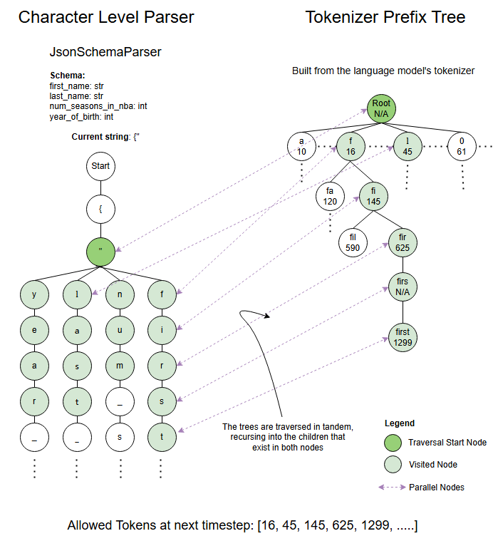

# OpenAI输出JSON格式

1. **使用函数调用（Function Calling）** : 这是OpenAI推出的一项功能，允许LLM在输出最终结果之前，决定是否需要调用特定函数。此方法的优势在于可以控制输出格式为标准JSON，从而方便程序解析。
2. **使用JSON模式** : OpenAI最新的模型（如gpt-4和gpt-3.5-turbo）提供了JSON模式。通过设置API调用时的响应格式为JSON对象，可以使LLM的输出被限制为有效的JSON字符串。代码如下：

```
curl https://api.openai.com/v1/chat/completions \
  -H "Content-Type: application/json" \
  -H "Authorization: Bearer $OPENAI_API_KEY" \
  -d '{
    "model": "gpt-3.5-turbo-1106",
    "response_format": { "type": "json_object" },
    "messages": [
      {"role": "system", "content": "You are a helpful assistant designed to output JSON."},
      {"role": "user", "content": "Who won the world series in 2020?"}
    ]
  }'
```

# 控制大模型输出方法

1、提示词（包括few-shot，略）

2、解析LLM输出

3、约束LLM输出

4、微调（略）

# 1 提示词

* few-shot方法
* 如果可以，请使用编码模型，例如 CodeLlama 或 WizardCoder，因为它们在 JSON 上训练得更好。
* 模型通常喜欢在代码块中使用 JSON 进行响应（三重反引号）.
* 考虑切换到更像文本或更平坦的输出格式，例如 YAML 或 TOML。如果您需要该格式的数据，也可以在 Python 中解析它们并转换为 JSON。（解析输出）
* 使用流生成，如果流偏离轨道，请提前中止流。重试提示，同时保留输出的有效部分。由于 vLLM 中的缓存，它应该是高效的。

# 2 解析LLM输出

## 2.1 pydantic自定义解析

pydantic：可以实现类->json->类的转换

json scheme：提供了一种声明性的方式来验证 JSON 数据是否符合某种结构。一个 JSON Schema 本身也是一个 JSON 对象,它定义了一系列的规则,这些规则说明了 JSON 数据应该满足的条件。

从类中导出json scheme

```
from pydantic import BaseModel
from typing import List

class Point(BaseModel):
    x: float
    y: float
    z: float


class Item(BaseModel):
    id: int
    name: str
    description: str
    number: int
    price: float
    position: List[Point]

print(Item.model_json_schema())
```

输出的json scheme是：

```
{
  "$defs": {
    "Point": {
      "properties": {
        "x": {
          "title": "X",
          "type": "number"
        },
        "y": {
          "title": "Y",
          "type": "number"
        },
        "z": {
          "title": "Z",
          "type": "number"
        }
      },
      "required": ["x", "y", "z"],
      "title": "Point",
      "type": "object"
    }
  },
  "properties": {
    "id": {
      "title": "Id",
      "type": "integer"
    },
    "name": {
      "title": "Name",
      "type": "string"
    },
    "description": {
      "title": "Description",
      "type": "string"
    },
    "number": {
      "title": "Number",
      "type": "integer"
    },
    "price": {
      "title": "Price",
      "type": "number"
    },
    "position": {
      "items": {
        "$ref": "#/$defs/Point"
      },
      "title": "Position",
      "type": "array"
    }
  },
  "required": ["id", "name", "description", "number", "price", "position"],
  "title": "Item",
  "type": "object"
}
```

定义prompt

```
user_prompt = f"""
请帮我把这个物品的描述转换成json格式的数据,

json scheme格式如下:
{Item.model_json_schema()}

物品描述如下:
{item_desc}

请你分析上面的描述,按照json schema,填写信息。请一定要按照json schema的格式填写,否则会导致数据无法解析,你会被狠狠地批评的。
只需要输出可以被解析的json就够了,不需要输出其他内容。
"""
```

输出解析

```
def extract_json(text):
    try:
        json_start = text.find("{")
        json_end = text.rfind("}") + 1
        json_content = text[json_start:json_end].replace("\\_", "_")
        return json_content
    except Exception as e:
        return f"Error extracting JSON: {e}"

output_parse = extract_json(output))
```

## 2.2 langchain中的Output Parser

# 3 约束LLM输出

## 3.1 lm-format-enforcer

[noamgat/lm-format-enforcer：强制执行语言模型的输出格式（JSON Schema、Regex 等） --- noamgat/lm-format-enforcer: Enforce the output format (JSON Schema, Regex etc) of a language model (github.com)](https://github.com/noamgat/lm-format-enforcer?tab=readme-ov-file)

原理：

* Token前缀树：LLM可以生成的所有Token的前缀树
* 字符级解析器：字符串解析过程类似于隐式树结构。在每一步，根据**自定义规则** 、或 **Token前缀树** 中获取可用Token。



如果是vLLM部署的模型，可以直接用，因为vLLM基础集成了lMFE和Outlines（[OpenAI 兼容服务器 — vLLM --- OpenAI Compatible Server — vLLM](https://docs.vllm.ai/en/latest/serving/openai_compatible_server.html#command-line-arguments-for-the-server)）

除了guided_regex，还有

```
guided_choice: 可选的列表
guided_json：JSON schema
```

实际测试IMFE报错超时，但是outlines执行正常！

```
extra_body = {
    "guided_regex": "1. \*\*静夜思\*\*\\n(.)+ \\n\\n2. \*\*望庐山瀑布\*\*\\n(.)+",
    # "guided_decoding_backend": "lm-format-enforcer",  # 报错
    "guided_decoding_backend": "outlines",
}
_system = "你是一位诗人"
_query = "请你随机写2首李白的诗"
resp = RequestHandler().openai_chat(
    query=_query,
    system=_system,
    extra_body=extra_body
)
print(resp)
```


## 3.2 Outlines

[Grammar - Outlines 〰️ (outlines-dev.github.io)](https://outlines-dev.github.io/outlines/reference/cfg/)
