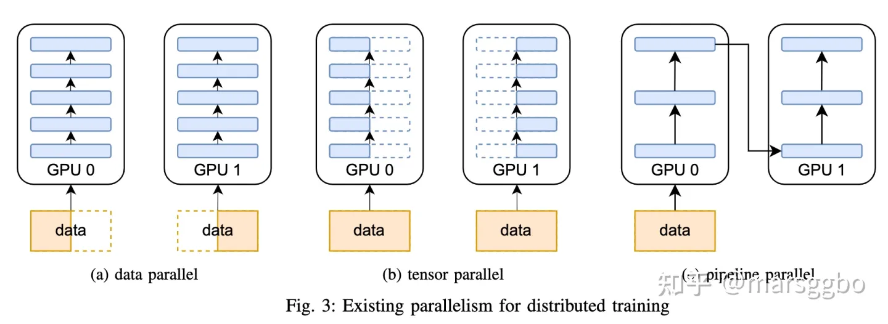

这篇文章提出：模型并行、算子融合、模型简化，三个方便提高训练效率

[大模型工业化的方法论，都藏在GPU里-工业模型 (51cto.com)]

https://www.51cto.com/article/744026.html

https://zhuanlan.zhihu.com/p/581677880

# 并行训练

概念：

- 数据并行（data parallel）

- 模型并行（model parallel）

- - tensor并行
  - pipeline并行
  - Sequence并行

- Zero Redundancy Data Parallelism （ZeRO）

Pipeline 并行也就是层间并行（图中上半部分），将不同的层划分到不同的 GPU 进行计算。这种模式的通信只发生在层的边界，通信次数和通信数据量较少，但会引入额外的 GPU 空间等待时间。

Tensor 并行也就是层内并行（图中下半部分），将一个层的计算划分到不同的 GPU 上计算。这种模式的实现更加容易，对于大矩阵的效果更好，更好实现 GPU 之间的负载均衡，但通信次数和数据量都比较大。

模型训练过程中涉及到的参数主要包含两大类，*model data* 和 *non-model data*，具体表示如下：

- model data

- - 模型权重
  - 模型权重的梯度
  - 优化器的状态

- non-model data

- - 模型逐层的特征向量（也叫作activations）

## 数据并行Data Parallel

把一个模型复制很多份，每份模型学习不同数据来加速训练。每隔一段时间（比如一个batch或者若干个batch）后需要彼此之间同步模型权重的梯度。

方法：PyTroch的DP DDP方法

## 模型并行Model Parallel

主要目的是解决模型太大在一张卡上放不下的问题。

### pipeline并行

已经有很多Pipeline相关的研究工作了，例如PipeDream，GPipe，和Chimera。它们的主要目的都是降低bubble time。这里不做过多介绍。

### tensor并行

https://zhuanlan.zhihu.com/p/581677880

### Sequence并行

Tensor parallelism主要是为了解决由 model data （模型权重，梯度和优化器状态）导致的内存瓶颈，但是 non-model data也可能成为性能瓶颈。比如像AlphaFold和NAS任务中会存在很多中间特征值（也叫activations）。

以DARTS算法为例，它的模型参数量其实并不多，但是它有很多分支，所以activations会消耗大量GPU内存，这也是为什么很多NAS算法只能在CIFAR-10上搜索到合适的模型结构后，再做人工扩展，最后应用到ImageNet上做性能验证。

同样地，在使用Transformer训练语言模型时，由于Transformer层中的Self-attention机制的复杂度是O(n2)，其中 n 是序列长度。换言之，长序列数据将增加中间activation内存使用量，从而限制设备的训练能力。

Sequential Parallelism （SP）就为了解决non-model data导致的性能瓶颈而提出的。下图给出了SP在Transform并行训练上的应用，具体的原理可以查看原论文.

## Zero Redundancy Data Parallelism （ZeRO）

训练过程中GPU内存开销主要包含以下几个方面：

- 模型状态内存（Model State Memory）：

- - 梯度
  - 模型参数
  - 优化器状态：当使用像Adam这样的优化器时，优化器的状态会成为GPU内存开销的大头。前面介绍的DP，TP， PP算法并没有考虑这个问题。

- 激活内存（Activation Memory）：在优化了模型状态内存之后，人们发现激活函数也会导致瓶颈。激活函数计算位于前向传播之中，用于支持后向传播。

- 碎片内存（Fragmented Memory）：深度学习模型的低效有时是由于内存碎片所导致的。在模型之中，每个张量的生命周期不同，由于不同张量寿命的变化而会导致一些内存碎片。由于这些碎片的存在，会导致即使有足够的可用内存，也会因为缺少连续内存而使得内存分配失败。ZeRO 根据张量的不同寿命主动管理内存，防止内存碎片。

ZeRO针对模型状态的三部分都做了对应的内存改进方法：

- ZeRO1：只划分优化器状态(optimizer states, os)，
- ZeRO2：划分优化器状态和梯度(gradient, g)，
- ZeRO3：划分优化器状态和梯度和模型参数(parameters, p)，

## 算法并行

# 代码学习

## DP和DDP

用pytorch进行数据并行主要有两种方法，一种是用`DataParallel`，另一种是`DistributedDataParallel`。数据并行的核心是把模型复制多份，每份模型接受不同的batch，然后在做模型参数更新的时候保持复制出来的不同模型的参数一致。在pytorch里面，`DataParallel`和`DistributedDataParallel`都是用来保持不同复制出来的模型参数一致的，只不过`DataParallel`是通过多线程实现的，`DistributedDataParallel`是在多进程的环境中使用的。

DP和DDP原理：

https://blog.csdn.net/kuweicai/article/details/120516410

DP和DDP和Apex加速效果对比图：

https://zhuanlan.zhihu.com/p/98535650

DP和DDP:

* DP多线程；DDP多进程
* DP不支持多机；DDP支持多机；
* DP代码简单；DDP更快；

DP：主GPU分配数据，各自前向传播，主GPU汇总output，在主GPU上计算梯度并分发新的权重

DDP：没有主GPU，各自前向传播及计算梯度；在反向传播期间，梯度下降在所有GPU上均被执行（这里需要GPU通信），从而确保每个 GPU 在反向传播结束时最终得到平均梯度的相同副本。

DDP使用需要学习：https://zhuanlan.zhihu.com/p/467103734

DP/DDP代码教程：https://zhuanlan.zhihu.com/p/640758965

## DeepSpeed

学习：https://blog.csdn.net/weixin_43301333/article/details/127237122

相应代码：https://github.com/Tsai-chasel/training-methods-tutorial/blob/main/05_cifar10_deepspeed.py

## Megatron

Megatron 采用了模型并行、Sequence 并行等优化手段以高效地训练 Transformer 大模型，可训练万亿级别参数量的模型。

