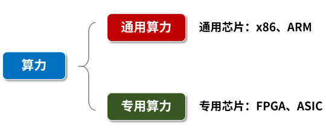
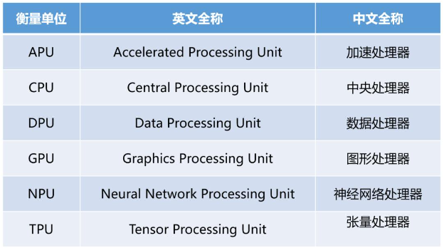
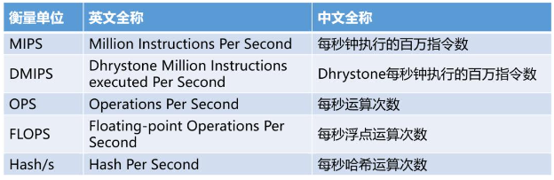
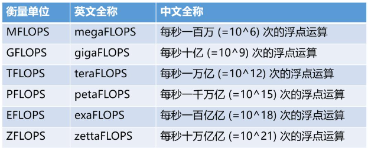
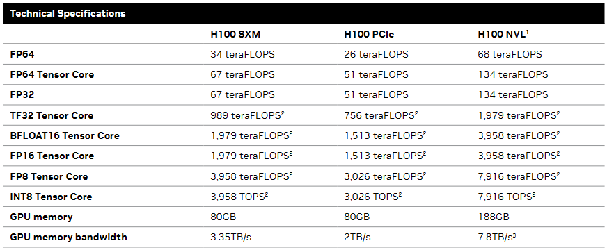
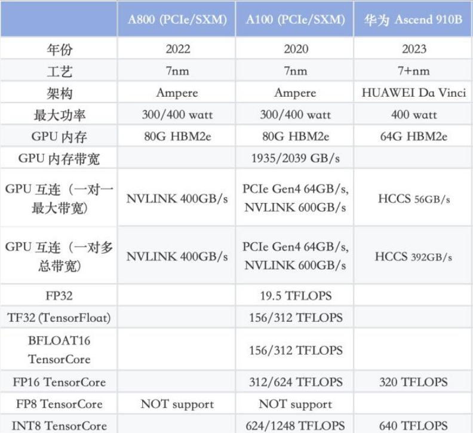
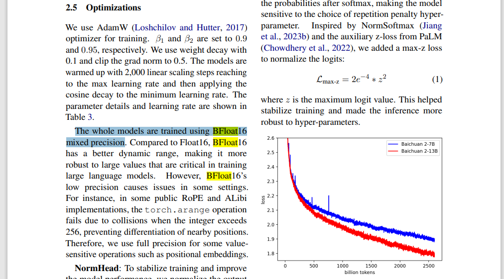
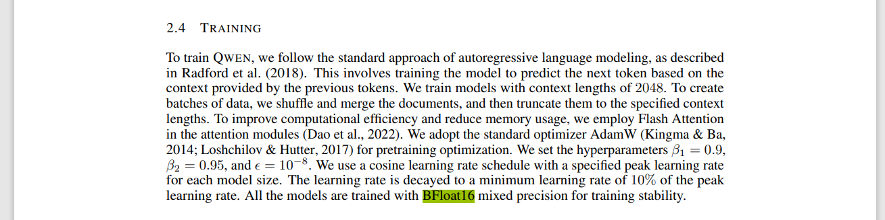

# 芯片

通常，我们将算力分为两大类，分别是**通用算力**和**专用算力**。 

通用算力：像x86、ARM这样的CPU处理器芯片，就是通用芯片。它们能完成的算力任务是多样化的，灵活的，但是功耗更高。

专用芯片，主要是指**FPGA**和**ASIC**。

FPGA，是可编程集成电路。它可以通过硬件编程来改变内部芯片的逻辑结构，但软件是深度定制的，执行专门任务。 能耗介于通用芯片和ASIC之间。

ASIC，是专用集成电路。顾名思义，它是为专业用途而定制的芯片，其绝大部分软件算法都固化于硅片。 作用比较单一，不过能耗很低。

因为高性能计算的需求越来越多，所以专用计算芯片的比例正在逐步增加。 

如GPU，可以被视作一种专用芯片，但它与传统意义上的专用芯片（ASIC，应用特定集成电路）有所不同。GPU是一种专用于图形和并行计算的芯片，但它不是ASIC那种为单一任务定制的专用芯片。GPU提供了一种平衡了性能、成本和灵活性的解决方案，适用于需要执行大量并行处理任务的广泛应用场景。

# 高性能计算

HPC高性能计算（High-performance computing）任务有：

* 科学计算类：物理化学、气象环保、生命科学、石油勘探、天文探测等。 
* 工程计算类：计算机辅助工程、计算机辅助制造、电子设计自动化、电磁仿真等。 
* 智能计算类：即人工智能（AI，Artificial Intelligence）计算，包括：机器学习、深度学习、数据分析等。

所以，

智算中心：专门进行智能计算的数据中心。 

超算中心：专门承担各种大规模科学计算和工程计算任务。 

# 算力

算力衡量单位有很多，如：

MFLOPS、GFLOPS、TFLOPS、PFLOPS等，都是FLOPS的不同量级。具体关系如下： 

# 人工智能算力

NVIDIA显卡列了很多性能指标：FP64 FP32 FP16 FP8 INT8等

* 不带Tensor Core表示通用算力，可以用于广泛的计算场景，包括科学计算、图形渲染等。

* 带Tensor Core是NVIDIA GPU中的专用硬件单元，专门针对深度学习中的矩阵乘法运算进行了优化。

所以，智算算力可以用带Tensor Core的指标。

如，华为晟腾910和对标的A100对比：

算力为什么主要对比FP16 ?

因为大模型训练都是用FP16或BF16：

注意BF16等只有NVIDIA最新的显卡支持这种数据类型。

baichuan：

qwen：

