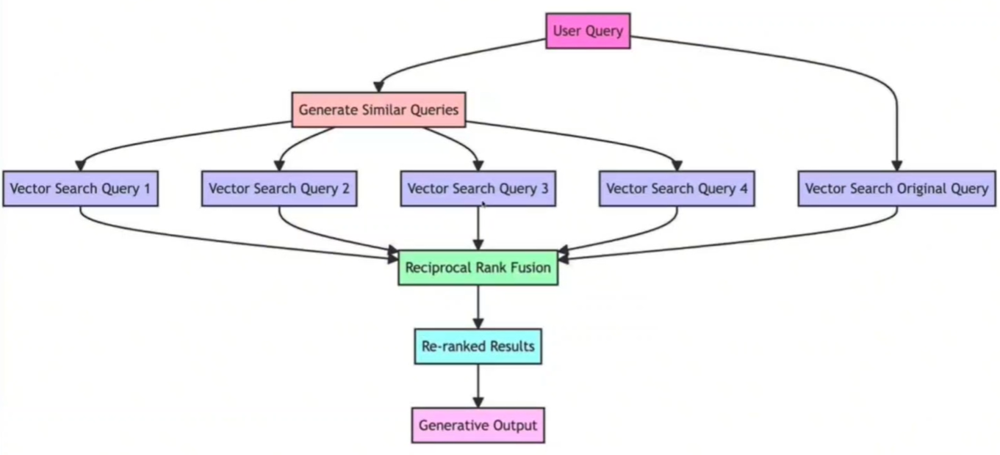
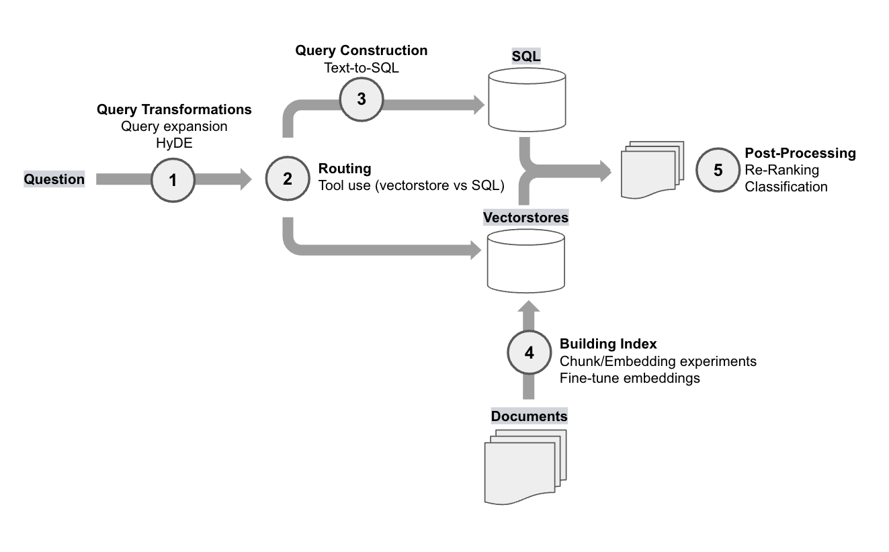
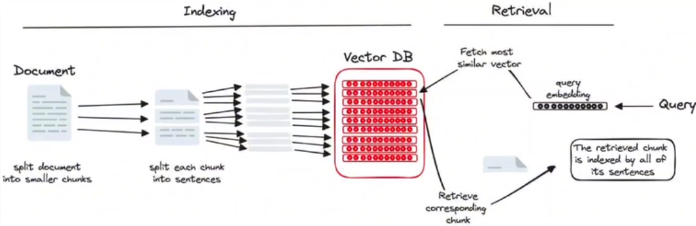
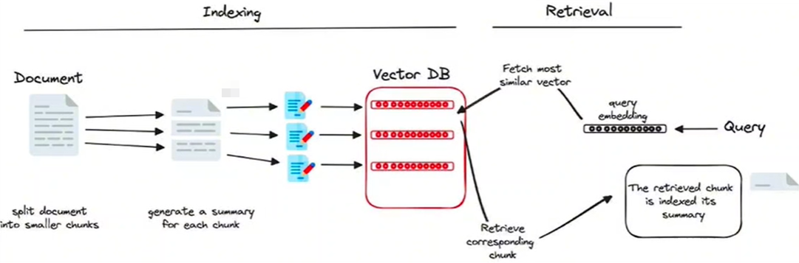

# RAG流程


# 提升-清洗数据

文档清洗：

* 不冗余、不重复
* 主题集中、文件按逻辑分开。


分档分割：

1、选择分块策略：长度分块、标题分块；

2、分块大小，扩充大小，检索数量：chunk_size，chunk_overlap，top_k。


# 提升-检索

## 检索方法

>[基于大语言模型知识问答应用落地实践 – 知识库构建（上） | 亚马逊AWS官方博客 (amazon.com)](https://aws.amazon.com/cn/blogs/china/practice-of-knowledge-question-answering-application-based-on-llm-knowledge-base-construction-part-1/)
>
>[基于知识图谱的大模型检索增强实现策略：Graph RAG实现基本原理及优化思路 - 知乎 (zhihu.com)](https://zhuanlan.zhihu.com/p/654012116)

总结：

* 语义召回：也就是倒排索引，首先通过切词器对文本进行切词，得到 Term 列表，然后根据 BM25 打分公式进行打分排序。
* 向量召回：也就是词向量嵌入，用Embedding模型将文本嵌入成向量，然后根据问题向量和文档向量的相似度（余弦相似度，欧氏距离）打分排序。

* 知识图谱召回：这种方式在图谱规模很大时其实是有提升空间。


## 资料1：RAG-Fusion

**工作流程：**

1、查询问题做相关性复制：通过LLM将用户的查询转换为相似但不同的查询；

2、并发检索：对原始查询及其新生成的同级查询执行并发的向量搜索。

3、智能重排：聚合和细化所有结果使用倒数排序融合(RRF)。


**流程图：**




**倒排数据融合(Reciprocal Rank Fusion)：**

是一种排序方法：整合多个排序信息，来产生一个更全面的、更准确的排序列表。计算公式如下：


举例：

```
排名列表1的排名和倒数：
项目A：1/1 = 1
项目B：1/2 = 0.5
项目C：1/3 ≈ 0.33
排名列表2的排名和倒数：
项目B：1/1 = 1
项目A：1/2 = 0.5
项目C：1/3 ≈ 0.33
然后，可以选择给排名列表不同的权重，例如，排名列表1的权重为0.7，排名列表2的权重为0.3。
计算加权倒数排名：
项目A：(0.7 * 1) + (0.3 * 0.5) ≈ 0.85
项目B：(0.7 * 0.5) + (0.3 * 1) ≈ 0.65
项目C：(0.7 * 0.33) + (0.3 * 0.33) ≈ 0.33
```


## 资料2：OpenAI's RAG

> https://blog.langchain.dev/applying-openai-rag/


Open AI 为与他们合作的客户报告了一系列 RAG 实验。

45%：余弦相似度检索；

65%：HyDE检索，微调Embedding，Chunk分块；（打x表示最后没有应用）

85%：Reranking重拍，问题问题；

98%：提示词工程，工具使用（这里指路由），问题扩展。


我们可以将这些方法分为几个 RAG 类别。下面的图表显示了其类别中的每个 RAG 实验并将它们放置在 RAG 堆栈中：



### Query Transformations

1、Query expansion:针对给定的用户输入查询从不同角度生成多个查询。

2、HyDE(Hypothetical Document Embeddings，假设文档嵌入) : 为查询生成假设性文档，对它们进行嵌入，并在检索中使用它们。这个想法是，这些模拟文档可能与期望的源文档的相似度比问题本身更高。但是OpenAI最终并没有用。

### Routing

OpenAI 演示报告称，他们需要在两个矢量存储和单个 SQL 数据库之间路由问题。

### Query Construction

查询构造，即text2sql

### Building Index

1、OpenAI 报告称，仅通过在文档嵌入期间试验块大小、嵌入模型即可显着提高性能。因为这是索引构建的核心步骤。

2、embedding fine-tuning：虽然他们没有报告嵌入微调对性能的显着提升，但已经报告了良好的结果。虽然 OpenAI 指出这可能不建议作为“容易实现的目标”

### Post-Processing

OpenAI的两个方法：

1、Re-rank: 应用交叉编码器cross-encoder对结果重排。

2、Classification: OpenAI 根据内容对每个检索到的文档进行分类，然后根据分类选择不同的提示+相关资料。

其他方法：

1、MMR：为了平衡相关性和多样性，许多矢量商店提供最大边缘相关性搜索

2、聚类：一些方法使用了带有采样的嵌入文档的聚类，这在我们整合广泛来源的文档的情况下可能会有所帮助。

## 资料3：Three Indexing Methods

> [Improve RAG Pipelines With These 3 Indexing Methods | by Ahmed Besbes | Level Up Coding (gitconnected.com)](https://levelup.gitconnected.com/improve-rag-pipelines-with-these-3-indexing-methods-83317e972676)


### 按子部分索引

chunk再拆分：

不直接对整个chunk做索引，而是将每个chunk再拆分成句子（更小的文本块）。对sentences做检索，返回chunk数据。




### 文本块的假设性问题

让LLM生成文本块相关的假设性问题，将问题作为索引。


### 文本块的摘要

和上面方法类似。使用文本块的摘要创建索引。



## 资料4：LlamaIndex中的5种检索

1、Hybrid Fusion Retriever

混合融合检索：生成多个查询；向量+关键词检索；用Reciprocal Rank Fusion重排。

2、Query Rewriting Retriever

重写查询检索：生成多个查询；向量检索；用Reciprocal Rank Fusion重排。

3、Auto Merging Retriever

自动合并检索：对文档建立分层节点图（父节点+子节点），检索子节点，然后查看是否检索到足够多的叶子节点，如果超过阈值，则合并叶子节点成父节点。

4、Small-to-big Retrieval

从小块到大块检索：大chunk块再分割成小chunk块，检索小chunk块返回大chunk块。

5、Sentence Window Retrieval

句子窗口检索：对句子检索，返回句子+句子两侧数据（上下文）。


# 提升-LLM

1、更改问题表述

2、迭代提示


# 总结

目前项目还需要改进的地方：

Indexing：

* 向量嵌入+语义嵌入
* 假设性 摘要+问题（这个先不做，做好chunk就好）

Retrieval：

* 查询扩展
* 重排：重排要用RRF算法。


