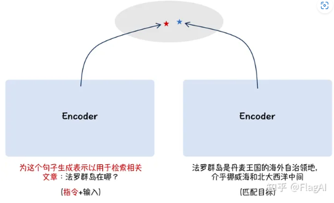

# BGE

智源发布**最强开源可商用中英文语义向量模型BGE（BAAI General Embedding）**，在中英文语义检索精度与整体语义表征能力均超越了社区所有同类模型，如OpenAI 的text embedding 002等。此外，BGE 保持了同等参数量级模型中的最小向量维度，使用成本更低。

## BGE Embedding

技术亮点：

1、针对表征的预训练：在大规模语料集上采取了针对表征的预训练算法（类似于BERT掩码方式）

2、大规模文本对训练：BGE 借鉴 Instruction Tuning 的思想，采取了非对称的指令添加方式，在问题端添加场景描述， 提升了语义向量在多任务场景下的通用能力

## BGE Reranker

交叉编码器将对查询和答案实时计算相关性分数，这比向量模型(即双编码器)更准确，但比向量模型更耗时。 因此，它可以用来对嵌入模型返回的前k个文档重新排序。 我们在多语言数据上训练了交叉编码器，数据格式与向量模型相同。 

这两个模型的区别：[Cross-Encoders — Sentence-Transformers documentation (sbert.net)](https://www.sbert.net/examples/applications/cross-encoder/README.html)

* Bi-Encoder会用BERT对输入文本编码，再根据cosine相似度分数筛选文本。
* Cross-Encoder会直接计算两个句子的相关性分数。

# BCE

`BCEmbedding`是由网易有道开发的中英双语和跨语种语义表征算法模型库，其中包含 `EmbeddingModel`和 `RerankerModel`两类基础模型。`EmbeddingModel`专门用于生成语义向量，在语义搜索和问答中起着关键作用，而 `RerankerModel`擅长优化语义搜索结果和语义相关顺序精排。

基于MTEB的语义表征评测指标：图略，结论：比e5-large-multilingual略差。

基于LlamaIndex的RAG评测结果如下：结论：SOTA

