# DAIL-SQL

为什么叫DAIL-SQL，论文里面什么没解释。

标题：Text-to-SQL Empowered by Large Language Models: A Benchmark Evaluation

时间：202309

亮点：在国际权威榜单Spider上取得了86.6的执行准确率，位列第一。

参考：

https://blog.csdn.net/sinat_33455447/article/details/139828297

https://blog.csdn.net/u011426236/article/details/135948426

当前问题：利用LLMs进行Text-to-SQL任务，缺乏系统性研究。

主要工作：

* 全面评估提示词工程。
* 通过监督微调进一步提高性能。

# 提示词工程

五种问题表示方法、四种样本选择、两种样本组织策略。

## 五种问题表示

1、基础提示 (Basic Prompt, BS P)：包括表结构、问题。问题部分以“Q:”开头，回答部分以“A: SELECT”开头。

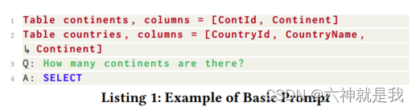

2、文本表示提示 (Text Representation Prompt, TR P)：包括指令、表结构、问题。相较于基础提示，添加了指令："Given the following database schema:"。

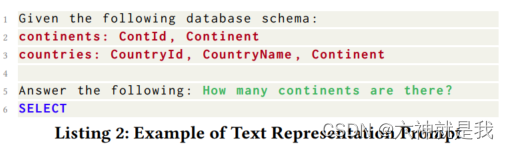

3、OpenAI演示提示 (OpenAI Demonstration Prompt, OD P)：包括指令、表结构、问题。所有信息都用井号“#”注释，且**指令更加具体**："Complete sqlite SQL query only and with no explanation"。

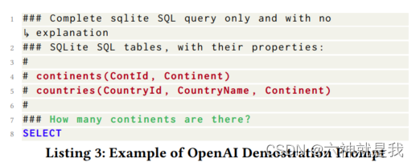

4、代码表示提示 (Code Representation Prompt, CR P)：包含指令、表模式、问题。表模式提供了更加全面的信息，如：数据类型、外键等。

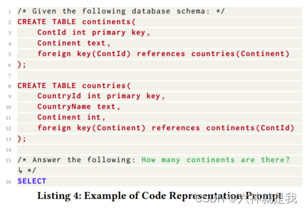

5、Alpaca SFT提示 (Alpaca SFT Prompt, AS P)：专为监督微调设计的提示词。

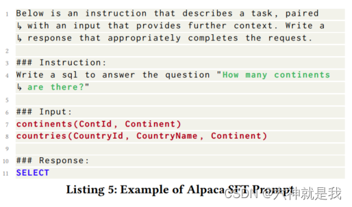

## 四种样本选择

随机选择 (Random)：从可用候选项中随机抽取样本。
问题相似性选择 (Question Similarity Selection, QTS S)：选择与目标问题最相似的样本。
掩码问题相似性选择 (Masked Question Similarity Selection, MQS S)：在计算相似性前，用掩码替换所有问题中的表名、列名和值。
目标SQL相似性选择 (Query Similarity Selection, QRS S)：选择与目标SQL查询最相似的样本。

## 两种样本组织策略

完整信息组织 (Full-Information Organization, FIO)：示例完整地提供问题和对应的SQL，帮助模型理解和学习两者之间的映射关系。（输入包括数据库结构信息、相似QA）

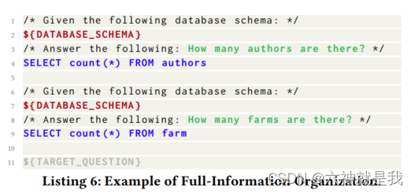

仅SQL组织 (SQL-Only Organization, SOO)：此策略仅使用SQL语句作为样本，不包括任何自然语言问题描述。它强调直接学习SQL语句的构造，适合在模型已经具备一定理解基础的情况下，专注于提升SQL生成的准确性。

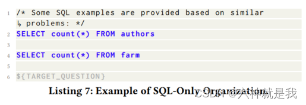

# DAIL-SQL方法论

**问题表示 (Question Representation)**

DAIL-SQL 使用Code Representation (CR P) 作为问题表示方法。这种表示方式包括数据库的完整信息，如主键和外键，这些信息对于预测如“JOIN”子句等SQL结构特别有用。CR P在预训练的编码语料库上进行训练，因此LLMs能够更好地理解并处理这种格式的提示。

**样本选择 (Example Selection)**

受MQS和QRS启发，提出DAIL Selection样本选择策略。该策略不仅考虑问题的相似性，也考虑查询的相似性。具体来说：

* 首先在目标问题q和候选样本问题Q中屏蔽掉特定领域的词汇；
* 然后根据问题和查询的欧几里得距离来对候选样本进行排序，并选择那些与目标查询有高相似度的样本。
* 选择标准优先考虑按问题相似度排序的候选项，并且查询相似度大于预定义阈值。

**样本组织 (Example Organization)**

受FIO和SOO启发，提出DAIL Organization样本组织策略。移除了shema，保留了问题和SQL。这样既保留了问题与SQL查询之间的映射信息，又能提高token效率（减少了token数量）。

**最终提示词大概是这样：**

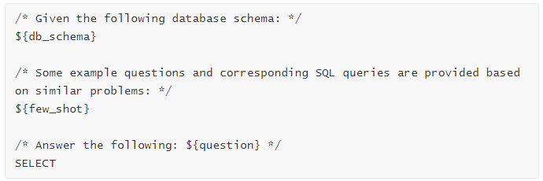

# 实验

**数据集**：使用Spider和Spider-Realistic数据集进行评估。

**度量标准**：使用准确匹配度（EM）和执行准确度（EX）进行评估。

**LLM**：GPT-4, GPT-3.5-Tubro, TEXT-DAVINCI-003, Vicuna-33B

## 问题表示

ODP 在所有LLMs中表现最佳，尤其是与GPT-3.5-TURBO结合时。

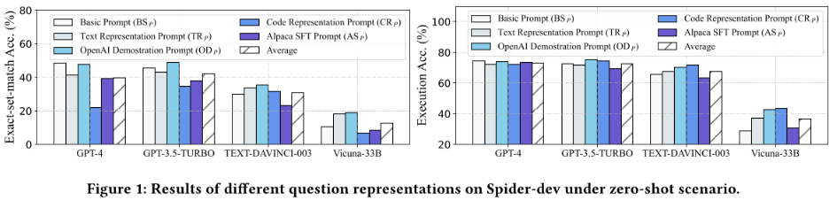

外键、更好的指令也能提升性能：

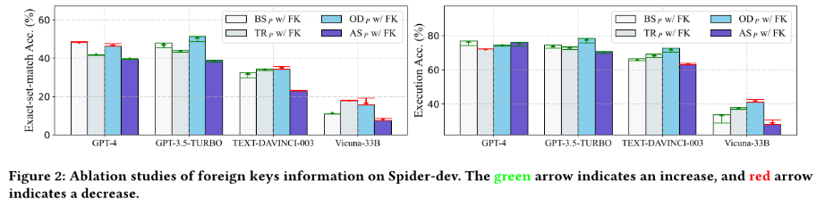

## 上下文学习

这里主要测试few-shot，也就是：样本选择+样本组织策略。

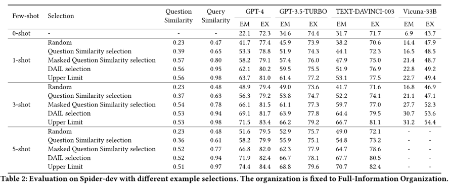

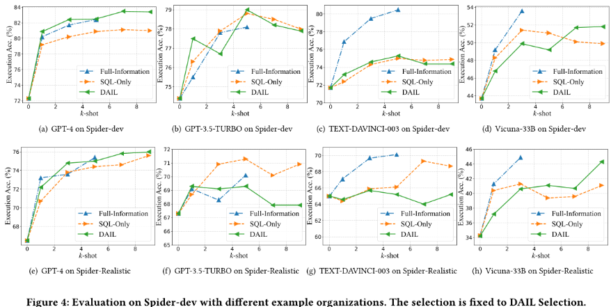

## 监督微调

- **开源LLM**：对开源LLMs（如LLaMA）进行了全面评估，发现在零样本和少样本场景中表现不佳。
- **监督式微调**：对开源LLMs进行微调后，性能大幅提升，但在添加上下文样本后性能降低。

略。

# 总结

**问题表示**：推荐使用代码表示提示（Code Representation Prompt）和OpenAI演示提示（OpenAI Demostration Prompt），并且额外信息如外键和规则暗示（更好的指令）对提升性能很有帮助。
**示例选择**：自然语言问题和SQL查询的相似性都很重要。这两个相似性指标共同构成了设计有效选择策略的良好指标。
**示例组织**：如果采用的LLM足够强大（如GPT-4），则展示问题和SQL查询对是有效且高效的选择。否则，建议展示包含完整信息的示例。
**开源LLM**：更多参数的LLM对Text-to-SQL任务有益，但训练语料的作用更为关键。此外，监督式微调对Text-to-SQL任务非常必要且具有巨大潜力。
