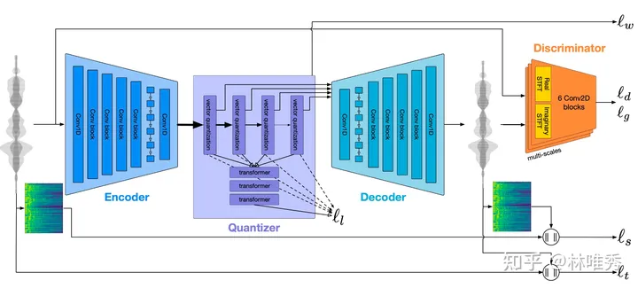
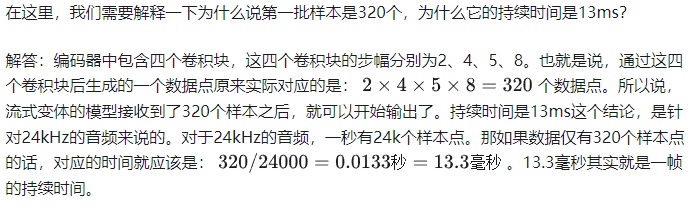
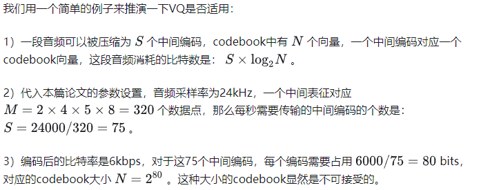
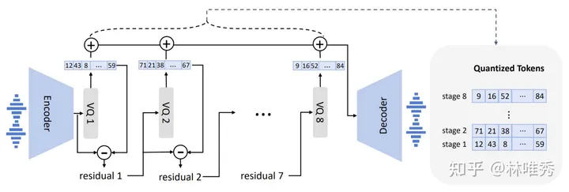
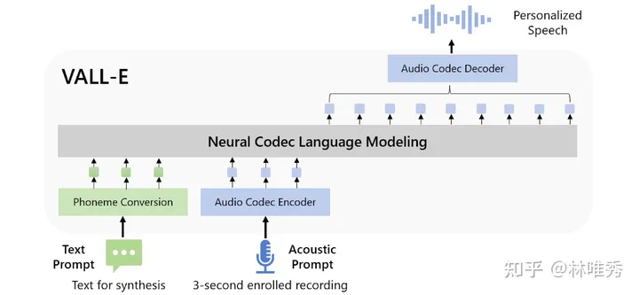
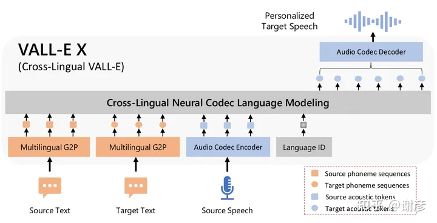
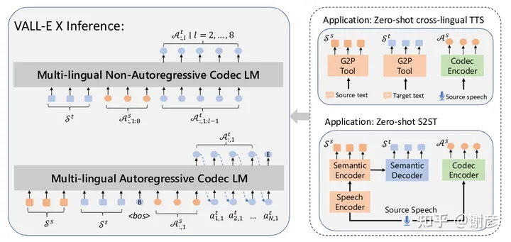

> **XTTS、YourTTS、FastSpeech2、VITS、Pheme**和**TorToiSe**。
>
> 在VALL-E出来之后，学术界陆续涌现出了不少关于语音合成大模型的佳作，比如谷歌的SpearTTS、字节跳动的MegaTTS 1/2，还有NaturalSpeech 2和VALL-E的多语言版本——VALL-E-X。这些佳作的出现，也会给我们带来不少的启发。我也会在后续时间持续更新对这些论文的解读。

# Encodec

EnCodec: High Fidelity Neural Audio Compression

时间：2022-10-24

机构：Meta

## 研究背景

音频数据要想实现实时传输，那我们就必须对其实现高度的压缩。但是，高度压缩又会不可避免地损坏音频数据的质量，造成信息的失真，也就是保真度下降。这其实就是音频数据压缩效率和质量的矛盾。我们在设计音频数据压缩算法时，就需要在压缩效率和压缩质量上做一个取舍。本文的工作解决的就是这个问题。**工作的核心思想在于使用神经网络来实现这一压缩过程。**

## 如何用神经网络压缩？

上文说到，论文的核心思想是使用神经网络来实现数据的压缩、音频数据的压缩。当遇到这种压缩问题的时候，我们最先想到的模型是AutoEncoder(自编码器)。AutoEncoder包含两个部分：Encoder和Decoder。Encoder负责将原始数据映射到低维度的潜空间，Decoder负责将潜空间中的变量映射成原始的数据。

为了进一步减少音频数据的大小，有利于数字存储和传输，**模型中还需要包含量化的过程**，将连续的音频信号转换为离散的数值。当然，量化过程也会导致一部分的信息损失。因此，设计的量化算法在减小文件大小的同时也要尽量减少对音质的影响。

基于上述两点的考虑，论文中设计的神经网络采样了典型的编解码器架构，带有一个Encoder和一个Decoder。为了实现量化的过程，Encoder和Decoder之间插入了一个Quantizer(量化器)。

有了基本的神经网络架构之后，我们接下来最关心的是以下几个问题：

第一，架构中的Encoder和Decoder应当如何设计？往前一步想，这个问题可以进一步归结为Encoder的设计，因为Encoder和Decoder的架构是镜像对称的。

第二，架构中的Quantizer应该如何设计才能减少音频数据大小的同时又不损坏音质？

第三，上述的神经网络架构应当如何训练？其实就是损失函数的设计。如果损失函数有多个的话，那就还需要考虑各个损失函数的平衡。

## 问题1：Encoder怎么设计

针对语音数据进行Encoder，我们通常会考虑使用卷积模块。原因也很简单、很粗暴：由卷积模块组成的模型在各种音频相关的任务中效果非常好。

具体而言，Encoder模型由1D卷积层和B个卷积块组成。1D卷积层的核大小为7，通道数为C。每个卷积块包含一个残差单元(residual unit)和一个步幅卷积的下采样层(downsampling layer consisting in a strided convolution)。核的大小是步幅的两倍。残差单元包括两个核大小为3的卷积和一个skip connection。每次下采样，通道数都会翻倍。卷积块后还会接一个两层LSTM进行序列建模。最后还会接一个1D卷积层。这个卷积层的核大小也是7，输出通道数为D。参照SoundStream的参数设置，1D卷积层的通道数C=32，卷积块的个数B=4，这4个卷积块的步幅(stride)分别是2、4、5、8。

Encoder模型的确定之后，Decoder的设计也就不难了，镜像对称地拷贝一下就可以了。唯一需要注意的就是，将Encoder中的strided convolution改成transposed convolution。

考虑到音频流式实时传输的需求，模型有两种变体：流式变体和非流式变体。二者的区别仅仅在于填充的位置和归一化的方式。在流式变体中，所有的填充都会放在第一个时间步之前。模型可以在接收到第一批320个样本(13毫秒)后立即输出。除了这个，流式变体还使用weight normalization(权重归一化)来代替对时间维度进行统计的layer normalization(层归一化)。

## 问题2：Quantizer如何设计

本文中使用的Quantizer是由RVQ(Residual Vector Quantization，残差向量量化)实现的。为了弄清楚RVQ的使用动机，我们有必要先来看看传统的VQ(Vector Quantization，向量量化)是否能够满足音频的实时、高保真的传输需求。

所谓的VQ，就是将输入向量映射到给定大小的codebook中最近的一个entry。这里的codebook，其实就是一个embedding table；codebook中的entry就是embedding向量，只不过这里的embedding向量是可训练的。

既然一个codebook无法满足需求，那我们就需要考虑多个codebook。那么，这多个codebook应当如何编码呢？它们之间应当如何连接呢？本文中所使用的RVQ就是在这种背景下诞生的。

RVQ的具体做法是这样的：

1）使用多个quantization block对应多个codebook，它们之间有残差连接，重要性不同。如果使用8个codebook的话，每个codebook占用10bits，对应的codebook大小是1024，这是可以接受的；

2）每个quantization block在量化的时候，量化的值与真实表征之间的残差值会传给下一个block。也就是说，每个quantization block只会量化前一个quantization block的误差；

上述做法有两个好处：第一，区分出不同quantization block的分工和重要性，第一个block包含最重要的信息，后续的block则负责精确还原语音时的细节信息；第二，训练是可以随机采样出前面k个block进行训练，保证在丢弃后若干个不重要的block时，模型仍然能够保持一定的精度。此时，模型可以在低比特率时选择性地丢弃后面的blocks，实现了对比特率的动态适应。

## 问题3：模型如何训练

模型的训练说白了其实损失函数如何设计的问题。encodec模型的主体就是一个包含了RVQ Quantizer的AutoEncoder。

涉及到AutoEncoder，那重构损失(reconstruction loss)就必须要考虑了。对于音频数据，重构损失可以进一步拆解为时域的重构损失和频域的重构损失（L1和L2）。除了重构损失，还需要保证AutoEncoder重建的数据的感知质量不会下降，因而还要加上一个感知损失(perceptual loss)。感知损失通常有discriminator(其实就是一个分类器)实现。感知损失其实就是利用GAN的思想来提升生成样本的感知质量。既然说到了GAN，那就必须要有生成器带来的损失和判别器带来的损失了。其实，用GAN来提升生成语音的表现力，算是一个屡试不爽的trick了。

对于RVQ Quantizer，基本的要求就是量化前后的特征不能出现较大的差异，这里有一个由均方误差(MSE)实现的commitment loss。量化前后的特征不出现太大的差异，我们才能够堂而皇之地将量化步骤视作恒等函数，STE的使用也就合理了。

# VALL-E

Neural Codec Language Models are Zero-Shot Text to Speech Synthesizers

时间：2023-01-05

机构：微软

## 问题背景

传统的语音合成任务很难采用端到端的方法，因为连续性声学特征很难离散化，只能建模为回归问题。

如果离散表示，那么可以做成类似于GPT。

## 如何离散表征？

原始的音频信号在电脑这样的设备中通常以16位整数来保存，因而生成模型在每个时间步输出的值就有65536种可能性。另外，为了保证音频的感知质量，其采样率通常都超过了10k，这导致音频序列长度非常长。如果直接合成原始音频的话，模型生成的推理速度会非常慢。因此，我们通常会对语音进行**量化(quantization)**以压缩存储位数和序列长度。作者从现有的量化方法中寻找合适的离散表征。

我们在这里简单比较一下作者列举的几种方案：

-  $\mu$律变换：将每个时间步的整数值量化到256，但无法压缩序列长度。这个方法的特点就是：重建质量高、生成速度慢；
- 向量量化：合成速度很快，但丢弃了说话者的信息，从而导致重建质量较差。
- AudioLM所采用的Encodec：压缩率非常高，可以达到320倍，将24kHz采样率的语音转换为75Hz；重建质量非常高，包含了足够多的说话者信息和声学信息，能够在重建中保持说话者的身份。Encodec除了同时满足重建质量高和压缩程度大这两大要求外，还具有一个优点：Encodec有现成的解码器能够将离散表征转换为声音波形，无需训练额外的声码器。

在这篇文章中，作者选用的Encodec中包含了8个quantizers，每个quantizer对应的codebook中有1024个entry。Encodec的模型结构如图1所示。可以看出，一段语音输入到Encodec之后，我们可以得到8个对应的离散向量。

我们在下文中将这些离散表示称作声学词元(acoustic tokens)。

## 模型架构

采用条件概率模型建模。

图2所示的整体架构还是比较简洁明了的：文本提示词转换通过音素转换模块(phoneme conversion)变成音素送入模型，语音提示词(acoustic prompt)经过Encodec的Encoder变成离散的acoustic tokens送入模型，二者融合来预测后续可能出现的acoustic tokens，Encodec的Decoder将预测的acoustic tokens转换为声学波形。

# VALL-E X

Speak Foreign Languages with Your Own Voice: Cross-Lingual Neural Codec Language Modeling

时间：2023-03-07

机构：微软

对 VALL-E 的扩展。它可以生成目标语言的高质量语音，同时保留看不见的说话者的声音、情感和声学环境。有效缓解了外国口音问题，可以通过语言ID来控制。

## 模型架构

由一个自回归的多语音编码器和一个非自回归的编码器组成。
多语言声学标记 (A) 和音素序列 (S) 分别使用编码器和 G2P 工具从语音和转录中转换而来。在训练期间，使用来自不同语言的配对 S 和 A 来优化这两个模型。本文中语义标记指音素序列。

## 多语言训练

利用了双语语音转录 (ASR) 语料库，成对的 (Ss, As) 和 (St, At) 来训练多语言模型。
另外，利用语言 ID 来指导 VALL-E X 中特定语言的语音生成。因为是用多语言数据训练的，如果不指定ID，可能会混淆为特定语言选择合适的声学标记。例如汉语是声调语言，而英语是非声调语言。这在引导正确的说话风格和缓解口音问题方面出奇地有效，具体来说，将语言 ID 嵌入到密集向量中，并将它们添加到声学标记的嵌入中。

## 多语言推理

自回归和非自回归模型的输入不同；右侧显示了语音到语音翻译的过程。
给定源语音 Xs，语音识别和翻译模型首先从语义编码器生成源音素 Ss，从语义解码器生成目标音素 St。此外，使用 EnCodec 编码器将 X 压缩为源声学标记 As。然后，将 Ss、St 和 As 连接起来，作为 VALL-E X 的输入，以生成目标语音的声学标记序列。使用 EnCodec 的解码器将生成的声学标记转换为最终的目标语音。

# EmotiVoice

**EmotiVoice**是一个强大的开源TTS引擎，完全免费，**支持中英文双语，包含2000多种不同的音色，以及特色的情感合成功能，支持合成包含快乐、兴奋、悲伤、愤怒等广泛情感的语音**。

- **调速**：类OpenAI TTS的API已经支持调语速功能；
- **定制**：用自己的数据定制音色；
- **易用**：易魔声 HTTP API 更易上手（无需任何安装配置），更快更稳定；

# GPT-SoVITS

GPT-SoVITS是一个声音克隆和文本到语音转换的开源 Python RAG框架。 5秒数据就能模仿你，1分钟的声音数据就能训练出一个高质量的TTS模型，完美克隆你的声音！ 根据演示来看完美适配中文，应该是目前中文支持比较好的模型。

