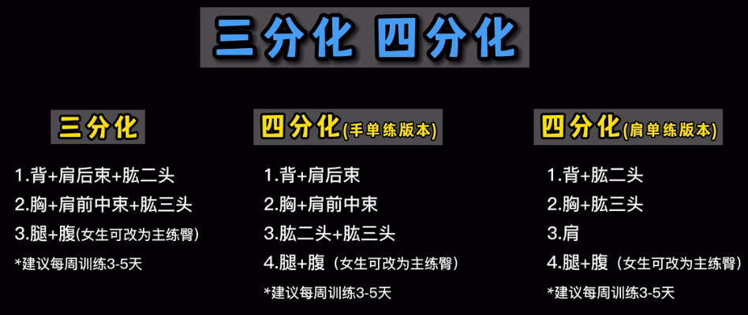
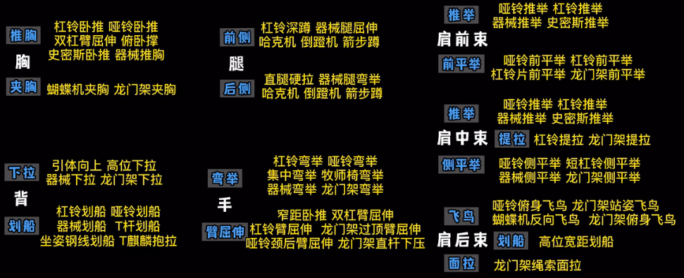
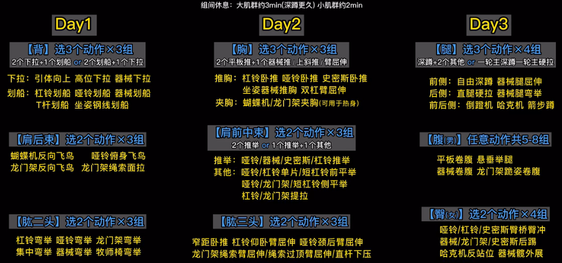
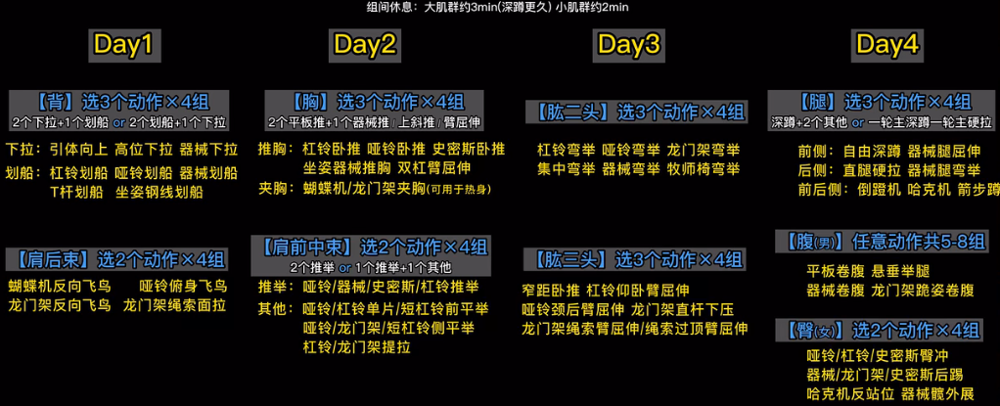
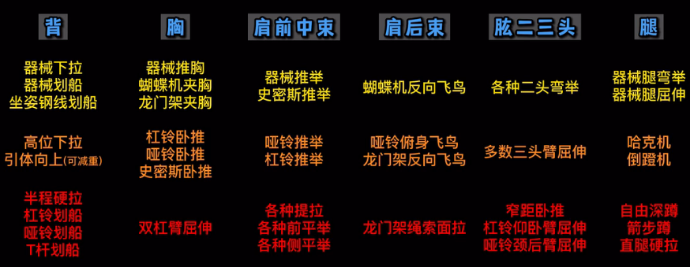
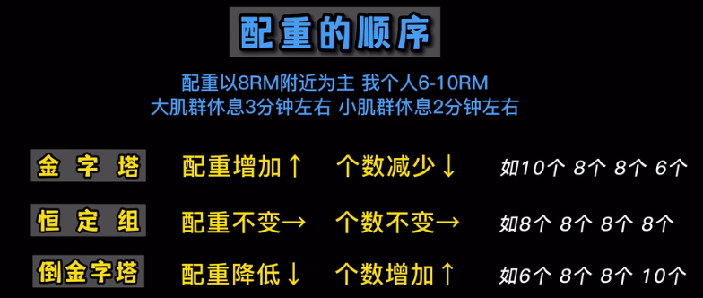
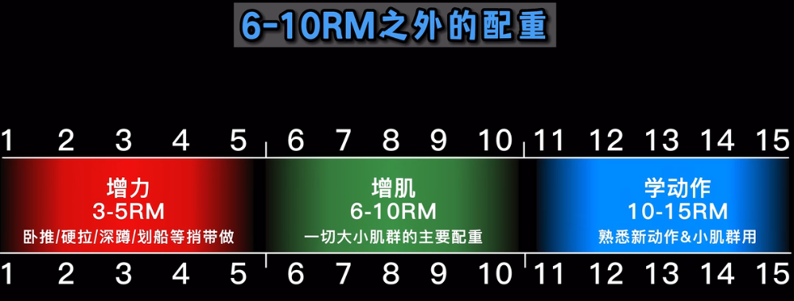

# 健身训练

## 分化方式

选 三分化 / 四分化。这样既可以充分利用肌肉协同训练、又能加快全身循环速度。

## 动作模式

胸的主要模式：推胸远远大于夹胸

背的主要模式：下拉+划船

腿的主要模式：自由深蹲为主

肱二头的主要模式：弯举

肱三头的主要模式：臂屈伸

肩前束的主要模式：主要是推举+次要是前平举

肩中束的主要模式：主要是推举+次要是侧平举/提拉

肩后束：主要和背部划船结合起来

## 训练计划

时间：1-1.5小时

频率：每周3天保底；4-5天合适；要有休息时间。

三分化：

四分化：

动作由简单到难：

## 配重

配种顺序不是关键，做到力竭是关键。

建议：12->8

## 常见错误

分化方式错误：

常见错误一：新手选五分化

答：五分化时，每个动作需要做很多组，你以为**组数越多约到位**，实际上是**垃圾组**。应该充分利用**大小肌群组合**，应该提高**全身循环速度**

常见错误二：大小肌群组合错误

答：肌肉只有两类较协同：胸肌+肩前束+肱三头；上背+肩后束。

动作常见错误：

1、上来就学最难的动作

2、长期依赖固定器械

3、动作模式主次不分

配种常见错误：

1、依赖轻重量“找感觉”

2、从不适用3-5RM大重量

3、健脂期主动减配种（建议增肌、减肌一样配种，能维持住肌肉）

# 饮食指南

健身饮食不是管理食物，而是食物背后的碳蛋脂

## 摄入总量

## 日内分配

## 食物&配餐

碳水：米饭、红薯
蛋白质：鸡蛋

## 专题&错误

# 计划

1、3、5、6

三明治：全麦面包+花生酱+香蕉

水果+煮鸡蛋+酸奶

