# 引言

**为什么分词？**

句子不能直接处理，句子要离散化处理。

**基于统计的分词**

先对各个句子进行分词，然后再统计并选出频数最高的前N个词组成词表。

缺点：

1、词的数量很多，词表不全，容易出现(Out Of Vocabulary, OOV)，模型无法处理；

2、低频词模型无法得到充分训练。

**字符粒度的分词**

如，英文单词最终是26个英文字母，虽然能够解决OOV问题，但单词被拆分成字符后，一方面丢失了词的语义信息，另一方面，模型输入会变得很长，这使得模型的训练更加复杂难以收敛。

**Subword(子词)分词**

它的划分粒度介于词与字符之间，比如可以将”looking”划分为”look”和”ing”两个子词，而划分出来的"look"，”ing”又能够用来构造其它词。

目前有三种主流的Subword算法，它们分别是：Byte Pair Encoding (BPE), WordPiece和Unigram Language Model。

# N-gram模型

**什么是N-gram模型？**

如果我们有一个由 m 个字/词组成的序列（或者说一个句子），我们希望算得句子的概率，根据链式规则，可得

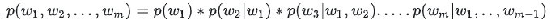

这个概率显然并不好算，不妨利用马尔科夫链的假设，即当前这个词仅仅跟前面几个有限的词相关。

当 n=1, 一个一元模型（unigram model)即为 ：


当 n=2, 一个二元模型（bigram model)即为 ：


通过我们的标准语料库，我们可以近似的计算出所有的分词之间的二元条件概率，比如任意两个词，它们的条件概率分布可以近似的表示为

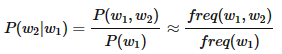

利用语料库建立的统计概率，对于一个新的句子，我们就可以通过计算各种分词方法对应的联合分布概率，找到最大概率对应的分词方法，即为最优分词。

N元模型的分词方法虽然很好，但是要在实际中应用也有很多问题：

* 某些生僻词，概率为0。（这种情况我们一般会使用拉普拉斯平滑，即给它一个较小的概率值）
* 句子长，分词有很多情况，计算量也非常大，这时我们可以用下一节维特比算法来优化算法时间复杂度。


**上面只是根据分词计算出句子概率，那么如何分词？维特比算法。**

为了简化原理描述，我们本节的讨论都是以二元模型为基础。

维特比算法采用的是动态规划来解决这个最优分词问题的，动态规划要求局部路径也是最优路径的一部分，很显然我们的问题是成立的。首先我们看一个简单的分词例子："人生如梦境"。它的可能分词可以用下面的概率图表示：

对于每个词，我们都可以计算出它的频率和二元条件概率。

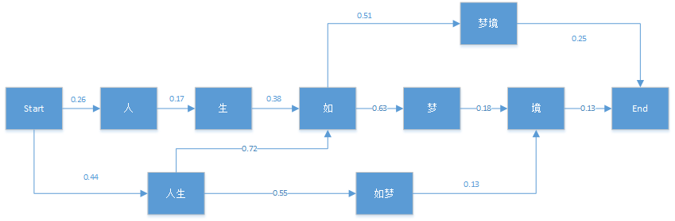

从后往前推，最终的分词结果为"人生/如/梦境"。

# BPE

BPE最早是一种数据压缩算法，由Sennrich等人于2015年在《Neural Machine Translation of Rare Words with Subword Units》中提出引入到NLP领域并很快得到推广。该算法简单有效，因而目前它是最流行的方法。

## 词表构建

BPE分词/词表构建步骤：

1. 准备足够大的训练语料，并确定期望的Subword词表大小；
2. 将单词拆分为成最小单元。比如英文中26个字母加上各种符号，这些作为初始词表；
3. 在语料上统计单词内相邻单元对的频数，选取频数最高的单元对合并成新的Subword单元；
4. 重复第3步直到达到第1步设定的Subword词表大小或下一个最高频数为1.

示例：

准备预料，初始词表。注意这里一定加终止符`</w>`，中止符可以区分单词边界。


不断合并高频词，一直重复这个过程，直至达到词表大小。


## 语料编码

BPE分词后，编码步骤：

1. 词表从大到小排序；
2. 遍历排序好的词表，寻找词表中的子词是否是该单词的子字符串。如果正好**「匹配」**，则输出当前子词，并对单词剩下的字符串继续匹配；
3. 如果遍历完词表，单词中仍然有子字符串没有被匹配，那我们将其替换为一个特殊的子词，比如`unk`。

示例：

 假设有词表

```
(“errrr</w>”, 
“tain</w>”, 
“moun”, 
“est</w>”, 
“high”, 
“the</w>”, 
“a</w>”,
“ve</w>”)
```

对于给定的单词`mountain`，其分词结果为：[`moun`, `tain</w>`]。

对于给定的单词`love`, 其分词结果为：[`unk`, `unk`, `ve</w>`]

## 语料解码

语料解码就是将所有的输出子词拼在一起，直到碰到结尾为`<\w>`。

假设模型输出为

```
["moun", "tain</w>", "high", "the</w>"]
```

解码的结果

```
["mountain</w>", "highthe</w>"]
```

## 代码实现BPE

```
import re


# 语料库
def get_vocab(in_data_list):
    vocab = {}
    for line in in_data_list:
        words = line.strip().split()
        for word in words:
            vocab[' '.join(list(word)) + ' </w>'] = vocab.get(' '.join(list(word)) + ' </w>', 0) + 1
    return vocab


# 统计当前语料库所有tokens以及其对应的数量
def get_tokens(vocab):
    tokens = {}
    for word, freq in vocab.items():
        cur_chars = word.split()
        for cur_char in cur_chars:
            tokens[cur_char] = tokens.get(cur_char, 0) + freq

    return tokens


# 获取所有可能组成pair的token合体之后的频率
def get_stats(vocab):
    pairs = {}
    for word, freq in vocab.items():
        cur_tokens = word.split()
        for i in range(len(cur_tokens) - 1):
            pairs[(cur_tokens[i], cur_tokens[i + 1])] = pairs.get((cur_tokens[i], cur_tokens[i + 1]), 0) + freq
    return pairs


# 给定特定的pair 比如(e, s) 将vocab中所有(e,s)合并
def merge_vocab(pair, in_vocab):
    out_vocab = {}
    bigram = re.escape(' '.join(pair))
    p = re.compile(r'(?<!\S)' + bigram + r'(?!\S)')
    for word in in_vocab:
        w_out = p.sub(''.join(pair), word)
        out_vocab[w_out] = in_vocab[word]
    return out_vocab


data_list = ['i love dogs', 'i loved you']
cur_vocab = get_vocab(data_list)
print(f'Begining vocab: {cur_vocab}')
cur_tokens = get_tokens(cur_vocab)
print(f'Begining tokens: {cur_tokens}')

# 合并到词表达到指定大小 size大于等于原vocab的大小
to_merged_vocab_size = 7
epoch = 0
while len(cur_tokens) > to_merged_vocab_size:
    print('-' * 50)
    pairs = get_stats(cur_vocab)
    if not pairs:
        break
    max_freq_pair = max(pairs, key=pairs.get)
    cur_vocab = merge_vocab(max_freq_pair, cur_vocab)
    print(f'Iter: {epoch}')
    print(f'max_freq_pair: {max_freq_pair}')
    print(f'cur vocab: {cur_vocab}')
    cur_tokens = get_tokens(cur_vocab)
    print('Tokens: {}'.format(cur_tokens))
    print(f'len tokens:{len(cur_tokens)} ')
    epoch += 1

```

# Byte-level BPE

BPE的算法最开始的基础词表也可能会很大，比如如果将所有的unicode 字符都放入基础词表，一开始的词表大小就有十几万了。一种处理方法是我们**以一个字节为一种“字符”**，基础字符集的大小就锁定在了**2^8=256**。

例如，GPT-2的词汇表大小为50257 = 256 + `<EOS>` + 50000 mergers，`<EOS>`是句子结尾的特殊标记。

# WordPiece

最早出现在2016年谷歌的论文Google’s Neural Machine Translation system。 2018 年 BERT 中也用了。

它可以被认为是 BPE 和 Unigram 算法的折中。WordPiece 也是一种贪婪算法，它利用似然性而不是计数频率来合并每次迭代中的最佳对，但配对字符的选择是基于计数频率的。因此，在选择要配对的字符方面，它与 BPE 类似；在选择要合并的最佳对方面，它与 Unigram 类似。

## 原理

BPE算法通过循环的方式不断将一些高频的pair进行合并，通过贪婪的方式，每一步都将将高频的组合进行合并。这种方法存在的一个主要问题是：一个词可能存在多种拆分方式，对于算法来说，难以评估使用那个拆分方式比较合理，可以组合的列表中的优先级无法确定，通常会直接取第一个，举个例子：

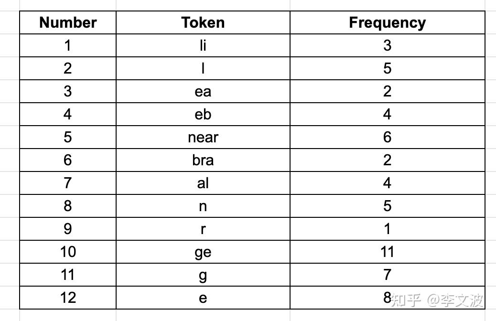

例如：linear = **li + near** 或者 **li + n + ea + r**，这两种拆分方法哪个好坏，无法评价。所以，比BPE使用频次进行merge更好的方法是， 在merge的时候考虑merge前后的影响到底有多大。

WordPiece选择能够提升语言模型似然概率最大的相邻子词加入词表。例如，在考虑将"e"和"s"合并的时候除了会考虑"es"的概率值，还会考虑"e"和"s"的概率值。

**似然概率怎么计算？**

假设句子$S=(t1, t2,,,tn)$，则句子S的语言模型似然值是：

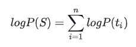

假设把相邻位置的x和y两个子词进行合并，合并后产生的子词记为z，此时句子S似然值的变化可表示为：

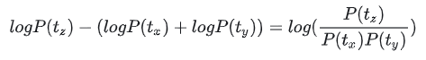

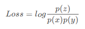

遍历所有的字符对，合并Loss最大的字符对。

**不太好理解？**

拆分前信息熵为-log(p(tz))，拆分后为-log(p(tx)) - log(p(ty)) ，拆分后-拆分前的信息增益为-log(p(tx)) - log(p(ty)) + log(p(tz))，可以变形为上式。信息增益越大越好。


## 词表构建

**WordPiece算法的主要步骤如下：**

1. 准备足够大的训练语料
2. 确定期望的subword词表大小
3. 将单词拆分成字符序列
4. 基于第3步数据训练语言模型
5. 从所有可能的subword单元中选择加入语言模型后能最大程度地增加训练数据概率的单元作为新的单元
6. 重复第5步直到达到第2步设定的subword词表大小或概率增量低于某一阈值

构建分词表后，编码解码步骤和BPE一样。


WordPiece有两种代码实现方式：bottom-up 和 top-down。最初的WordPiece和BPE一样基于bottom-up的，而BERT是基于 top-down。对于日语、中文和韩语，这种 top-down 的方法不起作用，因为没有明确的token units 可以开始。

## 代码实现

**这里是WordPiece的bottom-up算法实现**

top-down算法请参考https://www.tensorflow.org/text/guide/subwords_tokenizer#optional_the_algorithm


WordPiece算法分词时，会在非单词开头的字符上加上`##`前缀。如love，分词是

```
l
##o
##v
##e
```

代码示例

```
from collections import defaultdict


def get_word_freqs(pre_tokenized_res):
    word_freqs = {}
    for word in pre_tokenized_res:
        word_freqs[word] = word_freqs.get(word, 0) + 1
    return word_freqs


def get_word_splits(word_freqs):
    word_splits = {}
    for word in word_freqs.keys():
        word_splits[word] = [c if i == 0 else f"##{c}" for i, c in enumerate(word)]
    return word_splits


def get_base_vocab(word_freqs, word_splits):
    vocab = {}
    for word, freq in word_freqs.items():
        for subword in word_splits.get(word):
            vocab[subword] = vocab.get(subword, 0) + freq
    return vocab


def get_pair_scores(word_freqs, word_splits, vocab):
    pair_freqs = {}
    for freq, split in zip(word_freqs.values(), word_splits.values()):
        for i in range(len(split) - 1):
            pair = (split[i], split[i + 1])
            pair_freqs[pair] = pair_freqs.get(pair, 0) + freq
    pair_scores = {}
    for pair, freq in pair_freqs.items():
        pair_scores[pair] = freq / (vocab[pair[0]] * vocab[pair[1]])
    return pair_scores


def merge_pair(pair, word_splits):
    a, b = pair
    for word, split in word_splits.items():
        if len(split) == 1:
            continue
        i = 0
        while i < len(split) - 1:
            if split[i] == a and split[i + 1] == b:
                new_word = a + b[2:] if b.startswith('##') else a + b
                split = split[:i] + [new_word] + split[i + 2:]
            i += 1
        word_splits[word] = split
    return word_splits


def wordpiece_train(vocab_size, word_freqs, word_splits):
    vocab = get_base_vocab(word_splits)
    while len(vocab) < vocab_size:
        pair_scores = get_pair_scores(word_freqs, word_splits)
        if not pair_scores:
            break
        max_score_pair = max(pair_scores, key=pair_scores.get)
        word_splits = merge_pair(max_score_pair, word_splits)
        a, b = max_score_pair
        new_word = a + b[2:] if b.startswith('##') else a + b
        vocab.append(new_word)
    return vocab


"""
I love dogs
I loved you
"""
corpus = ['I', 'love', 'dogs', 'I', 'loved', 'you']
word_freqs = get_word_freqs(corpus)
print(f"word_freqs: {word_freqs}")
word_splits = get_word_splits(word_freqs)
print(f"word_splits: {word_splits}")
vocab = get_base_vocab(word_freqs, word_splits)
print(f"vocab: {vocab}")

# 合并到词表达到指定大小
to_merged_vocab_size = 7
epoch = 0
while len(vocab) > to_merged_vocab_size:
    print('-' * 50)
    print(f'epoch: {epoch}')
    pair_scores = get_pair_scores(word_freqs, word_splits, vocab)
    if not pair_scores:
        break
    max_score_pair = max(pair_scores, key=pair_scores.get)
    print(f'max_score_pair: {max_score_pair}')
    word_splits = merge_pair(max_score_pair, word_splits)
    print(f'word_splits: {word_splits}')
    vocab = get_base_vocab(word_freqs, word_splits)
    print(f'vocab: {vocab}')
print('-' * 50)
print(f'vocab: {list(vocab.keys())}')
```


# Unigram

## 原理

https://blog.csdn.net/raelum/article/details/132225006

Unigram 语言建模2018在 《 Improving neural network translation models with multiple subword candidates》 中提出。与WordPiece一样，Unigram Language Model(ULM)同样使用语言模型来挑选子词。不同之处在于，BPE和WordPiece算法的词表大小都是从小到大变化，属于增量法。而Unigram Language Model则是减量法,即先初始化一个大词表，根据评估准则不断丢弃词表，直到满足限定条件。UniLM算法考虑了句子的不同分词可能，因而能够输出带概率的多个子词分段。

我们接下来看看UniLM是如何操作的。

假设xi是句子的分词结果，当前分词下句子S的似然值可以表示为：

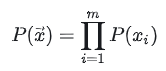

对于句子S，挑选似然值最大的作为分词结果，则可以表示为

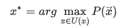

在实际应用中，词表大小有上万个，直接罗列所有可能的分词组合不具有操作性。针对这个问题，可通过**维特比算法**来解决（请参考N-gram模型）。

**那怎么求解每个子词的概率P(xi)？**

ULM通过EM算法来估计。假设当前词表V, 则M步最大化的对象是如下似然函数：

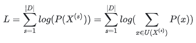

其中，|D|是语料库中语料数量。上述公式的一个直观理解是，将语料库中所有句子的所有分词组合形成的概率相加。


但是，初始时，词表V并不存在。因而，ULM算法采用不断迭代的方法来构造词表以及求解分词概率：

```text
1.初始时，建立一个足够大的词表。一般，可用语料中的所有字符加上常见的子字符串初始化词表，也可以通过BPE算法初始化。
2.针对当前词表，用EM算法求解每个子词在语料上的概率。
3.对于每个子词，计算当该子词被从词表中移除时，总的loss降低了多少，记为该子词的loss。
4.将子词按照loss大小进行排序，丢弃一定比例loss最小的子词(比如20%)，保留下来的子词生成新的词表。这里需要注意的是，单字符不能被丢弃，这是为了避免OOV情况。
5.重复步骤2到4，直到词表大小减少到设定范围。
```

可以看出，ULM会保留那些以较高频率出现在很多句子的分词结果中的子词，因为这些子词如果被丢弃，其损失会很大。


设语料库中单词为$w_i$，分词后的单词为$w'_{i}$, 那么当该子词被从词表中移除时，整个语料库的loss可以表示为：

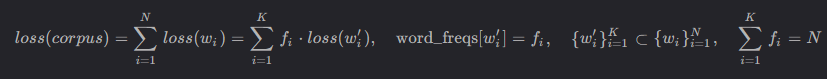


接下来，Unigram会为vocab中的每个子词计算一个score，这个score等于从vocab中移除该子词后loss的变化值。可以证明，这个值一定是非负的，因此score越小说明这个子词越不重要，故可以移除。

将vocab的子词按照score从小到大进行排序，并移除前10-20%，然后重新计算loss，反复执行，直到vocab大小符合要求。